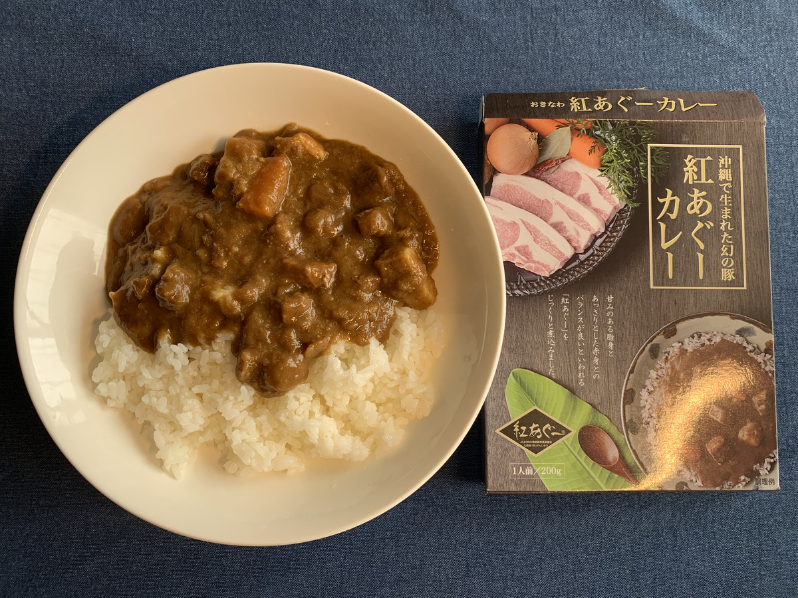

**ご当地カレーが食べたい！ とにかくご当地カレーが食べたい・・・！**

食べたい！

食べたい！！

**食べたーい！！！ :yum:**

---

もうがまんできなーい！

（ぽちっ）

---

**ででーん！ :package:**

とどいたー！

**とどいたぞー！！！ :tada: :tada: :tada:**

47個の、

ご当地の、

**レトルトカレーだぞ！**

---

**わーい！やったー！ :confetti_ball:**

もう、これでお昼かんがえなくて済むー！

**イエーイ！ :sunglasses: :sunglasses: :sunglasses:**

---

さてさてー！

今回は **沖縄県、紅あぐー豚のカレー** だぞ！

ひゃーーー！ :curry: :curry: :curry:

南から攻めるぜ〜〜

**カレー前線だぜ〜〜 :cherry_blossom: :cherry_blossom: :cherry_blossom:**

**どんどんどん！ぱふぱふぱふー！ :tada: :tada: :tada:**

---

さーて、パッケージは〜〜〜 :laughing: :laughing: :laughing:

---

**これだー！！:curry:**

---

幻の豚！！

幻の豚を・・・

**食う！！！ :pig: :pig: :pig:**

---

バックショットは〜〜〜

**Sexy!!! :sparkling_heart: :sparkling_heart: :sparkling_heart:**

---

ちなみに〜、 **株式会社がんじゅう** 、ってとこで作ってるらしいぞ！

https://ganjyu.co.jp/company2.html

ざわわ〜

ざわわ〜〜

ざわわ〜〜〜

---

どんな人が作ってるんだろー？ :thinking_face:

あっ、パッケージの人だ！！

**生産者に感謝・・・！ :pray: :pray: :pray:**

---

せっかくなので！

おきなわに！

**行った気になって食べたい！ :yum: :yum: :yum:**

**シューン！！**

この！

青空の下で！！

**紅あぐー豚カレーを、食うぞー！**

---

## 実食！！

まえおきはいいから、カレーはまだか！

**カレーをはよ・・・！！**

---

**きたーーー！！！ :curry: :curry: :curry:**

記念すべき！

1発目の！

**ご当地カレー！！！ :tada: :tada: :tada:**

---

脳汁〜〜〜、脳汁〜〜〜。

旨そう！

ウマソウ！

**UMASOU!**

---

では、

**いただきます！ :pray:**

---

（ペロリ）

---

**うまーーーい！！！ :satisfied: :satisfied: :satisfied:**

---

（ペロリ）

（ペロリ）

---

**うまいうまーーーい！！！ :satisfied: :satisfied: :satisfied:**

---

辛すぎず、
あとからじんわり辛さがくる、
安心感のあるお味・・・！

そこまで大きな豚肉感を感じるわけじゃないけど、
お肉もおいしいし、お野菜もボリュームあっておいしいぞ〜〜〜！

---

（ガツガツガツ・・・）

---

ああ〜、最後の一口だ・・・！

そろそろ **アレ** を呼ばなきゃ・・・！

アレが何かって？

そんなの、 **アレ** に決まってるじゃないですかー！ :smirk: :smirk: :smirk:

さあみんな一緒にー！

---

**ホア〜〜〜〜〜**

---

**ジャオ〜〜〜〜〜！！！**

---

**ドゥーン！**

（フリフリフリフリ・・・）

**うまーい！！ :yum: :yum: :yum:**

**ああ〜〜〜しびれる〜〜〜 :innocent: :innocent: :innocent:**

---

**沖縄 紅あぐー豚のカレー**

**おいしゅうございました！ :pray: :pray: :pray:**
