**またまたおたよりだよ！ :email:**

えーっと、なになに？

---

「 **ホアジャオ** ってどんな味がするんですか？ :old_man:」

「 **辛くないんですか？ :old_man:** 」

---

なるほどー！

きみは **辛いのが苦手** なんだね！ :eyes: :eyes: :eyes:

---

ホアジャオは

**ヒーヒー！ :fire:**

みたいな辛さじゃなくて

**ピリピリ！ピリピリ！ :zap: :zap: :zap:**

みたいな辛さだよ！

---

食べたあとも、くちびるが

**ピリピリ！ピリピリ！ :zap: :zap: :zap:**

って、 **パラライズひゃっほーう！ :innocent:**

**おうちでパラライズ体験してみてね！ :surfer: :surfer: :surfer:**

---

**今日のカレーは何かなー？ :man_with_turban:**

まいにち、 **カレー** が楽しみだ！

カレーがうまくて **毎日ハッピー！ :dog:**

---

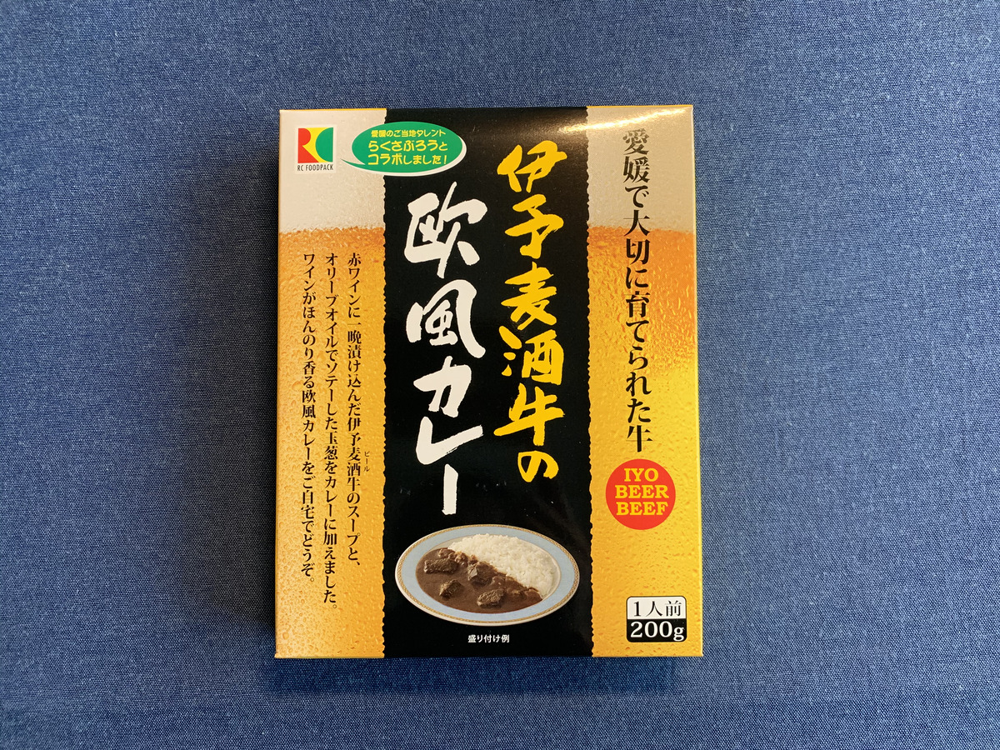

**ばーん！！！**

**伊予麦酒牛の欧風カレー！ :curry:**

いえーい！ **麦酒パッケージ** だぜー！ :beer:

しかも

**麦酒と書いて、ビールと読む！**

ときた！

---

**ビール祭りじゃー！  :beer:**

**ビール  :beer: でわっしょい！  :beer:  :beer:**

**わっしょい！  :beer: ビール！  :beer:  :beer:  :beer:**

---

しかも〜〜〜？

**ワイン :wine_glass: で一晩漬け込んだ** って〜？？？

---

**ワイン祭りじゃー！  :wine_glass:**

**ワイン  :wine_glass: でわっしょい！  :wine_glass:  :wine_glass:**

**わっしょい！  :wine_glass: ワイン！  :wine_glass:  :wine_glass:  :wine_glass:**

---

**ビール :beer:** と **ワイン :wine_glass:** の

**ちゃんぽん** だぜ〜〜〜 :sunglasses: :sunglasses: :sunglasses:

---

**バックショットフェチ** のみなさんの

おまちかね〜〜〜

**これ！**

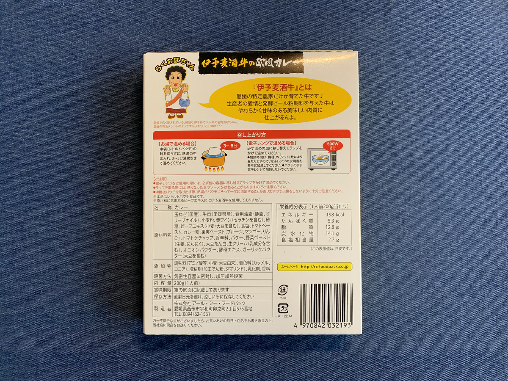

**Wow! Sexy Hot...!!! :sparkling_heart: :sparkling_heart: :sparkling_heart:**

---

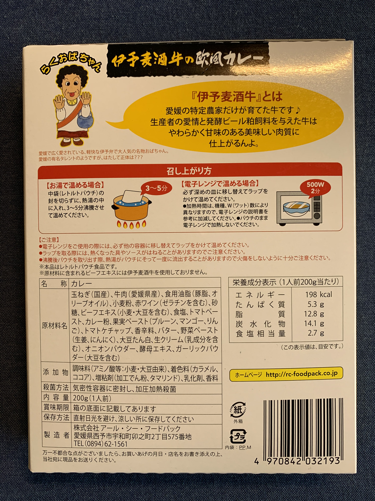

らくおばちゃん・・・！

**らくおばちゃんだ！**

---

らくおばちゃん is 誰・・・？ :thinking_face:

---

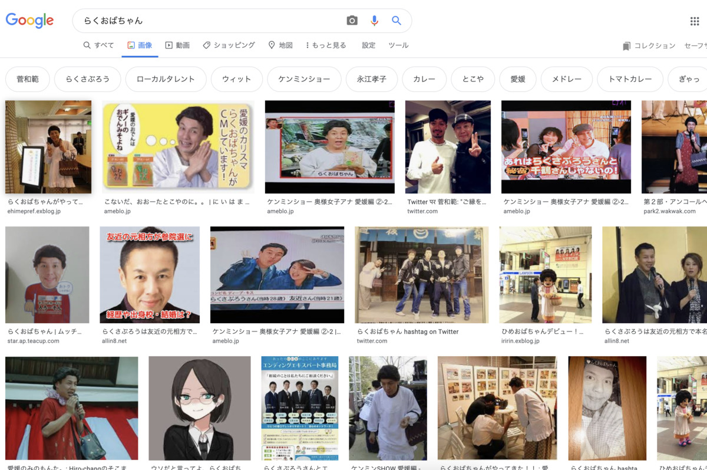

なんか、ご当地タレントらしい！

**愛媛なら誰でも知ってる！**

的なやつ！ :tangerine:

らしいぞ :sunglasses:

---

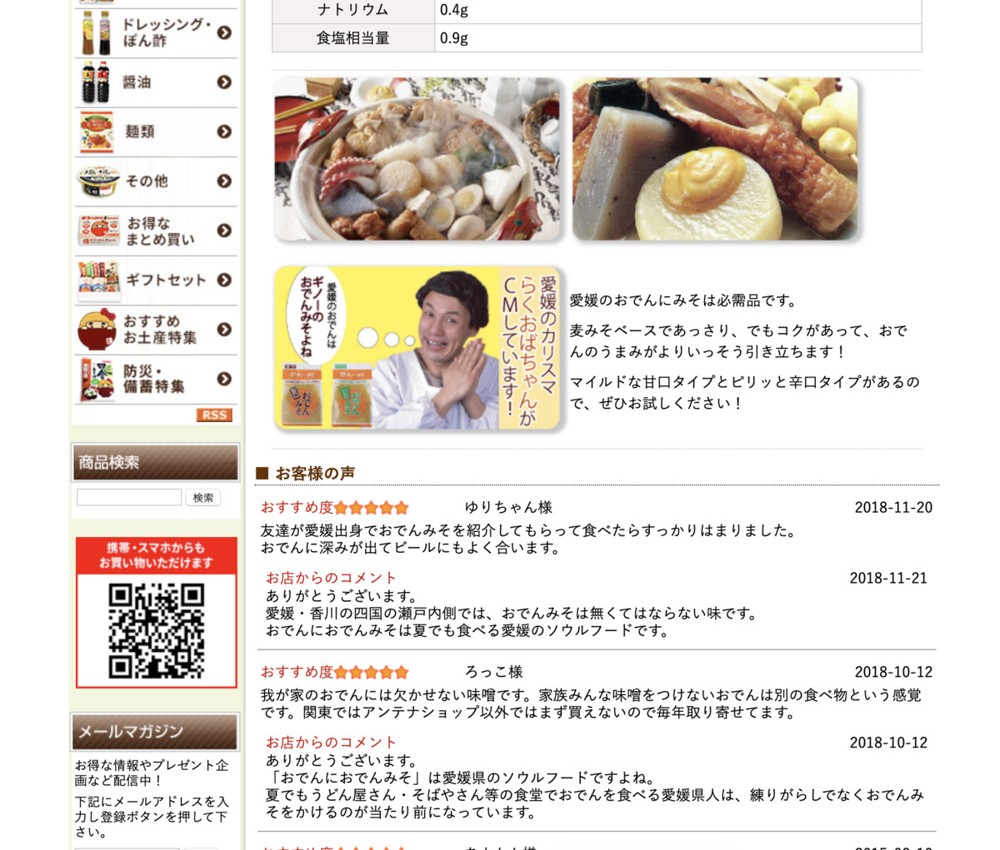

https://shop.gino-miso.co.jp/SHOP/K-1.html

なんやこれ〜

CM も出てるんかー

なになに？ **お味噌** なの？？

---

へへえー

どうやら **愛媛の地元企業** っぽい！

（ぽちっ）

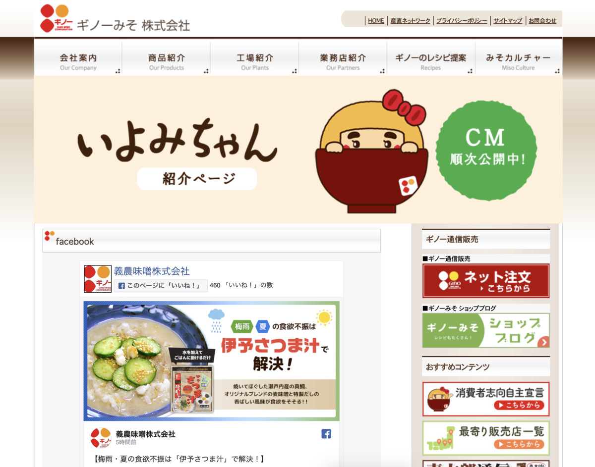

https://www.gino-miso.co.jp/

**ギノー味噌！**

こういう地元で

頑張ってる会社、

**いいよね〜〜〜 :muscle: :muscle: :muscle:**

---

こんど行ったら

**お土産に買っちゃうぞ！ :gift: :gift: :gift:**

---

ほかにどんな

おいしいもの、あるのかなー？

（ぽちっ）

---

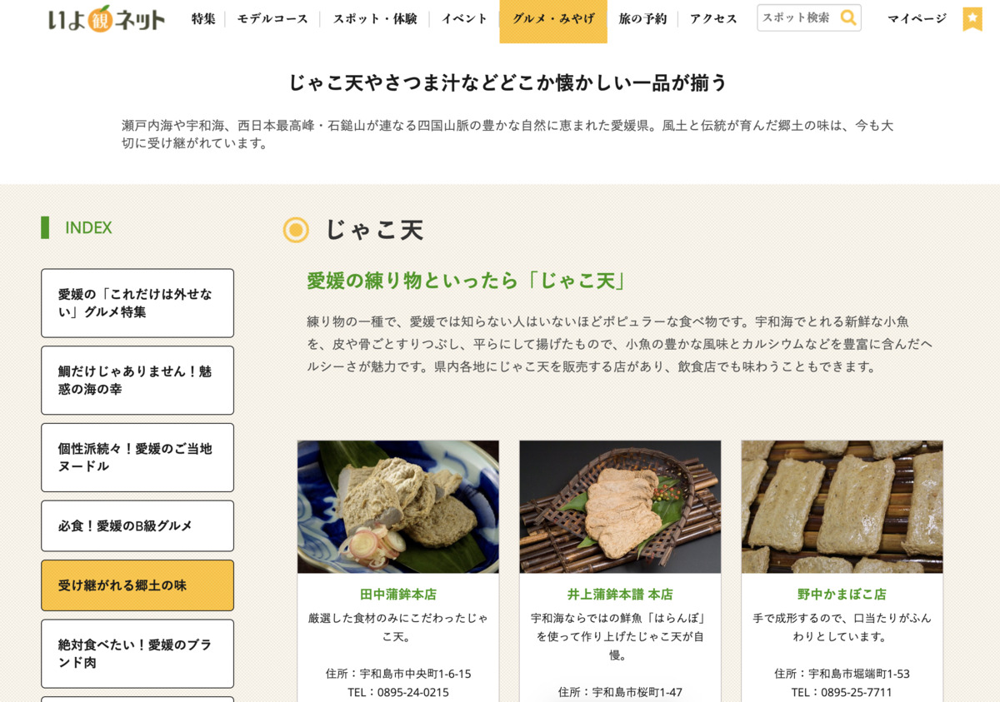

https://www.iyokannet.jp/feature/gourmet/local

**じゃこ天！**

知ってるぞ！

**愛媛の名物だー！ :eyes:**

---

やっぱこういうのは

現地のやつを

**現地で食べないとねー！**

---

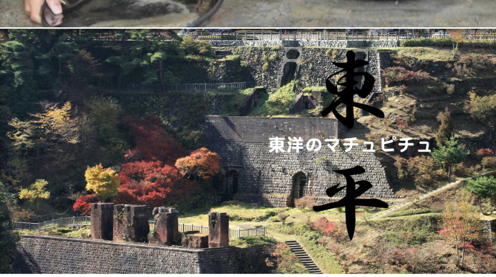

https://besshi.com/

**！？！？！？ :sweat_smile:**

**:thinking_face: :thinking_face: :thinking_face:**

どこの都道府県にもある、

ぱっと見よくわからない

**謎施設きたー！ :sunglasses:**

---

こういうの **わくわく** しちゃう！

**謎の冒険感**

あっていいよね！ :mushroom:

---

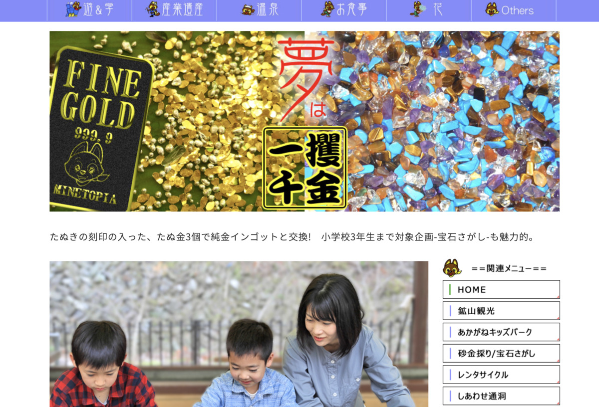

砂金！

なるほど鉱山だったのかな・・・？

きになるけど〜

**深く探るのはやめとこう・・・ :kissing_closed_eyes:**

---

そうそう！

**愛媛といえば！**

**謎のフェリールート** あるじゃないですかー？ :ferry:

（ぽちっ）

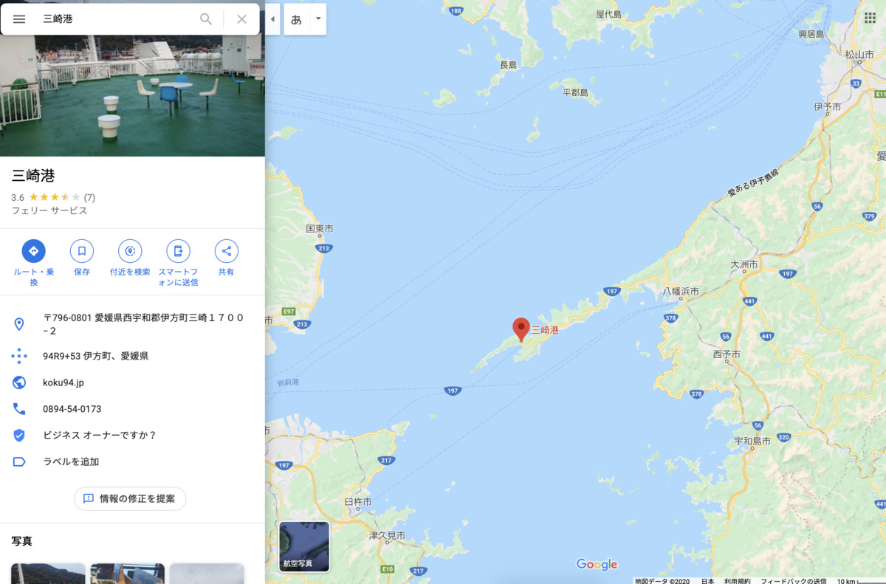

**そうここ！**

めっちゃ **気になるぅー！**

大分・愛媛ルート！

**気になる気になるぅー！ :ferry: :ferry: :ferry:**

---

いきたいいきたいー！

フェリーで大分から愛媛に

**いきたいぞー！ :rage: :rage: :rage:**

---

**はっ・・・！**

この妄想フェリールート・・・

**危険だ〜〜〜 :confounded: :confounded: :confounded:**

---

そろそろ

カレー食べる場所

**さがさなきゃ・・・！ :mag:**

---

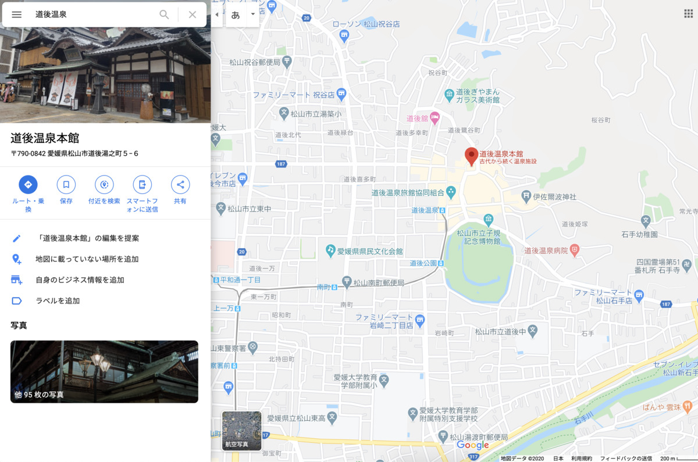

**道後温泉！ :hotsprings:**

行ったことないけど〜

超有名だよねえ〜〜〜

---

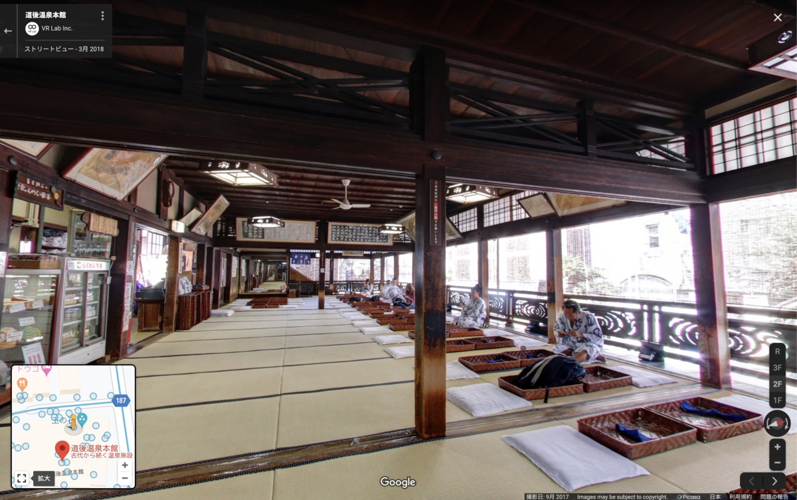

**ああああ〜〜〜！ :sparkles: :sparkles: :sparkles:**

この風呂上がりの

**休憩所！！！ :sweat_drops:**

風呂上がりの気分で

カレー食べたーい！！

---

## 実食！！

**このブログ、どんどん長くなるわ！w**

**カレーを早よ食べるぞ・・・！！！**

---

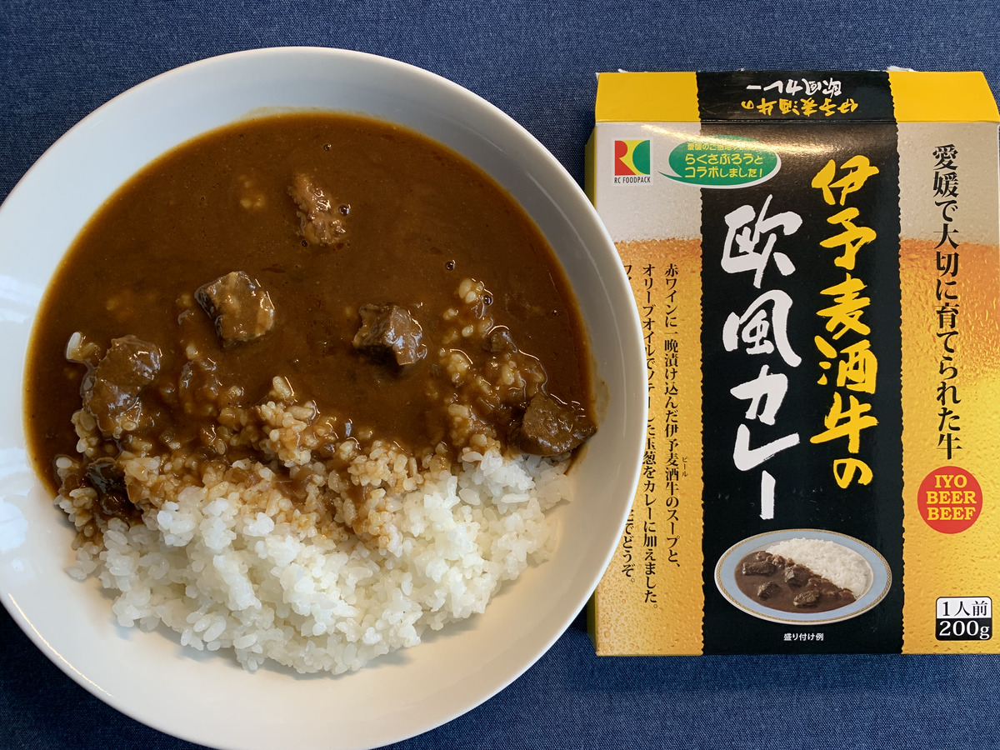

**きたーーー！！！ :curry: :curry: :curry:**

うまそう！

ウマソウ！！

**UMASOU!!! :yum: :yum: :yum:**

---

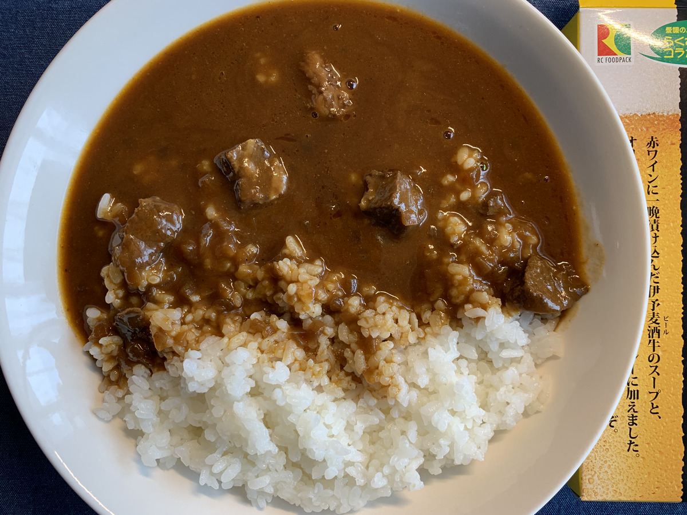

記念すべき！

**10杯目のカレーだぞ！！ :tada: :tada: :tada:**

---

**いえーい！ :v: :v: :v:**

**どんどんぱふぱふー :confetti_ball: :confetti_ball: :confetti_ball:**

---

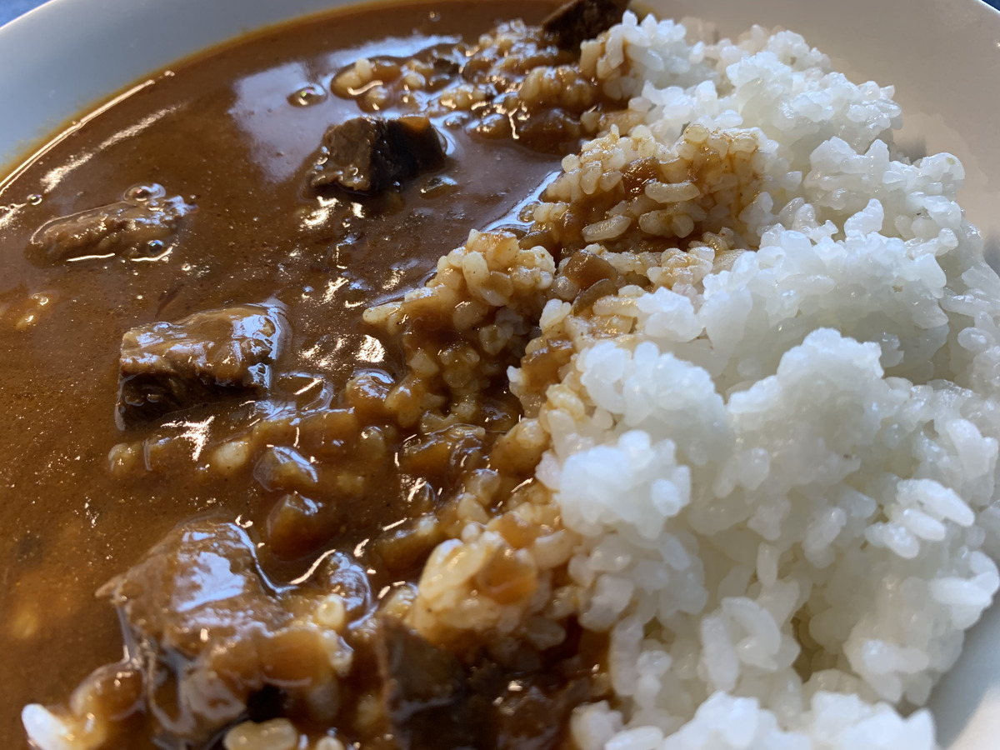

いやあ〜

**これは旨そうだ〜！ :yum:**

---

今回も生産者に感謝して〜

**いただきます！ :pray: :pray: :pray:**

---

（パクッ）

---

**うまーーーい！！！ :satisfied: :satisfied: :satisfied:**

---

（パクッ）

（パクッ）

---

**うまいうまーーーい！！！ :satisfied: :satisfied: :satisfied:**

---

カレーソースがまろやか！カレースープっぽさあるね！

なんか気のせいかもしれないけどお酒に合いそう、お酒飲みたくなってくる〜。
あっでも食べててお酒感は全然ないし当然アルコールも入ってないよ！

お肉がちょうど良い大きさに切ってあって程よく多めに入ってて良い感じ、
給食の時に食べたハヤシライスっぽさあるかも。うまーい！

---

**おやぁ〜？**

なんかもう知らないうちに

残りひと口になっちゃいますよね〜

**カレー危険すぎる・・・！ :smiling_imp: :smiling_imp: :smiling_imp:**

さあ今日も呼ぶよー！

---

**ホア〜〜〜〜〜**

---

**ジャオ〜〜〜〜〜！！！**

---

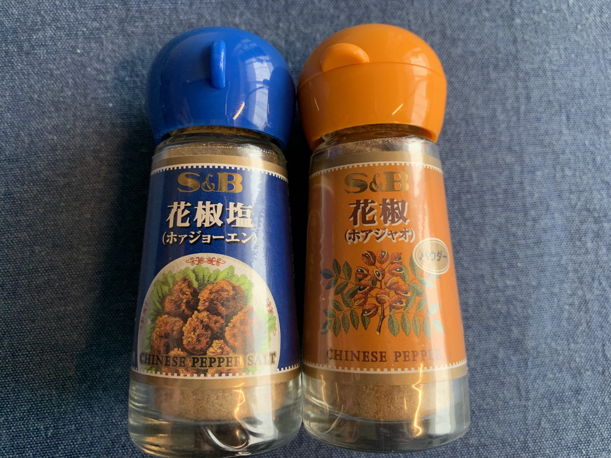

**ほわわわわ〜ん :innocent:**

（ふりふりふりふり・・・）

**ほわわわわ〜ん :innocent: :innocent:**

（ふりふりふりふり・・・）

---

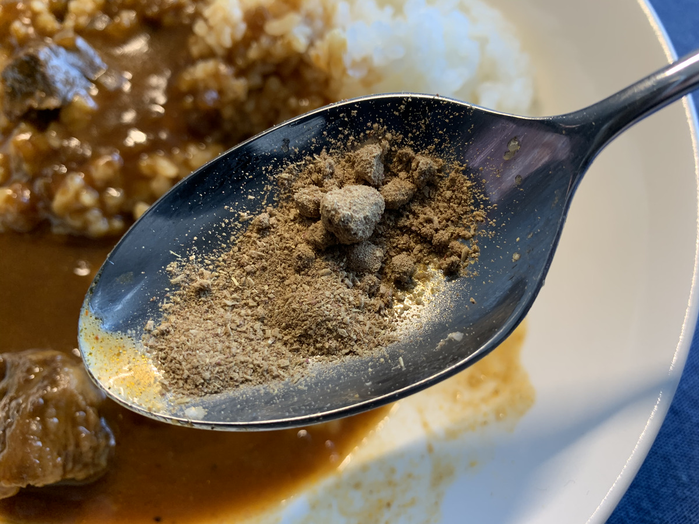

**ほわわわわ〜ん！ :innocent: :innocent: :innocent:**

（ふりふりふりふり・・・）

ハッピーパウダー、

**最高だ・・・！ :angel:**

---

**愛媛 伊予麦酒牛の欧風カレー**

**おいしゅうございました！ :pray: :pray: :pray:**
