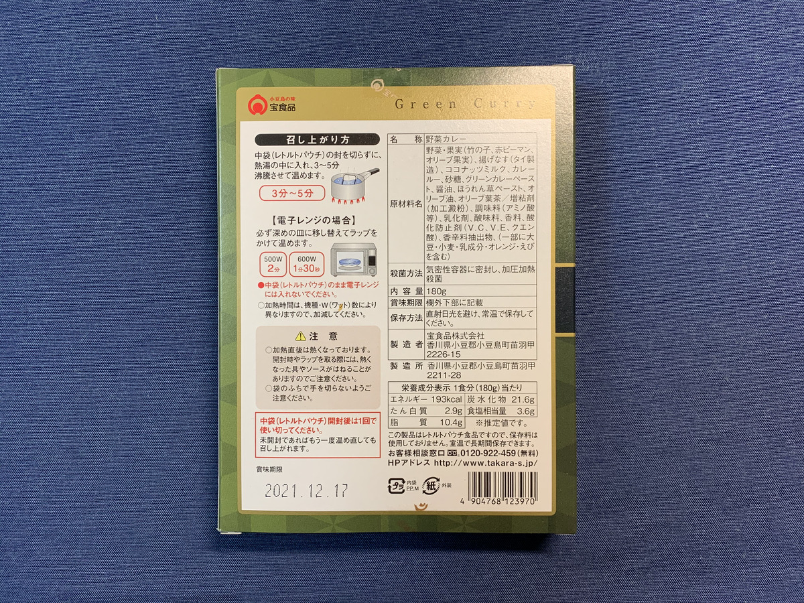
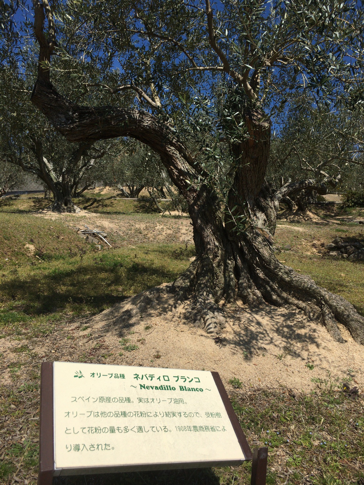
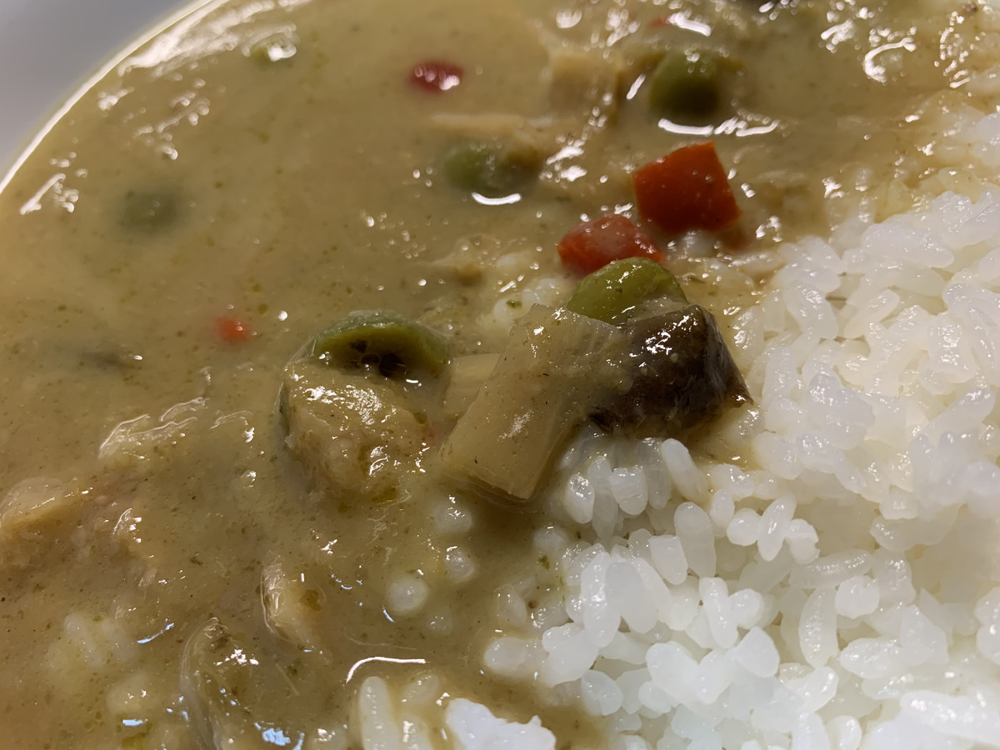

**今日もカレー、ドーン！ :boom: :boom: :boom:**

---

**中身がスッカスカ** でも大丈夫だぜー

ひゃっほーい！

**ひゃっほほほーい！**

**カレーだひゃっほい！ :satisfied:**

---

今日のカレーは

**こいつだぜベイベー！ :smiling_imp:**

---

**ババンッ！！！**

とうとうきたー！

**オリーブ果実グリーンカレー！ :curry:**

**オリーブのカレーキター！！！！！ :satisfied: :satisfied: :satisfied: :satisfied: :satisfied:**

---

段ボールで送られてきてたときから

**気になってた** んだよねえー :eyes: :eyes: :eyes:

オリーブカレーだぜ〜〜〜

オリーブで

**カレー :curry: 作っちゃいました**

のやつだぜ〜 :sunglasses:

チャレンジングだぜ〜

---

オリーブといえば！

**小豆島・・・！**

**めっちゃ楽しみだぜ〜〜 :sunglasses:**

---

恒例の〜

**バックショット** は〜

これだっ！

**Oh! Sexy Olive...!!! :sparkling_heart: :sparkling_heart: :sparkling_heart:**

---

だけどうんちくは表面にあったりする！

表面をみよう！

---

なになに〜？

> 日本におけるオリーブ発祥の地、小豆島。
> そこで生まれた「オリーブの果実」が入った
> 優しい甘さの中に刺激的な辛さのあるグリーンカレーです。
> 隠し味に小豆島産醤油とオリーブ葉茶を使用しています。

小豆島のオリーブと〜

小豆島の醤油の〜、

**コラボレーションー！ :couple_with_heart:**

---

**今回は実際に行っちゃおうぜ！！！**

ﾋﾞｭｰﾝ...!!

---

新岡山港！

---

どどぅーん！

---

**フェリーで！ :ferry:**

---

**フェリーで！！ :ferry: :ferry: :ferry:**

---

土庄（とのしょう）港に

**降り立ったぜー！ :tada: :tada:**

---

ここが！

**オリーブの島！**

---

**ばばーん！ :tada:**

やはり島はいいなあ・・・

島はいい・・・

---

おさるの国とな・・・？

---

**さるー！ :monkey:**

---

**さるだー！ :monkey:**

**さるださるだー！ :monkey: :monkey: :monkey:**

全部放し飼いになっててやばーい！

---

自販機も **オリーブ** と **醤油** 推しだぜ〜

---

https://www.1st-olive.com/

オリーブ園だぜ〜

---

**オリーブたくさんだぜ〜**

---

**発祥の地！**

発祥の地しか名乗れないやつ！

---

原木もあるんだぜ〜〜

---

オリーブソフトも

**食べちゃうぜ〜！ :icecream:**

---

そういえば、 **醤油** も

**地元企業さん** が頑張ってるんだぜ〜 :muscle:

---

**ここだっ！**

---

醤油の香り〜〜〜 :innocent:

---

発酵〜〜〜

**発酵しゅき〜〜〜 :heart: :heart:**

---

こっちもアイスあるぞ！ :icecream:

**ネタになりそうだけど・・・ :sweat:**

---

そろそろ食べる場所を

**探すワン！ :dog:**

---

**・・・はっ！**

食べる場所探さなきゃ〜 :mag:

どっか良い場所ないかなー？

---

あ〜このオリーブがたくさんある中にある、 **風車** なんか、いい〜んでないの？ :sunglasses:

---

そうそう、ここここ〜

**ギリシャ風車** っていうのかーしらんかったー :thinking_face:

---

あ〜〜〜

いいじゃないですかあ〜〜〜

**ここに決めたー！ :v:**

いえーい :v: :v: :v:

---

## 実食！！

**旅ブログになっちゃったよ！**

カレー食べなきゃだよ！ :curry:

---

**パンパカパーン！ :confetti_ball: :confetti_ball: :confetti_ball:**

できあがりー！

**旨そうだー！グリーンカレー！！**

---

ああああ〜〜

いい！

こういうスタンダードとは違う、

個性的なカレーも **しゅき〜！ :heart_eyes:**

---

うわああ〜〜

**もう我慢できないよ〜！ :heart_eyes: :heart_eyes: :heart_eyes:**

---

では、 **生産者** と **小豆島の幸** に感謝して〜

**いただきます！ :pray: :pray: :pray:**

---

（パクッ）

---

**うまいぞー！！！ :satisfied: :satisfied: :satisfied:**

---

（パクッ）

（パクッ）

---

**うまいぞたまらんぞー！！！ :satisfied: :satisfied: :satisfied:**

---

オリーブオイルっぽさを最初に感じつつ、今までのカレーよりも早く辛さを感じるね！
辛いと言っても、オリーブのまろやかさと辛さでちょうど良い感じ！辛うまー！

ソースも美味しいけど、オリーブがごろごろ入ってるのもグッド！
オリーブ好きにはいいかもしれない！

---

はー！

今日のはテイスト的に **ホアジャオせんせー** とは合わない気がするなあ・・・

どっちかっていうと、 **チリペッパーせんせー** の出番かもしれない！

**チリペッパーせんせー！**

**ほわわわわ〜ん！**

（ふりふりふりふり・・・）

---

**はー辛うまー！ :innocent: :innocent: :innocent:**

（ふりふりふりふり・・・）

ハッピーパウダーファミリー！最高だ！

---

はー、小豆島にまたいきたくなっちゃうよー

フェリーでまた行きたい・・・

**絶対に行っちゃうからなー！ :muscle:**

---

**香川 オリーブ果実グリーンカレー**

**おいしゅうございました！ :pray: :pray: :pray:**
