**カレーの時間** だよー！

今日もカレーの時間が

**やってきたよおー！！！ :v: :v: :v:**

---

ひゃっほーい！ :curry:

ひゃっほーい！ひゃっほーーい！ :curry:

**ほほほーい！ :pig: :pig:**

---

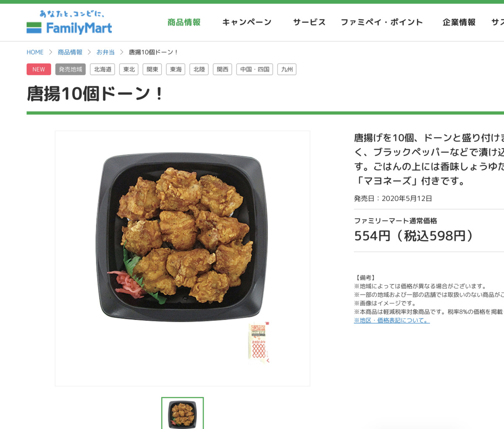

**唐揚げ10個ドーン！ :boom:**

---

今日のカレーは〜〜〜？？？

**なんじゃろなー？ :thinking_face:**

---

**今日はこいつだー！！！**

---

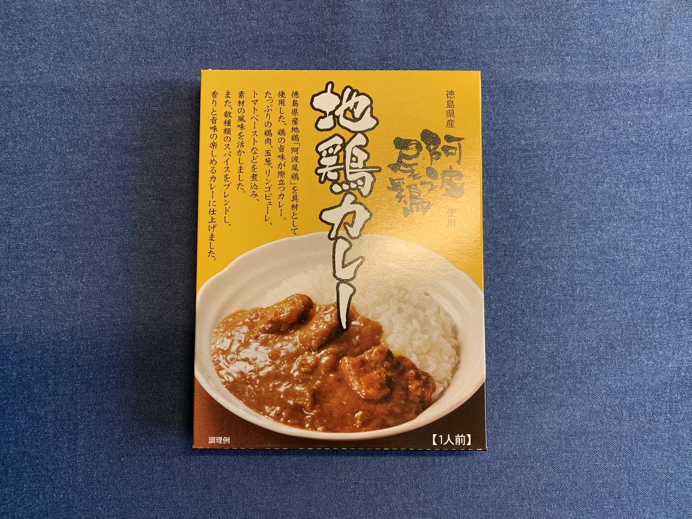

はいっ！

**徳島 地鶏カレー！ :curry:**

**どんどんぱふぱふー！ :tada: :tada:**

---

正確には〜

**徳島県産阿波尾鶏使用 地鶏カレー！ :curry:**

きたー！！！

---

エライヤッチャ！ :dancers:

エライヤッチャ！ :dancers:

**ヨーイヨーイヨーイヨーイ！！ :dancers: :dancers: :dancers:**

おーい！

絵文字ー！

**空気読めーい！**

---

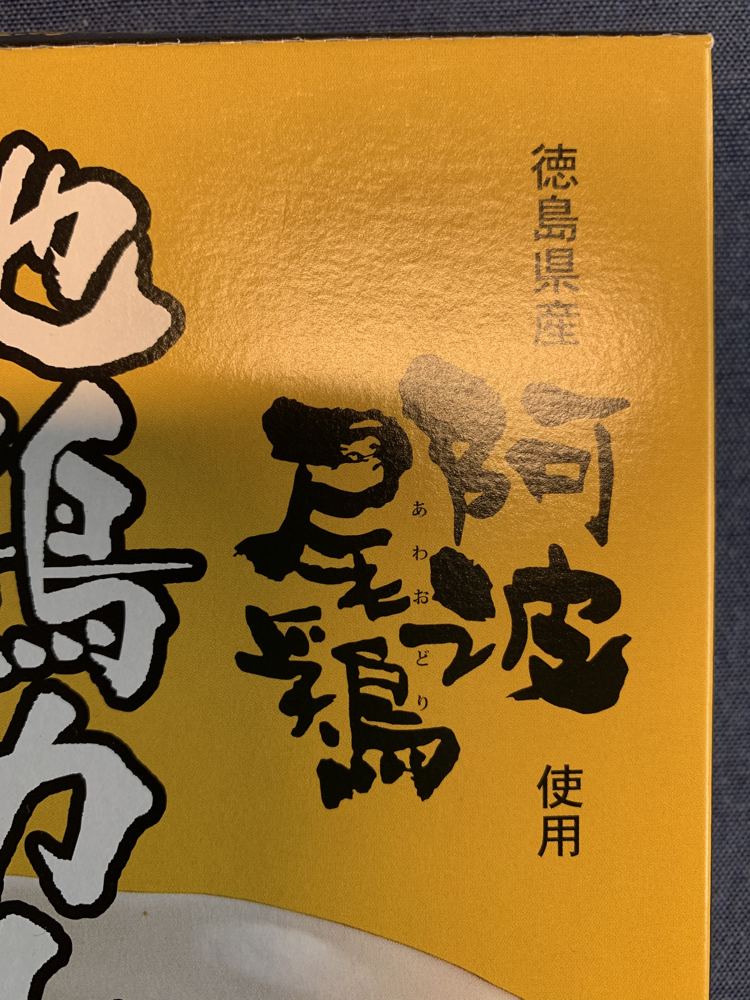

**阿波尾鶏（あわおどり）・・・！**

とな？

**どういうことなの・・・！ :thinking_face:**

（ダジャレなの・・・？）

---

ダジャレとか

言ってはいかーん！

作ってる人は真剣に

**考えてるのだ！！ :cop: :cop: :cop:**

---

さあさあ！

**今日も生産者に感謝・・・！ :pray: :pray: :pray:**

---

いつものえっちいやつは〜

これだっ！

---

**ばばん！**

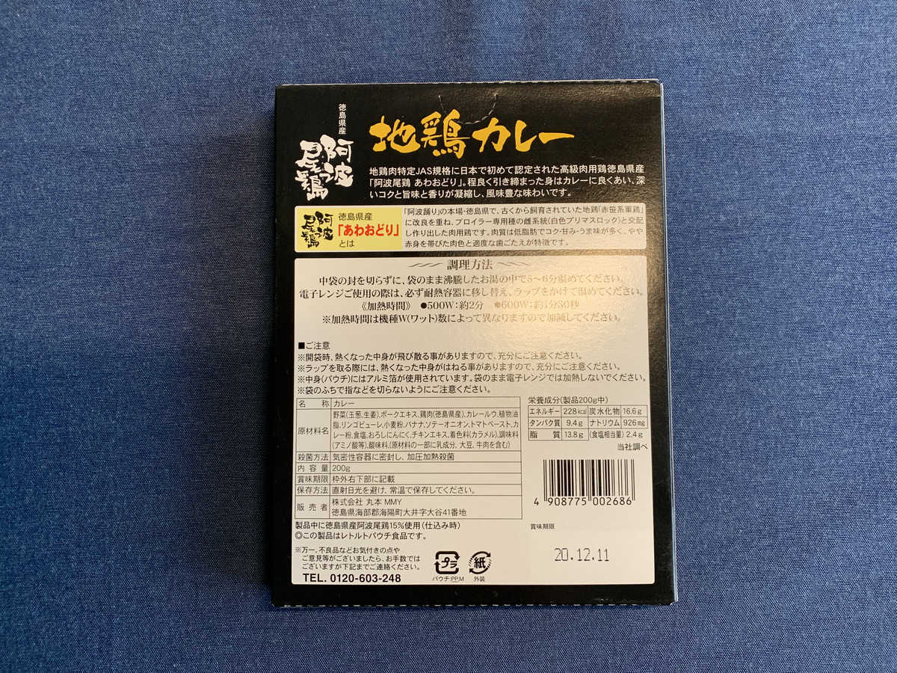

**Oh! Sexy Dancing...!!! :sparkling_heart: :dancer: :sparkling_heart: :dancer: :sparkling_heart:**

---

**唐揚げ10個ドーン！ :boom:**

---

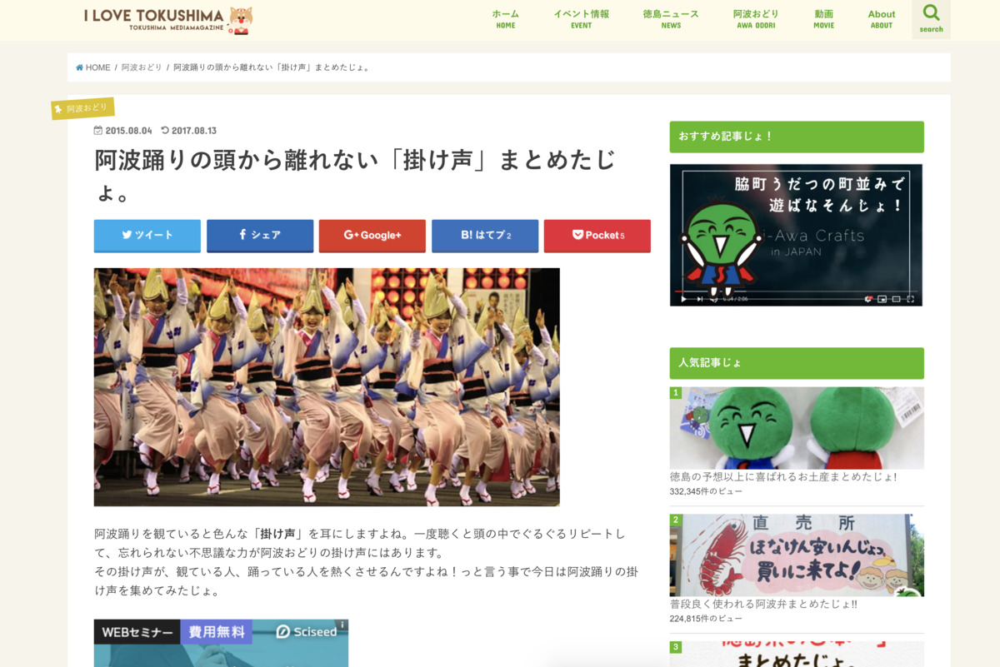

http://ilovetokushima.com/?p=279

**阿波踊り！**

そう、 **オリジナル** の方！

両方オリジナルだけど！

---

**掛け声** ですってー！

行ったことないからわかんないけど、

**どんなのがあるんだろー？ :speaker:**

---

> 誰が言ったかわからないが間違いなく歴史に残る名言
>
> 踊る阿呆にみる阿呆　同じ阿呆なら踊らにゃ損々
> エライヤッチャ　エライヤッチャ　ヨイヨイヨイヨイ

エライヤッチャ！

**誰が行ったかわからーん！**

---

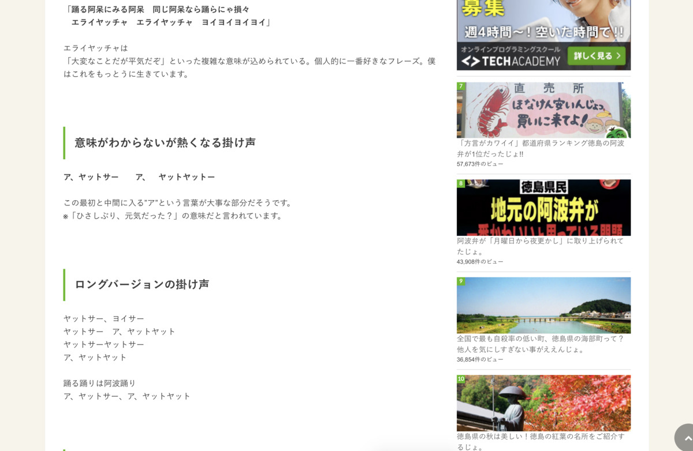

> 意味がわからないが熱くなる掛け声
>
> ア、ヤットサー　ア、ヤットヤットー

**ア、ヤットヤットー！ :satisfied:**

---

https://www.pakutaso.com/20200422121web-27.html

あ、ヤットヤットー！ :satisfied:

**フリー素材の方のヤットさん** だー！

**あ、ヤットヤットー！ :satisfied: :satisfied: :satisfied:**

---

**唐揚げ10個ドーン！ :boom:**

---

こら〜〜〜！

唐揚げに頼るんじゃありません！

**:stuck_out_tongue_closed_eyes: :stuck_out_tongue_closed_eyes: :stuck_out_tongue_closed_eyes:**

---

あ〜〜〜

そうそう！

**うだつ！**

（ぽちっ）

---

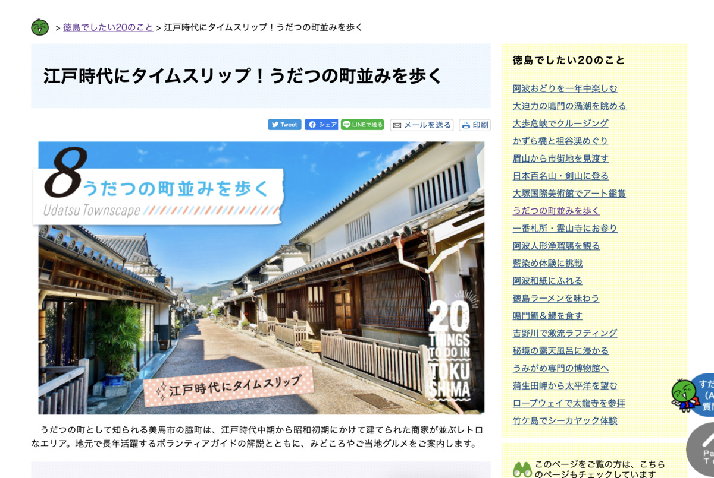

https://www.awanavi.jp/document/report/23363.html

**うだつが上がらない**

の **うだつー！ :sunglasses:**

行ってみたいんだよね〜

**徳島県、美馬市、だぞ！**

---

こういうところって、

現地のガイドさんの話とか聞くと

**より面白い** んだよねー！

行きたい！

**行きたいぞ！ :rage: :rage: :rage:**

---

他にうまいもん

なんかあるのかなー？

（ぽちぽちっ）

---

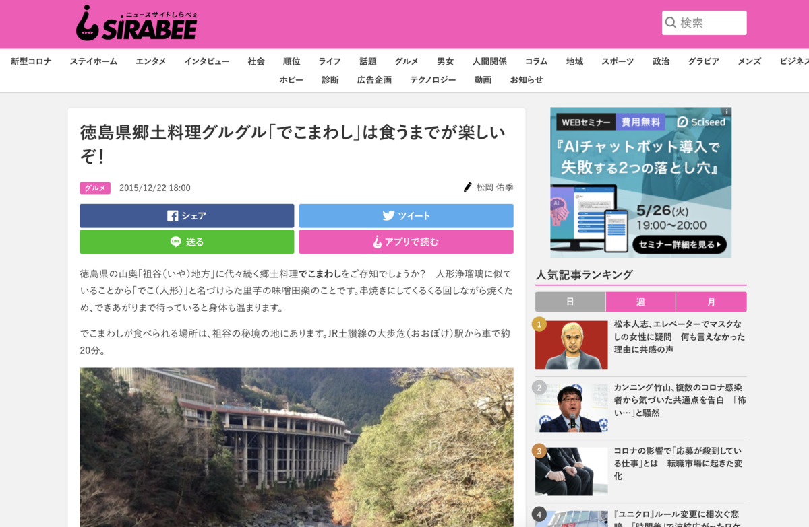

https://sirabee.com/2015/12/22/71525/

**でこまわし・・・！**

でこまわし？

ってなんじゃろな？

---

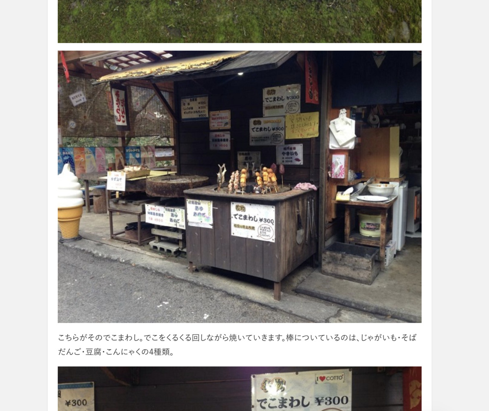

あ〜〜〜

こういうの〜〜

**しゅき〜〜〜〜 :heart_eyes: :heart_eyes: :heart_eyes:**

---

**ああ〜〜たまらんねえ〜〜**

（ぽちっ）

---

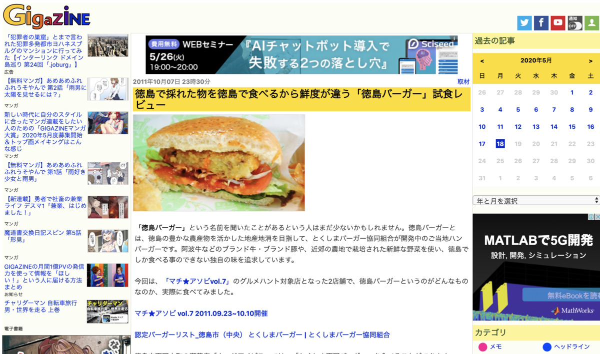

https://gigazine.net/news/20111007_tokushima_burger_machiasobi7/

あ〜〜〜

こういう現地でしか食えないの〜〜〜

**しゅき〜〜〜〜 :heart_eyes: :heart_eyes: :heart_eyes:**

---

はあっ、はあっ、はあっ・・・

**ダメだ〜〜〜**

**妄想グルメ旅、危険だ〜 :imp: :imp: :imp:**

---

はやく！

カレー食べる場所を

**探さなきゃ！ :mag:**

---

今日はどこにしようかなー :fork_and_knife: :yum: :fork_and_knife:

**今日はどこで食べよかなー :fork_and_knife: :yum: :fork_and_knife:**

よーしここだ！

（ぽちっ）

---

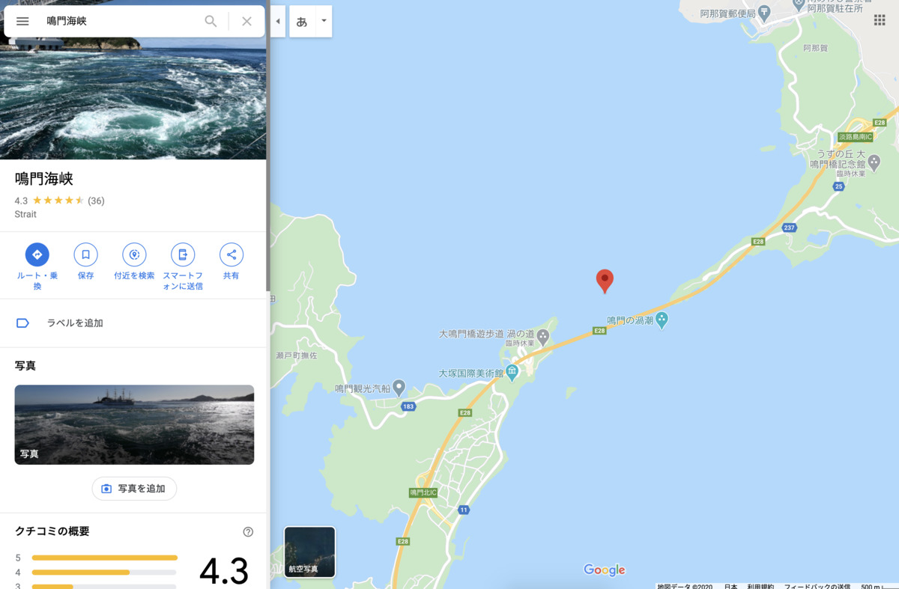

**なるとかいきょう〜 :fish_cake: :fish_cake: :fish_cake:**

---

このシステムを使えば！

天候や場所、

お金 :moneybag: かかっちゃうところだって

**ひとっ飛びー！ :money_with_wings: :money_with_wings: :money_with_wings:**

---

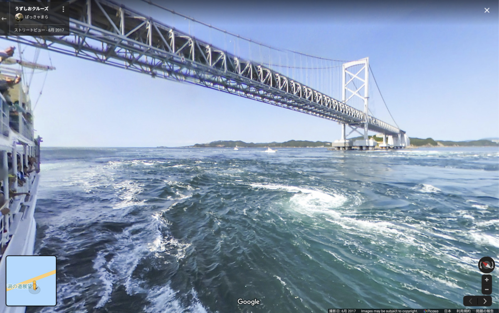

**いえーい！ :v: :v: :v:**

最高のロケーションだぜ〜

渦だぜ〜〜 :fish_cake:

---

ところでこのクルーズ船、

なんだろう〜？ :thinking_face:

（ぽちっ）

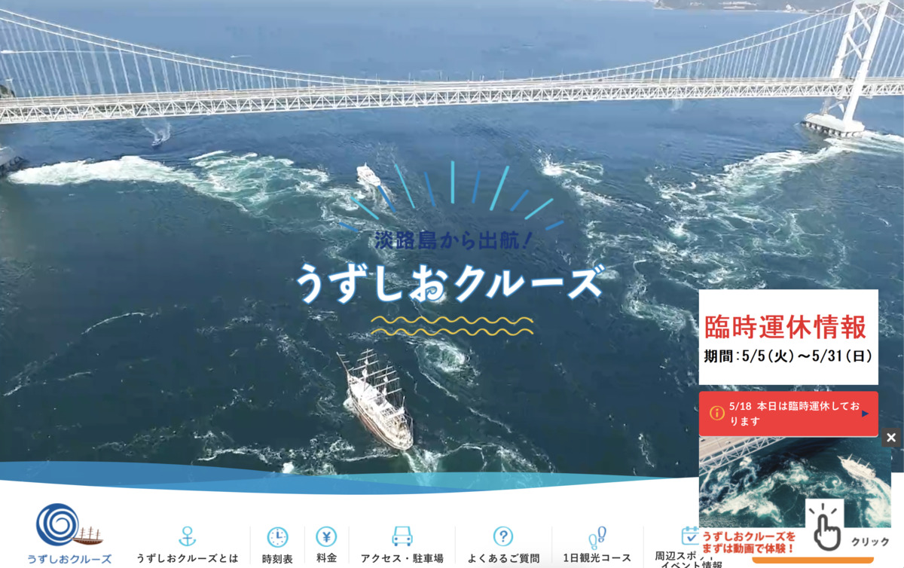

https://www.uzu-shio.com/

うひゃー！

こんなのが **淡路島** から出てるの！？

**関西人、ずるいぞずるいぞ！ :rage: :rage: :rage:**

---

## 実食！！

**なっが〜〜〜〜い！**

さて食べます！！！

---

（グツグツ・・・グツグツ・・・）

---

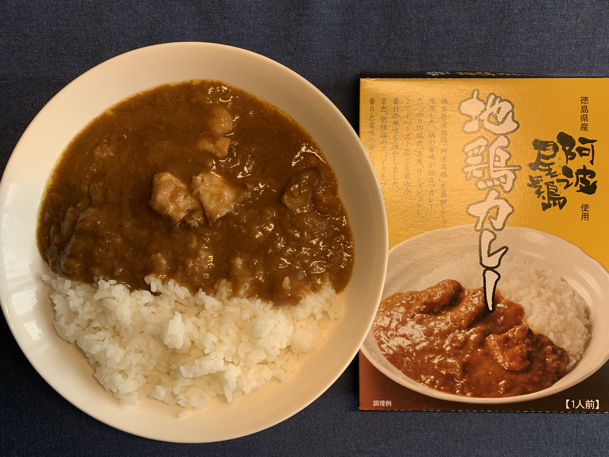

**パンパカパーン！ :tada: :tada:**

たった5分でカレーの完成だー！

**作る阿呆に食う阿呆！**

**同じ阿呆 (あほ) なら食わにゃ損々ー！！**

---

**ア、ヤットサー！**

**ア、ヤットヤットー！ :satisfied: :satisfied: :satisfied:**

---

た、食べるぞ・・・！

---

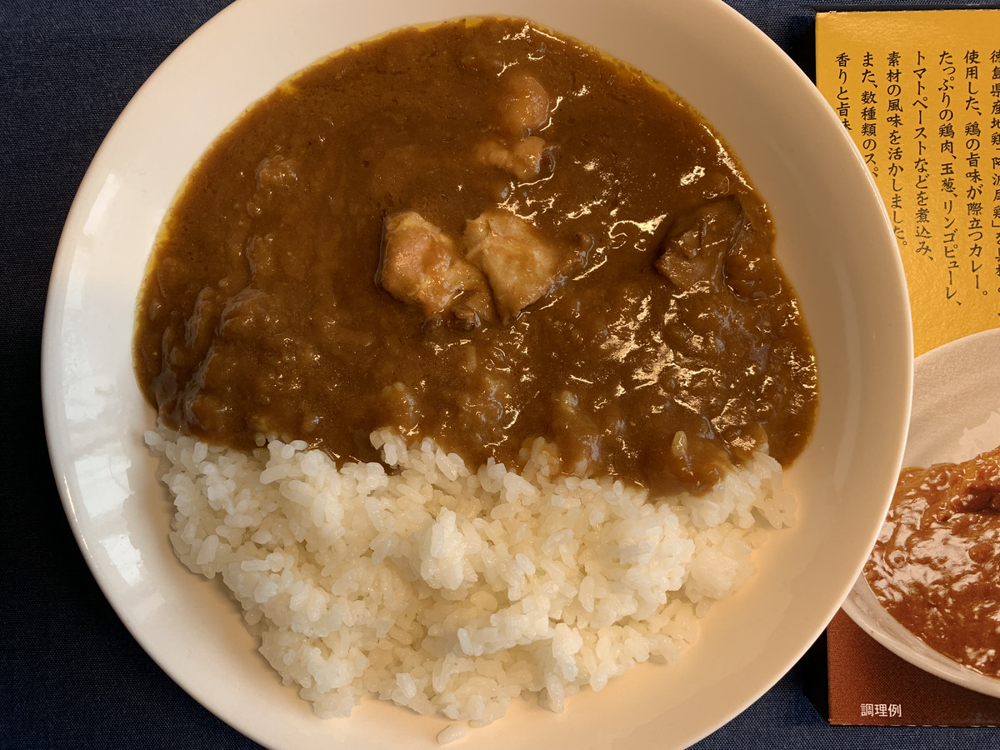

**おおー！旨そう！**

旨そう！うまそう！

**UMASOU!!! :yum: :yum: :yum:**

---

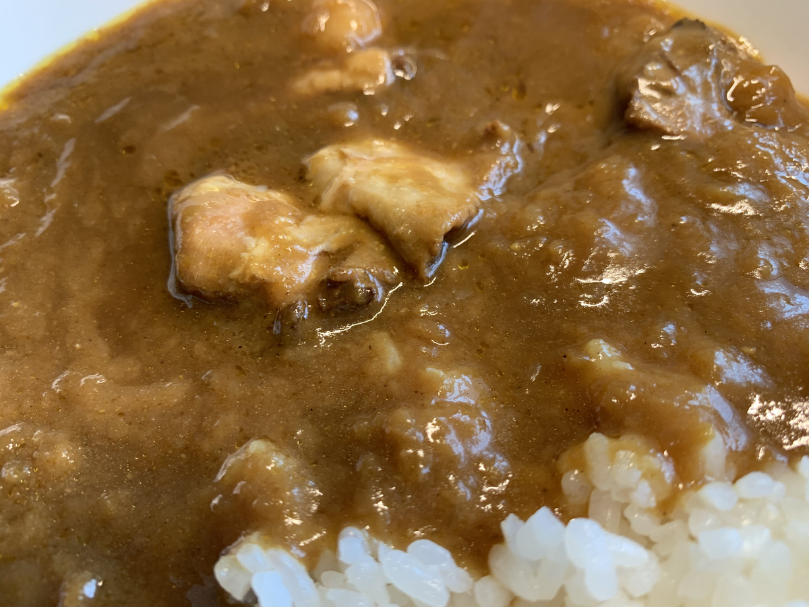

**阿波尾鶏** が **阿波踊ってるぅー！**

もう辛抱たまらーん！

---

ではでは、

**いただきまーす！ :pray: :pray: :pray:**

---

（パクッ）

---

**うまぁ〜いー！！！ :satisfied: :satisfied: :satisfied:**

---

（パクッ）

（パクッ）

---

**うまぁぁぁぁ〜いー！！！ :satisfied: :satisfied: :satisfied:**

---

ソースはお肉のカレーを彷彿とさせるようなボリューミーな感じ、
とろみがあっておいしいなあ！

カレーの中に鶏肉あっても、肉の旨味が主張してて良いね！
どこの肉なのかは分かんないけど、若干ササミに近い食感？歯応えあっていいぞおー！

---

（ガツガツ・・・）

まだ・・・

半分あるけど・・・

もう・・・そろそろ・・・

いいよね・・・！ :yum: :yum: :yum:

---

体が・・・！

**ｳｽﾞｲﾃ...!!! :confounded:**

ﾎｱｼﾞｬｵ...ﾎｼｲ...!!!

**ﾎｱｼﾞｬｵ...ﾎｼｲ...ｯｯｯ!!! :tired_face:**

---

**ホア〜〜〜〜〜**

---

**ジャオ〜〜〜〜〜！！！**

---

せんせーはよ！

**はよー！**

**（ﾌﾘﾌﾘﾌﾘﾌﾘﾌﾘﾌﾘﾌﾘﾌﾘ...!!!）**

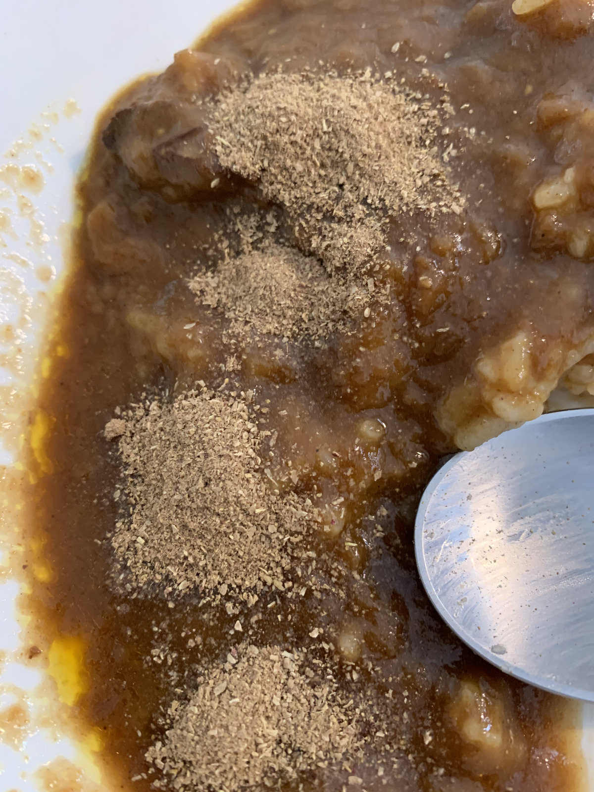

**ほわわわわーん！ :innocent: :innocent: :innocent: :innocent: :innocent: :innocent: :innocent: :innocent:**

---

**徳島 地鶏カレー**

**おいしゅうございました！ :pray: :pray: :pray:**

---

これで四国のカレー

**完　食　だっ！ :crown: :crown: :crown:**
