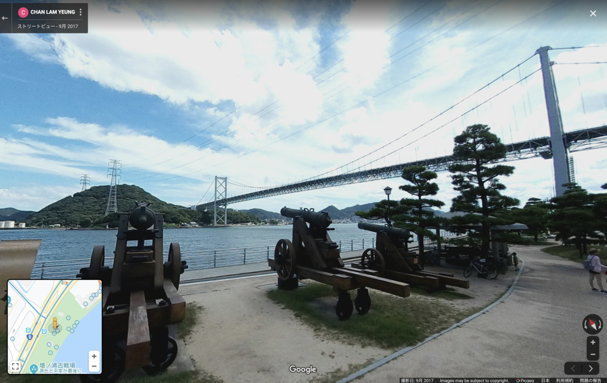

**カレー前線北上中！ :cherry_blossom: :cherry_blossom: :cherry_blossom:**

---

ひゃっほーう！

**ひゃっほーう！ひゃっほーう！ :yum:**

とうとう **本州** にきちゃったぜ！

---

毎日 **カレー :curry:** で楽しいなー！

**昨日** もカレー！

**今日** もカレー！！

**明日もカレー！！！ :curry: :curry: :curry:**

---

**お昼考えなくてわーい！ :hatched_chick: :hatched_chick: :hatched_chick:**

---

みんなも〜

**やってみるといいぞ〜！ :muscle:**

---

今日もカレーは

**こいつさベイベー！ :surfer:**

---

じゃん！

**山口 ふくカレー！**

**わーふくきたー！ :tada: :tada: :tada:**

---

**ふく祭じゃー！！**

ふくふく！ :blowfish: :blowfish: わっしょい！ :blowfish: :blowfish:

わっしょい！ :blowfish: :blowfish: ふくふく！ :blowfish: :blowfish:

---

山口では、

ふぐじゃなくて

**ふく** って呼ぶんだってー

**いえーい！ :v: :v: :v:**

**ふくをたらふく食うぞー！ :blowfish: :blowfish: :blowfish:**

---

いつものバックショットはこれだっ！

（ちらっ）

---

**Wow! Sexy fish...!! :sparkling_heart: :fish: :sparkling_heart: :fish: :sparkling_heart:**

パッケージ、色っぽさ〜〜〜 :sparkling_heart:

---

うんちく、いいよね〜

**今日も読みたいよね〜 :eyeglasses:**

どれどれ〜？ :mag:

> 河豚本来の味に、香り・辛みが絶妙にマッチした新感覚のカレーを、
> 河豚食解禁の地、日本一の「河豚の街・下関」からお届けします。
> 「マル幸」自慢の「新味覚」をお楽しみください。

おお〜っと！

**河の豚って書いて、ふぐって読むんだゾ！ :star:**

マル幸さんが作ってるのね？

生産者に感謝っ！

**（びしっ） :pray: :pray: :pray:**

---

http://marukou-inc.co.jp/

おお〜〜〜

**こりゃ〜〜〜旨そうだ :yum:**

（じゅるり・・・） :yum: :yum: :yum:

こんなん絶対うまいやん〜

**うまいやつやん〜〜〜 :sunglasses:**

---

他にも **美味しいもの** 、

**色々ありそう** だなー :star2:

（ぽちっ）

---

https://shimonoseki.travel/spot/food.html

**楽しも！**

そうだぞ！下関（しものせき）の **しも** とかけてるんだぞー！

---

こらー！

**だじゃれをバカにしてはいけません！ :cop: :cop: :cop:**

毎回こういうのは、

**ちゃんと大人が考えてるんだからー！ :see_no_evil:**

だめだゾ！ :sparkles:

世の中のおじさんのダジャレもバカにしたらダメだぞ！ :cop:

---

他にどんな美味しいもの

**あるのかなー？ :thinking_face:**

わくわくー！ :grinning:

（ぽちっ）

---

https://www.toyoura.net/charm/index.php?mode=dtl&id=6364d3f0f495b6ab9dcf8d3b5c6e0b01&cid=5

おおー！

知ってる知ってる！

**瓦そば！**

有名だよね！ :laughing:

**UMASOU!! :yum:**

---

https://ja.wikipedia.org/wiki/%E7%93%A6%E3%81%9D%E3%81%B0

む？ :thinking_face:

---

> 肉などを焼いて食べたという話に参考にして、1961年・・・

**意外と最近だったー！！ :laughing: :laughing: :laughing:**

でも **UMASOU!! :yum:** だからオッケー！

・

・

・

こまけぇーことはいいんだよ！ :rage: :rage: :rage:

---

https://www.oidemase.or.jp/about-yamaguchi/tourism/bridge/

**Oh... Bridge...! :sparkles: :sparkles: :sparkles:**

なんとマニアックな・・・

橋マニアにはたまらないコンテンツ・・・

---

**おっ！これ見たことあるぞ！**

**錦帯橋！ :sparkles: :sparkles: :sparkles:**

**日本三名橋** のひとつ、

なんですってー！

---

行きたい行きたいー！

現地に行って見てみたいぞー！ :rage:

**行きたいー行きたいぞー！ :rage: :rage: :rage:**

---

https://www.asahishuzo.ne.jp/

旭酒造だー！

**だっさーーーい！**

**ダッサイ！ :sake:**

**獺祭ーっ！！ :sake: :sake: :sake:**

---

そうそう、

この前の洪水で品質足りないやつを

島耕作とコラボして

**被災地に寄付** したんだよねーすごい・・・ :sparkles: :sparkles: :sparkles:

**がんばってる地元企業に敬礼っ！ :pray: :pray: :pray:**

---

あ〜〜〜 :sake:

飲みたい飲みたいー！

現地に行って飲みたいぞー！ :sake: :heart_eyes:

**飲みたいー飲みたいぞー！ :heart_eyes: :sake: :heart_eyes:**

---

・・・はっ！

**カレーブログ** だった・・・！ :curry:

食べる場所

探さなきゃー！ :mag:

---

どこがいいかなー

どこでカレー :curry: 食べよかなー

**よーし！ :muscle:**

**ここだー！ :dash: :dash: :dash:**

（ぽちっ）

---

**関門海峡〜！**

こら〜

定番すぎるとか言わない〜 :kissing: :kissing: :kissing:

おや？

**壇ノ浦** って書いてあるぞ？？？

---

あれれー？

壇ノ浦って、こんなに

**関門海峡のすぐ近く**

だったの？？？ :thinking_face:

---

https://ja.wikipedia.org/wiki/%E5%A3%87%E3%83%8E%E6%B5%A6

おおー :eyes: :eyes: :eyes:

**マジだったー :+1: :+1: :+1:**

知らなかったー :sweat: :sweat: :sweat:

---

じゃあ今日は

**壇ノ浦でカレーだぜ〜 :sunglasses: :sunglasses: :sunglasses:**

---

おおー **謎の大砲** スポット！

**謎コンテンツきたー！！ :alien:**

**福岡 vs 山口の戦い・・・ :ocean:**

---

ここで **平家を感じながら** 食おう！

平家〜 :zap:

**平家〜〜〜 :zap: :zap: :zap:**

---

## 実食！！

**平家じゃなくてカレーだよ・・・！**

---

早く食べよう・・・！

**食べたい食べたい・・・！ :confounded: :confounded: :confounded:**

---

**カレーババーン！！！ :tada: :tada: :tada:**

おおおお〜

ふくが・・・！ :heart:

**ふくが目の前に！ :heart: :heart:**

---

**ふく〜〜〜 :heart_eyes:**

**ふくしゅき〜〜〜 :heart_eyes: :heart_eyes: :heart_eyes:**

---

よし！準備は整った！

**食べよう！！**

**いただきまーす！！！ :pray: :pray: :pray:**

---

（パクッ）

---

**あまぁ〜いー！！！ :satisfied: :satisfied: :satisfied:**

---

（パクッ）

（パクッ）

---

**あまいうま〜いー！！！ :satisfied: :satisfied: :satisfied:**

---

ソース甘口ーでまろやかーなお味！
ふく美味しい！お刺身と違って厚めに切ってあってフィッシュ感感じるお肉ー！ふくー！

とにかくふくが美味い！食べてるとそれ以外の感想が出てこない・・・！

---

**お口の中がー！**

**ふく祭じゃー！！ :blowfish:**

ふくふく！ :blowfish: :blowfish: わっしょい！ :blowfish: :blowfish:

わっしょい！ :blowfish: :blowfish: ふくふく！ :blowfish: :blowfish:

---

そろそろ先生を呼ぼう・・・！

**せんせー！せんせー！！**

---

**ホア〜〜〜〜〜**

---

**ジャオ〜〜〜〜〜！！！**

---

ﾄﾞｩｰﾝ... :sunglasses:

ホアジャオせんせー！！

**今日もｵﾅｼｬｽ...!!!**

（ﾌﾘﾌﾘﾌﾘﾌﾘﾌﾘﾌﾘﾌﾘﾌﾘ...）

（ﾌﾘﾌﾘﾌﾘﾌﾘﾌﾘﾌﾘﾌﾘﾌﾘ...）

---

**ほわわわわーん！ :innocent: :innocent: :innocent: :innocent: :innocent: :innocent: :innocent: :innocent:**

---

すべての味が・・・！

（ﾌﾘﾌﾘﾌﾘﾌﾘﾌﾘﾌﾘﾌﾘﾌﾘ...）

**幸せで上書きされていく・・・！！！**

（ﾌﾘﾌﾘﾌﾘﾌﾘﾌﾘﾌﾘﾌﾘﾌﾘ...）

**これぞハッピーパウダー・・・！ :innocent:**

（ﾌﾘﾌﾘﾌﾘﾌﾘﾌﾘﾌﾘﾌﾘﾌﾘ...）

---

**山口 ふくカレー**

**おいしゅうございました！ :pray: :pray: :pray:**
