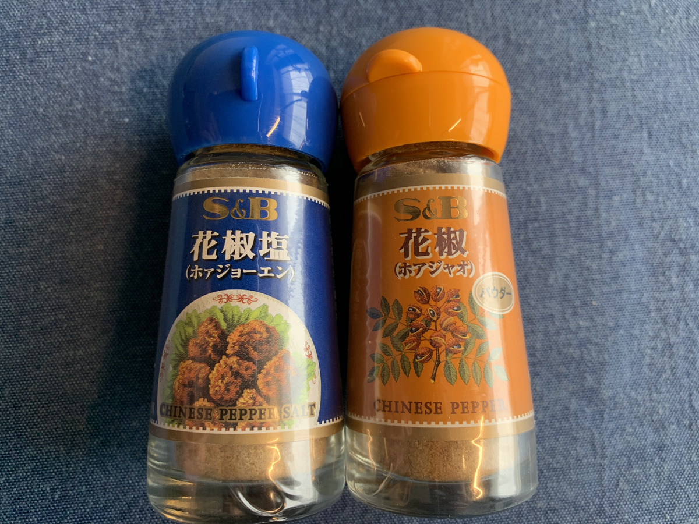

**気づいちゃったんだよね・・・ :smirk:**

---

毎日のカレーのわくわく感・・・

これ **給食のわくわく感だー！ :two_men_holding_hands:**

---

お昼まだかなー！ :boy:

（そわそわ・・・） :boy:

お昼まだかなー！ :girl:

（そわそわ・・・） :girl:

**ってことなのよ！！ :muscle:**

---

わくわくが！

最高潮！！

わくわくわくわく・・・！

**わくわくわくわく・・・！ :smile:**

---

**わくわくが止まらない・・・！！！**

---

https://www.youtube.com/channel/UCdCsSSokazx-GBM-6boSpiA

**わくわくが止まらない・・・！！！**

---

まじかー :thinking_face: :thinking_face: :thinking_face:

時代はやはり **YouTuber :star2:** かあー :flushed: :flushed: :flushed:

---

気を取り直して！

今日の **カレー :curry:** はこいつじゃ！

---

**広島 呉海軍亭肉じゃがカレー！**

いえーい！

**どんどんぱふぱふー :confetti_ball: :confetti_ball: :confetti_ball:**

**肉じゃがきたー！ :yum: :yum: :yum:**

**UMASOU!!!**

---

おおー！

> 肉じゃがの素材感を大切にしました。

**ですって！！ :v:**

---

カレーなの！？肉じゃがなの！？

いいえ

**肉じゃがカレーです！(ﾄﾞﾔｧ) :smiling_imp:**

---

バックショット、見たいじゃろ？

**すけべじゃのう〜 :blush:**

**すけべえじゃのう〜 :blush: :blush: :blush:**

---

こいつじゃけぇ〜！！

（バンッ）

**Oh, Beauty and Sexy...!  :sparkling_heart: :sparkling_heart: :sparkling_heart:**

具が大きいのが自慢ですって！！

---

海軍では

**金曜はカレーの日！**

だったらしいぞ！

**僕は毎日カレーだ！ :curry: :curry: :curry:**

うぇーい！ :v: :stuck_out_tongue_winking_eye: :v:

**うぇいうぇーい！ :v: :stuck_out_tongue_winking_eye: :v:**

---

広島〜

**行きたいとこ**

**たくさんある** んじゃけぇ〜 :baby:

（ぽちっ）

---

https://www.hiroshima-kankou.com

**ひろしま観光ナビ！ :eyes:**

カープっぽさ〜

そうそう！ **うさぎ島！**

たしか **大久野島** っていうんだよね〜

（ぽちっ）

---

https://www.hiroshima-kankou.com/usagi/usagi/top

**はわわわわ〜〜〜〜！！！ :heart_eyes_cat: :heart_eyes_cat: :heart_eyes_cat:**

これがうわさに聞く

**うさぎ島・・・！ :rabbit:**

これは行きたい！ :exclamation: :exclamation:

---

行きたい！

**行きたいよぅ！ :tired_face:**

もふもふしたいよぅ！！！ :rabbit:

**もふもふ祭りじゃー！！**

**もふ :rabbit: もふ :rabbit: もふ :rabbit: もふ :rabbit: もふ :rabbit: もふ :rabbit: もふ :rabbit:** **もふ :rabbit: :rabbit: もふ :rabbit: :rabbit: もふ :rabbit: :rabbit: もふ :rabbit: :rabbit: もふ :rabbit: :rabbit: もふ :rabbit: :rabbit: もふ :rabbit: :rabbit:**

---

そう！

しまなみ街道も行きたーい！

**行きたいんだよね！ :bicyclist:**

（ぽちっ）

---

https://www.hiroshima-kankou.com/shimanami/island/top

**サイクリング** の聖地ー！

こぎこぎ・・・ :bicyclist:

**こぎこぎ・・・ :bicyclist: :bicyclist:**

---

なんか

**サイクリング :bicyclist:** に

色々 **やさしい場所！**

なんだって！

**へえ〜〜〜 :open_mouth:**

---

https://www.hiroshima-kankou.com/cycling/cycling/top

**ほえー！ :smiley:**

すごい！

こんなにも

**サイクリング :bicyclist:**

に **おすすめのスポット** が用意されてる！

---

http://hiroshima-welcome.jp/kanpai/special/jitensya/

ひゃああ！

行きたい！ :rage:

**行きたいぞ！！ :rage: :rage: :rage:**

---

**愛媛県今治市** から！

自転車こぎーの！ :bicyclist:

しまなみ街道通りーの！ :bicyclist: :bicyclist:

**自転車こぎーの！ :bicyclist: :bicyclist: :bicyclist:**

**尾道** 到着しぃーの・・・

---

http://www.onomichi-matsuri.jp/jizakana/

**ご褒美ドーン！ :star: :star: :star:**

**はああああ〜〜〜〜 :innocent: :innocent: :innocent:**

---

妄想旅・・・！

**危険すぎる・・・！ :smiling_imp: :smiling_imp: :smiling_imp:**

---

https://www.jalan.net/news/article/102929/

おおっとー！

尾道ラーメンが

**あるな？？？ :ramen:**

（ここから罠のターン）

---

ラーメンは危険・・・ :ramen:

**ラーメンは危険・・・！ :ramen: :ramen: :ramen:**

・

・

・

わかっちゃいるが・・・！

わかっちゃいるが・・・！！！

---

https://aumo.jp/articles/24865

どわーん！ :ramen:

**どわわわーん！！ :ramen: :ramen: :ramen:**

こんなん **絶対うまいやつぅー！**

---

はー！

他にうめーもんないかなー

（ぽちぽちっ）

---

https://pizza-links.com/

**ピザの自販機 :pizza:** きたー！

時代の **最先端** を行ってるぜ・・・！

**:pizza: :pizza: :pizza:**

---

ラーメン！ :ramen: ピザ！ :pizza:
ラーメン！ :ramen: ピザ！ :pizza:
ラーメン！ :ramen: ピザ！ :pizza:
ラーメン！ :ramen: ピザ！ :pizza:
ラーメン！ :ramen: ピザ！ :pizza:
ラーメン！ :ramen: ピザ！ :pizza:

**ラーメン！ :ramen: ピザ！ :pizza:**
**ラーメン！ :ramen: ピザ！ :pizza:**
**ラーメン！ :ramen: ピザ！ :pizza:**
**ラーメン！ :ramen: ピザ！ :pizza:**
**ラーメン！ :ramen: ピザ！ :pizza:**
**ラーメン！ :ramen: ピザ！ :pizza:**

---

・・・はっ！

**これは危険すぎる・・・！ :smiling_imp: :smiling_imp: :smiling_imp:**

そういえば、

このブログ・・・

---

**カレーブログだったー！ :curry: :curry: :curry:**

きけん〜〜〜

---

カレー食べる場所さがそう！ :mag:

**どこがいいかなー？ :fork_and_knife: :yum: :+1:**

---

ああああ〜

やっぱ **尾道** でしょ〜 :eyes:

この **尾道を見下ろす風景** を眺めながら

カレー :curry: を食う・・・！

**圧倒的警官！ :cop: :cop: :cop:**

---

じゃなかった :sweat:

**圧倒的景観！ :muscle: :muscle: :muscle:**

---

**わくわくが止まらない・・・！！！**

---

## 実食！！

**寄り道が多い・・・！**

---

さあ！

一瞬で

**作るぞ！ :muscle: :muscle: :muscle:**

---

（グツグツグツグツ・・・）

---

**じゃじゃーーん！ :tada:**

**肉じゃがカレーの出来上がりー！ :confetti_ball: :confetti_ball: :confetti_ball:**

---

いえーい！ :v: :v: :v:

**うえいうえーい！ :ghost: :ghost: :ghost:**

---

この！

圧倒的 **具材感・・・！**

ごろごろしてるーぅ！ :facepunch:

---

**ひゃあああ！！！ :confounded:**

**もうたまらーん！ :tired_face: :tired_face: :tired_face:**

---

生産者に！

**感謝して！**

**いただきます！！ :pray: :pray: :pray:**

---

（モグッ）

---

**ほふほふ・・・！ :satisfied: :satisfied: :satisfied:**

---

（モグッ）

（モグッ）

---

**ごろごろでうま〜いー！！！ :satisfied: :satisfied: :satisfied:**

---

肉じゃがのごろんごろん感、ソースのプルンプルン感がすごい・・・！
カレーソースはとろみがあるせいか、若干少なめかな？と思ったけど、その分素材のパワーを感じる・・・全然気にならない・・・！

辛さはそこまでじゃない、甘口と中辛の間くらい？後からじんわり辛さがくる感じ。
程よく入ってるこんにゃくもなかなかカレーに良いかも！うまいぞー。

---

はー！ :sweat_drops:

今日も **せんせー** を呼ばなきゃ・・・！

えっ？ **せんせー** って誰かって？？

そんなの

**ホアジャオせんせ** ーに

きまってるじゃないか！！！

---

せーの！ :loudspeaker:

---

**ホア〜〜〜〜〜**

---

**ジャオ〜〜〜〜〜！！！**

---

---

**以下略！ :sunglasses:**

**ドン！**

---

**広島 呉海軍亭肉じゃがカレー**

**おいしゅうございました！ :pray: :pray: :pray:**
