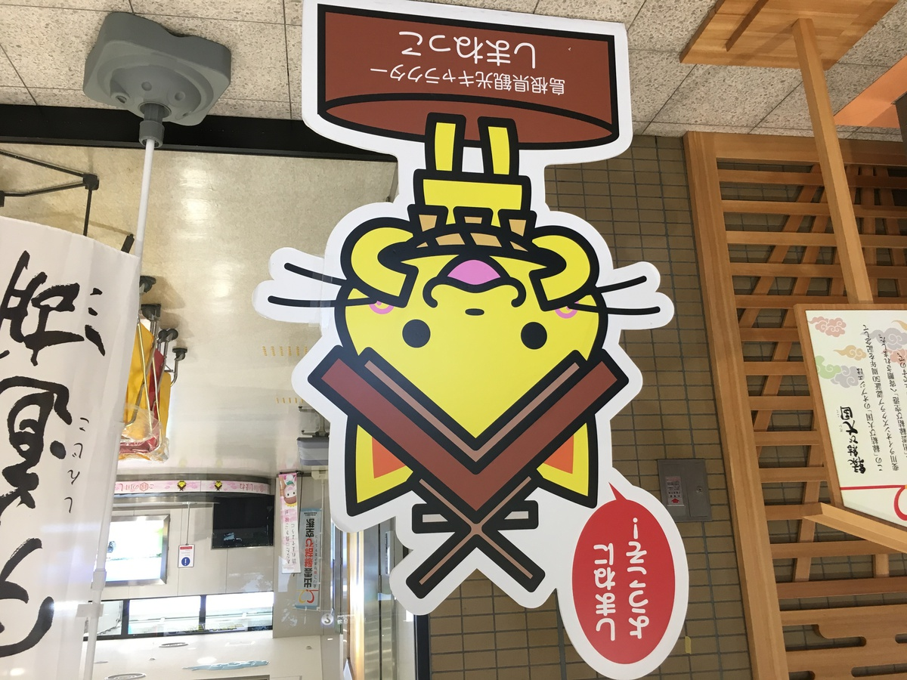
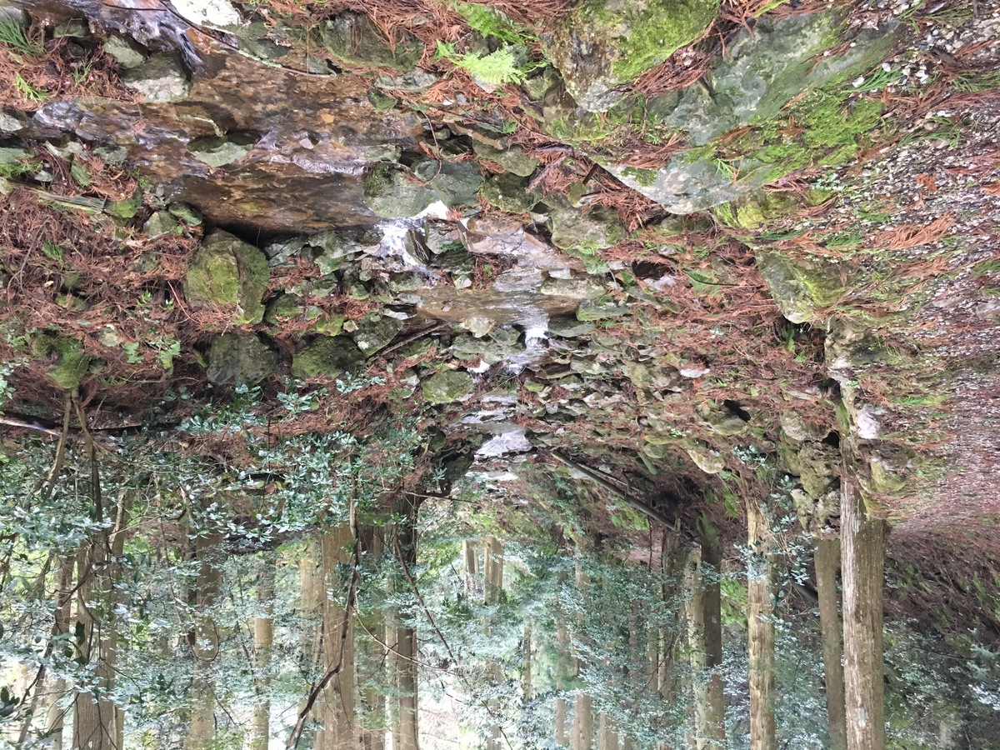
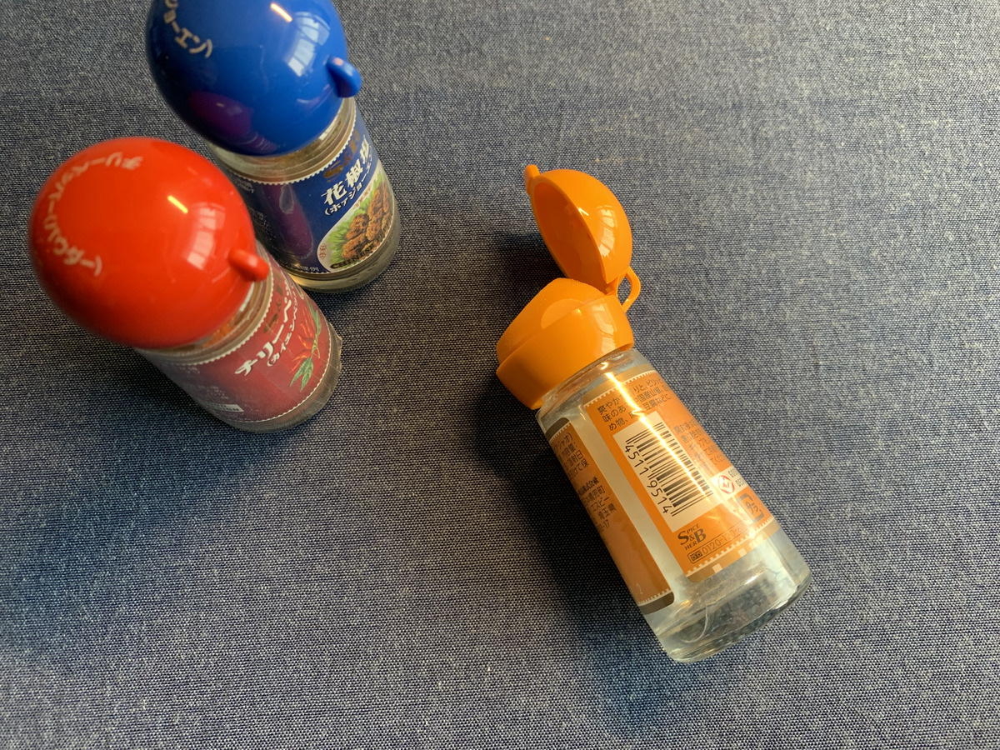

島根だー！

**島根のターン** がきたぞー！！

神が集まる県、島根県・・・！ :angel:

**神在月** 、の県だぞ！ :v:

---

今日は

そんな島根県にふさわしい

素敵なカレーだ！

**パンパカパーン！ :confetti_ball: :confetti_ball: :confetti_ball:**

---

**島根 しまね合鴨カレー プレミアム！**

**プレミアムっ！！ :sparkles: :sparkles: :sparkles:**

までが名称っぽいぞ！

てかてかっておるぞ〜 :star2:

**てかてかっておるぞ〜〜 :star2: :star2:**

---

てかりすぎて、 **スマホ** うつっちゃってるぞ・・・！ :camera:

いや〜ん :flushed:

---

バックショットは〜？？？

**Oh, Premium Sexy...! :sparkling_heart: :sparkles: :sparkling_heart: :sparkles: :sparkling_heart:**

---

**ほわわわわ〜ん・・・ :innocent:**

---

**おや？**

気付いたら

**島根に、いるな？？？ :thinking_face:**

---

**島根にようこそ！ :smile_cat:**

\ヨウコソ！/

---

いえーい！ :v:

**きちゃったぜ〜！ :v: :sunglasses: :v:**

---

そう！

**島根！**

島根の東側には

**穴道湖** っていうでっかい湖があるのよー

---

**穴道湖** をはさんで

西側に **出雲大社！ :pray:**

東側に **松江市！ :gem:**

があるのよね〜

---

おや？ :thinking_face:

**おや？おや？ :thinking_face: :thinking_face:**

**出雲大社** にきちゃったぞ？？？

---

おお〜〜〜

草原だ〜〜〜 :four_leaf_clover:

じゃなかった

**荘厳だ〜〜〜 :sun_with_face:**

神〜 :earth_africa:

**神〜〜〜 :earth_africa: :earth_americas: :earth_asia:**

---

\ヨウコソ！/

---

そば、食べたい！

**出雲そば！**

---

出雲そば

**日本三大蕎麦** の一つ

なんだってー :thinking_face:

**そうなんだー！！ :satisfied:**

なーんて言うてるそばから

**そば食うゾ！ :sparkles: :sparkles: :sparkles:**

---

そばー！

**そばー！そばー！ :yum: :yum: :yum:**

---

うぇーい！ :train:

**ローカル鉄道だー！ :+1: :+1: :+1:**

でんしゃ！ :train:

でんしゃに！！ :train: :train:

**乗っちゃうゾ！ :star2: :star2: :star2:**

---

**温泉** あるってよ！ :hotsprings:

**足湯** あるってよ！！ :hotsprings:

（ぽちゃっ）

---

**足湯** 入りながらの

**しじみソフトクリーム**

**うま〜 :icecream: :icecream: :icecream:**

---

そうなのよねー

**しじみ :exclamation:**

有名なのよね〜！ :yum:

---

**しじみラーメン！** も

あるらしいぞ！

・

・

・

**はっ！**

**ラーメン :ramen:** に手を出したら

**危険だ〜〜〜 :imp: :ramen: :imp: :ramen: :imp:**

---

松江〜〜〜 :gem:

---

**松江〜〜〜 :gem: :gem:**

**Matz 江〜〜〜！ :gem: :gem: :gem:**

（ごいりょく〜）

---

松江のうまいもんは後回しで

船乗りたい！

**島行きたいぞ！ :rage:**

行きたい行きたい！ :rage:

**行きたいぞー！！ :rage: :rage: :rage:**

---

**行っちゃうぞぉ！ :sunglasses: :sunglasses: :sunglasses:**

高速船〜

**うぇ〜〜〜い :v:**

---

**超高速移動だぞ！ :v: :sunglasses: :v:**

---

**隠岐の島ー！**

**松江からずーっと北** にある島だぞ！

島！

最高だ！！ :kissing_smiling_eyes:

---

**はぁ〜〜〜島〜〜〜 :heart_eyes: :heart_eyes: :heart_eyes:**

---

謎スポット！ :alien:

---

謎スポット！！ :alien: :alien:

---

**謎スポット！！！ :alien: :alien: :alien:**

・・・

**壇鏡（だんぎょう）の滝とな？ :thinking_face:**

---

謎スポット感ぱない〜〜〜 :older_man: :older_man: :older_man:

---

だんぎょ〜〜〜！ :sparkling_heart:

**だんぎょ〜すげえ！！ :sparkling_heart: :sparkling_heart: :sparkling_heart:**

---

裏側いけちゃうぞ！

---

**Oh, Sexy Waterfall...! :sparkling_heart: :sparkles: :sparkling_heart: :sparkles: :sparkling_heart:**

---

ここで突然の **サザエ村どーん！ :point_right:**

---

**どどんがどーん！ :point_right: :point_right: :point_right:**

・

・

・

**どどんが丼・・・？ :thinking_face: :thinking_face: :thinking_face:**

Oh, Yes!

**Sazae-don!**

**plus! :boom:**

**extra!!! :boom: :boom:**

**sazae...!!!!!! :sunglasses: :sunglasses: :sunglasses:**

---

**:droplet: :cyclone: :zap: でフェリー** だぞ！

**うわあああ〜〜〜 :cyclone: :cyclone: :cyclone:**

（ぐるんぐるん・・・）

**うわあああ〜〜〜 :cyclone: :cyclone: :cyclone:**

（ぐるんぐるん・・・）

---

http://okiwebshop.com/user_data/haruka.php

そうそう！

隠岐の島って

**カキ** が有名なんだよねー！

離れた島だから

**当たりにくい** おいしい **カキ** が

育つんだぞ！ :muscle:

**圧倒的成長！ :muscle: :muscle: :muscle:**

---

**おやおやおや？？？**

これが噂の

**岩ガキ春香・・・！ :fork_and_knife: :yum: :+1:**

ちゅるちゅる〜 :heart_eyes_cat:

**ちゅるちゅる〜 :heart_eyes_cat: :heart_eyes_cat:**

---

---

ちゅるちゅる〜 :heart_eyes_cat:

**ちゅるちゅる〜！ :heart_eyes_cat: :heart_eyes_cat:**

---

**ここで突然のラーメン :ramen: どーん！ :boom:**

ラーメンには

あれほど **手を出すな** と・・・！

言ったのに・・・！！！ :smiling_imp: :smiling_imp: :smiling_imp:

---

しじみラーメン

ちゅるちゅる〜！ :heart_eyes_cat: :ramen:

**ちゅるちゅる〜！！ :heart_eyes_cat: :ramen: :heart_eyes_cat: :ramen:**

---

**島根**

**おいしゅうございました！ :pray: :pray: :pray:**

---

---

## 実食！！

**カレー食ってねえよ！ :curry:**

---

は〜〜〜

**妄想旅きけんすぎる〜〜〜 :smiling_imp: :smiling_imp: :smiling_imp:**

---

改めて今日のカレーはこいつだぞ！

**島根 しまね合鴨カレー プレミアム！**

---

**（しゅぱぱぱぱっ・・・！）**

---

**じゃじゃーん！ :+1: :+1: :+1:**

**合鴨カレーの完成だっ！ :curry: :curry: :curry:**

さすがに腹がへって腹がへって

**たまりませぬ〜〜〜 :weary: :weary: :weary:**

---

あ〜〜〜

うまそう！

ウマソウ！！ :yum:

**UMASOU...!!! :yum: :yum: :yum:**

---

よだれだるーん :droplet: :droplet: :droplet:

ってなっちゃうね・・・！！！

早よ食べたい・・・

---

う〜〜〜 :rage:

**もう〜〜 :rage: :rage:**

**待ちきれないよ〜〜〜！ :confounded: :confounded: :confounded:**

---

こんかいも！

生産者に感謝して！ :pray:

**いただきまーす！！！ :pray: :pray: :pray:**

---

（モグッ）

---

**おおっ・・・！ :satisfied: :satisfied: :satisfied:**

---

（モグッ）

（モグッ）

---

**うまいうまーい！！！ :satisfied: :satisfied: :satisfied:**

---

スームカレーっぽさがあってまろやか、後からじんわり辛さが広がるね！

合鴨が歯応えあってうまいなあ、全然噛みきれないほどじゃなくてちょうど良い歯応え感で良い！
余計なものをあれこれいれずに、合鴨の良さを感じるがいいと言わんばかりのシンプルさ。
これぞプレミアム・・・！

---

**せんせー！**

（ﾌﾘﾌﾘﾌﾘﾌﾘﾌﾘﾌﾘﾌﾘﾌﾘ...）

**ホアジャオせんせー！！！**

（ﾌﾘﾌﾘﾌﾘﾌﾘﾌﾘﾌﾘﾌﾘﾌﾘ...）

---

わしゃもうだめだ・・・ :old_man:

**ホアジャオせんせー！**

しなねえでくだせえ・・・！！

---

（がくっ）

ホアジャオせんせーが

**し、死んでしまった・・・！ :innocent:**

---

**続く！**

**（ドンッ）  :anger:**

---

**島根 しまね合鴨カレー プレミアム**

**おいしゅうございました！ :pray: :pray: :pray:**
