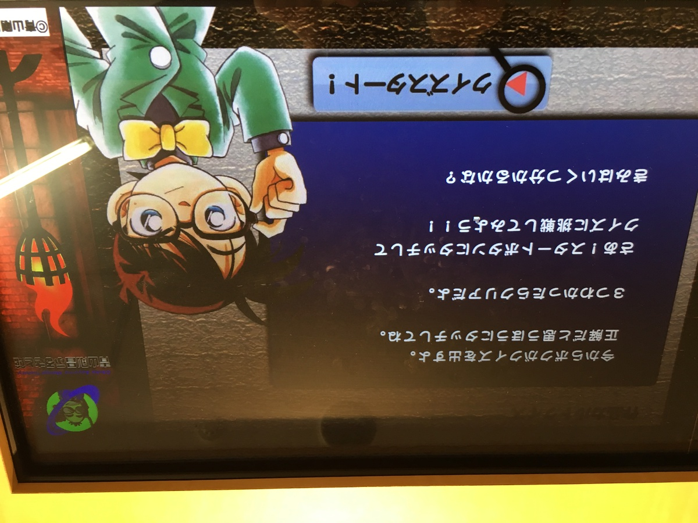

生きるのに厳しい土地・・・ :cyclone: :cyclone: :cyclone:

**鳥取・・・！**

**（ひゅううう〜〜〜） :cyclone: :cyclone: :cyclone:**

---

これは

そんな **生きるのに厳しい** 土地で

生きる人々を描く、

**群像ドラマ** である・・・ :ocean:

**（ひゅううう〜〜〜） :cyclone: :cyclone: :cyclone:**

---

・

・

・

---

**今日のカレーはこいつだ！ :sunglasses:**

---

**ババン！**

**鳥取 二十世紀梨カレー！ :tada: :tada: :tada:**

なんかやさしそう！！

想像と！

**全然違う！！！！ :satisfied: :satisfied: :satisfied:**

UMASOU...!!! :yum:

---

なになに〜？

> 朝食にもサラッと食べられます

**朝食にカレー！**

**お昼にカレー** よりも **上位概念** きたー！！！

---

**モーニングカレー祭り** じゃー！

**おはよう！ :sun_with_face: :sun_with_face: かれー！ :curry: :curry:**

**かれーで :curry: :curry: おはよう！ :sun_with_face: :sun_with_face:**

**うぇ〜〜〜〜い！ :v: :sunglasses: :v:**

---

バックショット、どーん！ :boom: :boom:

**Oh, Twentieth century Sexy...!:sparkling_heart:  :sparkling_heart: :two: :zero: :sparkling_heart: :sparkling_heart:**

生産者の方々に感謝！ :pray:

---

うんちく〜

**毎回楽しみだよね〜！ :smile: :smile: :smile:**

どれどれ〜？ :mag: :mag: :mag:

**さんこうえん！**

> 鳥取砂丘の近くに位置する「さんこうえん」は、鳥取県内で最も歴史が古い梨園です。
> 自慢の梨を使って爽やかでサラッと食べられるフルーツカレーにしました。やさしくフルーティな味はパンとの相性も良く、朝食にもぴったりです。

**鳥取で・・・爽やか？やさしく？ :thinking_face:**

**:thinking_face: :thinking_face: :thinking_face:**

---

僕は、知ってるんだからな・・・！

鳥取が、

**生きるのに厳しい :cyclone: :cyclone: :cyclone:**

土地だってことを・・・！！！

---

**ほわわわわ〜ん・・・ :innocent:**

---

**き、きたろうだー！ :eyes: :eyes: :eyes:**

今回もいつの間にか

**鳥取** にきてしまっていたー！

---

**島根** と **鳥取**

**めっちゃ近く** で行き来も多いんだぞ！ :star2: :star2: :star2:

---

＼おい、きたろう！／

---

**水木しげる記念館** も

あったりして

妖怪がたくさん街中にいるんだぞ！

---

妖怪に用かい〜？ :japanese_ogre: :japanese_ogre: :japanese_ogre:

---

**妖怪に用かい〜？ :japanese_goblin: :japanese_goblin: :japanese_goblin:**

---

**妖怪に用かい、の出待ち〜 :kissing_smiling_eyes: :kissing_smiling_eyes: :kissing_smiling_eyes:**

---

＼おい、きたろう！／

---

鳥取・・・

**なめてはいけない・・・ :runner: :runner: :runner:**

思ったより、

**横に長い** ということを・・・！

---

島根もそうだけど、

横に長いから

**良い子は島根から一気に鳥取砂丘へ**

**行ってはいけないぞ・・・！ :bow:**

---

**生きるのに厳しい・・・！ :cyclone: :cyclone: :cyclone:**

---

その最たるスポットは・・・

そう・・・！

鳥取砂漠・・・！

じゃなかった、

**鳥取砂丘・・・！**

これだけみたら

大したことない・・・

**って思うじゃん？**

いけどもいけども・・・

これが続く・・・

**生きるのに厳しい・・・！ :tired_face:**

---

鳥取県民・・・

これを観光地にしてるなんて

**狂気の沙汰じゃない・・・！ :dizzy_face: :dizzy_face: :dizzy_face:**

**狂ってる・・・！！ :persevere: :persevere: :persevere:**

---

**生きるのに厳しい・・・！ :tired_face:**

**こんなん無理・・・ッ！ :tired_face: :tired_face: :tired_face:**

---

っていうか、

遠近感・・・

**仕事しろ・・・っっっ！！ :angry: :angry: :angry:**

---

だめだ！

鳥取砂丘は

**他県民には難易度が高すぎる・・・！ :cold_sweat:**

室内コンテンツだ！

室内コンテンツしかない！

---

**あれれ〜〜〜？？**

こんなところに

**青山剛昌ふるさと館** があるよ〜？

---

**真実はいつもひとつ！ :point_right:**

そう！

**鳥取** は **名探偵コナン** もあるのだ！

**ずるいぞずるいぞー！ :rage: :rage: :rage:**

---

なんと

西に **鬼太郎**

東に **コナン**

それぞれ空港があるんだな〜

**すごいな〜 :open_mouth:**

---

だが、

**生きるのに厳しい・・・ :cyclone: :cyclone: :cyclone:**

---

**コナンっぽい！ :bust_in_silhouette: :bust_in_silhouette:**

---

**コナンっぽい！ :bust_in_silhouette: :bust_in_silhouette: :bust_in_silhouette:**

---

映画・・・

毎年やってたらこんなになっちゃった・・・

（どっかでまとめてみなきゃ・・・）

---

**ここで突然のコナンクイーズ！**

---

**余裕だぜ〜〜〜 :sunglasses:**

えっ？どんなクイズだったかって？

そんなの

現地に行ってやったらいいじゃないー :sunglasses: :sunglasses: :sunglasses:

---

あっ！

**声優変わった後の色紙だ・・・！**

ってこら〜

そういう **大人の事情** に

触れるんじゃありません・・・！ :rage: :rage: :rage:

---

スタバはないけど

すなばはある〜

**すなば珈琲〜！ :coffee: :coffee: :coffee:**

---

な〜んて冗談もいえなくなってしまった・・・

（ぽちっ）

https://nlab.itmedia.co.jp/nl/articles/1505/23/news026.html

スターバックスさん・・・

**生きるのに厳しい** 土地で・・・ :cyclone: :cyclone: :cyclone:

**戦っていく決意・・・！ :muscle: :muscle: :muscle:**

---

生きるのが厳しいばっかいってると

**文句きちゃう** から気を付けるんだぞ！

---

＼おい、きたろう！／

---

はっ・・・！

**カレーブログだったことを忘れてた・・・ :curry:**

**妄想旅、危険だ〜〜〜 :imp: :imp: :imp:**

---

カレーどこで食べよかなー

そう〜そうそう〜〜〜

**因幡（いなば）の白兎（しろうさぎ）**

この辺らしいのよね〜！

ぴょんぴょん〜！ :rabbit:

**もふもふ〜 :rabbit: :rabbit: :rabbit:**

**もふ :rabbit: もふ :rabbit: もふ :rabbit: もふ :rabbit: もふ :rabbit: もふ :rabbit: もふ :rabbit: もふ :rabbit: もふ :rabbit: もふ :rabbit: もふ :rabbit: もふ :rabbit: もふ :rabbit: もふ :rabbit: もふ :rabbit: もふ :rabbit: :rabbit: :rabbit: :rabbit:**

---

あ〜〜〜

**いいんじゃない？？？**

**穏やかな海** を眺めながら

**ウサギ :rabbit:** が **ぴょんぴょん :rabbit:**

飛び移ったのを想像しながら

**カレー :curry:**を食うのも **良いかも〜！ :fork_and_knife: :yum: :+1:**

---

**あっ・・・ :neutral_face:**

これは・・・

生きるのに・・・きびし（ry

---

## 実食！！

**カレーどこいっちゃったよ！ :curry:**

---

鳥取県の人ディスってるわけじゃないからね〜

こんな日本海から

風びゅんびゅんのところで

生活しててすごいって

**超尊敬** してるんだからね！ :bow: :bow: :bow:

---

**パンパカパーン！ :tada: :tada: :tada:**

鳥取が誇る！

**二十世紀梨のカレーが完成だゾ！ :muscle:**

**やべえ・・・！チャレンジングで旨そう！！！**

---

ほどよく食感が残る程度に

すり下ろした感なのかな？

**わくわくだ・・・！ :yum: :yum: :yum:**

---

うっひょー！！

**もう我慢できないよー！！！ :tired_face: :tired_face: :tired_face:**

---

早くいただいちゃおう！

鳥取の自然が生み出した幸に感謝して！ :pray:

**いただきまーす！！！ :pray: :pray: :pray:**

---

（モグッ）

---

**あまっ・・・！ :satisfied: :satisfied: :satisfied:**

---

（モグッ）

（モグッ）

---

**あまくてうまーい！！！ :satisfied: :satisfied: :satisfied:**

---

甘い！甘い！これカレーか？って思うくらい甘口だ！
あーでもだいぶ経ってから辛さがほんのりくる感じ。

あーこれ子ども向けかもしれないなあ〜。
もちろん大人でも超楽しめるんだけど、甘口すきな人には絶対おすすめカレーだぞ！

梨を含む具材が細かめに刻んであって、ソースごと楽しんでくれと言わんばかりの、ソースが主役のカレーだ！うまい！

---

・

・

・

---

せんせー！ :cry:

**せんせー！！ :cry: :cry:**

残されたわれわれはいったいどうすれば・・・！ :cold_sweat:

---

**心配ご無用・・・！！！**

（ガタッ）

---

**じゃじゃーん！ :sparkles: :sparkles: :sparkles:**

**弟子！**

**その1その2その3その4ー！ :fire: :fire: :fire: :fire:**

みんなあわせて〜

---

**ハッピーパウダー戦隊！！！ :confetti_ball: :confetti_ball: :confetti_ball:**

**爆誕・・・！ :bomb: :bomb: :bomb:**

---

**ドーン！！！ :boom: :boom: :boom:**

---

**鳥取 二十世紀梨カレー**

**おいしゅうございました！ :pray: :pray: :pray:**
