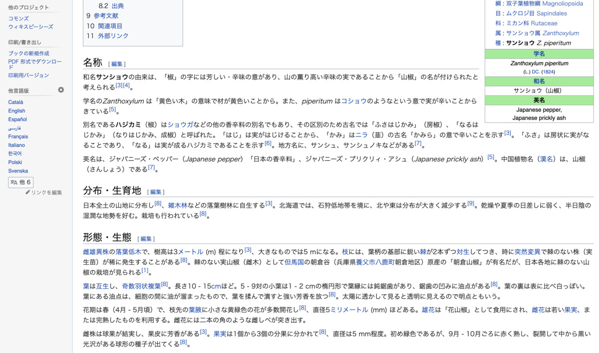
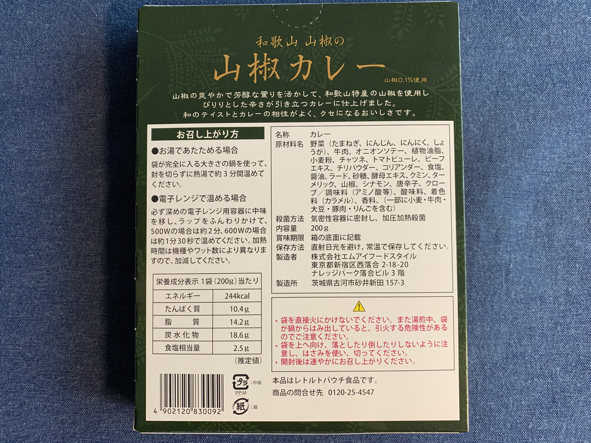
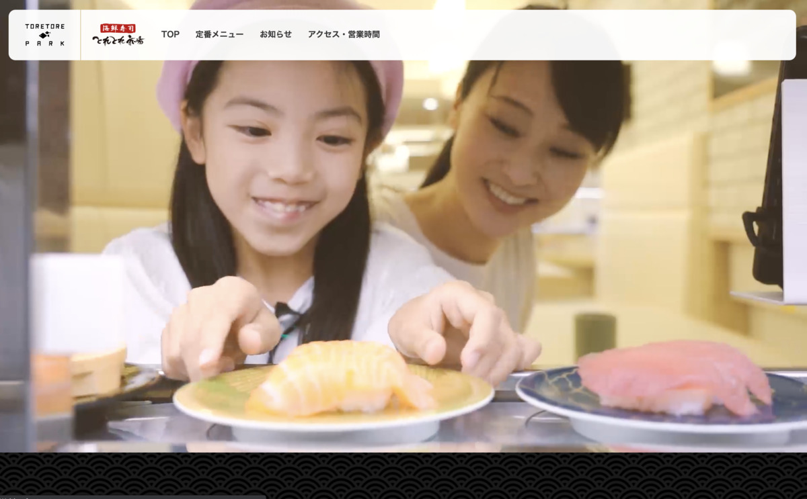

**反省** だ・・・ :monkey: :monkey: :monkey:

---

最近の **カレーブログ :curry:**

妄想が広がりすぎて

**縦に長くなりすぎてるー！**

**:punch: :punch: :punch:**

---

は、 **反省** だ・・・ :monkey: :monkey: :monkey:

（写真40枚以上も並べたら長くなるに決まってるじゃないか・・・）

---

**長さ！**

測ってみたら〜 :memo:

島根（前々回）も

鳥取（前回）も

**60,000 ピクセルを超えてたんだぞ！**

ひゃああ〜〜〜

**どんだけ〜〜〜 :see_no_evil: :see_no_evil: :see_no_evil:**

---

カレーブログが目的なんじゃないやい！

**カレー :curry:** を **食う！ :fork_and_knife:**

ことが目的なんだい！ :rage: :rage: :rage:

---

さあ〜

気を取り直して〜〜〜

**今日のこいつはカレーだ！**

---

**テロレロレ〜ン！ :green_heart:**

**和歌山 和歌山山椒の山椒カレー！**

いえーい！ :v: :sunglasses: :v:

**どんどんぱふぱふー！ :tada: :tada: :tada:**

---

**説明しよう！ :person_with_blond_hair: (ｷﾘｯ)**

https://ja.wikipedia.org/wiki/%E3%82%B5%E3%83%B3%E3%82%B7%E3%83%A7%E3%82%A6

**山椒（サンショウ）** というのは、

**ホアジャオ** の親戚のようなもので、

**Japanese Pepper** とも呼ばれているのダ！

---

**サンショウせんせー！ :sparkles:**

ひゃっほーい！ :clap: :clap: :clap:

こいつは **祭りの予感** だ・・・！ :herb: :herb: :herb:

---

https://ja.wikipedia.org/wiki/%E3%82%AB%E3%83%9B%E3%82%AF%E3%82%B6%E3%83%B3%E3%82%B7%E3%83%A7%E3%82%A6

**ホアジャオ** せんせーと

親戚ってだけで

**わくわく** しちゃうね！！ :smirk_cat:

は〜〜〜

**たのしみ〜〜〜 :herb: :herb: :herb:**

---

さあ〜〜

いつもの〜〜

**バックショットはこいつさ〜！ :rocket:**

**Wow! Peppery Sexy...!!!  :sparkling_heart: :herb: :sparkling_heart: :herb: :sparkling_heart:**

なんかもう裏面はシンプルすぎて・・・

必要なことは

**表面から感じろ！**

といわんばかりのセクシーさ・・・ :sparkling_heart:

---

そんでもってもう一度

**表面だー！ :eyes:**

うんちくは表面にあるぞー！

> 山椒の爽やかで芳醇な薫りを活かして和歌山特産の山椒を使用し
> ぴりりとした辛さが引き立つカレーに仕上げました。

**わあああああ！！！**

**ぴりり祭り** じゃー！

---

**ぴりり :herb: がわっしょい！ :dancers:**

**わっしょい :dancers: ぴりり！ :herb:**

**ぴりり :herb: :herb: がわっしょい！ :dancers: :dancers:**

**わっしょい :dancers: :dancers: ぴりり！ :herb: :herb: :herb:**

わ〜〜〜 :clap: :clap: :clap: :clap: :clap:

---

すごいな〜

いいな〜 :herb: :herb: :herb:

そもそも

**和歌山** が山椒の名産地だなんて

知らなかったぞ〜

（ぽちっ）

---

http://ag-w.org/archives/1

おおお〜〜〜

**こ、こんなにでかいの・・・？ :frowning: :frowning: :frowning:**

ぶどうみたい・・・ :grapes:

というか

**ぶどう山椒 :grapes:** っていうらしいぞ？

いいな〜〜 :yum:

**現地でみてみたい〜 :eyes: :eyes: :eyes:**

---

なんか

和歌山の **南紀白浜** に

**IT の拠点もあるんだって！**

へえ〜〜〜

そうなんだあ〜〜〜 :smiley_cat: :smiley_cat: :smiley_cat:

どれどれ〜？

（ぽちっ）

---

https://wakayama-it.jp/

和歌山ITとかいう、

なんか **ドンピシャな URL** きたー！ :baby:

---

ほえ〜

どうやら **この辺** に

集まってるらしい :chicken: :baby_chick: :baby_chick: :baby_chick:

---

うーむ？ :thinking_face: :thinking_face: :thinking_face:

土地勘は行かなきゃ

全然わからーんので、

これは **一度行くしか** ないですな・・・

---

http://tree.vc/work/406.html

こうやって地方に移住して

**頑張ってる企業さん** も

**すてきー！ :cupid: :cupid: :cupid:**

ポリシーもすてきだなあ・・・ :two_hearts:

---

とはいえ〜〜〜？

やはり〜〜〜

おいしいものがないと〜〜〜

---

**だめですよね〜〜 :yum: :yum: :yum:**

**うぇえ〜〜〜い :fork_and_knife: :yum: :beers:**

（ぽちっ）

---

こういう **ランキング :crown:**

から攻めるの

なかなか良いですよね〜 :muscle:

・・・

**むむむっ？ :thinking_face: :thinking_face: :thinking_face:**

---

**とれとれ？？？ :thinking_face:**

（ぴこんぴこん！ :rotating_light:）

**おいしいセンサー** が反応しています！ :rotating_light: :rotating_light:

**おいしいセンサー** が反応しています！！ :rotating_light: :rotating_light: :rotating_light:

---

**キーワード！チェーンジ！ :arrows_counterclockwise: :arrows_counterclockwise: :arrows_counterclockwise:**

（ぽちぽちぽちっ）

---

うぇ〜〜〜い！ :v: :sunglasses: :v:

**うぇいうぇ〜〜い！ :v: :sunglasses: :v:**

あ〜

これ絶対 **正解のやつ〜 :+1: :+1: :+1:**

---

https://toretore.com/ichiba/

あああ〜っ！

この地元のおいしいやつ

**詰まってます感・・・！ :star: :star2: :star: :star2: :star:**

・・・たまらん！ :yum:

---

https://toretore.com/ichiba/ichiba.html

**おとなのテーマパークきたー！！！**

これあれでしょ？？

買えるところと

食えるところが

**色々混ざっちゃってるやつ** でしょ？

ずるいわー :rage:

**そんなん美味しいに決まってますやん〜 :rage: :rage: :rage:**

---

**なんやこれ・・・ :astonished:**

なんと、

**とれとれ市場** は

**とれとれパークのいち施設** にしか

すぎなかったのだ・・・！ :scream:

（なんておそろしい子・・・！）

---

https://toretore.com/sushi/

**はい絶対うまいやつぅー！ :yum: :yum: :yum:**

---

> おいしかったら「うーん、とれとれ！」と、言いましょう。

**「うーん、とれとれ！」 :yum: :yum: :yum:**

はい **重要キーワード**

いただきましたー :pray:

---

あ〜宿もあって

やばいやつやん〜

あ〜ここ行きたい :rage:

**行きたい行きたい行きたいぞー！ :rage: :rage: :rage:**

---

・・・はっ！

そういえば

カレーブログだった・・・！ :curry:

**とれとれ、危険ワードだ〜〜〜 :imp: :imp: :imp:**

---

カレー食べる場所！

さがさなきゃ！

結局前回

探してないからなー :cold_sweat: :cold_sweat: :cold_sweat:

**どれどれー？ :mag:**

（ぽちっ）

**やっぱここでしょー！**

景色のいい砂浜をみながら

**山椒カレーを食べたいぞ！ :fork_and_knife: :yum: :+1:**

---

**うひょー！**

**最高ロケーション！ :surfer: :surfer: :surfer:**

**ここでカレー食うぞ・・・！ :muscle: :muscle: :muscle:**

---

## 実食！！

**今回もなっが〜い！**

さあカレー作るぞ！ :muscle:

---

（ぐつぐつぐつぐつ・・・）

---

いえーい！ :v: :v:

**出来上がりー！！！ :tada: :tada: :tada:**

やばいぜ〜

山椒をふんだんに使った

チャレンジングなカレーだぜ〜

---

おお〜〜〜旨そう！！

**食べたい・・・！ :yum:**

---

食べたいよう！！ :rage:

**もう我慢できなーい！ :rage: :rage: :rage:**

---

生産者に感謝して！ :pray:

**いただきまーす！！！ :pray: :pray: :pray:**

---

（モグッ）

---

**とれとれっ・・・！ :satisfied: :satisfied: :satisfied:**

---

（モグッ）

（モグッ）

---

**うーんとれとれっ！**

じゃなかった :sweat:

**うまーい！！！ :satisfied: :satisfied: :satisfied:**

最初から山椒の香りと味がくる・・・！
これはけっこう好みが分かれるかもしれないな・・・。

これなんちゃって山椒カレーじゃなくて、山椒が好きな人なら超おすすめのガチ山椒カレーだ。
他の素材は細かく刻んで入れてある系で、あくまで山椒を楽しんでくれというコンセプト、そういう振り切ってるの好きー！

---

・

・

・

---

**「ようやく私の出番がきたようだな・・・」**

あ、あなたは・・・！

**もしや・・・！ :eyes: :eyes: :eyes:**

---

**ババーン！ :boom:**

**サンショウせんせーあらわる・・・！ :sparkles: :sparkles: :sparkles:**

なに？まだ **ふた口目** だって？

（ﾌﾘﾌﾘﾌﾘﾌﾘﾌﾘﾌﾘﾌﾘﾌﾘ...）

**どうせ山椒なんだから :sunglasses:**

（ﾌﾘﾌﾘﾌﾘﾌﾘﾌﾘﾌﾘﾌﾘﾌﾘ...）

**問題ないだろう？ :sunglasses:**

（ﾌﾘﾌﾘﾌﾘﾌﾘﾌﾘﾌﾘﾌﾘﾌﾘ...）

**ブーストだブースト！ :rocket: :rocket: :rocket:**

（ﾌﾘﾌﾘﾌﾘﾌﾘﾌﾘﾌﾘﾌﾘﾌﾘ...）

**ほわわわ〜ん :innocent: :innocent: :innocent:**

---

**和歌山 和歌山山椒の山椒カレー！**

**おいしゅうございました！ :pray: :pray: :pray:**
