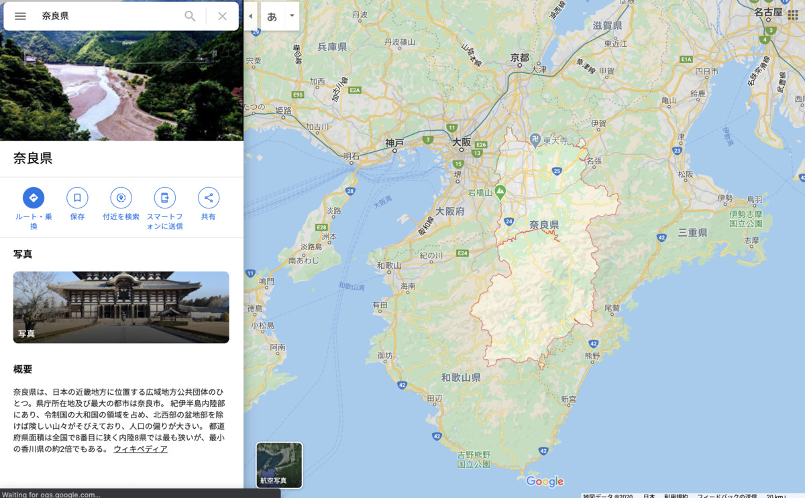
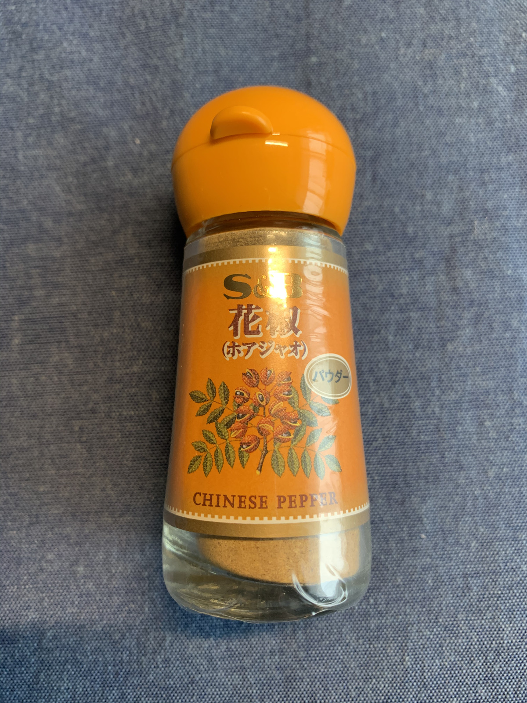

カレー食べるようになってから、

**お昼が毎日待ち遠しい！ :fork_and_knife: :yum: :curry:**

---

夜にはもう

**「明日のカレーが楽しみだなー」**

って気持ちになってる！

**カレーパワーすごい！ :curry: :volcano:**

---

周りに疲れた人を

みかけたら

**カレー :curry:** でも食って

**ハッピー :heart:** になれよ・・・

**っておすすめしてあげるとイイゾ！ :muscle:**

---

さてさて！

今日のカレーは〜〜〜？

**これ！！ :point_right: :point_right: :point_right:**

---

**奈良 大和肉鶏カレー！ :tada: :tada: :tada:**

いえーい！

**奈良〜〜〜！**

**歴史** 感じちゃうぜ〜〜〜 :running: :running: :running:

---

んでもって〜〜〜

**バックショット** はこれ！

（ばしっ）

---

**Oh, Simply Sexy...!!! :sparkling_heart: :sparkling_heart: :sparkling_heart:**

**シンプル** で、 **いいね！ :+1: :+1: :+1:**

マージン、美しいぜ・・・

---

**おやおや〜？ :thinking_face:**

**奈良県畜産技術センター**

ってなんだろな〜？ :thinking_face: :thinking_face: :thinking_face:

（ぽちっ）

---

http://www.pref.nara.jp/1768.htm

**よくわからーん！w**

けど

**畜産のプロっぽーい！ :cow: :pig: :chicken:**

---

きっと

**おいしい鶏** を作ってくれたんだろうな・・・

**生産者に敬礼！ :pray: :pray: :pray:**

---

https://www.nta.co.jp/media/tripa/articles/h3Zsa

**唐突だけど、奈良県民あるあるー！**

---

> 土を掘れば何か出てくる

**すげえ・・・！ :older_man:**

**リアルに出土・・・！ :moyai: :moyai: :moyai:**

---

なるほど！

**そういえば海ないんだっけ！ :bulb:**

悲観することないのにねー

**山の幸** がその分

**豊富** ってことでしょー！ :deciduous_tree: :deciduous_tree: :deciduous_tree:

---

ええと〜

**山の幸〜山の幸〜〜 :deciduous_tree: :deciduous_tree: :deciduous_tree:**

（ぽちっ）

---

http://www.pref.nara.jp/2767.htm

おおっ、 **大和野菜？ :thinking_face:**

なんだか面白そうな予感・・・！ :eyes:

---

おお〜〜〜！！！

京野菜は知ってたけど！

**大和野菜！ :sparkles:**

すごい！いろいろあるー！ :sparkles: :sparkles: :sparkles:

---

見たことない、

知らないのばっかりだ・・・！ :frowning:

**も〜なんでもっと自慢しないのよ〜 :sunglasses: :sunglasses: :sunglasses:**

---

https://www.ozmall.co.jp/especial/travel/8825/

うわ〜〜〜

**いいじゃないのよ〜〜〜 :yum: :yum: :yum:**

なんでもっと早く

**教えてくれなかったの〜 :grinning:**

---

https://readyfor.jp/projects/yamatoyasai

あら〜 **クラウドファンディング！ :flushed:**

もう手遅れだったけど・・・

**もったいない〜〜〜 :scream: :scream: :scream:**

そもそも認知してもらえてないんだな

こりゃ〜

**食べにいかないとですな・・・ :smiling_imp: :smiling_imp: :smiling_imp:**

---

大和野菜がたっぷり入った

**カレー :curry:** とかあったら

最高なのになあー

（ぽちっ）

---

https://naramachi-hiyori.jp/cafe/_an81834%E3%80%80%E5%A4%A7%E5%92%8C%E9%87%8E%E8%8F%9C%E3%82%AB%E3%83%AC%E3%83%BC/

あるじゃん！

あるじゃん！！

**あるじゃんー！！！ :curry:**

そうそう！

**こういうの！こういうの！！ :two_hearts: :two_hearts:**

---

なるほど？ :thinking_face:

**「旬彩ひより」** って名前ね

**覚えた・・・！ :eyes: :eyes: :eyes:**

---

他にはどんなのがあるのかなー？

（ぽちぽちっ）

---

https://gurutabi.gnavi.co.jp/a/a_1517/

**飛鳥鍋！**

> 起源は飛鳥時代まで遡り

**ガチの歴史の食べ物きたー！ :metal: :metal: :metal:**

---

すげえ・・・！

食べたことないけど、

きっとやさしい味なんだろうな・・・

食べたいな・・・！ :yum: :yum: :yum:

---

https://ja.wikipedia.org/wiki/%E8%8C%B6%E7%B2%A5

おっ？ **茶粥** とな？ :thinking_face:

> 昔から「大和の茶粥、京の白粥、河内のどろ喰い」と言われお粥の固さや食べ方も土地柄があるが、大和の茶粥は粘りが無くさらっとしている。
> 奈良県では塩分が多くサラサラして熱い茶粥を常食にするから胃潰瘍になり、潰瘍から癌になるので胃癌の死亡率が高いという説から、1954年（昭和29年）に「茶粥の廃止」が呼びかけられたことがあり、また嗜好の変化もあり常食は少なくなっている

またもや **歴史の食べ物きたー！ :dolls: :dolls: :dolls:**

---

時代のスケール感やばい！

**飛鳥時代の話** とか

**奈良時代の話** とかが

普通に出てきて **やばーい！ :heart_eyes: :heart_eyes: :heart_eyes:**

---

しかも

**やさしい、素朴なお味** のものが

多いのね・・・！ :yum:

**やさしいもの** 食べて、 **やさしい気持ち** になりたいときは、 **奈良県に行くべき** かもしれん・・・！ :satisfied:

---

にしても・・・

奈良県はおいしいものたくさんありそうなのに・・・

**ちょっと自慢ベタ・・・？ :sweat:**

（もったいないゾー！ :rage:）

---

そろそろ **カレー :curry: 食べる場所**

探そうぜ・・・！ :mag:

**カレーブログ** だからな！ :curry:

---

奈良〜

**奈良なら〜？ :thinking_face:**

**奈良なら〜？？ :thinking_face: :thinking_face:**

---

**ここだっ！**

**いえーい！ :v: :sunglasses: :v:**

やはりここしか！ :star2:

**鹿しか・・・！ :star2: :star2: :star2:**

---

鹿を眺めながら

**カレーを食うゾ！ :muscle: :muscle: :muscle:**

---

## 実食！！

き、今日は比較的早いぞ・・・！

**最近長すぎて狂ってきちゃってるけど・・・ :sweat: :sweat: :sweat:**

---

**でっきあっがりー！ :tada: :tada: :tada:**

**ひゃあ〜〜〜 :heart_eyes_cat: :heart_eyes_cat: :heart_eyes_cat:**

おいしそう・・・ :sparkles: :sparkles:

---

どんな味だろ〜？わくわく！

**美味しそう・・・！ :yum: :yum: :yum:**

---

うわ〜〜〜

**もう辛抱たまらーん！ :rage: :rage: :rage:**

---

**いただきまーす！ :pray: :pray: :pray:**

---

（パクッ）

---

**むむっ・・・！ :flushed:**

---

（パクッ）

（パクッ）

---

**うまうまー！！！ :satisfied: :satisfied: :satisfied:**

---

濃厚！ソースが濃厚！ピリッとくるというよりはじんわり広がる感じ。

正統派な感じで素材ごろごろたまらんなあ。
カレーの中に入っててもチキンぽさを感じるお肉。
やっぱりカレーに入れる肉は少し主張強いくらいがちょうどいいなあ。うまい。

---

いやあ・・・ :smiley_cat:

これは絶対

**せんせーの出番でしょ・・・ :sunglasses: :sunglasses: :sunglasses:**

さあみんな一緒にー！

---

**ホア〜〜〜〜〜**

---

**ジャオ〜〜〜〜〜！！！**

---

**ほわわわわ〜ん！ :innocent: :innocent: :innocent:**

「2代目じゃ・・・ :older_man:」

---

先代からうけついだ、

この **フリフリ** を見よ！

（ﾌﾘﾌﾘﾌﾘﾌﾘﾌﾘﾌﾘﾌﾘﾌﾘ...）

（ﾌﾘﾌﾘﾌﾘﾌﾘﾌﾘﾌﾘﾌﾘﾌﾘ...）

（ﾌﾘﾌﾘﾌﾘﾌﾘﾌﾘﾌﾘﾌﾘﾌﾘ...）

---

**ﾊｱｯ､ﾊｱｯ､ﾀﾏﾗﾅｧｰｲ...!! :innocent:**

**ﾎｱｼﾞｬｵ､ﾀﾏﾗﾅｧｰｲ...!!! :innocent: :innocent: :innocent:**

---

**奈良 大和肉鶏カレー**

**おいしゅうございました！ :pray: :pray: :pray:**
