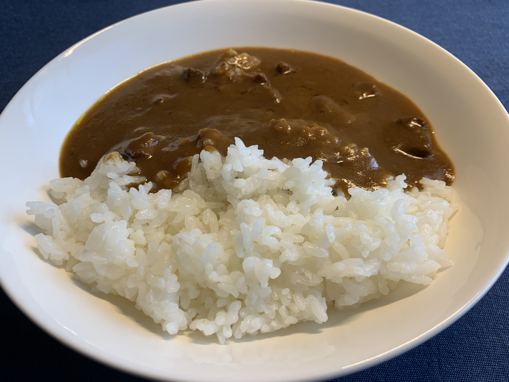
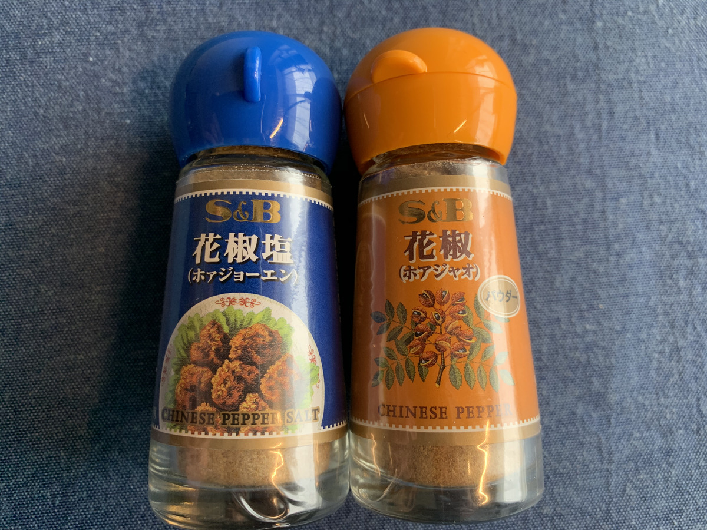

ご当地カレーのターンが・・・

**きたー！！！ :star: :star: :star:**

---

毎回！

おひるが・・・！

**待ち遠しい・・・！！！ :curry:**

---

お昼で麺類ばっかりの生活は〜〜

**もう終わりだー！ :bomb:**

---

さてさてー！

今回のカレーは・・・？？？

な、な、なんと・・・！

---

 **鹿児島 とんこつベースの霧島神話豚カレーだー！**

---

！？！？！？

**神話！？**

はやくも **神話級** の食べ物きたーーー！！

**やばーい！ :sun_with_face: :sun_with_face: :sun_with_face:**

---

さーて、パッケージは〜〜〜 :laughing: :laughing: :laughing:

---

**これだー！！:curry:**

---

**どんどんどん！ぱふぱふぱふー！ :tada: :tada: :tada:**

---

神話の〜〜〜

**豚！ :pig: :pig: :pig:**

---

食べて、いいのか？

**このやろう！ :rage: :rage: :rage:**

---

いいえ、

たべちゃって

**いいーんです！ :sunglasses:**

---

バックショットは〜〜〜

**Oh Sexy!!! :sparkling_heart: :sparkling_heart: :sparkling_heart:**

---

せっかくだから、霧島に行った気になっちゃおう！

よーし、この辺がいいかな？

---

おっと間違えた〜〜〜

これは **霧島** じゃなくて、 **霧島酒造** だ〜〜〜。 :sake: :sake: :sake:

うっかりうっかりー。 :stuck_out_tongue:

---

あらためて〜。

おっ、なんじゃこれ？

**神話の里公園、ですって〜？**

神話豚を食べるのに、もってこいだー！ :muscle:

---

どれどれ〜？

おおー！

**景色最高じゃないですかー！！ :satisfied: :satisfied: :satisfied:**

ここで食うぞー！

神話の里公園で、

神話豚のカレーを、

---

**食うぞー！！！ :muscle: :muscle: :muscle:**

---

## 実食！！

まえふり、ながーい！

**カレーを早く食べたい・・・！！**

---

**ずずーんーーー！！！ :curry: :curry: :curry:**

---

これが！

神話の！

**豚ー！！！ :pig: :pig: :pig:**

---

正面から **どーん！**

---

ライスサイドから **どどーん！！**

---

カレーサイドから **どどどーん！！！**

---

脳から脳汁が・・・！

**いや、カレー汁が・・・！**

---

**どばどばー :curry: :curry: :curry: :curry: :curry: :curry:**

---

それでは、

生産者に感謝して〜、

**いただきます！ :pray:**

---

（ペロリ）

---

**うまいぞー！！！ :satisfied: :satisfied: :satisfied:**

---

（ペロリ）

（ペロリ）

---

**これはうまいぞー！！！ :satisfied: :satisfied: :satisfied:**

---

濃厚なカレーのルーのなかから、
ごろごろしたお肉を感じるおいしさ・・・！
これが神話豚 :pig: なのか・・・！

そこまで辛くはないけど、
甘さのなかにちゃんと辛い感じがある、クセになるお味ですね！！
これは美味しい・・・！ :yum:

---

（ガツガツガツ・・・）

---

ああ〜、のこり一口になっちゃった・・・

そろそろ **アレ** を呼ばなきゃ・・・！

えっ、アレってなにかって？？

そんなの、 **ふりかけたらハッピーになれる魔法の粉** に決まってるじゃないですかー！ :smirk: :smirk: :smirk:

さあみんな一緒にー！

---

**ホア〜〜〜〜〜**

---

**ジャオ〜〜〜〜〜！！！**

---

**ドゥーン！**

（フリフリフリフリ・・・）

**はあ〜〜〜幸せ物質が脳にくる〜〜〜 :innocent: :innocent: :innocent:**

---

**鹿児島 とんこつベースの霧島神話豚カレー**

**おいしゅうございました！ :pray: :pray: :pray:**
