**パンパカパーン！ :confetti_ball: :confetti_ball: :confetti_ball:**

**わーわー！ :clap: :clap: :clap:**

なななんと！

このご当地カレーブログ！！

**今回で20杯目ですー！ :tada: :tada: :tada:**

---

**わーおめでとー！**

やったー！ :+1: :+1: :+1:

こんなどうでもいい駄文を

書き続けて **えらい！ :+1:**

こんなくだらないブログを

毎回 **読みにきてくれてすごい！ :pray:**

**チョア〜〜〜！！！ :heart_eyes_cat: :heart_eyes_cat: :heart_eyes_cat:**

---

**ちょあーー？？？ :thinking_face:**

---

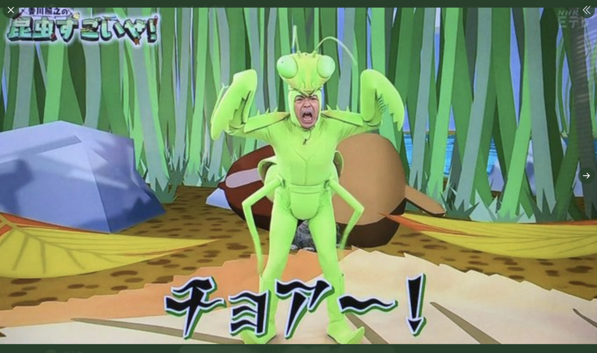

**チョア〜〜〜！！！ :tired_face: :tired_face: :tired_face:**

---

**:thinking_face: :thinking_face: :thinking_face:**

---

・

・

・

---

さてさてー？

**今日のカレーは**

なんじゃろなー？？？ :yum: :yum: :yum:

---

今日はこいつ！ :point_right: :point_right: :point_right:

---

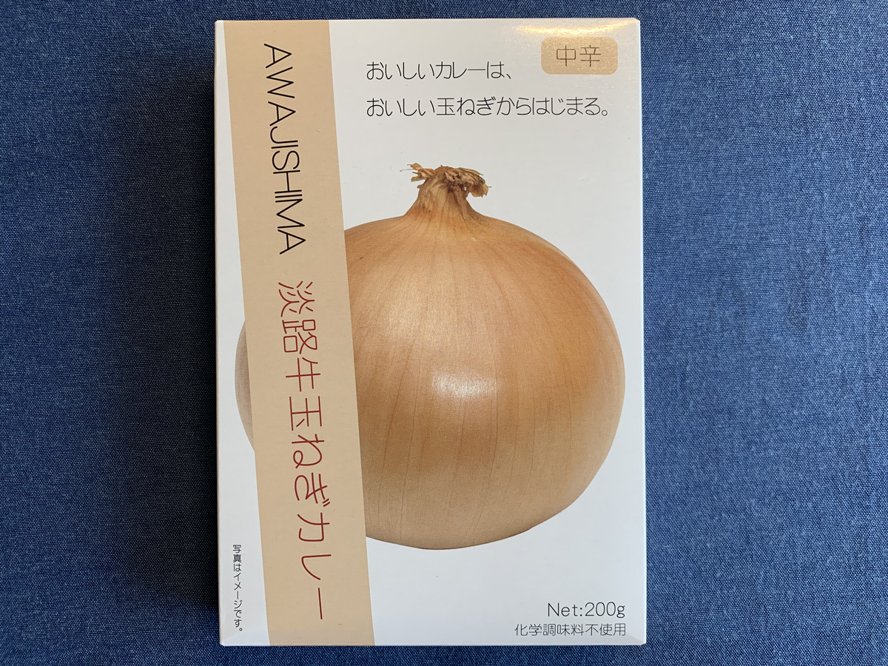

**兵庫 淡路牛玉ねぎカレー！**

**いえー〜い :metal: :metal:**

---

こ、こいつ・・・！

**すごい・・・！ :man_with_turban:**

とうとうパッケージに

**カレー :curry:** じゃなくて

素材である **玉ねぎ** を載せてるぜ・・・

---

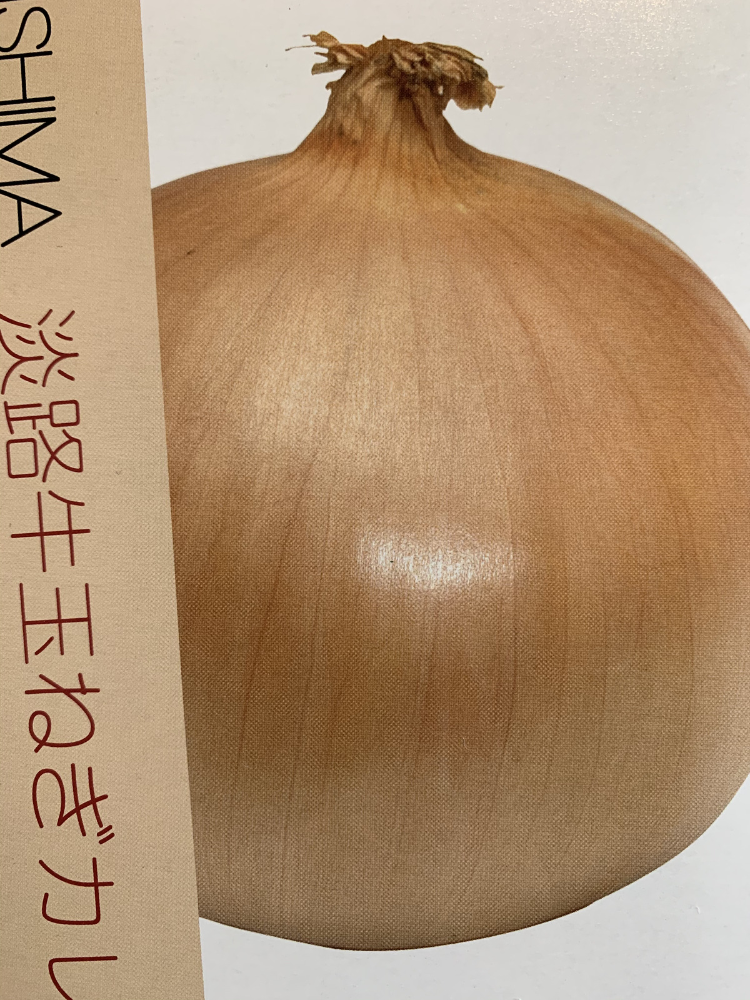

**やばいぜ〜〜〜**

**絶対自信あるマン** だ・・・ :man:

そのわりには

**淡路牛** も

さらっとアピールしてるような・・・？ :thinking_face:

---

**バックショット** 、かもーん！ :kissing_cat: :kissing_cat: :kissing_cat:

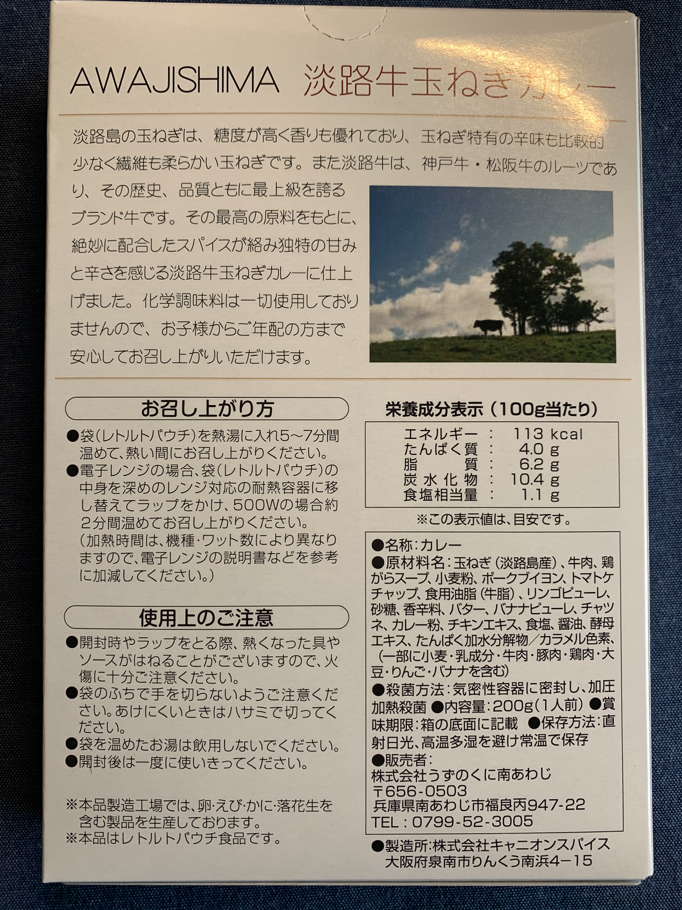

**Oh, Sexy Onion...!!! :sparkling_heart: :sparkling_heart: :sparkling_heart:**

> 淡路島の玉ねぎは、糖度も高く香りも優れており、玉ねぎ特有の辛みも比較的少なく繊維も柔らかい玉ねぎです。

ほえええ〜〜 :person_frowning:

**すっごくあまーい！**

玉ねぎなのかあ :thinking_face:

気になる！

**気になるぞ！ :smiley_cat:**

---

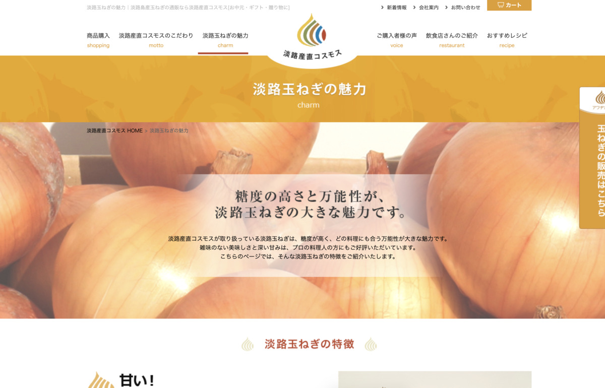

https://www.awajisanchoku.com/charm/

ひゃあああ！

**淡路島の玉ねぎ！**

---

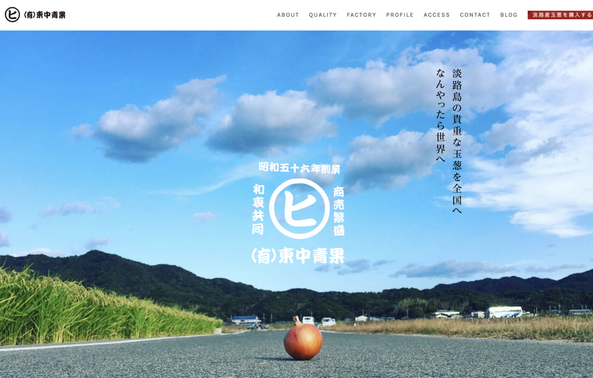

https://higashinakaseika.co.jp/

ひゃあああ！！

**淡路島の玉ねぎ・・・！！**

---

どこの玉ねぎが使われてるかまではわかんないけど、

**生産者に感謝・・・！ :pray: :pray: :pray:**

---

http://eki.uzunokuni.com/etc/hamburger.html

ご当地バーガーで1位2位のやつ！

どっちも **淡路島の玉ねぎ**

入ってるんだって！

**すごい！！ :hamburger: :hamburger: :hamburger:**

---

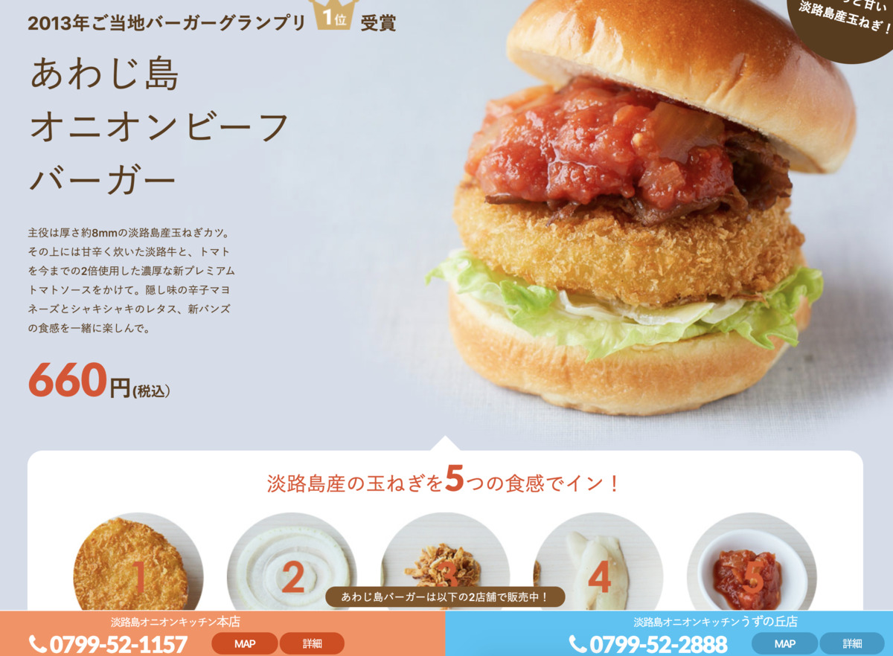

**あ〜〜これ絶対うまいやつぅ〜！ :hamburger:**

**こんなんずるいでしょー！ :hamburger: :yum: :hamburger:**

ずるいゾー！ :smiling_imp:

**ずるいゾずるいゾー！ :smiling_imp: :smiling_imp: :smiling_imp:**

---

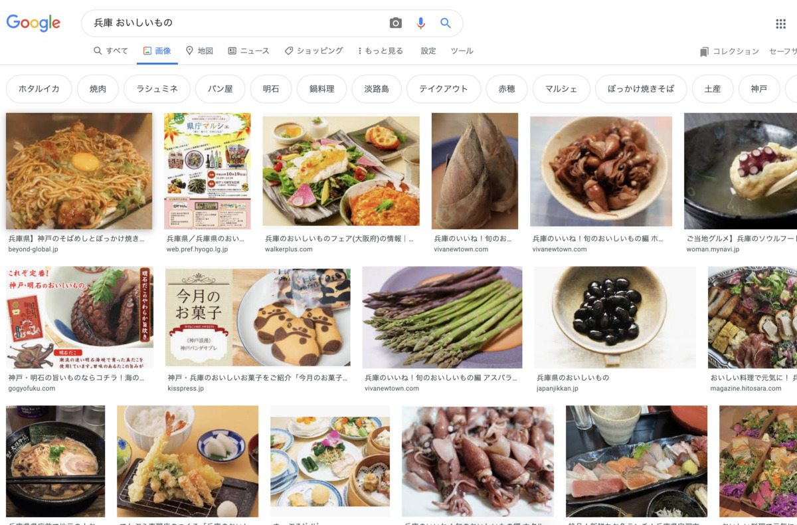

他にどんな **おいしいもの :yum:**

あるのかしらねー

（脱線のターン）

---

なになに〜？ :mag:

（ぽちっ）

---

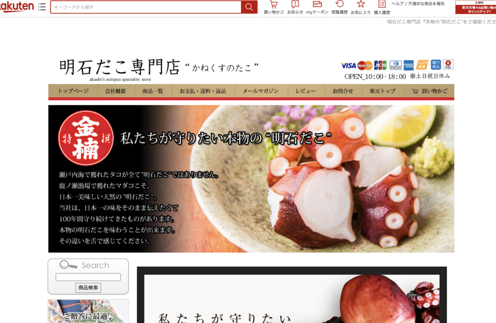

https://www.rakuten.co.jp/akashi-dako/

**明石だこ！ :octopus:**

たこ！だいすき！

へー

淡路島とをつなぐ

**明石海峡大橋** らへんの

流れの早いところに住んでるのが

**おいしい** んだって・・・！ :octopus:

---

タコカレーとかも

**あったら今度食べよう・・・！ :curry: :octopus:**

きっとあるでしょ！

調べないけど :stuck_out_tongue_winking_eye: :stuck_out_tongue_winking_eye: :stuck_out_tongue_winking_eye:

---

他にはどんな

**美味しいものあるかなー？？ :yum: :yum: :yum:**

（ぽちぽちっ）

---

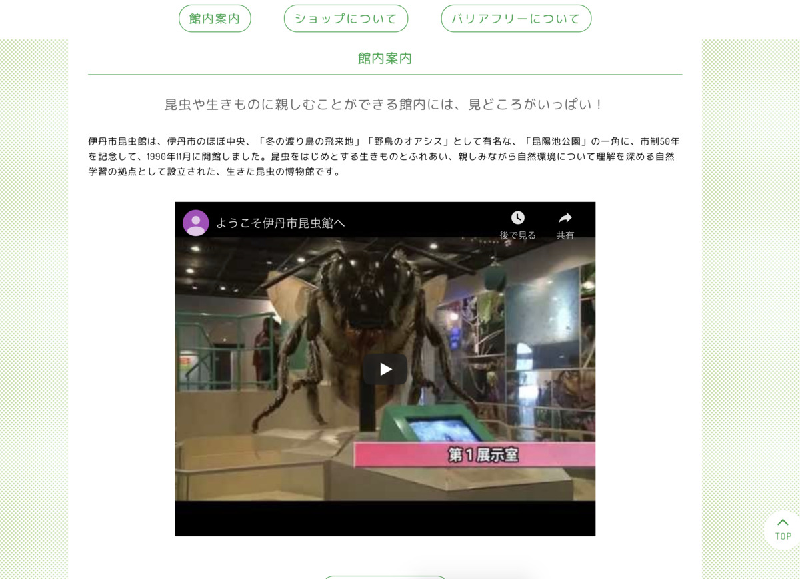

https://www.itakon.com/floor-guide

**昆虫・・・！？ :thinking_face: :thinking_face: :thinking_face:**

ここで唐突な・・・ **昆虫・・・！**

西日本最大規模だって！

へえ〜〜

こういうマニアックなところも

**すき〜〜 :heart_eyes_cat: :heart_eyes_cat: :heart_eyes_cat:**

---

昆虫・・・

**昆虫** といえば・・・

**あれ** しか・・・ :beetle:

---

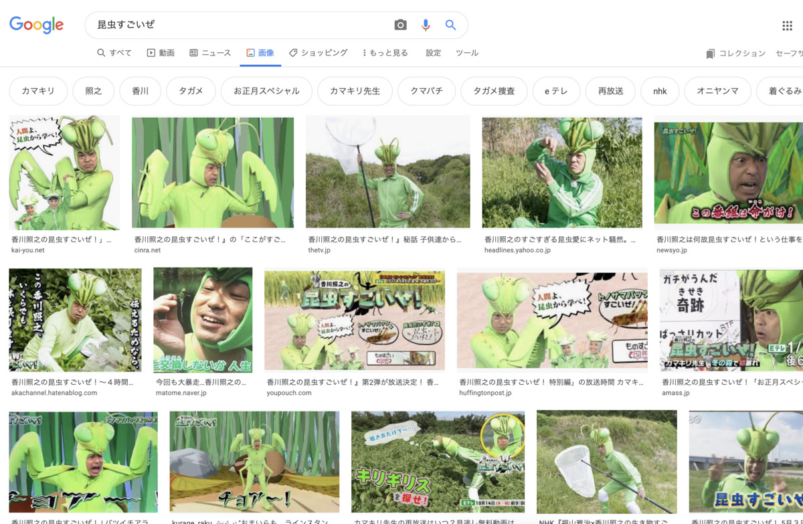

**昆虫おじさんだー！ :beetle: :bug: :honeybee:**

---

**チョア〜〜〜！！！ :tired_face: :tired_face: :tired_face:**

---

兵庫

**謎スポット :rocket:**

**意外とあるぞ？ :thinking_face: :thinking_face: :thinking_face:**

---

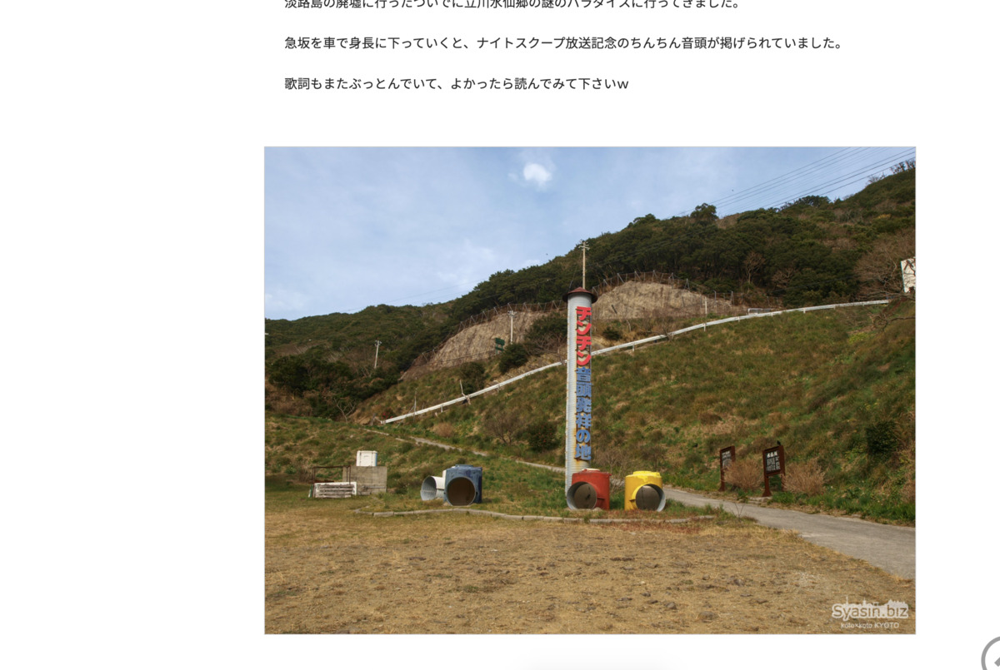

https://syasin.biz/tinspo/nazoparad/

**淡路島ナゾのパラダイス・・・！**

ち、地方によくありそうなやつ・・・！ :sweat_smile:

---

**チョア〜〜〜！！！ :tired_face: :tired_face: :tired_face:**

---

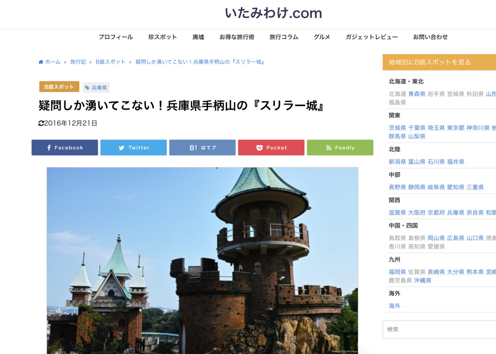

https://www.itamiwake.com/2013/08/b-spot.hyogo.tegarayama.html

**ス、スリラー城・・・ :european_castle:**

な、なんでこんなもん

**作ったんや・・・ :sweat:**

---

**チョア〜〜〜！！！ :tired_face: :tired_face: :tired_face:**

---

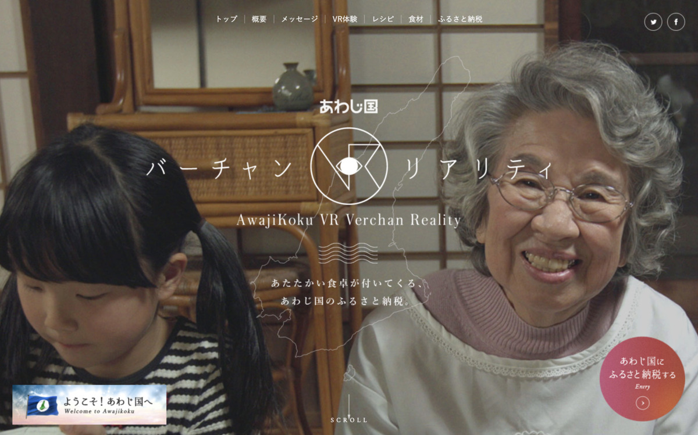

https://www.awajikoku.com/

なんやこれ・・・

**バーチャン・リアリティ・・・？ :thinking_face:**

なんか

だんだん

**兵庫県が怖くなってきた・・・ :hear_no_evil: :hear_no_evil: :hear_no_evil:**

---

なかなか **個性的な方々** が

**多いのね・・・ :cold_sweat: :cold_sweat: :cold_sweat:**

---

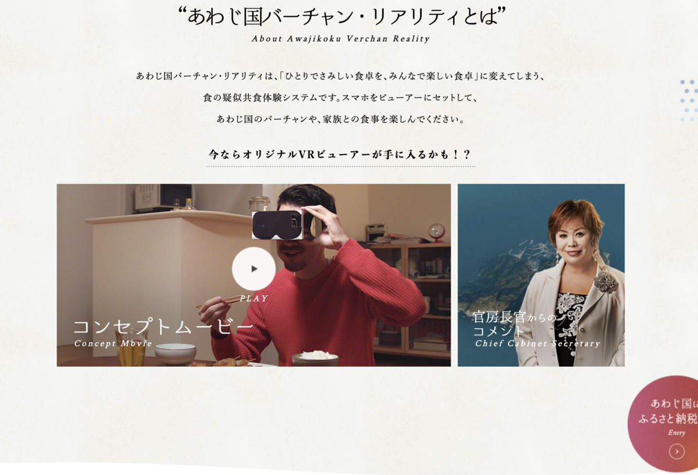

やばそう・・・

なんか見たことある人いる・・・

---

どこまで本気で

どこからギャグなのか

**ぜんぜんわからーん！w :dash: :dash: :dash:**

---

**チョア〜〜〜！！！ :tired_face: :tired_face: :tired_face:**

---

・

・

・

こらあ！ :cop:

**チョアー！ :tired_face:** で

**ごまかすんじゃない・・・！ :cop: :cop: :cop:**

---

はっ！

兵庫の謎スポット探検

**危険だ〜〜〜 :cold_sweat: :cold_sweat: :cold_sweat:**

**いろんな意味で危険〜 :imp: :imp: :imp:**

---

さて、今日はどこで **カレー** 食べよかな！ :fork_and_knife: :yum: :curry:

**どれどれ〜？ :mag: :mag: :mag:**

（ぽちっ）

---

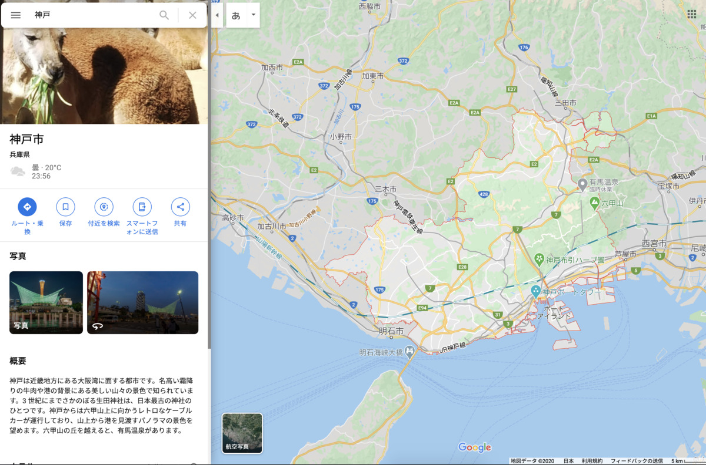

やっぱ **神戸** かなー？

**淡路島** と **謎スポット** に

持って行かれすぎたから

**スタンダード** なところがいい！ :star: :star: :star:

---

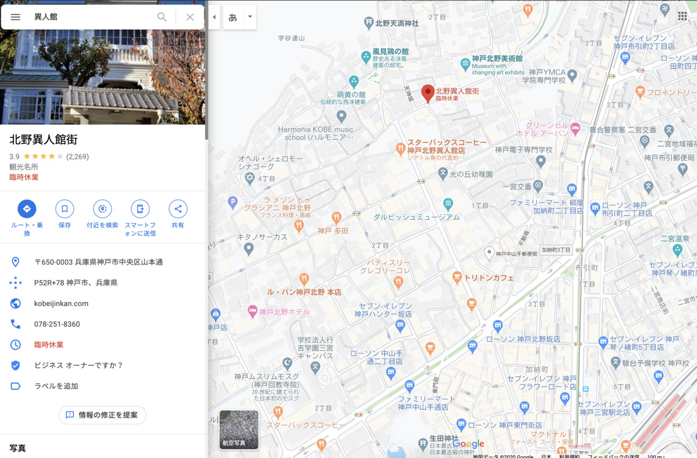

あ〜〜〜

**異人館** とか有名っぽい？

異国情緒あふれる街で

**カレーを食う・・・！ :curry:**

---

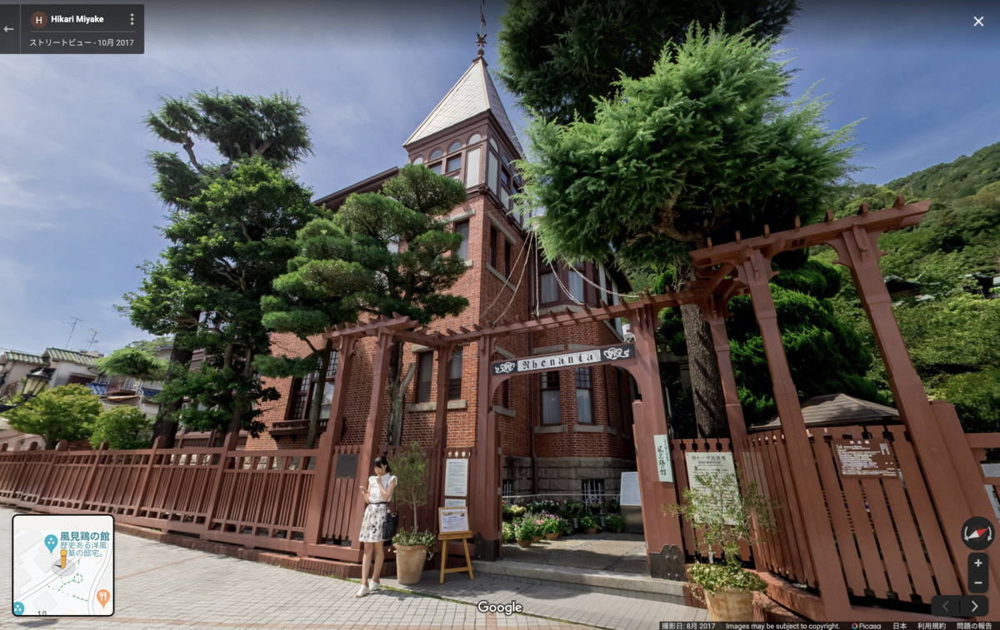

あああ〜〜

**ここでしょ〜〜 :cupid: :cupid: :cupid:**

**風見鶏の館** っていうらしい！ :two_hearts: :two_hearts: :two_hearts:

**ここにきーめた！ :sunglasses:**

---

## 実食！！

**実食までが段々近くなっててえらい！ :tada:**

---

**チョア〜〜〜！！！ :tired_face: :tired_face: :tired_face:**

---

こら〜

**そういうとこやぞ！ :fire: :fire: :fire:**

---

（ぐつぐつぐつぐつ・・・）

---

**かんせーい！ :confetti_ball: :confetti_ball: :confetti_ball:**

完成かんせーい！ :raised_hands:

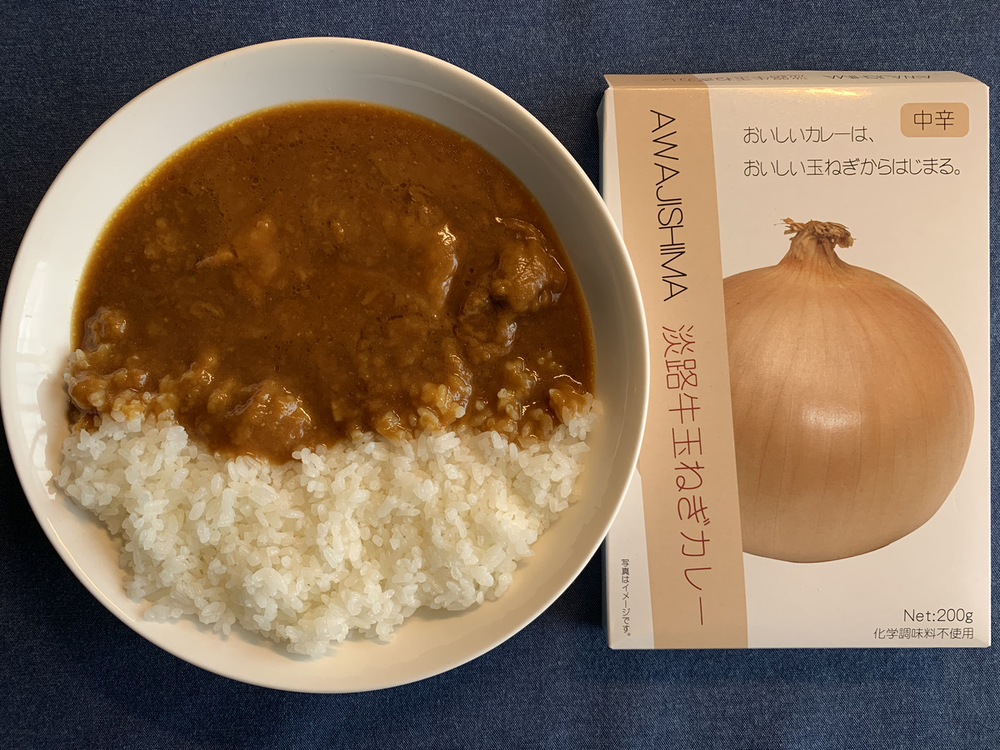

旨そう！ :yum:

ウマソウ！ :yum: :yum:

**UMASOU...!!! :yum: :yum: :yum:**

---

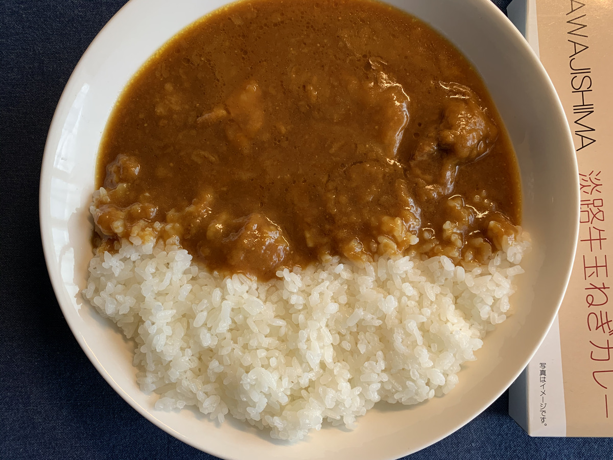

はあああ〜〜〜

どんな味がするんだろう？ :satisfied:

**楽しみすぎる・・・！ :satisfied: :satisfied:**

---

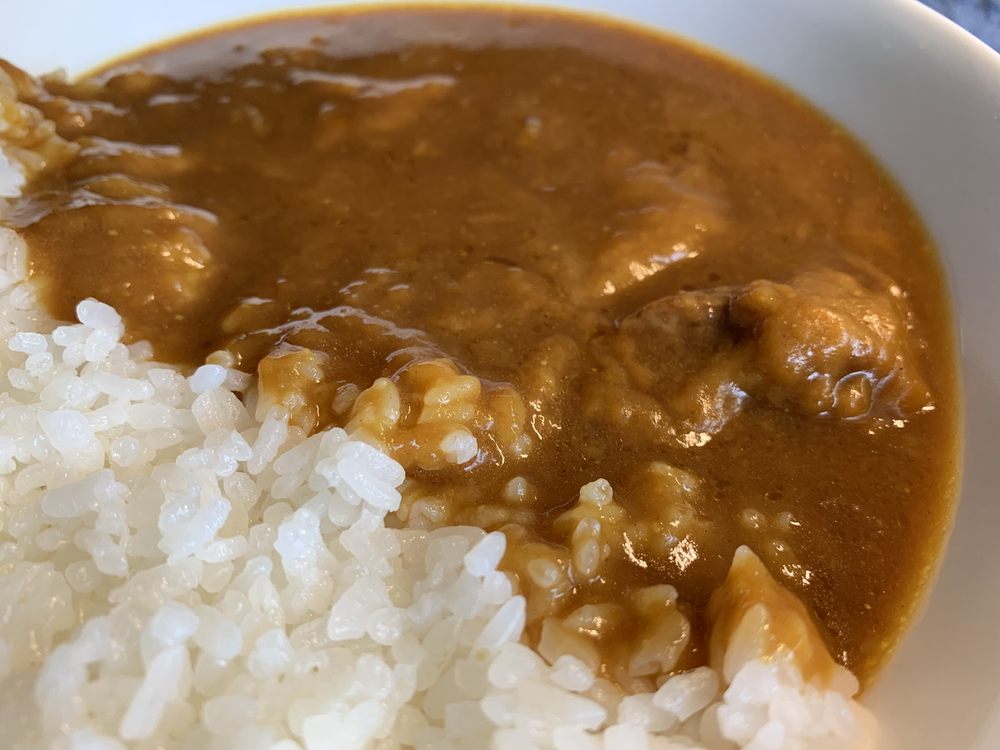

もう・・・！ :rage:

はやく・・・！ :rage: :rage:

**食べたいので・・・！  :rage:  :rage:  :rage:**

---

**いただきまーす！ :pray: :pray: :pray:**

---

（モグッ）

---

**おおっ・・・！ :flushed:**

---

（モグッ）

（モグッ）

---

**うまいうまーい！！！ :satisfied: :satisfied: :satisfied:**

---

玉ねぎの甘みを感じさせる、やさしく甘いカレーソースが美味い！
てっきり玉ねぎが具材として入ってるのかなと思いきや、全然そんなことはなく、
あくまでソースの中にペースト状に入ってて、玉ねぎの甘みとともにカレーを味わってくれ感がたまらん！

玉ねぎメインでお肉はサブ的にちょこっとかなと思いきや、意外とごろんとした肉のかたまりが入ってる！

---

こいつはうめえ・・・！ :yum:

こいつはうめえ・・・！！ :yum: :yum:

---

そろそろせんせーを呼ぼう・・・！

今日も **せんせーの出番** だ・・・！ :innocent:

さあみんな一緒にー！

---

**ホア〜〜〜〜〜**

---

**ジャオ〜〜〜〜〜！！！**

---

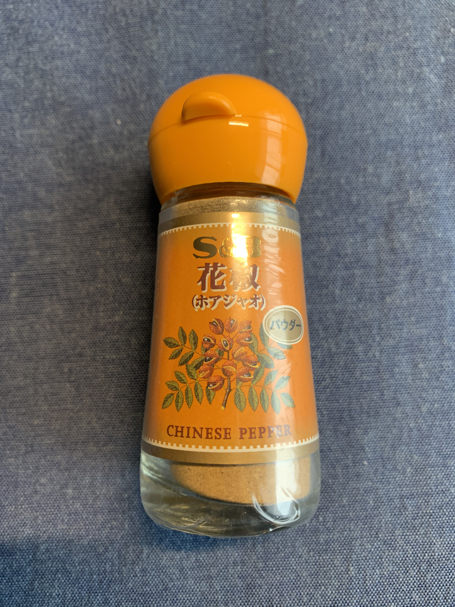

**ほわわわわ〜ん！ :innocent: :innocent: :innocent:**

はい :sunglasses:

（ﾌﾘﾌﾘﾌﾘﾌﾘﾌﾘﾌﾘﾌﾘﾌﾘ...）

きょうも :sunglasses:

（ﾌﾘﾌﾘﾌﾘﾌﾘﾌﾘﾌﾘﾌﾘﾌﾘ...）

ふりふり :sunglasses:

（ﾌﾘﾌﾘﾌﾘﾌﾘﾌﾘﾌﾘﾌﾘﾌﾘ...）

しましょうねえ〜 :innocent:

---

**兵庫 淡路牛玉ねぎカレー**

**おいしゅうございました！ :pray: :pray: :pray:**
