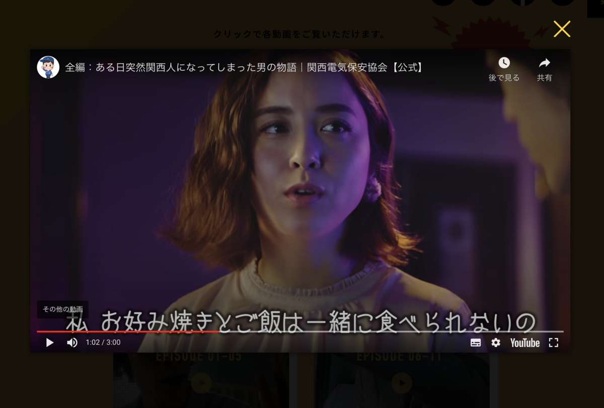

**カレー前線北上中！ :cherry_blossom: :cherry_blossom: :cherry_blossom:**

---

きちゃったぜ〜〜

とうとう **大阪** まで

**きちゃったぜ〜〜〜 :sunglasses:**

---

**うぇ〜〜〜〜 :train: :train: :train:**

---

**わ〜〜〜 :barber: :barber: :barber:**

**わ〜わ〜〜〜 :barber: :barber: :barber:**

---

**大阪** といえば〜？

**乳首ドリル！ :barber:**

**せーへんのかーい！**

---

https://www.tokyo-sports.co.jp/entame/494081/attachment/%e5%90%89%e7%94%b0%e8%a3%95/

何この **乳首ドリル光線・・・ :barber: :sparkles:**

**パワー :muscle:** を感じる・・・！

---

今日のカレーは **これっ！**

**しゅぱっ！ :rocket:**

---

**大阪ブラックー！ :ramen: :black_joker:**

---

---

**カレー :curry: たべへんのかーい！**

---

おおっと〜〜

間違えて〜〜〜

昔大阪で食べた

**ラーメン画像** を出してしまった〜 :ramen:

---

うっかり〜 :stuck_out_tongue_closed_eyes:

**うっかり〜〜！ :stuck_out_tongue_closed_eyes: :stuck_out_tongue_closed_eyes:**

---

http://king-emon.jp/

**金久右衛門（きんぐえもん）！**

おいしいラーメンやさんだぞ！

大阪に寄ったときには

**また絶対行っちゃうんだからね！ :rage:**

---

さてさて〜

**今日のカレー :curry: は〜？**

---

**はいっ！ :open_hands:**

**大阪 せんば自由軒の混ぜカレー！ :tada:**

おおーっ！

なんか美味しいお店って聞いたことある！

ついこの前も食べてみて！って言われたゾ！ :yum:

---

わくわくー！

**わくわくーわくわくー！ :yum:**

---

**バックショット、これっ！**

---

**ババン！ :boom:**

Oh, Diamond Sexy...!!! :sparkling_heart: :gem: :sparkling_heart: :gem: :sparkling_heart:

---

しかしまだ、この時は

**思いもよらない罠 :bomb:** が

仕組まれていることに

**気づきもしないのだった・・・！！ :crystal_ball:**

---

（つづく）

---

**自由軒・・・！**

どんなお店じゃろ〜？

どれどれ〜（ぽちっ）

---

おお〜！

もしかして、みんな知ってる

**超有名店** なのかー？

知らなかったぜ〜〜 :dizzy_face: :zzz:

大阪・難波にある！って書いてあるぞ〜

**んんっ？ :thinking_face:**

---

大阪

最初に訪れたとき

**なにわ** と **なんば（難波）** の違いが

よく分からないまま

今まで **謎に包まれてたんだぞ :thinking_face:**

---

**「なんば」と「なにわ」** って

**どう違うんですかー？ :baby:**

ふむふむ？そうそう :grin:

（ぽちっ）

---

> 「なにわ」というのは大阪全体を刺すことが多い
>
> このなにわも、難波と書くことがあります

**わかったようでわからーん！w :innocent:**

大阪の人！

**正解を教えてくれよな！ :+1:**

（なんなら現地で！）

---

https://www.azami-house.com/aruaru.html

**ここで唐突の大阪あるあるー！**

**どんどんぱふぱふー！ :confetti_ball: :tada:**

> 基本的には2回言う
>
> テンションあがったら4回言う

**盛ってる盛ってる！ :sparkles: :sparkles:**

---

この、 **関西電気保安協会** 、って

よく聞くんだよなあ〜

**わからん〜 :thinking_face: :thinking_face: :thinking_face:**

普通に電気関連の会社じゃあないの？

（ぽちっ）

---

https://www.ksdh.or.jp/web-movie/kansaijin/

**うほっ！ :panda_face:**

**なんなんだ :scream: :scream: :scream:**

この **関西あるあるが凝縮**

されたような **動画シリーズ** は・・・！

かんさい〜でんき **ほ〜あんきょ〜かい〜♪**

---

あ〜〜

大阪に住み出すと

こういうのに **条件反射** してしまうのか

**危険だ〜〜〜！ :smiling_imp: :smiling_imp: :smiling_imp:**

かんさい〜でんき **ほ〜あんきょ〜かい〜♪**

---

ところで

> とんかつとんかつ
>
> KYK〜♪

ってなあに？ :thinking_face:

---

https://www.tonkatu-kyk.co.jp/tonkatu

おお〜

**地元のおいしいとんかつ・・・！ :pig: :pig: :pig:**

ああ〜 :yum:

**こういうのしゅき〜 :heartpulse: :heartpulse: :heartpulse:**

---

そうそう！

**大阪** って

**肉吸い** も有名だよね！

（脱線フラグ）

---

https://www.chitose-nikusui.com/

**にくしゅい〜〜〜 :heart_eyes_cat: :heart_eyes_cat: :heart_eyes_cat:**

ごいりょく〜 :kissing_cat: :kissing_cat: :kissing_cat:

---

要するに

**肉うどん ー うどん ＝ 肉吸い**

だぞ！

この公式 **テストに出るぞー！ :100:**

---

はっ！

うまいもんの妄想旅

**いつも脱線して危険すぎる〜！ :smiling_imp: :smiling_imp: :smiling_imp:**

---

**カレー食うぞー！ :curry:**

普通に考えたら

**自由軒の店舗** で食べるところだけど・・・

今日は趣向を凝らして

**ちょっと違うところで食べちゃうぞ！ :fork_and_knife: :yum: :curry:**

---

大阪！

こうしてみると、 **意外と縦に長い！ :ramen:**

---

そしてよく大阪の人の間でネタにされる

**枚方（ひらかた）・・・**

なんだかとっても気になる・・・ :thinking_face:

---

**どれどれ〜？ :mag:**

（ぽちっ）

---

おお〜

ここが噂に聞く

**ひらかたパーク！ :circus_tent:**

通称 **ひらぱー** かあ！ :circus_tent: :circus_tent: :circus_tent:

---

http://www.hirakatapark.co.jp/hirapar_niisan/

**ひらぱー兄さん！**

・

・

・

**:thinking_face: :thinking_face: :thinking_face:**

---

**おお〜〜！！！ :star2: :star2: :star2:**

観覧車！ **景色最高 :sparkles: じゃないかあ！**

ひらぱーの観覧車で

自由軒のカレーを食う・・・！

**なんという圧倒的自由・・・！ :monkey:**

---

## 実食

さーて！

今日も温めてサクサクっと準備するかね！

---

:thinking_face:

:thinking_face: :thinking_face:

**:thinking_face: :thinking_face: :thinking_face:**

---

**ど、どゆこと・・・！？ :fearful: :fearful: :fearful:**

---

いつのまにか勘違いしていた・・・

**レトルト＝調理いらず**

ではないということ・・・！

---

レトルトとは、 **レトルトパウチ** の略・・・！

レトルトに入っているからといって、

調理しなくて良い

**・・・とは限らない！**

**固定観念の破壊・・・！ :boom: :boom: :boom:**

---

ど、どうやら **卵とウスターソース** が

**追加で必要** らしい・・・！

**き、今日は食えない・・・！！ :sob: :sob: :sob:**

---

ここにきて！

**初の1日お預け・・・！ :broken_heart: :broken_heart: :broken_heart:**

---

## 翌日、再実食

日を改めて！

**いくさの準備は整ったり〜！ :zap: :zap: :zap:**

**るーるーるーるー！！！ :rage: :rage: :rage:**

---

**こっちの通りに作っていくぞ！ :muscle: :muscle: :muscle:**

カレールーを軽くいためて！ :curry:

ご飯を混ぜて！ :rice:

**盛り付け！ :curry: :curry: :curry:**

---

**いため〜の :curry:**

---

**まぜ〜の :rice:**

---

**もりつけ〜の！ :curry:**

むー :thinking_face:

なんだか若干の物足りなさ :thinking_face: :thinking_face: :thinking_face:

---

**そこにこいつだー！ :egg:**

---

**じゃじゃーん！！ :tada: :tada: :tada:**

1日延期ののち、ようやく **完成！ :confetti_ball:**

---

**やったー！ :crown:**

**わ〜〜〜 :barber: :barber: :barber:**

**わ〜わ〜〜〜 :barber: :barber: :barber:**

**まぜまぜしたい・・・！ :open_hands:**

---

**まぜまぜしたい・・・！ :open_hands: :open_hands:**

**まぜまぜしたい・・・！ :fork_and_knife: :rage: :fork_and_knife:**

もう1日待たされて **我慢できないよう！ :tired_face: :tired_face: :tired_face:**

---

生産者に感謝して〜

**いただきまーす！ :pray: :pray: :pray:**

---

（モグッ）

---

**もぐっ・・・！ :flushed:**

---

（モグッ）

（モグッ）

---

**うまいぞー！！！ :satisfied: :satisfied: :satisfied:**

---

卵のまろやかさが先にくるけど、そのあとすぐにカレーの香りが口に広がる、カレーだこれ・・・！

ウスターソースがまた入れるとちょうど合う感じになってていいね！時々、わずかにできたおこげみたいなのもあって、それはそれで美味い！

---

いやあ〜〜〜

でも **ライスを混ぜて調理する** とは

**盲点だったぜ・・・ :eyes:**

---

レトルトだと思って食べようとしたら

**いつのまにか調理させられていた :fork_and_knife:**

レトルトカレー界の **叙述トリック・・・**

---

はっ！

**ご飯の量がいつもより少なめ** だったから

もうなくなっちゃった・・・！

せ、せんせーの出番が・・・！！

**ﾎｱ〜〜〜〜 :innocent: :innocent: :innocent:**

---

**大阪 せんば自由軒の混ぜカレー**

**おいしゅうございました！ :pray: :pray: :pray:**
