---

title: "京都 京野菜カレー！"
summary: "京都の京野菜をつかったカレーだぞ！ついでに京都をぐるぐる回っちゃうぞ！"
featured_image: heroimage.jpg
date: 2020-06-01T12:00:00+09:00
publishdate: 2020-06-01
draft: false
slug: 22
---
は〜〜

最近 **カレーばっかり** で **お昼が待ち遠しい・・・**

でも・・・

だんだん・・・

---

**書くのがつらくなってきたゾー？ :scream: :scream: :scream:**

**あれれ〜？ :thinking_face: :thinking_face: :thinking_face:**

**わ〜〜〜 :ghost: :ghost: :ghost:**

---

**カレーは食べたい・・・！ :yum:**

でも書くのは **大変・・・ :sweat:**

えっ？

**書かなければいいじゃん、って？**

そんなの

**食ったら書くのはセット** でしょ！ :curry: :pencil2:

---

不定期で気ままにやっていくぞ！ :muscle: :muscle:

さてさて今日は〜？ :joy:

---

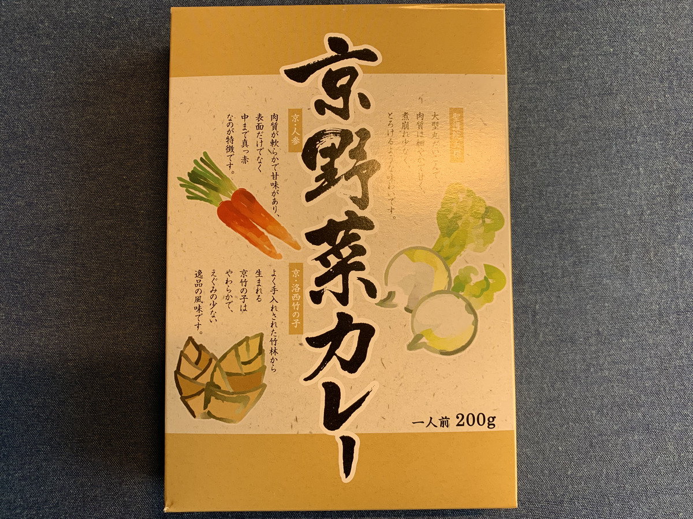

**いえーい！ :v:**

**京都 京野菜カレー！ :izakaya_lantern: :izakaya_lantern: :izakaya_lantern:**

---

**京野菜** だ！

現地の変わったお野菜、しゅき〜 :heart_eyes_cat: :heart_eyes_cat: :heart_eyes_cat:

**京人参！ :open_mouth:**

**聖護院（しょうごいん）大根！ :open_mouth: :open_mouth:**

**洛西（らくさい）竹の子・・・！ :open_mouth: :open_mouth: :open_mouth:**

入ってるんだってー！ :raised_hands:

他にも **京野菜、いろいろありそう** だなー！ :relieved:

---

**バックショット** 、かもーん！

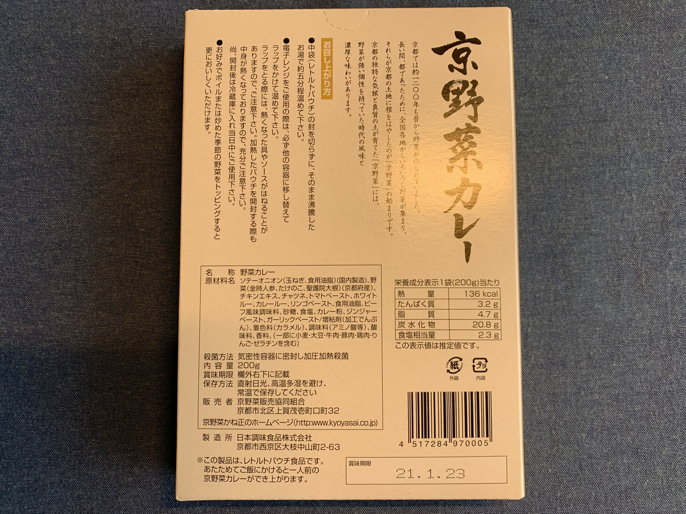

**Wow! Sexy Maiko!!! :sparkling_heart: :kimono: :sparkling_heart: :kimono: :sparkling_heart:**

シンプルだなー！

どんな味なんだろー！ **わくわく・・・！ :yum: :heartpulse:**

---

うんちくファンのための〜

**うんちくタイム〜！ :watch:**

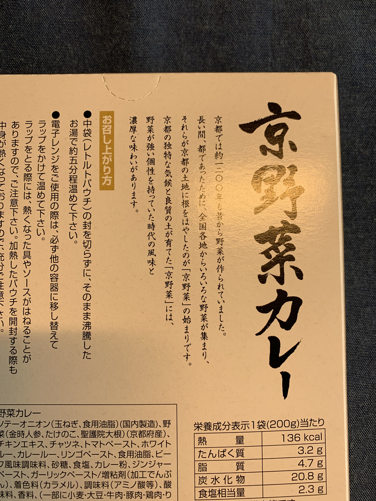

なになに？

> 京都では約1200年も昔から野菜が作られていました。
> 長い間、都であったために、全国各地から野菜が集まり、それらが京都の土地に根を生やしたのが「京野菜」の始まりです。

**なるほど、すげー！ :hushed:**

**むかしのやさい** きたー！

---

**むかしのやさい祭りじゃー！ :tada: :tada: :tada:**

むかしのわっしょい！！ :eggplant: :tomato: :corn:

わっしょい！やさい！！ :eggplant: :tomato: :corn:

**むかしのわっしょい！！ :eggplant: :tomato: :corn:**

**わっしょい！やさい！！ :eggplant: :tomato: :corn:**

わーーー！！！ :eggplant: :tomato: :corn: :eggplant: :tomato: :corn:

---

そうだ！

**京都行こう・・・！ :ear_of_rice:**

---

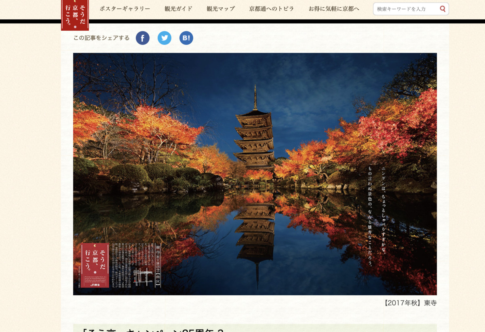

https://souda-kyoto.jp/blog/00578.html

京都っぽさ〜〜〜

---

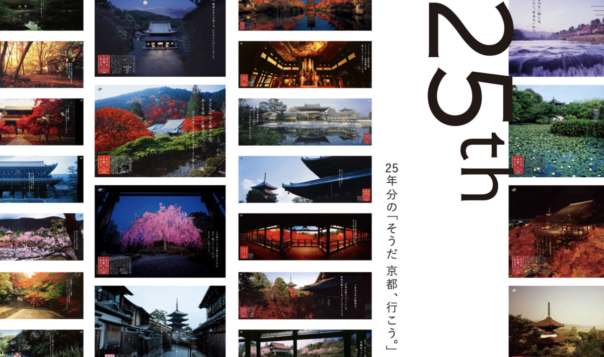

https://souda-kyoto.jp/25th/index.html

**京都っぽさ〜〜〜 :izakaya_lantern:**

でも

こういういかにも **京都っぽいところ** は

今回は全力で :muscle:

---

**スルーしちゃうぞ！ :star2: :surfer: :sparkles:**

---

**うぇ〜〜〜い :smiling_imp: :smiling_imp: :smiling_imp:**

---

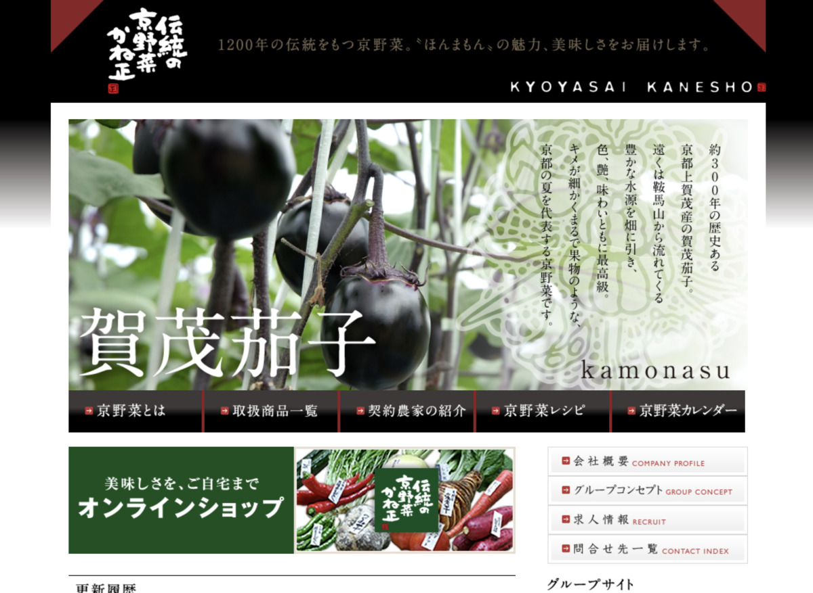

http://www.kyoyasai.co.jp/

**きょうやさい、どっと、しーおー、じぇーぴー！**

わーわーわー :satellite: :satellite: :satellite:

もう、 **京野菜なら俺にまかせろ！ :sunglasses:**

**感ぱない！ :fire: :fire:**

**生産者に敬礼！ :pray: :pray: :pray:**

---

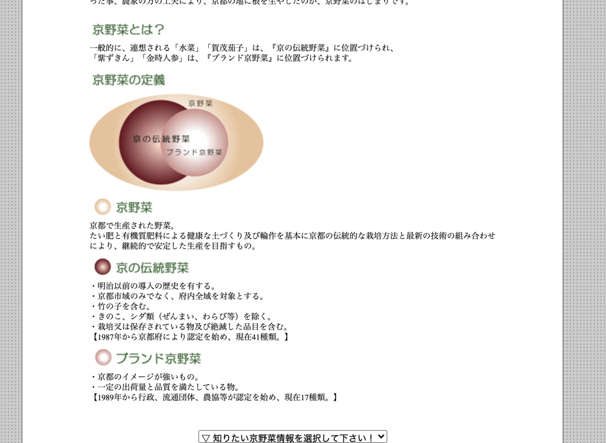

**京野菜！**

ひとくちに **京野菜** っていっても

**京の伝統野菜** と

**ブランド京野菜** の

2種類あるらしいぞ！

**間違えたらおしおき** どすぇ〜〜〜 :kimono: :kimono:

---

> 明治以前の導入の歴史を有する

明治以後のやつは、

**伝統野菜とは認めねえ・・・！ :rage: :rage: :rage:**

伝統かそうじゃないかのしきい値

**たかすぎぃ〜〜〜！ :scream_cat:**

---

僕が食べたいの！

**京の伝統野菜** の方だ・・・！ :eggplant:

---

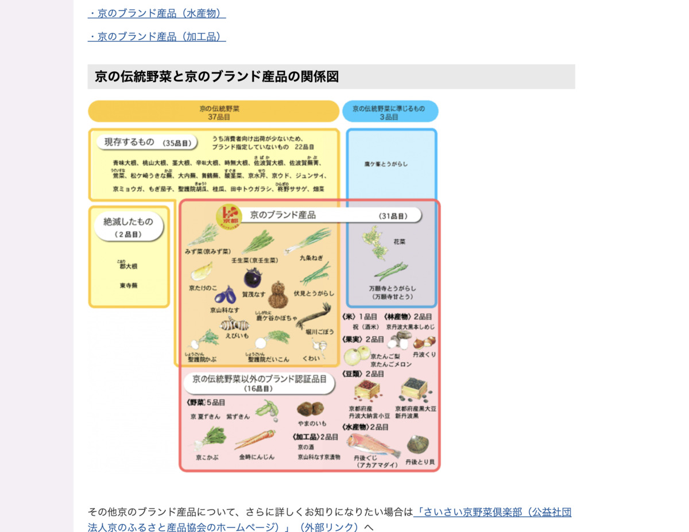

https://www.pref.kyoto.jp/brand/brand1.html

京都府が・・・！

**絶対に間違えんなよ・・・！！**

みたいな図出してる〜〜

**こわい〜〜〜 :hear_no_evil: :hear_no_evil: :hear_no_evil:**

ここ、きっとテストに出るやつだ〜 :100:

---

**くわい！**

くわい・・・？ :thinking_face:

**くわいってなに？**

**京の伝統野菜の1つ** なんだって

どんなだろー？

（ぽちっ）

---

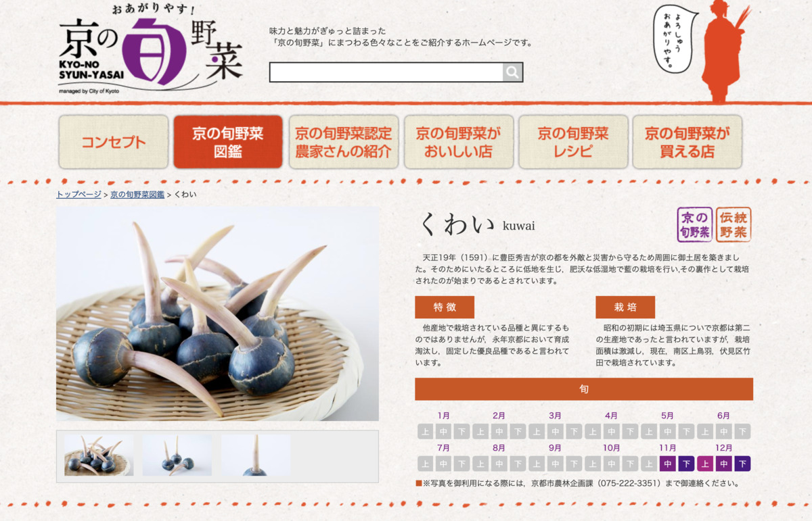

http://xn--u9j432gh4p5l1a8to.jp/yasai/detail/?id=42

！？！？ :skull:

**・・・食えるの？ :speak_no_evil: :speak_no_evil:**

え〜〜

なにこれ〜

**え〜〜〜・・・ :sweat_drops:**

---

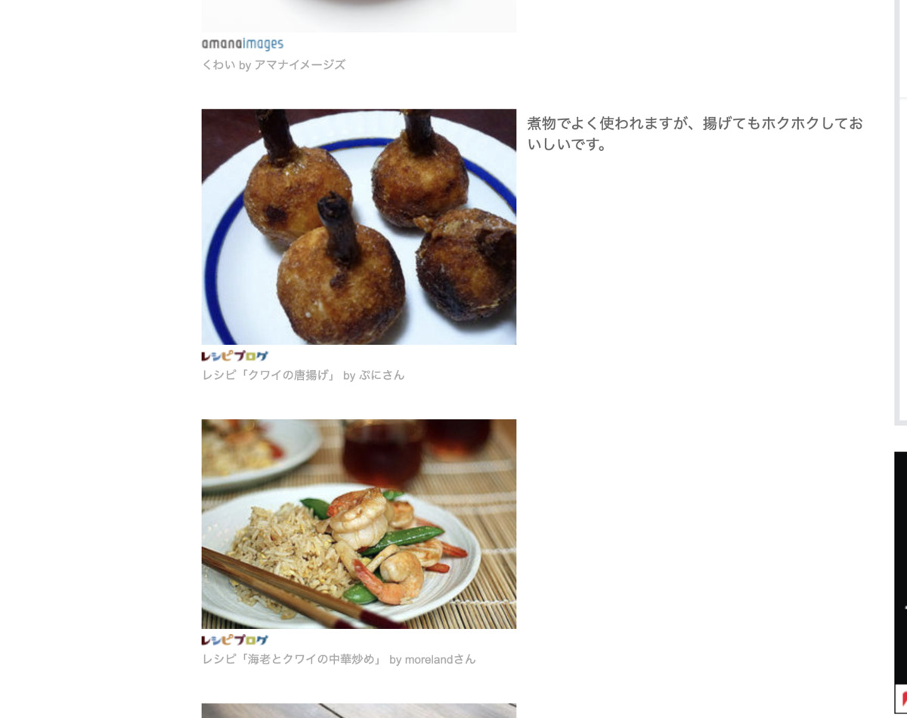

https://matome.naver.jp/odai/2156449971840797501

あれ？

でも、揚げたやつは **なんだか旨そう** だな・・・

旨そう！ :yum:

**ウマソウ！ UMASOU...!!! :yum:**

食べたくなってきた・・・

食べたい！ :rage:

食べたことないもの

**食べたいぞー！ :rage: :rage: :rage:**

---

他に京都

美味しいものないかなー！

もっと **上品じゃないやつ** がいいなー :metal: :metal: :metal:

（ぽちっ）

---

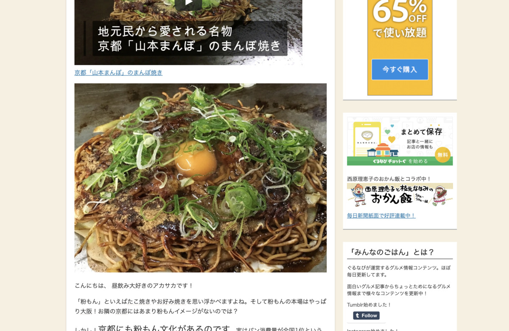

http://r.gnavi.co.jp/g-interview/entry/akasaka/4021

あ〜〜〜

こういう **頭空っぽで食える系** すきー :heart_eyes_cat:

**まんぼ焼き**

って言うんだって！

こういうのもあってくれて嬉しい・・・！ :smiling_imp:

**うぇ〜〜〜い :metal: :metal: :metal:**

---

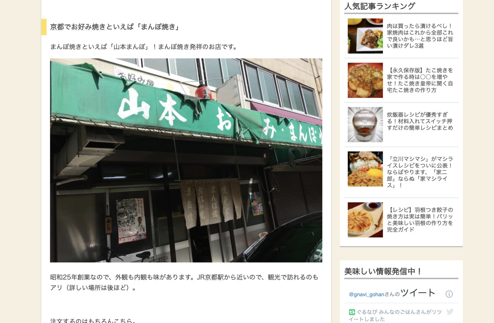

あ〜〜

**年季入ってますね〜〜 :+1: :+1: :+1:**

こういう地方にしかないやついいよね！ :stuck_out_tongue_winking_eye:

---

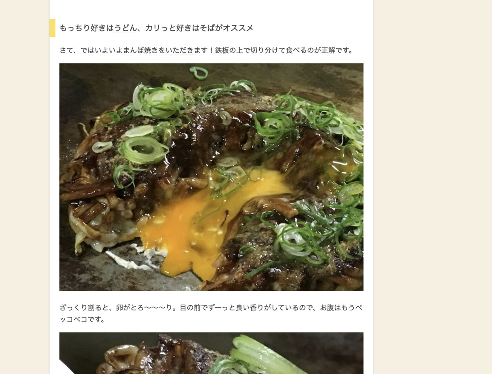

あ〜〜〜

**たまらん！！！**

いいじゃん！ **いいじゃん！ :fork_and_knife: :yum: :star2:**

そうそう！

こういうの！

このブログには

こういうのが **必要だー！ :jack_o_lantern:**

---

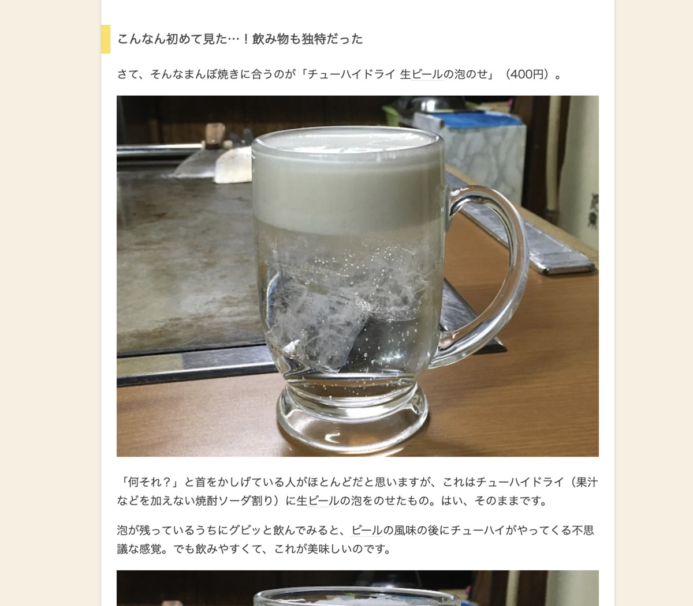

**意味わからん飲み物きたー！！！**

うひょー！なんだこれwww :rocket:

**チューハイドライ生ビール泡乗せ** 、だって！

---

んんんっ？ :thinking_face: :thinking_face: :thinking_face:

理解力が足らないので！

**1回だと理解できない！！ :moyai:**

---

**チューハイドライ生ビール泡乗せ！ :performing_arts:**

・・・

あっだめだ、2回目でも

**理解できなかったw :rooster:**

---

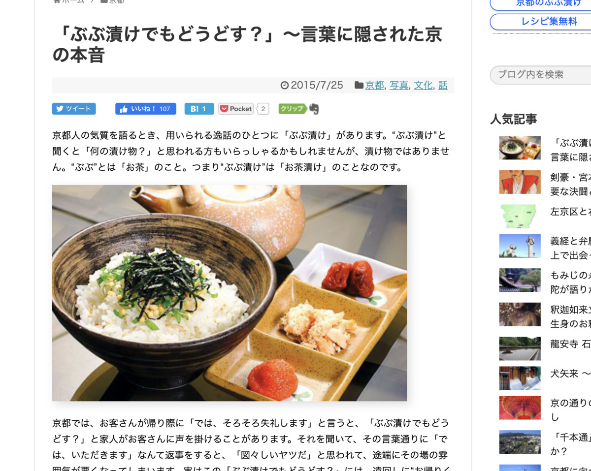

https://www.cyber-world.jp.net/bubuduke/

**ぶぶ漬け！**

京都のお茶漬け、なんだって！

**「ぶぶ漬けでもどうどす？」 :kimono:**

って、言われたら

**（さっさと帰ってくれないかなー） :kimono:**

の意味なんだってー

**こわい・・・！！ :confounded: :confounded:**

**こわすぎる・・・！！ :confounded: :confounded: :confounded:**

---

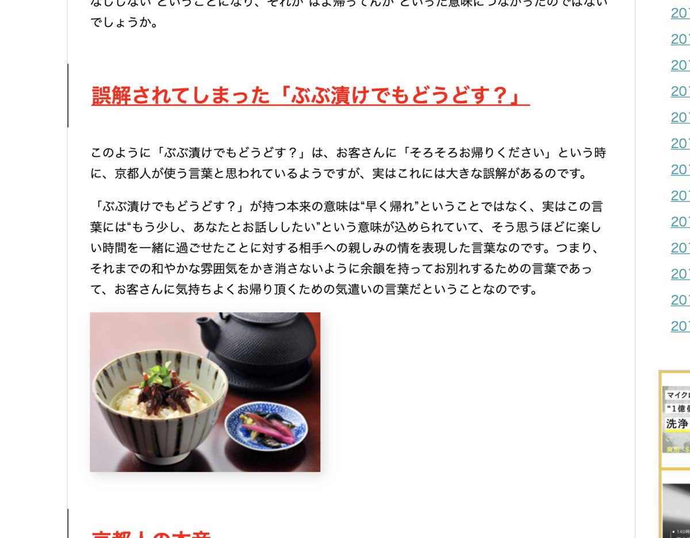

> 「ぶぶ漬けでもどうどす？」が持つ本来の意味は、早く帰れという意味ではなく、実はこの言葉にはもう少しあなたとお話がしたいという意味が込められていて

**ぜ、絶対に信じないぞ・・・！ :confounded:**

---

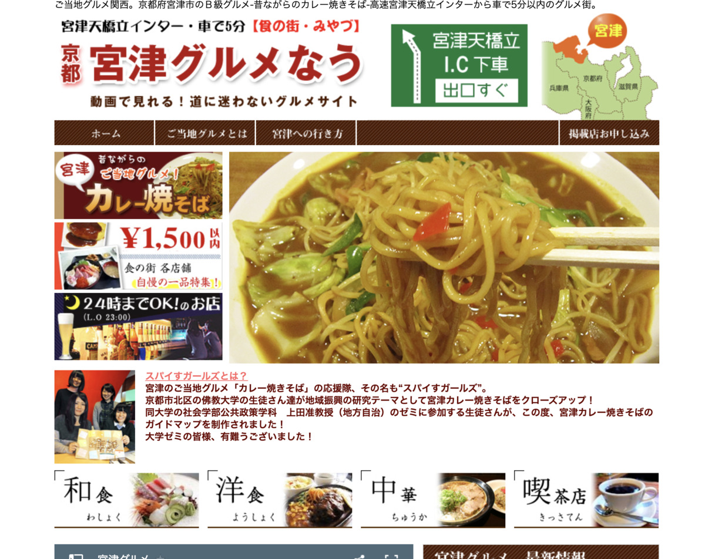

https://miyadu.info/

**カレー焼きそば！**

ああ〜こういうB級グルメもいいよね〜

**宮津市！ :star:**

**天橋立（あまのはしだて）** が

あるところじゃないのー？

---

はっ！

**カレー焼きそば** 食ってる場合じゃねえ！ :imp:

**カレー食う場所さがさなきゃ！ :mag: :mag: :mag:**

---

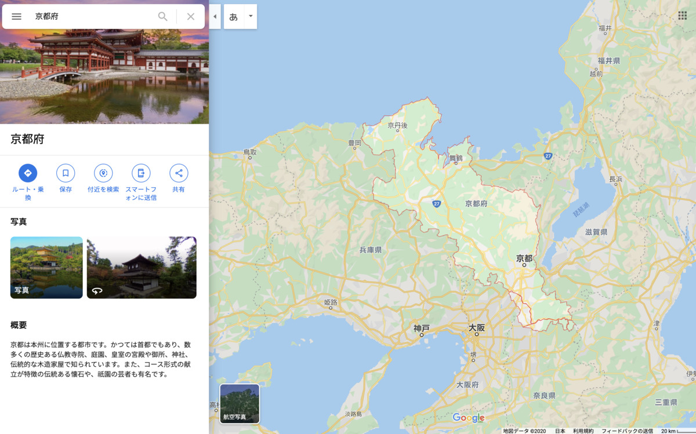

**京都府** ってけっこう広いのよね〜

どこがいいかな〜

**定番** はいくつかあるんだけど〜〜〜 :thinking_face:

---

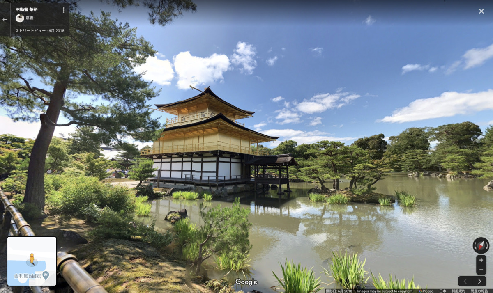

**金閣寺！ :star2: :star2: :star2:**

うーん

観光客の中、金閣寺眺めながら

カレー食うのも捨てがたいが・・・ :thinking_face:

---

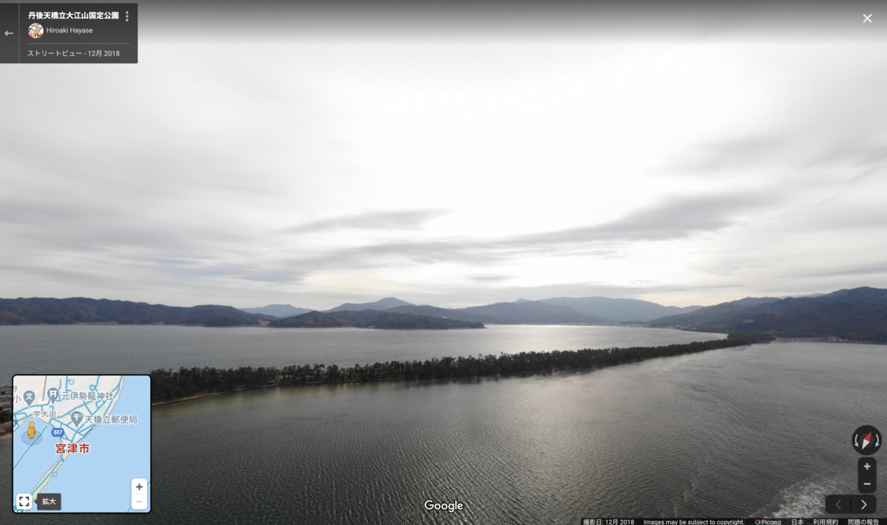

**天橋立！ :v:**

いいね〜〜〜！

**けっこう長い！ :eyes:**

これ、全部陸地なんだって！！ :star: :star: :star:

---

長いから、 **遠くから眺めつつ**

のんびりカレー食おう！

**ここに決めたー！ :hammer: :hammer: :hammer:**

---

## 実食！！

**まえおきも長ーい！**

（おなかすいたゾ :rage:）

---

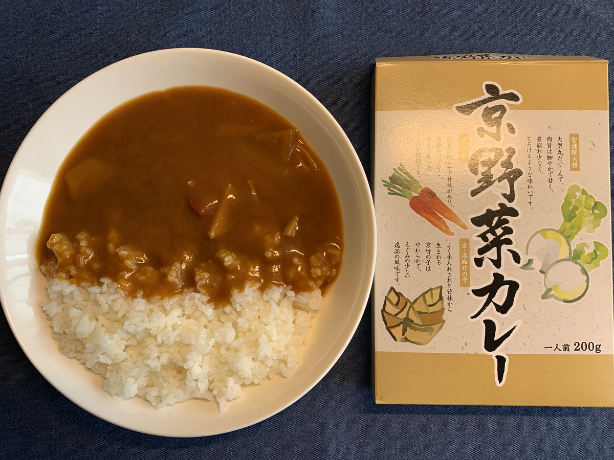

**パンパカパーン！**

**できあがりー！ :100: :tada:**

---

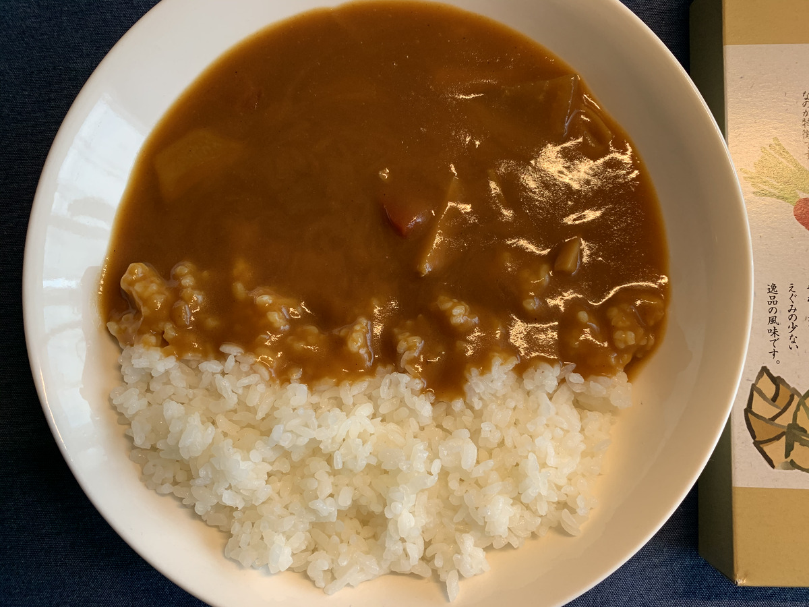

おおっ、なんだか色合いが違うぞ？ :thinking_face:

どんな味がするんだろう！

**わくわくわくわく・・・！ :yum:**

---

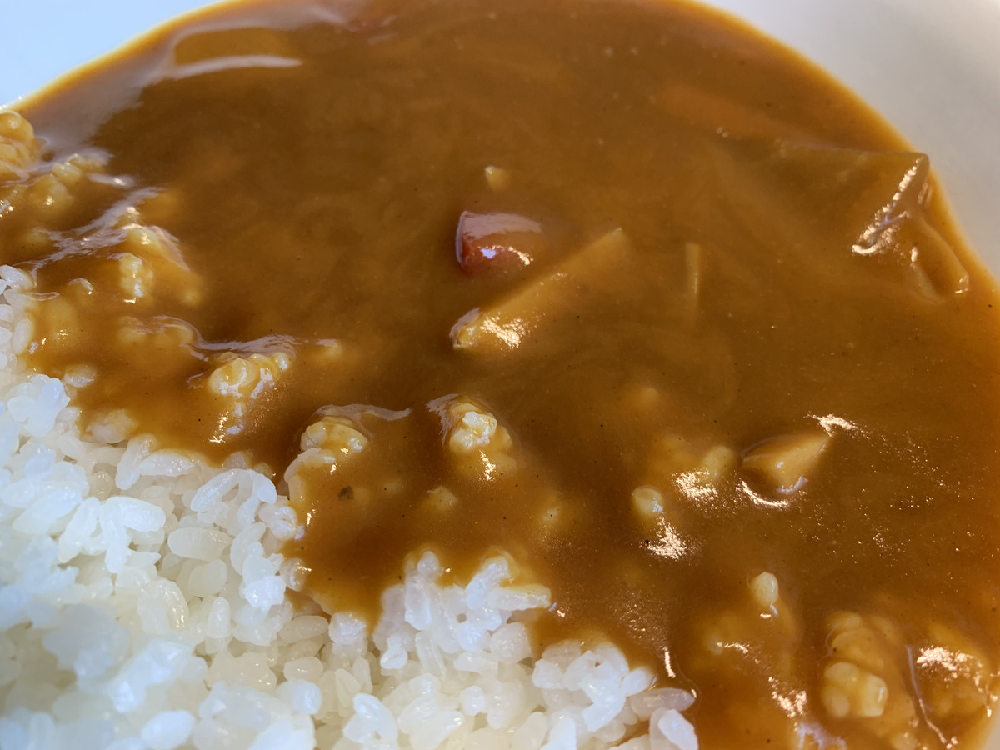

**もう待ちきれない〜 :persevere:**

食べよう！ :persevere: :persevere:

**食べようー！！ :yum: :yum: :yum:**

---

**ではでは、いただきます！ :pray:**

---

（モグッ）

---

**おおっ・・・？ :flushed:**

---

（モグッ）

（モグッ）

---

**なるほどうめえ〜〜〜！！！ :satisfied: :satisfied: :satisfied:**

---

表に書いてなかったけどすごくトマトっぽさを感じる・・・！この色はトマトだったのかな？
トマトペーストだ！トマトカレーだ！

トマトのまろやかさとカレーが合う、けっこう甘口！
そのトマトカレーに合わせるように、やさい、やさしい・・・！やさい、やさしい・・・！

---

**ドン！**

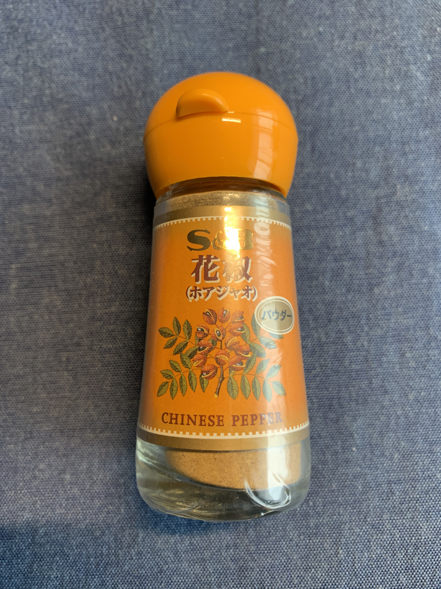

（ﾌﾘﾌﾘﾌﾘﾌﾘﾌﾘﾌﾘﾌﾘﾌﾘ...）

**・・・雑！ :innocent:**

---

**京都 京野菜カレー**

**おいしゅうございました！ :pray: :pray: :pray:**
