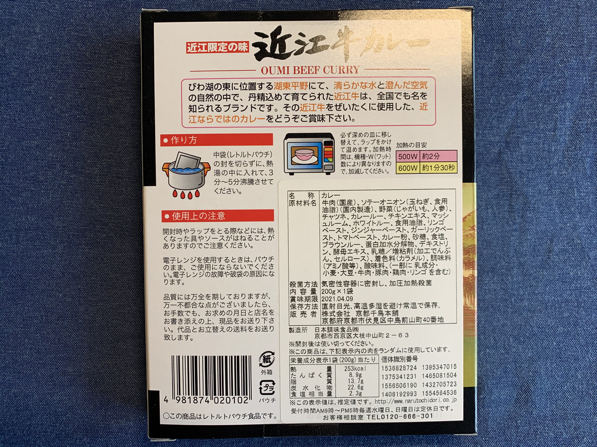
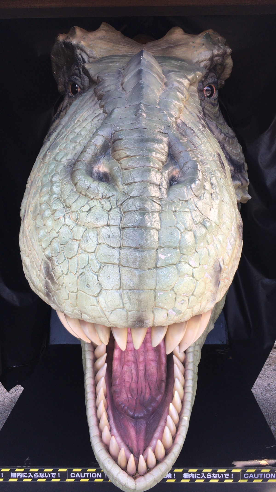
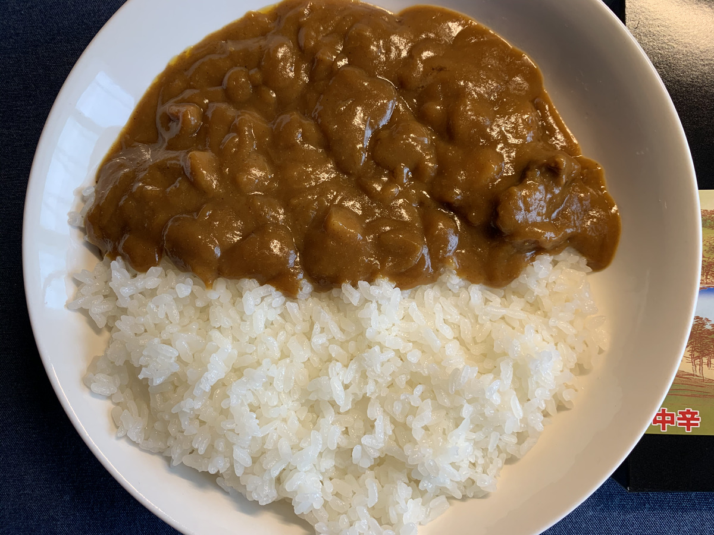

**カレー食ってハッピー！ :curry: :revolving_hearts:**

楽しみだなー :star:

**楽しみすぎるなー :star2: :star2:**

---

**カレー食ってハッピー！** は

あながち的外れでも

ないんだゾ！ :smile:

---

http://www.recruit-mp.co.jp/news/release/2015/1029_2771.html

カレー食うと！ :curry:

腸から **セロトニン** が吸収されて :innocent:

**ハッピー :revolving_hearts:** になる！らしい！

せんせー！

リクルートマーケティングパートナーズくんがそう言ってましたー

---

はー **今日のカレー** も

そわそわしちゃう・・・ :nose: :dash:

**そわそわ・・・ :sun_with_face:**

**そわそわ・・・ :sun_with_face:**

---

今日はこいつ！

**ばばばんっ！ :sparkles:**

---

**滋賀 近江牛カレー！ :tada:**

**うぇ〜〜〜い :metal: :sunglasses: :metal:**

いよいよ関西・近畿付近の最後の県だぜ〜

**おうみ** 、って読むんだゾ！

ここまでくると

肉だけじゃ驚かないぜ〜 :sunglasses:

---

**バックショット！はいっ！**

**Wow! Sexy Beef!!! :sparkling_heart: :cow: :sparkling_heart: :cow: :sparkling_heart:**

**近江限定** だぜ〜 :smirk_cat:

限定って言っておきながら

**レトルトにしちゃった・・・ :scream_cat:**

こいつは **ギルティだぜ〜 :alien:**

---

あ〜〜〜

近江・・・！行きたい・・・！ :information_desk_person:

行きたい！行きたい！ :rage:

行きたい行きたい **行きたいぞ！！ :rage: :rage:**

いきたーい！

（ほわわわーん :innocent: :innocent: :innocent:）

---

**おやおや〜？ :thinking_face:**

またまた気付いたら

**近江八幡駅に、いるぞ？？ :kissing_closed_eyes:**

---

そう！

ここは **近江商人発祥の地 :checkered_flag:**

なのだ！

わー :tada:

**わーわー :tada: :tada:**

---

**三方よし！ :arrow_left: :arrow_up: :arrow_right:**

三方よし！は

**売り手よし！ :v:**

**買い手よし！ :v: :v:**

**世間よし！ :v: :v: :v:**

の3つのことだぞ！

---

どうやら現地で

それを **体現しちゃってる会社 :office:** が

あるらしい・・・！

そりゃー **行かなきゃ！ :dash:**

---

たねやー！ :+1:

ラコリーナ！ :+1:

---

https://taneya.jp/la_collina/

**おお〜 :ear_of_rice: :ear_of_rice: :ear_of_rice:**

**たねや** さんがやってる、

**ラコリーナ** って名前の

**田舎のど真ん中** にある施設だぞ！

（まじで周りなんもないぞ :sweat_smile:）

---

自然を抜けると〜

---

**おお〜〜〜 :sparkles: :sparkles: :sparkles:**

自然たっぷりの施設〜

---

こんな感じで

メインは **バウムクーヘン！ :yum:**

---

ひゃあああ！ :yum:

**うまそう！ :yum: ウマソウ！ :yum:**

**UMASOU...!!! :yum: :yum: :yum:**

でも・・・

---

**1本 21,600 円でございますー！ :moneybag: :moneybag: :moneybag:**

**ひゃあああ！ :scream:**

---

**まんまんまんぞく〜**

**1本まんぞく〜 :yum:**

---

**まんまんまんぞく〜**

**1本（21,600円）まんぞく〜！！ :yum: :yum: :yum:**

---

あ〜〜でも美味しそう・・・

**普通に** 普通の量で食べたい・・・

---

**カフェで食べちゃうぞ！**

うぇ〜〜〜い :ok_woman:

**女子力〜〜〜 :muscle: :woman: :fork_and_knife:**

---

美味しいもの食べたし

少し **街並み散策** しよ・・・

**るーんるーん :notes:**

---

**:exclamation: :question: :exclamation: :question: :exclamation: :question:**

おまえ、だれや・・・！ :astonished: :astonished:

**ま、マネキンか・・・びっくりした・・・ :dizzy_face:**

近江には、

こういう **罠** が隠されているのか・・・

おそろしい子・・・ :baby:

---

**おやおやぁ〜？ :rabbit: :rabbit:**

---

https://tworabbitsbrewing.com/

おやおやぁ〜？ :rabbit: :rabbit:

**おやおやぁ〜〜〜？？ :rabbit: :rabbit:**

---

---

**ビール :beer:**

**どーん！ :beers: :beers: :beers:**

近江で！

**近江のビールが飲み比べ** られるなんて

**最高じゃないか！！！ :kissing_cat:**

---

**Two Rabbits** さん！

**最高でございます・・・！ :confetti_ball:**

---

あ〜〜〜

**こんなん絶対うまいやつぅ〜〜〜！ :sparkling_heart:**

こんなんつまみながら

**飲み比べ** できちゃったら

**無限に飲めちゃうじゃないかー！ :rabbit: :beers: :rabbit:**

---

ああ、いい・・・！

こういうの、いい・・・！ :sunglasses:

酔ってるから

もう **すべてが最高** に見える・・・！ :revolving_hearts:

---

あああ〜〜〜

---

**商い双六** でもやりながら、

寝て明日続き回るか〜〜〜 :zzz:

---

**（ほわわわ〜〜〜ん :innocent: :zzz: :innocent: :zzz: :innocent: :zzz:）**

---

**はっ！**

寝て起きたら **長浜市に居たわ・・・！ :open_mouth:**

びっくりびっくりー！ :stuck_out_tongue_winking_eye:

**長浜** も色々ありそうだぞ！ :yum:

**わくわくだぞ！ :yum: :yum: :yum:**

---

**誰！？！？ :crocodile:**

**何！？！？ :crocodile:**

---

http://www.shiga-amuze.com/

へーー

**こういうのもあるのね :thinking_face:**

ただ、そういうのばっかりじゃなくて・・・

---

長浜は長浜で

**古い街並みがあって面白い・・・！ :mag:**

---

わー！

**ガラス館！ :gem:**

---

わー！

**オルゴール館！ :musical_note:**

---

**おやおやぁ〜？ :whale: :whale:**

---

おやおやぁ〜？ :whale: :whale:

**おやおやぁ〜〜〜？？ :whale: :whale:**

---

ぶらぶらあてもなく :v:

ふらついていたら :v: :v:

たまたま偶然 :v: :v: :v:

クラフトビールを :v: :v: :v: :v:

見つけてしまったぞぉー？ :v: :v: :v: :v: :v:

---

そしてまさかの

**蒸留所きたー！！！ :tada:**

**わー！！！ :tada: :confetti_ball: :rocket: :barber: :cocktail:**

**わーわーわー！！！ :tada: :confetti_ball: :rocket: :barber: :cocktail: :tada: :confetti_ball: :rocket: :barber: :cocktail: :tada: :confetti_ball: :rocket: :barber: :cocktail:**

---

まずは **ビール・・・！ :beer:**

**うぇ〜〜い :metal: :metal: :metal:**

---

おお〜

どれも **近江特産** なんだって〜

**鮒寿司、しじみの佃煮、赤こんにゃく**

**どれもうまい！ :yum:**

---

わ〜〜〜

楽しいな〜〜〜 :grinning: :grinning: :grinning:

---

長濱浪漫ビール、雰囲気もいい・・・！

---

**そ〜し〜て〜？？？**

---

**AMAHAGAN...!!!**

**うぇ〜〜〜い！ :metal: :metal: :metal:**

逆から読むと〜？ :thinking_face:

**NAGAHAMA...!!!**

脳はすべて溶けた・・・！(ｷﾘｯ

---

飲み比べ・・・！ :cocktail:

**たまらん・・・！ :cocktail: :cocktail:**

ひゃっほーい！！ :innocent: :innocent:

---

（ほわわわーん :innocent: :innocent: :innocent:）

---

**・・・はっ！夢か・・・！**

妄想旅で1泊してしまった〜

**危険だ〜〜〜 :smiling_imp: :smiling_imp: :smiling_imp:**

---

## 実食

**妄想旅で1泊** ってどんなだよ！

**カレー :curry:**どこいっちゃったよ！

---

さあ、今回の近江牛カレーは〜

**これだ〜〜〜！ :tada: :tada: :tada:**

---

**なんだこれ！ :heartbeat:**

カレールーが **とろっとろ！**

粘性がかなり高い！

もはや **プルンプルン！！**

---

うおおおお〜〜

早く食べよう・・・！ :muscle:

---

では、 **生産者さん** と〜 :pray:

**地元で頑張ってる企業さん** に感謝して〜 :pray: :pray:

**いただきます！！ :pray: :pray: :pray:**

---

（パクッ）

---

**うまっ・・・？ :flushed:**

---

（パクッ）

（パクッ）

---

**うまいうまーい〜〜〜！！！ :satisfied: :satisfied: :satisfied:**

---

重厚感があって食べて比較的すぐにじんわり辛さがくる、これぞカレーという感じのビーフカレーだ！

具材がたくさん入っていて具材自体も楽しめる！マッシュルームもいいね！
肉が予想外にすごい！そんなに入ってないんだけど、一口食べたら肉こそがとろっとろで感激した！
これがたくさん入ったカレー食べたいよお・・・ :yum:

---

**ほあ！じゃお！どん！（略！）**

---

**滋賀 近江牛カレー**

**おいしゅうございました！ :pray: :pray: :pray:**
