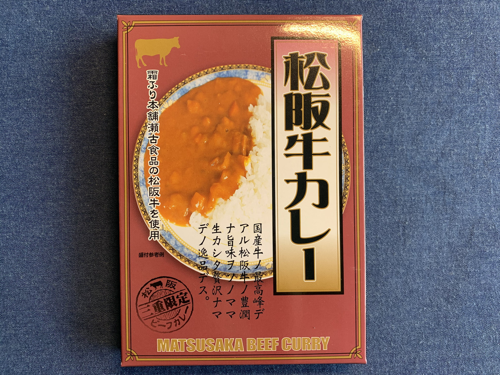
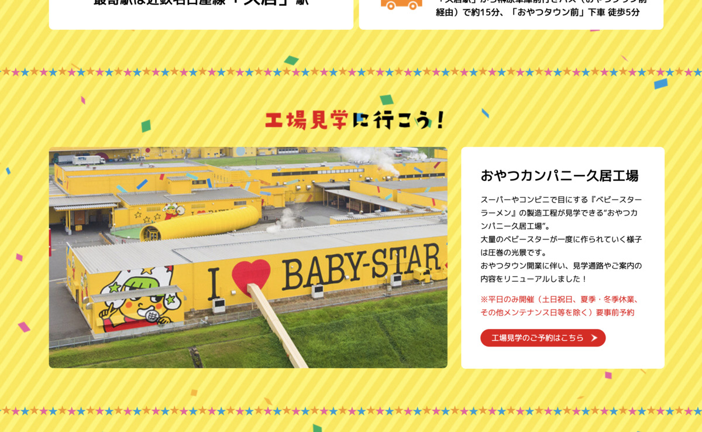
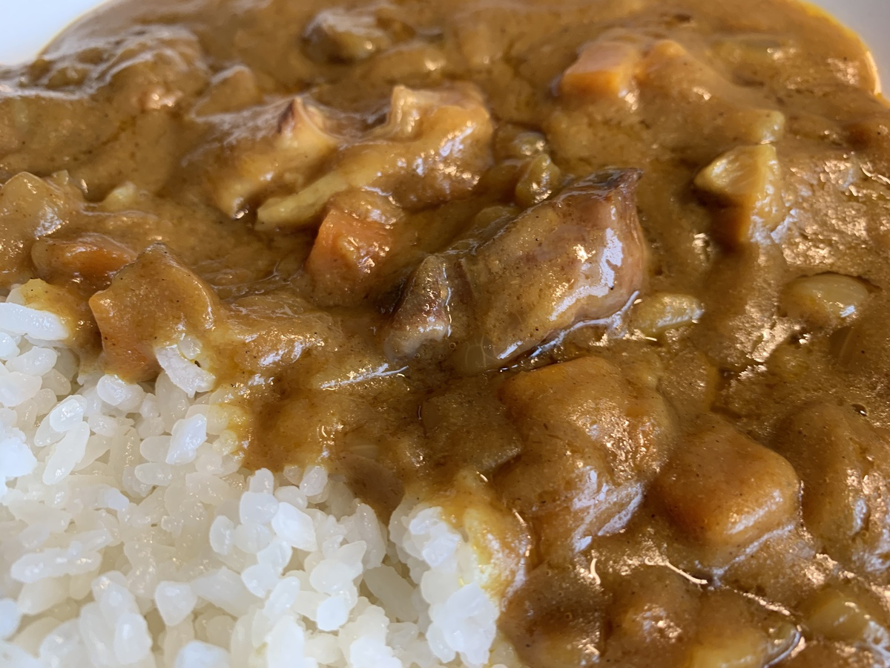

**わ〜〜〜 :tada:**

都道府県は **47つ！**

今回で **24回目！ :tada:**

つまり・・・

**半分到達ー！ :confetti_ball: :confetti_ball:**

---

きゃーきゃーおめでとー！ :clap: :clap: :clap:

わーわーありがとー！ :pray:

**ぱーん！ :fireworks: :fireworks: :fireworks:**

---

残り半分は

もうちょっと **ゆっくり食べる** んだからね？

**ふりじゃない** んだからね？？

---

記念すべき

ちょうど5合目のカレー :curry:

**こいつっ！！ :point_right:**

---

いえ〜〜〜い :car: :dash:

**三重 松阪牛カレー！**

とうとう **三重**

きちゃったぜ〜〜

**東海地方** だぜ〜〜〜 :car: :dash: :car: :dash:

表に **うんちく** 書いてあるぞ・・・？

---

> 国産牛ノ最高峰デアル松阪牛ノの豊潤ナ旨味ヲソノママ生カシタ贅沢ナマデノ逸品デス。

**片言・・・！ :thinking_face: :thinking_face: :thinking_face:**

外国人設定かな・・・？ :thinking_face:

---

恒例の〜〜〜

**バックショット** は〜〜

これっ！

**Foo! Sexy BEEF...!!! :sparkling_heart: :cow: :sparkling_heart: :cow: :sparkling_heart:**

**セクシービーフ、乱発** の予感・・・！！！

どこの都道府県も

ここぞとばかりに

**美味しい肉** を出してくる・・・！

---

だが！

しかし！！

気付いてしまった・・・！！！ :stuck_out_tongue:

**レトルトカレーの価格帯** で

**贅沢な肉** を入れるという

この **矛盾・・・！！ :angry:**

（ざわ・・・ざわ・・・）

圧倒的矛盾を・・・

**どう処理** すればいいのか・・・！

---

そう！

**個数を減らす・・・！**

それが一番 **妥当な解決策！ :angry:**

かつ！

もっと欲しいと思わせる **インパクト！ :angry:**

今回も！

それが！

求められている・・・！

**Sexy BEEF...!!! :sparkling_heart: :sparkles: :cow: :sparkles: :sparkling_heart: :sparkles: :cow: :sparkles: :sparkling_heart:**

---

**三重県！**

とある筋からの情報によると

**魔境 :cyclone:** らしいぞ？

**魔境探検** だ・・・ :paw_prints: :paw_prints:

---

**魑魅魍魎（ちみもうりょう）** ・・・！

**なにそれこわい！ :cold_sweat:**

えーどこどこ？

なんか **旧鈴鹿スカイライン**

って場所なんだって！

---

https://celebrated-road.com/tihou/kinnki/mie/5202.html

> これでもかって位に減速帯が設置されていて走っててちょっと怖いんだが

こわ・・・もうすでに魔境 :cyclone: ・・・

三重って **意外と縦長** だよね〜〜

どこがどうなってるんだろう？ :thinking_face:

---

https://twitter.com/labokkoymp/status/1267353919262355457

**あっなんとなく分かる・・・w**

そういえばあんまり南の方行ったことないなー

三重でも謎とされているのだ・・・ :evergreen_tree: :deciduous_tree:

（あっこれまた住んでる人に怒られるやつ・・・）

---

おやおや？

**三岐鉄道** ってなんじゃろな？ :mag:

（ぽちっ）

**あ〜解っちゃった〜 :v: :v:**

東海地方に少し詳しいなら

これは **解っちゃうでしょ〜 :sunglasses:**

**三重の "三"** と、 **岐阜の "岐"** でしょ〜

へへーん！

**かしこい〜〜！  :thumbsup: :thumbsup: :thumbsup:**

---

https://ja.wikipedia.org/wiki/%E4%B8%89%E5%B2%90%E9%89%84%E9%81%93%E4%B8%89%E5%B2%90%E7%B7%9A

えっ、なになに？

> 1931年7月23日に富田 - 東藤原間が開業し、同年12月23日に東藤原 - 西藤原間が延伸開業したものの、1937年に西藤原 - 関ヶ原間の免許が失効し、富田 - 西藤原間が建設されただけにとどまった。

**ど、どういうことなの・・・ :dizzy_face:**

三岐鉄道なのに、

**三重県内しか通ってない〜！ :scream: :scream: :scream:**

意味分からん〜〜〜 :innocent:

みんなも

**免許失効には気をつけようね！ :fire:**

---

https://www.mie30.jp/

で、出たー！

**いつも参考になる、観光サイトー！ :sparkles: :sparkles: :sparkles:**

こういうの、地味に大事よ・・・！ :muscle:

---

https://www.mie30.jp/eat/6690

**棒グルメ** ・・・とな？ :thinking_face:

**東紀州（ひがしきしゅう）**

さっきの **雑マップ** の

**『？？』** って

ざっくり書いてあったところだぞ！

---

旨そうだなー

**（美味しいものスイッチON！）**

他に美味しいもの

何があるんだろ〜？ :mag:

（ぽちっ）

---

https://www.oyatsu.co.jp/

**おやつカンパニー♪**

そうだった！ :open_mouth:

**ベビースターラーメン :ramen:**

おいしいよね〜 :yum:

---

むかし

車で酔ったときに

ベビースターラーメンを **1本ずつ食べて**

**酔いを我慢してた** のを

今でも思い出す・・・ :expressionless: :cyclone:

---

https://oyatsu.town/

**おやつタウン！ :candy: :house:**

最近できたんだゾ！

---

おやつタウン！

**工場見学の施設** もあるらしい・・・！ :candy: :house:

落ち着いたら **行ってみたいなあ〜 :car: :dash:**

---

そろそろ **大人向けのターン！ :sake:**

（ぽちぽちっ）

---

https://www.miyanoyuki.co.jp/kinmiya.html

**うぇ〜〜〜い :metal: :metal: :metal:**

**キンミヤ焼酎〜！ :sake: :sake:**

実はついこの前まで知らなかったんだけど

有名らしい！

**四日市の酒造メーカー** なんだって！ :sake:

---

ついでに

**超やばい飲み方**

**知っちゃった・・・！ :smiling_imp: :smiling_imp: :smiling_imp:**

---

https://www.excite.co.jp/news/article/Sirabee_20161914644/

**超神水・・・！**

**ドラゴンボール** で出てくるやつだ・・・！

**焼酎** を

**エナジードリンク！**

つまりは **魔剤** で割ったもの

**超神水** っていうらしい！

---

この前飲んでみたけど **やばーい！**

**飲みやすすぎて危険・・・ :smiling_imp: :smiling_imp: :smiling_imp:**

---

https://www.jalan.net/news/article/305182/

**カキ小屋・・・！**

**行きたい！行きたーい！ :rage:**

カキ小屋行きたいぞー！ :rage: :rage: :rage:

もう周りのことなど気にせずに

**むしゃむしゃ :yum: :yum: :yum:**

**無心でカキを貪り食いたい・・・！ :yum:**

---

**はっ！**

**妄想が無限に広がる・・・！ :anguished:**

いかんいかん・・・

**カレーブログの責務** を

果たさねば・・・

---

やっぱこの辺かなー？

**かしこじま！ :smiley:**

なんかもう

これ見てるだけで

**島要素** が色々ありそう・・・！ :eyes:

---

ちなみに

つい2016年にやってた

**伊勢志摩サミット開催の地 :tophat: :tophat:**

だぞ！

---

**おお〜すばらすぃ〜〜！ :sparkles: :star2: :sparkles: :star2:**

**賢島大橋** を眺める

この **ロケーション・・・！**

ここでカレーを :curry:

**食うぞー！ :fork_and_knife: :yum:**

---

## 実食

**まいかいながーい！**

でも **長いのが定番**

になりつつあって

**危険・・・！ :smiling_imp: :smiling_imp: :smiling_imp:**

---

**じゃん！ :tada:**

**三重 松阪牛カレーの出来上がりー！ :confetti_ball:**

---

**おお〜〜〜 :satisfied:**

**スタンダード** な感じがして

**いいね〜〜〜！ :+1: :+1: :+1:**

---

**旨そう！ウマソウ！ :yum:**

**UMASOU...!!! :yum: :yum: :yum:**

---

早くたべましょー！ :yum:

**生産者に感謝してー！ :pray:**

**いただきまーす！ :pray: :pray: :pray:**

---

（パクッ）

---

**むぐっ・・・！ :satisfied:**

---

（パクッ）

（パクッ）

---

**うまいうまーい〜〜〜！！！ :satisfied: :satisfied: :satisfied:**

---

コクがあって濃厚！あとで辛みがじんわりくる重厚感のあるカレー！
まだだけど・・・！まだだけど・・・！ホアジャオに絶対合うやつー！

ペースト感あってうまい、ガッツリ食った感を感じられて良い〜、お肉も程よい歯応えと柔らかさでうまいー！

---

さあて？

そろそろ？

**せんせー** の？

出番ですよね・・・？

---

**ホア〜〜〜〜〜**

---

**ジャオ〜〜〜〜〜！！！**

---

**ババーン！ :star2: :star2: :star2:**

**！？！？！？ :thinking_face: :thinking_face: :thinking_face:**

---

はっ！なんと！

もう **こんなに力を使ってしまった** のか・・・！

**手強いやつらばかりじゃあ・・・！ :persevere:**

---

（ﾌﾘﾌﾘﾌﾘﾌﾘﾌﾘﾌﾘﾌﾘﾌﾘ...）

**ﾊｧｯﾊｧｯ... ﾃｺﾞﾜｲ...!**

（ﾌﾘﾌﾘﾌﾘﾌﾘﾌﾘﾌﾘﾌﾘﾌﾘ...）

**ｺﾝｶｲﾉ... ﾃｷﾓ... ﾃｺﾞﾜｲｼﾞｬｵ...!!**

（ﾌﾘﾌﾘﾌﾘﾌﾘﾌﾘﾌﾘﾌﾘﾌﾘ...）

**ﾊｯﾋﾟｰﾊﾟｳﾀﾞｰ...!!! :innocent: :innocent: :innocent:**

---

**三重 松阪牛カレー**

**おいしゅうございました！ :pray: :pray: :pray:**
