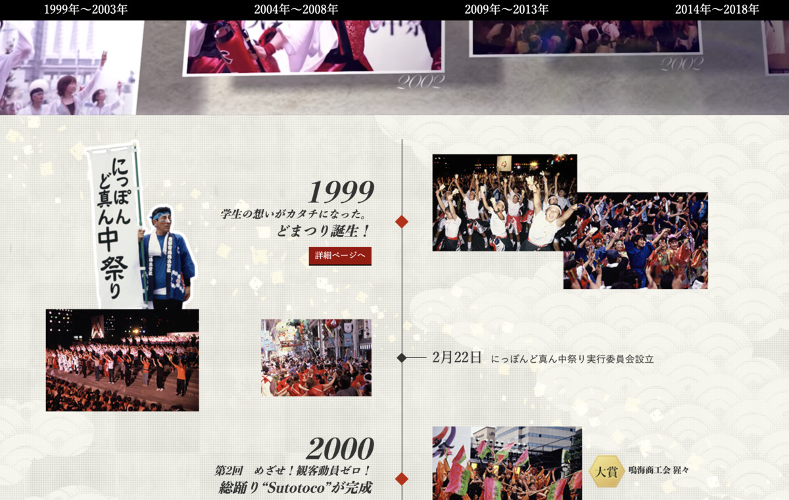
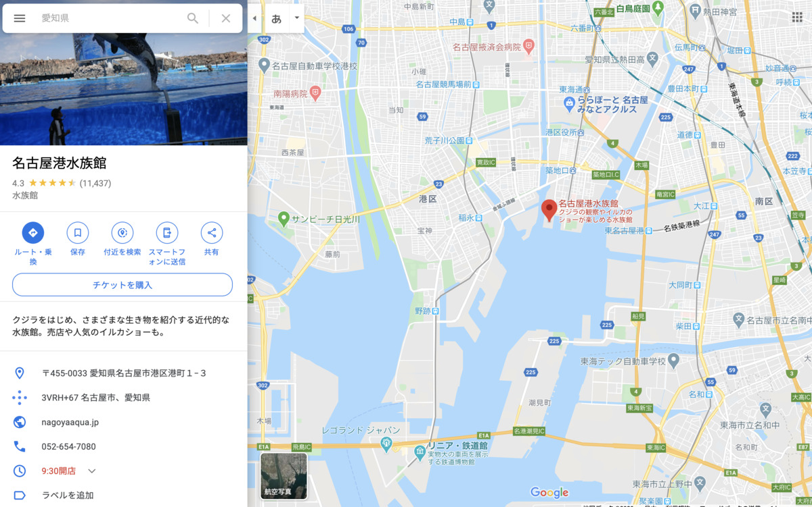

https://twicolle-plus.com/articles/358201

**やはり名古屋は・・・**

**全体的に なんとなく・・・**

**雑・・・！**

---

今日は **雑なところ** を

**雑にお届け** するぞ・・・！ :neutral_face:

---

紹介も雑！これ！ :neutral_face:

**愛知 名古屋コーチンカレー！ :tada:**

**うぇ〜〜〜い :metal:**

---

バックショットこれ！

**Sexy Chicken...!!! :sparkling_heart: :chicken: :sparkling_heart: :chicken: :sparkling_heart:**

**うぇ〜〜〜い :metal: :metal:**

---

だが、 **生産者さん** には雑じゃなく

**きちんと感謝！！ :pray: :pray:**

ありがたや〜〜〜 :pray:

ありがたや〜〜〜 :pray:

---

**名古屋コーチン** なんじゃろな？？ :thinking_face:

**日本三大地鶏** 、の1つなんだって！ :sunglasses:

**すごーい！ :heartbeat: :heartbeat: :heartbeat:**

---

https://www.cookdoor.jp/family-restaurant/dictionary/13674_resta_065/

なるほどなるほど〜？ :thinking_face:

> 秋田県の比内地鶏、愛知県の名古屋コーチン、鹿児島県エリアの薩摩地鶏を日本三大地鶏と公式に呼ばれています。

だって〜！

**へえ〜〜〜 :hatching_chick: :hatching_chick: :hatching_chick:**

秋田はまだ食べてないし、鹿児島は神話豚だったから、薩摩地鶏食べてないなー！

こりゃ〜〜〜、どっかで食べなきゃだ！

**現地で食べなきゃ** だ！

**チキン祭り、開催の予感・・・！ :chicken:**

---

**愛知のご当地謎CMのコーナー！ :movie_camera:**

（ぽちっ）

http://www.aichisev.co.jp/

あああ〜〜〜

**やばそう・・・！**

CM がやばいやつ・・・！ :dizzy_face: :dizzy_face: :dizzy_face:

---

https://www.youtube.com/watch?v=pup7bYe4dJo

**ひゃああああ！ :scream: :scream: :scream:**

これは危険・・・！

**「愛知小型エレベーター」**

ってフレーズを相手に言わせるだけで、

**愛知県県民** かどうか分かっちゃうんだって！

**怖い！ :dizzy_face:**

---

**愛知県民に偽装** するときは

**みんなこのフレーズを覚えよう！ :v:**

これで君も立派な愛知県民だ！ :sunglasses:

---

**名古屋のことを知りたい** ときは〜

ここだー！ :mag:

（ぽちっ）

---

https://jouhou.nagoya/

**名古屋情報通！ :sparkles: :sparkles: :sparkles:**

名古屋の **うまいもん情報** が

**勝手に流れてくるゾ！ :star2: :yum: :star2:**

---

おっなんだこの情報は〜？？ :mag:

調査だ調査だー！ :rage: :rage: :rage:

---

https://jouhou.nagoya/umino-dia/

なにこれー :thinking_face:

**劇場居酒屋** だって！ :astonished:

---

わー！ :dizzy:

**一瞬地雷 :bomb: かと** 思ったけど！

**旨そう！ウマソウ！ :yum:**

**UMASOU...!!! :yum: :yum:**

すごい、 **23時から夜定食** とかやってるんですって！

**素敵・・・！ :two_hearts: :two_hearts:**

---

**名古屋に旅行** にきたとき

**到着が深夜になっても安心だね！ :bulb:**

---

・

・

・

**名古屋に・・・**

**旅行・・・？？？ :thinking_face: :thinking_face:**

---

https://rocketnews24.com/2016/07/07/771311/

名古屋、 **何もない・・・！！（2016年）**

---

https://rocketnews24.com/2018/09/06/1112642/

名古屋、 **何もない・・・！！（2018年）**

**うぇ〜〜〜い :metal: :metal:**

**うぇ〜〜〜い :metal: :metal:**

2連覇だぜ〜〜〜 :v:

**圧倒的だぜ〜〜〜 :muscle: :muscle: :muscle:**

---

だが・・・

**逆に考えるんだ・・・！ :two_men_holding_hands:**

**地価もそこまで高くなく、**

**日本のど真ん中** にあるってことは

**日本全国どこでも旅行しやすい場所 :car: :ferry: :rocket:**

だということに・・・！ :bulb: :bulb: :bulb:

---

https://www.japan-mfg.jp/content/dam/sitebuilder/rxjp/mfg-japan/documents/2018/jp/MONON18_News_Releas_0409.pdf

**日本のど真ん中ですよ、ど真ん中！**

ど真ん中に行くのではなく

**ど真ん中を拠点にする生活！**

**最高じゃないか！ :sparkles: :sparkles: :sparkles:**

---

そうそう

**ど真ん中** といえば・・・

---

https://www.domatsuri.com/overview/

**日本ど真ん中まつり！ :izakaya_lantern:**

やばい！

**ど真ん中** であることを

すでに **既成事実化** してる・・・！

**なんておそろしい子・・・！ :smiling_imp:**

---

https://www.domatsuri.com/overview/trajectory/

へーすごーい！

結構 **若いお祭り** なのね :baby:

1999年に学生さんが始めたものが

もう今や **200万人集めるお祭り** :star2:

なんだって・・・ :tada: :tada: :tada:

**スゴスギ・・・ :muscle:**

---

お祭りじゃ

**お腹膨れないぞ！ :rage: :rage: :rage:**

美味いもん・・・！

**美味いもんはいずこに・・・！ :yum:**

（ぽちぽちぽちー）

---

https://www.manchinken.com/menu/

**どん！ :boom:**

**まんちんけーん！ :kissing_cat:**

http://www.umaya.co.jp/

**どどん！ :boom:**

**うまやー！ :kissing_cat:**

https://www.sugakiya.co.jp/

**どどどん！ :boom:**

**すがきやー！ :kissing_cat:**

・

・

・

って、ラーメンばっかじゃないかーい！ :ramen:

**ノンノンノン！**

**すがきやはラーメンではなくすがきや・・・！**

**へりくつ・・・ :smiling_imp:**

---

https://www.yamachan.co.jp/

**どどどどん！ :boom:**

**山ちゃんー！**

---

http://www.kimoya.jp/

**どどどどどん！ :boom:**

**きもやー！**

・

・

・

なんだと？

**肝屋を・・・知らない・・・？ :thinking_face:**

---

**説明しよう！ :person_with_blond_hair: (ｷﾘｯ)**

**肝屋とは、つまり肝だらけで**

**コロッケさえも肝でできている**

**肝料理専門店なのだ・・・！ :yum: :yum: :yum:**

---

**:zzz: :zzz: :zzz:**

はっ！！

**妄想グルメ旅は危険すぎる・・・！ :smiling_imp: :smiling_imp: :smiling_imp:**

そういえば **カレーブログ :curry:** だった・・・

さてさて〜？

---

**どこで食べましょうかね〜？？ :mag:**

---

やはりここは・・・

**名古屋港水族館**

なんていいんじゃないでしょうか！ :star2:

---

おおー！！

全面ガラスでイルカ達を

潜ってるところから見れるやつ〜〜（語彙力〜）

**イルカ見ながらカレーだ！ :fork_and_knife: :yum: :+1:**

---

## 実食

**雑！ながーい！**

---

これが

**愛知 名古屋コーチンカレー！**

の **完成形ー！ :tada: :tada: :tada:**

わーいやったー :curry:

---

おお〜 **ねっとり系だ・・・！**

**旨そう！ :yum:**

---

うわあああ〜〜〜！ :tired_face: :tired_face:

もう **我慢できないぞー！ :rage:**

**いただきまーす！ :pray: :pray: :pray:**

---

（パクッ）

---

**ほふっ・・・！ :satisfied:**

---

（パクッ）

（パクッ）

---

**うまいうまーい〜〜〜！！！ :satisfied: :satisfied: :satisfied:**

---

あっ、甘くない・・・！

甘口辛口の甘くないという意味じゃなく、ビター？な感じのカレーだ

名古屋コーチンの個性すごい、ホクホクで鶏肉感あって適度な歯応えもあってうまい！
けっこうカレーソースがプルンプルン！

---

**ドン！**

（ﾌﾘﾌﾘﾌﾘﾌﾘﾌﾘﾌﾘﾌﾘﾌﾘ...）

**・・・雑！ :innocent:**

---

・

・

・

---

**やはり名古屋は・・・**

**全体的に なんとなく・・・**

**雑・・・！**

---

**愛知 名古屋コーチンカレー**

**おいしゅうございました！ :pray: :pray: :pray:**
