おやおやおやー？

今回、 **岐阜県** が来ると思ったあなたー？ :thinking_face:

ざんねーん！

**静岡でしたー！ :sunglasses:**

---

なぜ **三重、愛知** と来て、 **岐阜** じゃないのかって？

ふっふっふ :sunglasses:

もう半分食べたのだから

そろそろ **法則性 :game_die:** に

気づいてもいいはず・・・

---

気分で南から :palm_tree:

食べてるわけじゃないぞ？ :surfer:

---

さあ！

今日は **さわやか県！ :sparkles: :sparkles: :sparkles:**

じゃなかった！

**しずおか県！**

---

今日の **カレー** どん！ :curry:

---

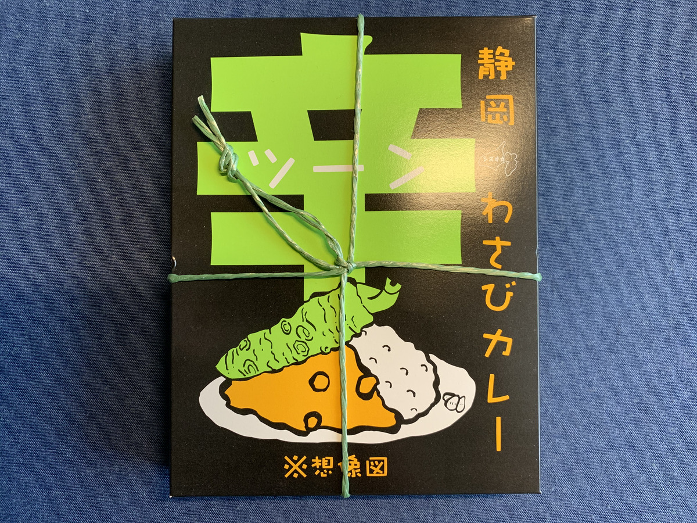

おお〜

チャレンジャーなのきたー！

**静岡 わさびカレー！ :fire: :fire: :fire:**

これやばくないです？？？  :raised_hands: :raised_hands:

**ツーン！ :fire:**

---

早々にバックショット :high_heel:

**Here! :point_right:**

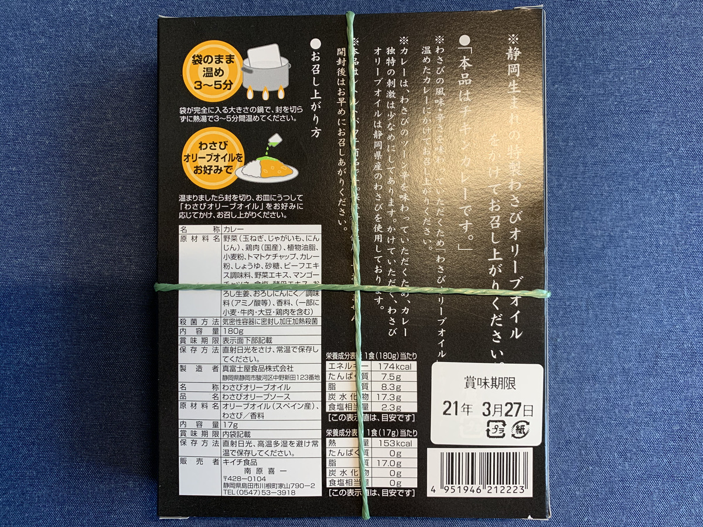

**Sexy hot...!!! :sparkling_heart: :nose: :sparkling_heart: :nose: :sparkling_heart:**

---

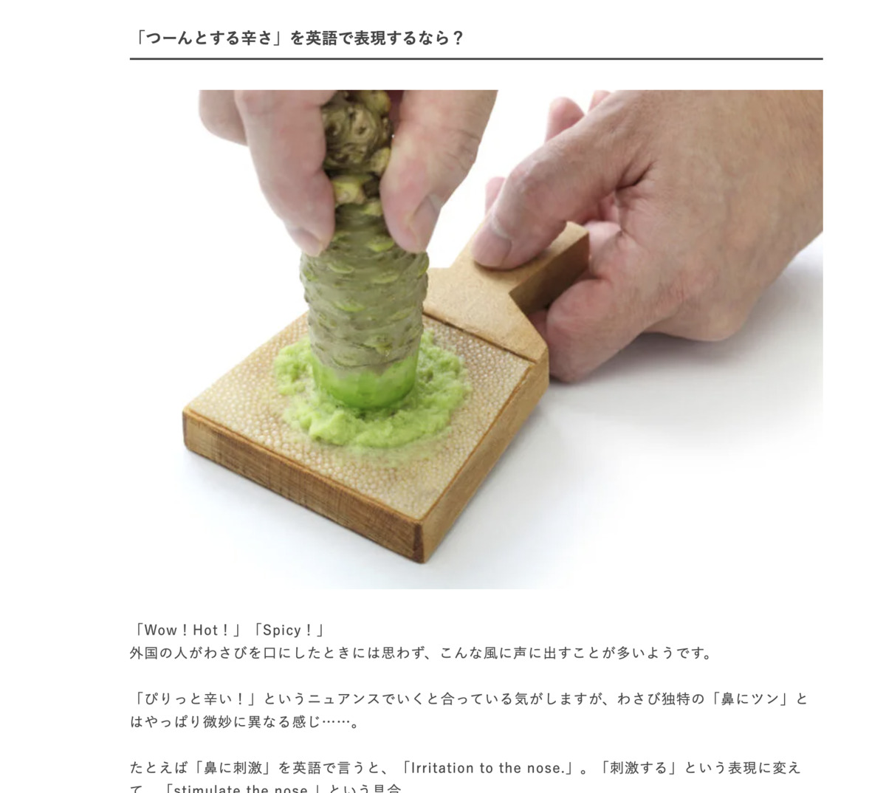

https://macaro-ni.jp/35559?page=2

どうでもいいけど

わさびの **ツーンとした辛さ**

**Hot!** って表現するらしいゾ！

---

さてさて、もうちょっと

**バックショット :sparkles:** 眺めようぜ！

---

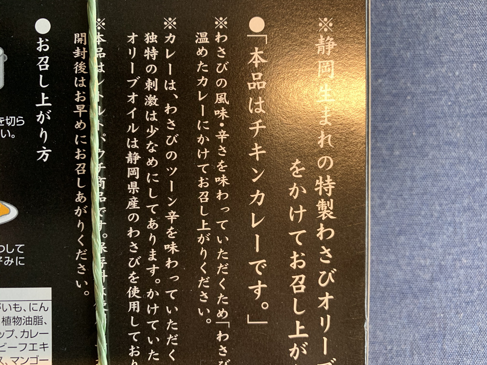

**むむむ？ :thinking_face: :thinking_face: :thinking_face:**

> 本品はチキンカレーです。

わさびカレーだと思っていたら

**チキンカレーだったでござる！ :chicken: :chicken:**

**コココココ :chicken:**

**コケーコココ・・・！ :chicken:**

---

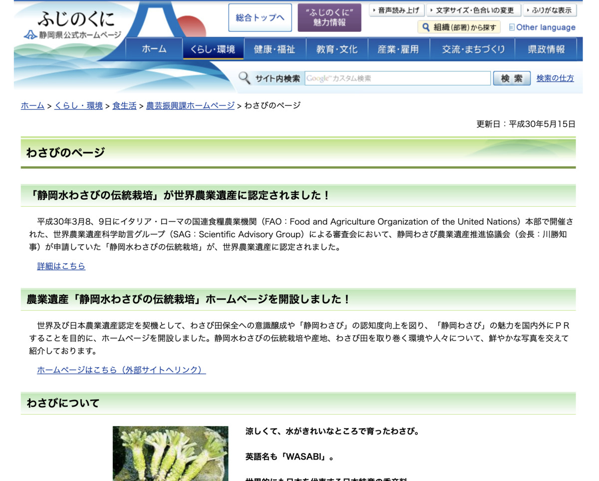

http://www.pref.shizuoka.jp/sangyou/sa-360/wasabi/wa01.html

**公式** だ！静岡からのお知らせだ！

どうやら **静岡水わさびの伝統栽培** は

**世界農業遺産** らしいぞ！ :trophy:

**わー！ :tada: :tada: :tada:**

---

さすが **さわやか！ :sparkles: :sparkles: :sparkles:**

えっ？

**さわやか** ってなんだって？

もしかして **さわやか** をご存知ない？

---

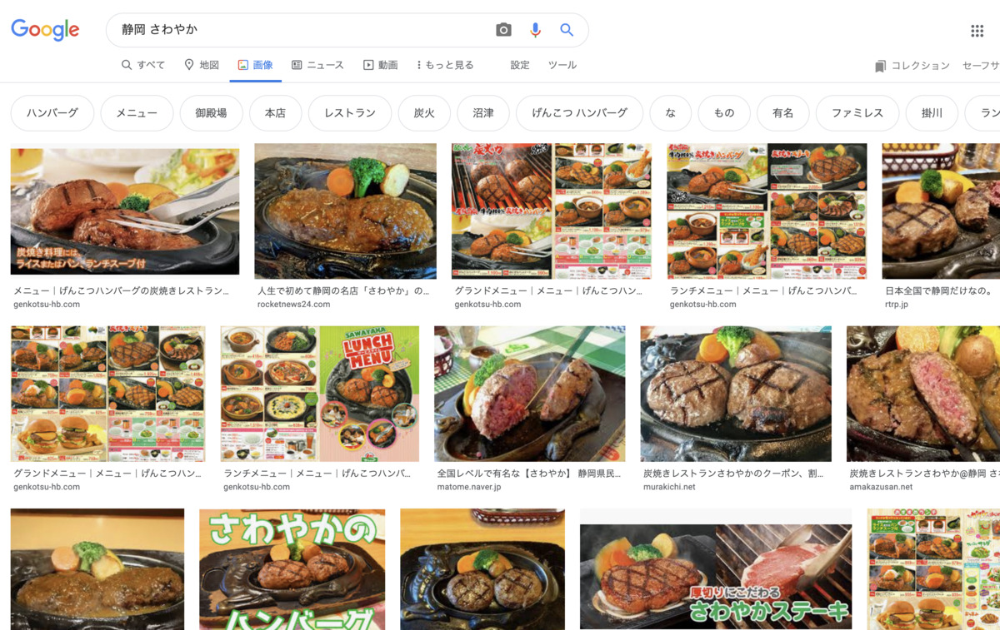

**さわやか** は

静岡県民が誇る

静岡にしかない

**げんこつハンバーグ :muscle: :meat_on_bone:**

のお店だゾ！ :muscle:

---

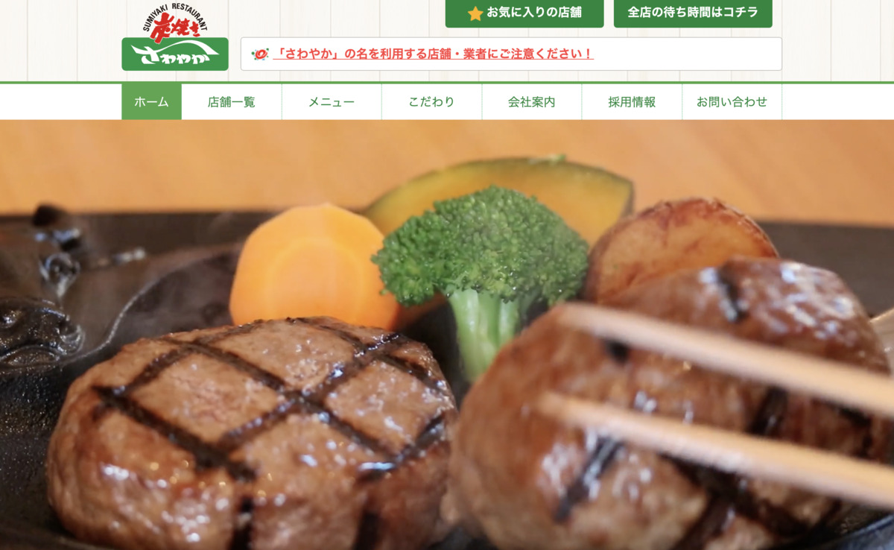

https://www.genkotsu-hb.com/

どーん！

**さわやかー :sparkles: :sparkles: :sparkles:**

---

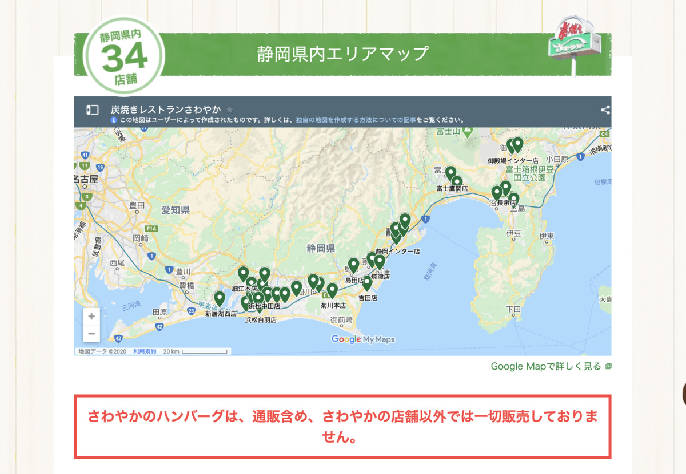

**さわやか :sparkles: :sparkles: :sparkles:**

**本当に静岡にしかない・・・！ :sob:**

（ **あとちょっとで愛知県** なのに・・・！）

独占禁止法だぞ！ :rage:

**ぷんぷん！ :rage: :rage: :rage:**

---

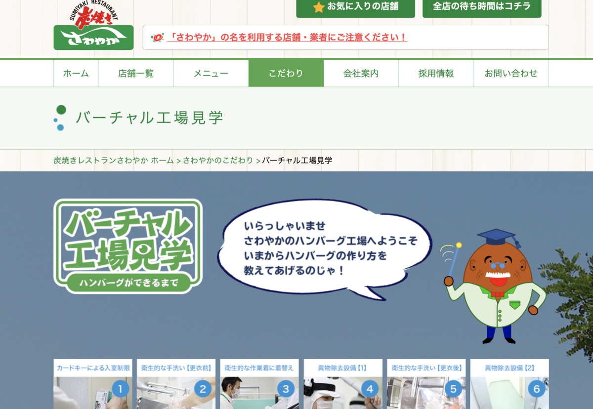

https://www.genkotsu-hb.com/professhonal/virtual/

**うぇーい！ :metal: :metal:**

**さわやかバーチャル工場見学〜 :sparkles:**

こういうの

しゅき〜〜 :heart_eyes_cat: :heart_eyes_cat: :heart_eyes_cat:

---

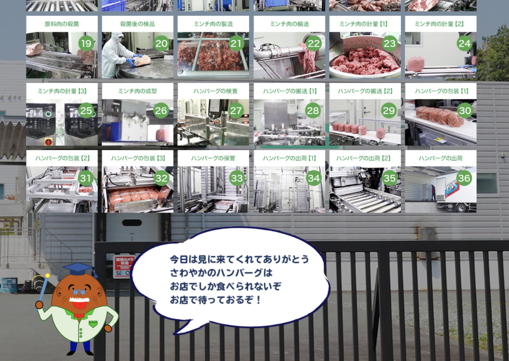

・・・

にしては、 **動画コンテンツ多すぎぃ〜！**

36番まである・・・ :eyes:

それだけ **こだわりがある**

ってことなんだよう！ :trophy:

---

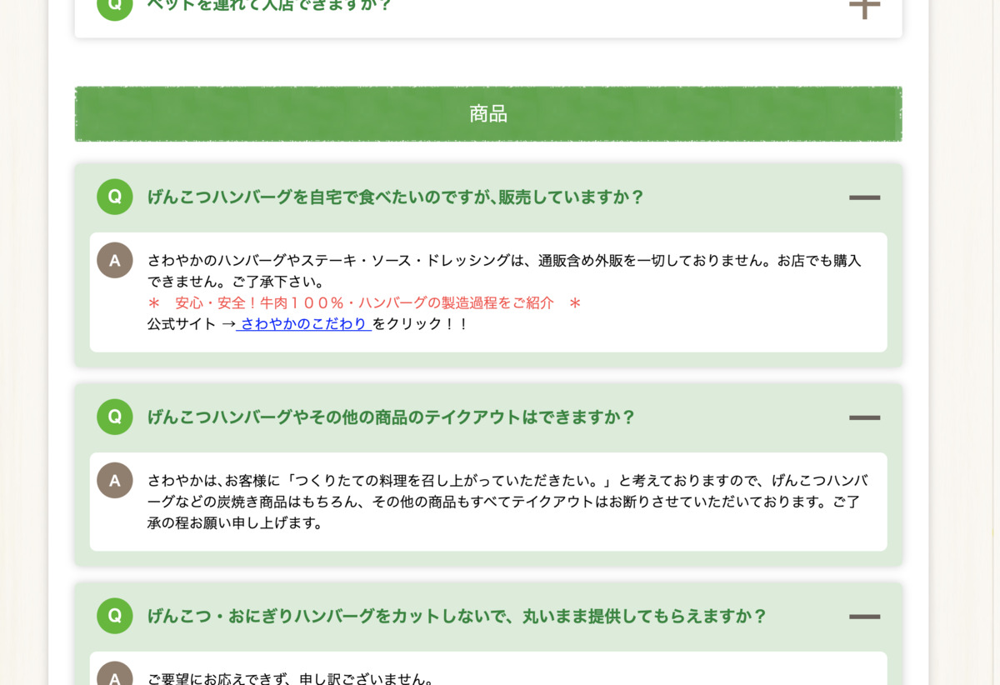

さわやか :sparkles: :sparkles: :sparkles:

> 自宅で食べたいのですが

**:no_good: :no_good: :no_good:**

> 商品のテイクアウトはできますか？

**:no_good: :no_good: :no_good:**

**絶対に静岡の店舗内以外では売らないマン！**

徹底してる・・・！

**絶対に死守！ :cop: :cop: :cop:**

これはもう現地で食べるしか・・・！ :yum:

---

おっ、なんやこれ？

（ぽちっ）

---

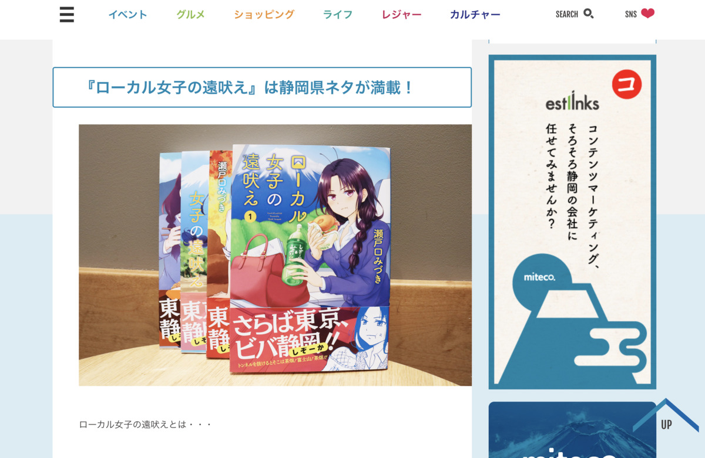

https://estlinks.co.jp/miteco/culture/17189/

**静岡のご当地漫画** っぽい！

**ローカル女子の遠吠え** 、だって :eyes: :eyes:

タイトルからは **静岡成分** を感じないな・・・ :thinking_face:

---

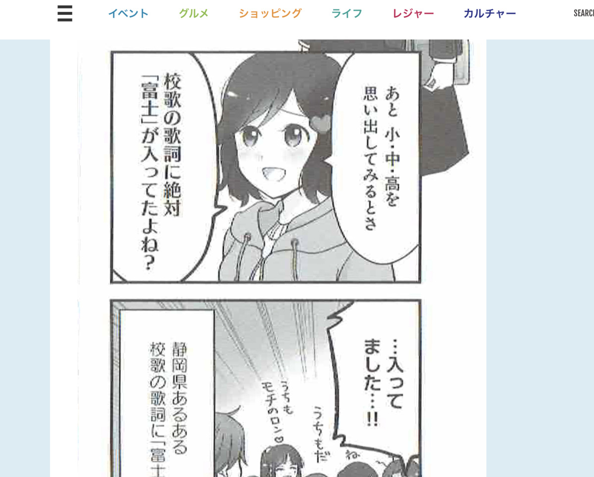

あ〜〜〜 :blush:

**静岡っぽいw :sweat_smile:**

**静岡県民と、山梨県民に**

富士山を汚すような発言をしたら

**敵意を向けられる** ので気をつけよう・・・ :sweat:

---

どっちがどうとかっていうのも

**危険だぞ！ :imp: :imp: :imp:**

---

そろそろ

**うまいもん :yum:**

**食べたくないですか？ :fork_and_knife:**

（脱線のターン :mountain_railway:）

---

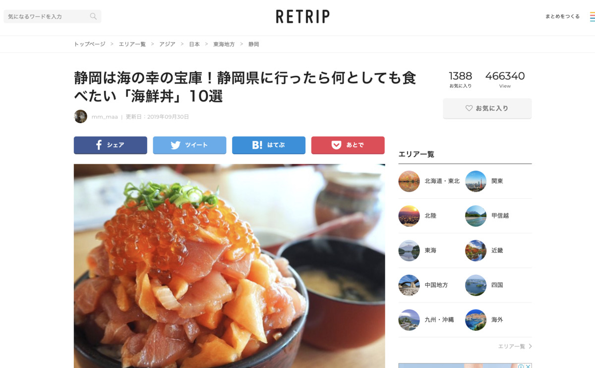

https://rtrp.jp/articles/15148/

**静岡の海の幸〜！**

**いぇ〜〜〜い！ :mount_fuji: :mount_fuji: :mount_fuji:**

もうすでに **やばーい！ :yum: :innocent:**

---

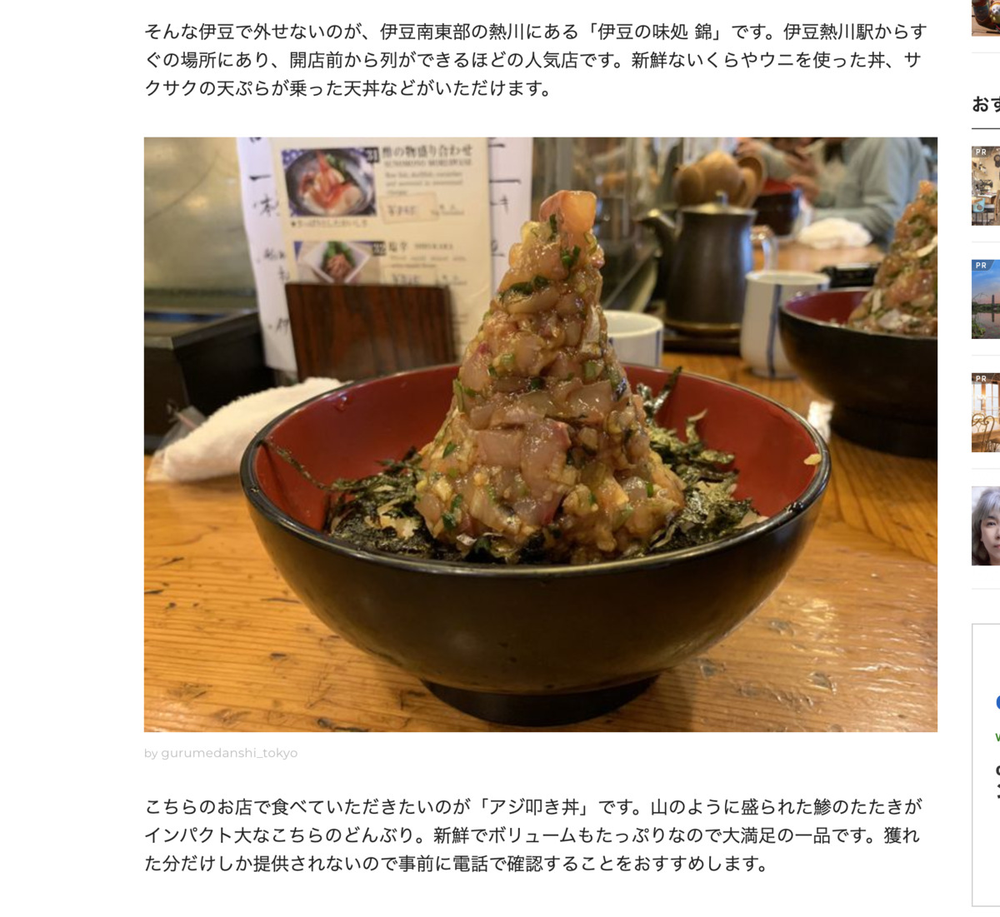

**ひゃああああ〜〜〜 :innocent: :+1:**

これこそ現地でしか食えないやつ〜〜

うまいやつ〜〜〜 :yum:

**うまいやつ〜〜〜 :yum: :yum:**

**食べたいやつ〜〜〜 :yum: :yum: :yum:**

このアジの山盛り

**やばくないですか？？？ :rotating_light:**

---

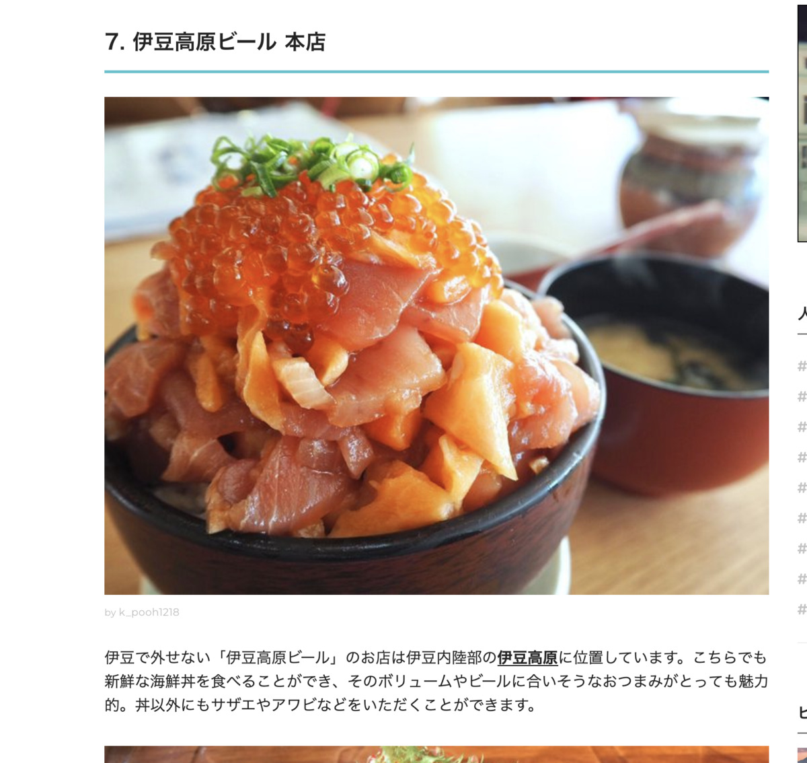

**こっちもやばーい！ :yum:**

・・・

**ん？ :thinking_face:**

**伊豆高原ビール？ :thinking_face: :thinking_face:**

---

**伊豆高原ビール** 、なんじゃろな〜？ :thinking_face:

（ぽちぽち〜っ）

---

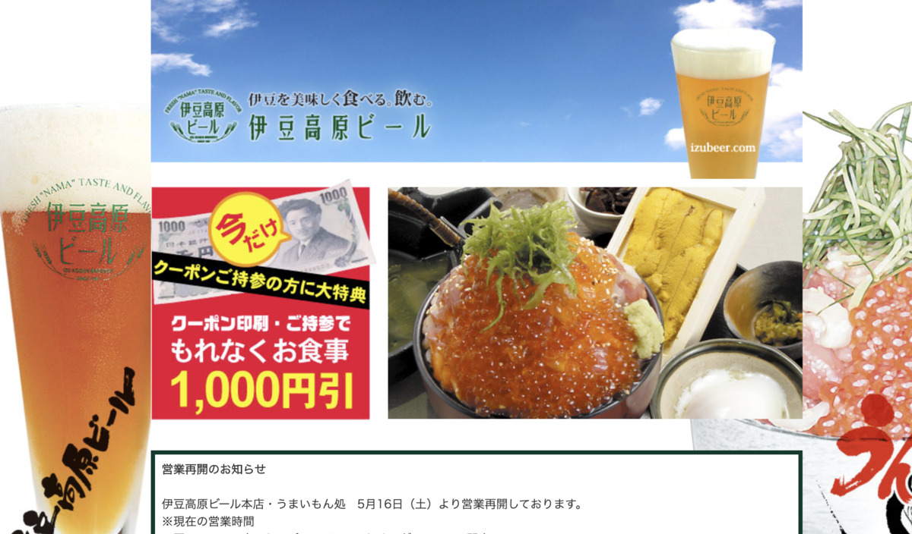

https://www.izubeer.com/

**美味しいフラグ** きたー！

**伊豆高原ビール！**

**メモメモ・・・ :memo: :memo: :memo:**

っていうかドメイン

**伊豆 beer :beer: ドットコムきたー！ :muscle: :muscle:**

ひゅう〜 :beers:

**ひゅう〜ひゅう〜 :beers: :beers:**

---

あ〜〜〜これやばい

お店の名前が、 **うまいもん処**

こんなん絶対うまいやつやん〜〜  :rotating_light: :rotating_light: :rotating_light:

---

・

・

・

---

はっ！

いけない！ :fish:

**伊豆高原のグルメ** を :fork_and_knife:

探しまくるところだった！ :runner: :runner: :runner:

**妄想旅、危険だ〜〜〜 :smiling_imp: :smiling_imp: :smiling_imp:**

---

カレー！ :curry:

しかも **わさびカレー！ :fire: :curry:**

食べる場所！ **探さなきゃ！ :mag:**

---

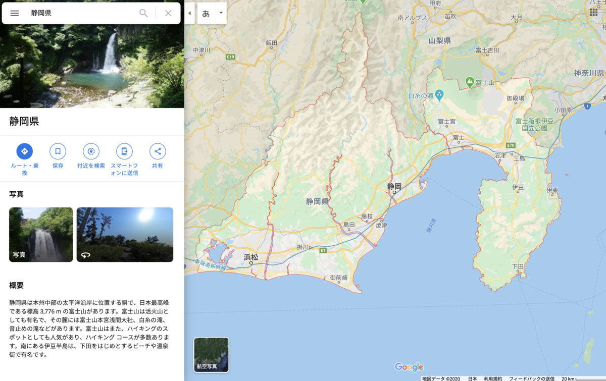

さわやか！ :sparkles:

じゃなかった、 **静岡！ :sparkles: :sparkles:**

**横に長い** よね〜〜

**どこで食べよう〜〜？ :thinking_face: :thinking_face: :thinking_face:**

---

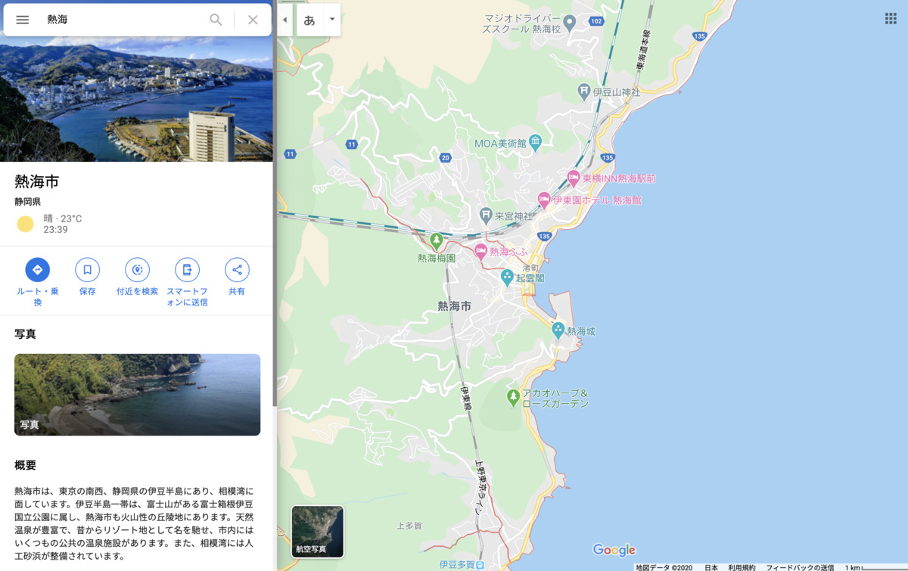

あ〜〜〜

**熱海** なんかいいかもしれないね〜〜

最近、また **観光客**

増えつつあるらしいよ？ :family: :family:

観光、頑張ってるのかな？？

---

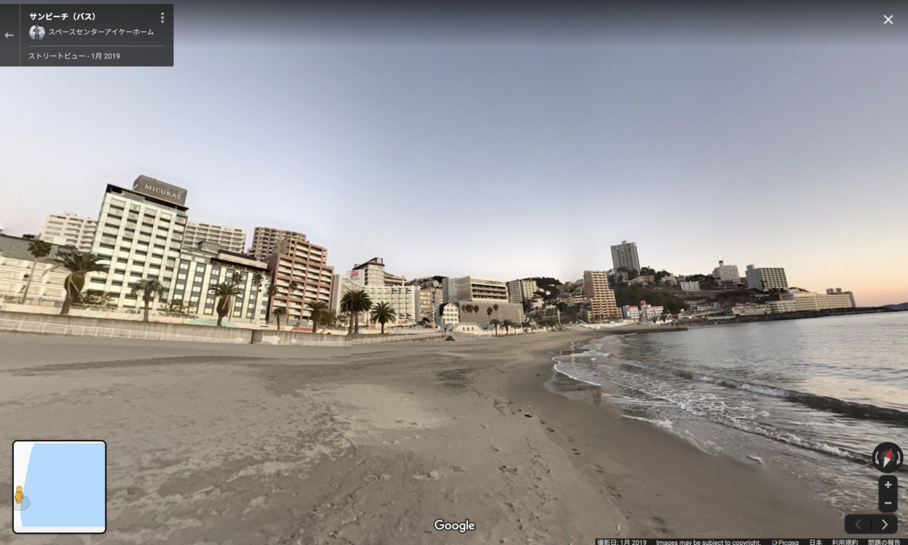

**おお〜〜 :smiley:**

**熱海っぽさ〜〜 :star2: :star2: :star2:**

ここにしよう！

---

## 実食

**横にながい！**

じゃなかった、カレー食うまでが長い！

---

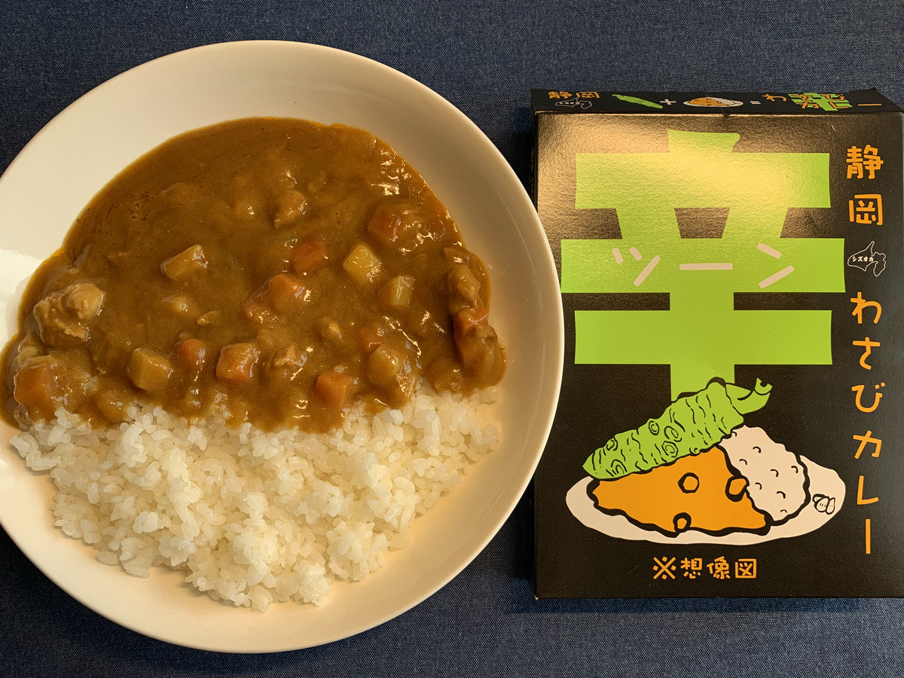

**ばばーん！ :tada:**

**わさびカレー！**

・・・

と思ったが？？

---

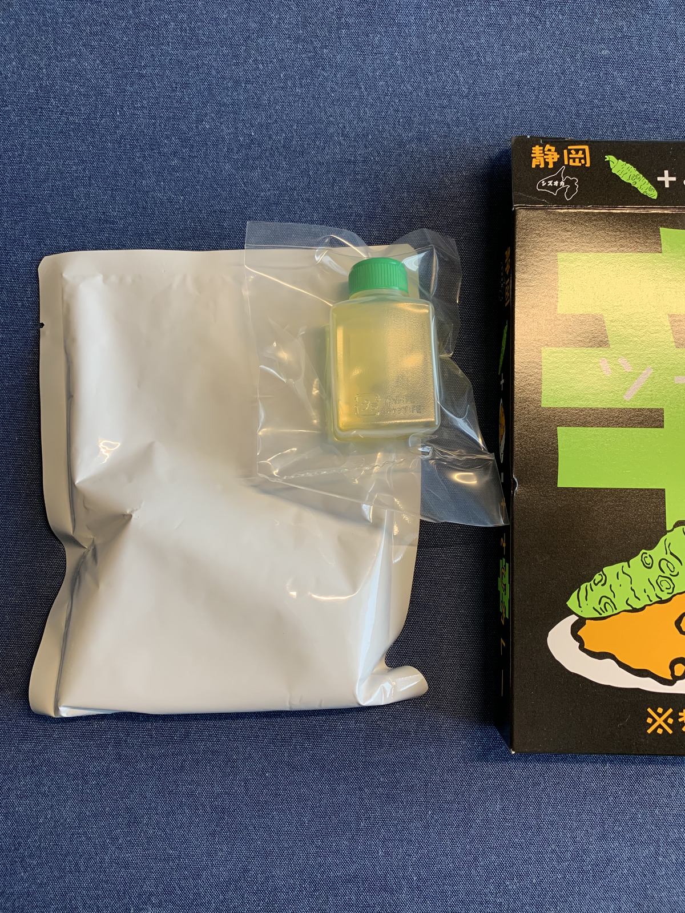

作る前に **付属品に気づいたー！**

なんじゃこれー？？？ :thinking_face:

---

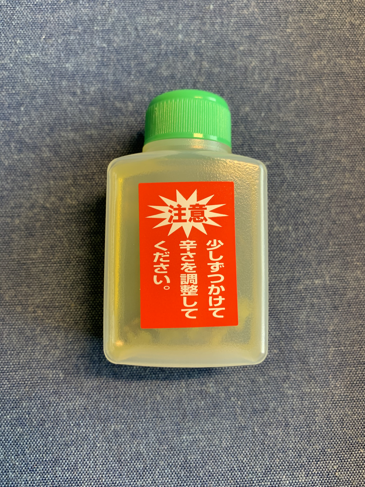

なるほど！

こっちが **わさび成分** らしいぞ！

---

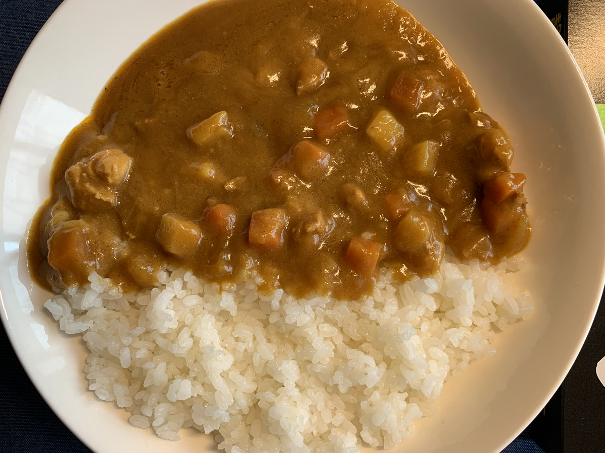

これだけでも **普通に旨そう！ :yum:**

**旨そう** なのだが・・・！

---

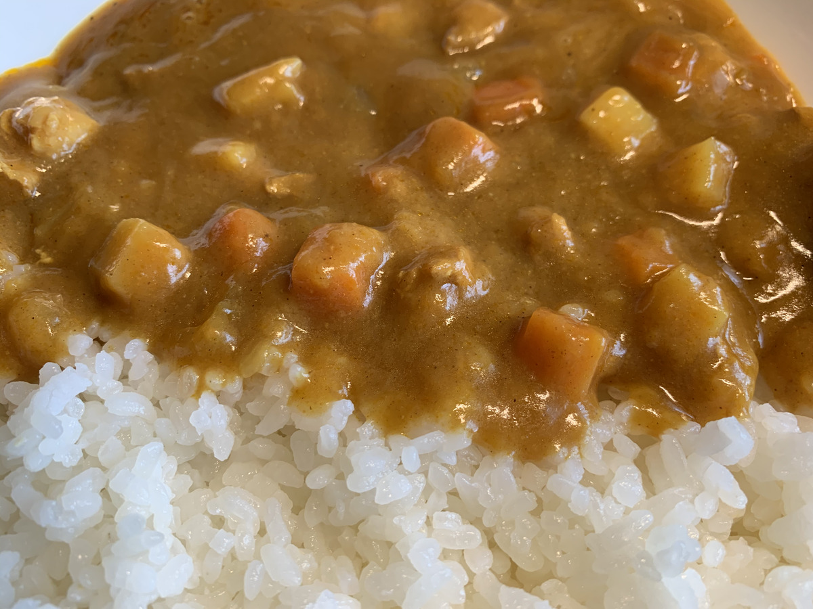

ここに・・・！

**Japanese Spice** を・・・！

最初から投入してしまう・・・！

**罪悪感・・・！ :innocent:**

---

**説明しよう！ :person_with_blond_hair: (ｷﾘｯ)**

今まで

**ホアジャオせんせー :innocent:**

を始めとした香辛料

ちゃんと **半分食べてから入れる**

という **ルールを自らに課してきたのだ！ :cop:**

---

なんという **罪悪感** ・・・っ！ :dizzy_face:

まだ・・・

（ｼﾞｬﾊﾞｼﾞｬﾊﾞｼﾞｬﾊﾞｼﾞｬﾊﾞｼﾞｬﾊﾞｼﾞｬﾊﾞ...）

**食べていないのに・・・！ :dizzy_face: :dizzy_face:**

（ｼﾞｬﾊﾞｼﾞｬﾊﾞｼﾞｬﾊﾞｼﾞｬﾊﾞｼﾞｬﾊﾞｼﾞｬﾊﾞ...）

**振りかけてしまうとは・・・！！ :innocent:**

（ｼﾞｬﾊﾞｼﾞｬﾊﾞｼﾞｬﾊﾞｼﾞｬﾊﾞｼﾞｬﾊﾞｼﾞｬﾊﾞ...）

---

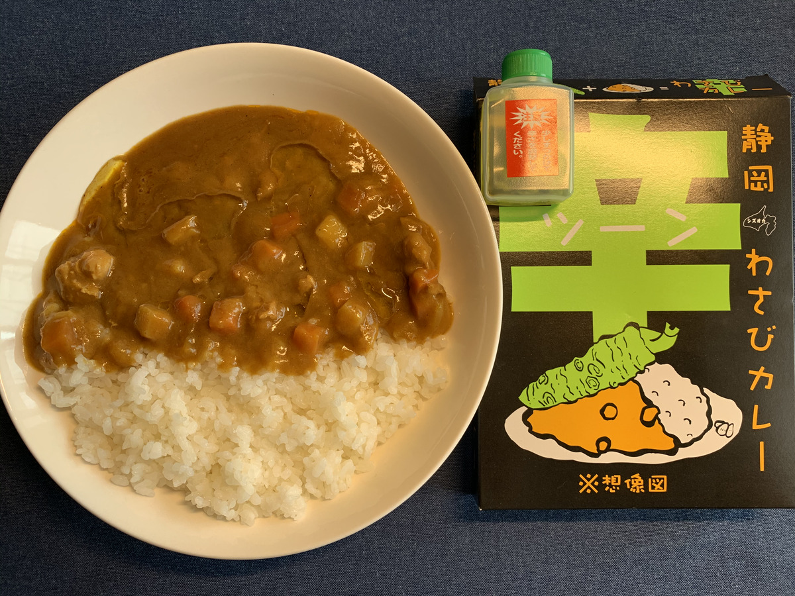

**本当の完成・・・！ :tada:**

---

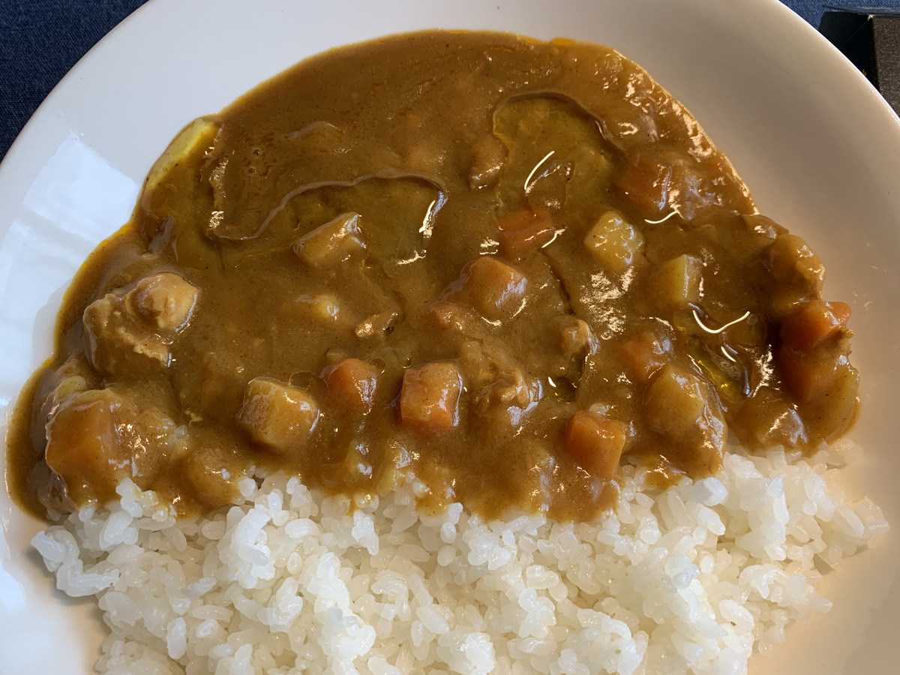

**ぐっ・・・！ :tired_face:**

罪悪感をとても感じるが・・・！

これが **生産者の意図するところ** ではある・・・！

**感謝して食べよう・・・！ :pray:**

---

**それでは、いただきます！ :pray:**

---

（パクッ）

---

**ツーン・・・！ :flushed:**

---

（パクッ）

（パクッ）

---

**くはーうまーい〜〜〜！！！ :satisfied: :satisfied: :satisfied:**

---

わさびの辛さとカレーの辛さで独特の風味・・・これをなんと表現したら良いのか、うん、わさびだな！
チキンカレーかどうかはあまり感じとることが難しいが、辛さの種類を楽しむカレーかもしれない・・・！

チキンや他の具材も小さめに用意されていて、あくまで主役はカレールーって感じだ、わさびカレー、チャレンジャーがチャレンジ成功だ！

---

・

・

・

---

ホアジャオせんせー **「わしの出番は・・・？」**

---

**静岡 わさびカレー！**

**おいしゅうございました！ :pray: :pray: :pray:**
