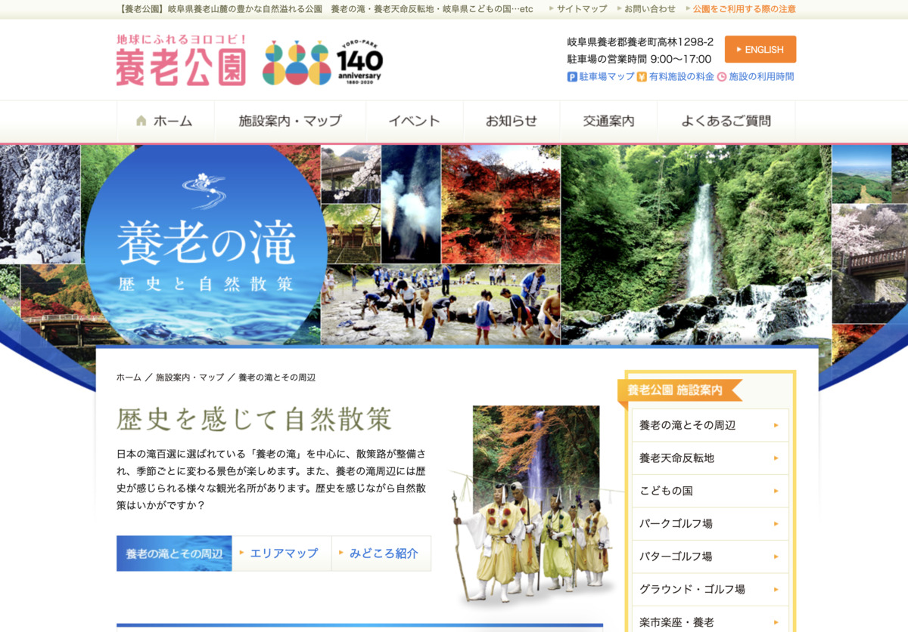

> なんかカレーを食うという良い思いをした罰として、ブログを書かされている、みたいな流れになってきててよくないw

**罰ゲームじゃないゾ！ :no_good: :no_good:**

決して！

**罰で書いてるわけじゃないのだゾ！ :neutral_face:**

---

今日のカレーはこれ！

**パンパカパーン！ :confetti_ball: :confetti_ball:**

---

**岐阜 飛騨牛ビーフカレー！ :tada:**

やったー！

**飛騨牛** のカレーきたぞー :muscle: :muscle: :muscle:

---

ひだぎゅー :cow:

ぎゅうぎゅぎゅうー！ :cow: :cow:

**ひだぎゅー :cow:**

**ぎゅうぎゅぎゅうー！ :cow: :cow:**

---

バックショットは〜〜〜 :bust_in_silhouette:

---

**Yeah! Sexy beef...!!! :sparkling_heart: :cow: :sparkling_heart: :cow: :sparkling_heart:**

安定の〜

**セクシービーフ！ :cow: :cow: :cow:**

---

おやおやおや〜？

**サイドショット！**

**分厚い・・・！**

いままでの中で

**一番分厚いかもしれないぞ？？？ :thinking_face:**

---

さてさて〜

**岐阜と言えば〜〜〜 :thinking_face:**

---

https://www.yoronotaki.co.jp/store/yoronotaki/index.html

**養老の滝！**

岐阜といえば養老の滝・・・

じゃなくて、

これ **居酒屋の方の養老乃瀧** だこれ！

---

https://www.yoro-park.com/facility-map/yoro-falls/

**養老の滝〜〜〜 :smiley:**

岐阜県民だと、

こっちの方がピンとくるのかもしれない

---

https://www.kankou-gifu.jp/event/976/

**ふぁ〜〜〜すごい :maple_leaf: :maple_leaf: :maple_leaf:**

**もみじまつり** だって！

いいですなー :smiley:

---

ところでこのサイトは？

（ぽちっ）

---

https://www.kankou-gifu.jp/

**ぎふの旅ガイド** 、ですって！

ドメインが **kankou! gifu! jp!**

Yes! **Simple! :cat:**

---

**馬籠宿！ :sparkles: :sparkles:**

**いいよね！人気らしい！ :+1: :+1:**

馬籠宿！

昔、 **中山道の宿場町 :runner: :e-mail:**

だったらしいぞ！

---

はーー

行きたい、行きたい、行きたいなー

行きたい行きたい・・・ :rage:

**行きたい行きたい・・・ :rage: :rage:**

---

・

・

・

**ほわわわわ〜〜〜ん :innocent: :innocent: :innocent:**

---

気付いたら **馬籠宿** じゃないか！

わー！ :star2: :star2:

---

**宿場町！宿場町！**

---

ひゃああ〜〜〜

**水車** もあるぞ！ :droplet: :cyclone:

---

馬籠宿の近くには

昔、 **学校だった場所を宿泊施設** に

してるところがあるぞ！

---

https://gifu-magome.jp/

**馬籠ふるさと学校〜 :school:**

**わ〜〜〜 :tada:**

---

なかなか **素敵な雰囲気ですねー :sparkles: :sparkles:**

---

**学校っぽさ！ :school: :school:**

元々学校だけど！

---

わー

**なんか色々やれそう！**

---

どうやら **外国人の方** が

**馬籠宿を観光** するついでに

ここに **宿泊** するケースが多いらしいぞ！

なるほどー :sparkles: :sparkles: :sparkles:

**調理室もあっていいね！ :+1: :+1: :+1:**

---

**教室にも泊まれちゃうぞ！ :school:**

**枕投げ、し放題だ！ :dash: :dash: :dash:**

---

そろそろ！

**美味いもんは！美味いもんはまだか！！ :rage:**

---

**鶏ちゃん・・・！**

えっ、鶏ちゃんって何かって？

そう、それは **岐阜県の郷土料理** なのだ！

---

http://keichan-us.com/keichan-info/

えっなにこのサイト・・・ :fearful:

**鶏ちゃんを崇拝してるサイト** だこわい・・・ :fearful: :fearful: :fearful:

要するに、しょうゆ、みそベースのタレに

**鶏肉とキャベツを混ぜて食う** という、

**ご飯が進んでしまう子・・・！ :baby:**

なんですね！

ぴゃあああ〜〜〜 :sparkles: :sparkles: :sparkles:

---

あ〜あと

**川魚も、いいよね！ :+1: :+1: :+1:**

---

**あまご甘露煮〜！ :fish:**

そのまま **全部食えちゃうやつ〜〜〜！ :fish:**

---

**イワナの塩焼き〜〜！ :fish: :fish:**

**あ〜これ絶対うまいやつ〜！ :yum:**

**旨そう！ :yum:**

**ウマソウ！ UMASOU!! :yum: :yum:**

---

やばい！

まだまだ **美味しいもの** たくさんあるのに

**カレー :curry: 食べなきゃ！**

こりゃ〜〜〜

美味しいもの食べに

**岐阜県に行かなきゃだねー！ :fork_and_knife: :yum: :metal:**

---

## 実食

**今日はカレーを食べるんだぞ！ :curry: :curry: :curry:**

あたため〜の

ごはんよそい〜の

もりつけ〜の

---

**でき〜の！ :curry:**

わー！ :star2: :star2: :star2:

**飛騨牛ビーフカレーだぞ！**

**重厚感** ある！ :heart_eyes_cat: :heart_eyes_cat:

---

肉がごろごろしてる！ :cow:

**肉がごろごろしてる！ :cow: :cow:**

---

ひゃあああ！！ :rage:

**もう待ち切れないよ〜！  :rage:  :rage:**

---

さあさあ！

**生産者に感謝して〜！いただきます！ :pray: :pray: :pray:**

---

（モグッ）

---

**おおっ・・・！ :flushed:**

---

（モグッ）

（モグッ）

---

**うまいうまーい！！！ :satisfied: :satisfied: :satisfied:**

---

ああ、正統派のカレー！

ねっとり濃いめのルーがおいしい！
肉、やわらかすぎ！舌でつぶせてしまうほどのやわらかさ！でも食べてる感も感じられて美味い！
はあ〜〜〜これは肉で勝負ができるカレーだなー！

---

正統派のカレーなら・・・？

**そう！**

**ホアジャオせんせーの出番だ！ :sparkles:**

---

**ホア〜〜〜〜〜**

---

**ジャオ〜〜〜〜〜！！！**

---

**ほわわわわ〜ん！ :innocent: :innocent: :innocent:**

はい！ :sunglasses:

（ﾌﾘﾌﾘﾌﾘﾌﾘﾌﾘﾌﾘﾌﾘﾌﾘ...）

正統派カレーなら :sunglasses:

（ﾌﾘﾌﾘﾌﾘﾌﾘﾌﾘﾌﾘﾌﾘﾌﾘ...）

わたしの :sunglasses:

（ﾌﾘﾌﾘﾌﾘﾌﾘﾌﾘﾌﾘﾌﾘﾌﾘ...）

出番ですよ〜 :innocent:

---

**岐阜 飛騨牛ビーフカレー**

**おいしゅうございました！ :pray: :pray: :pray:**
