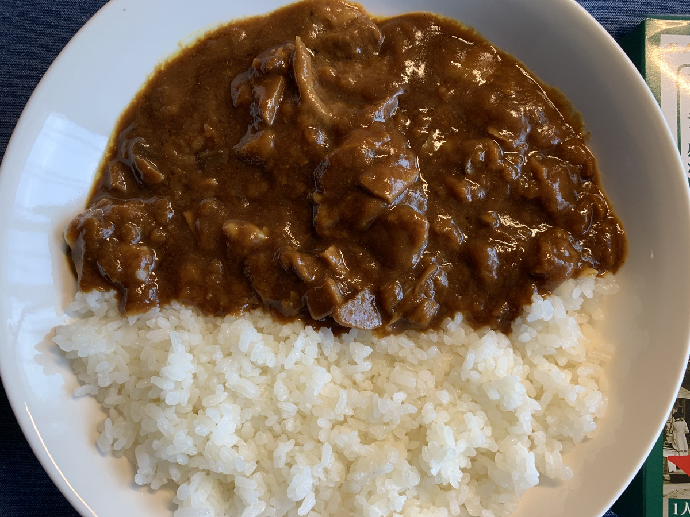

**ばばーん！ 長野 軽井沢欧風カレー！ :tada:**

---

バックショットこれ！ほい！

---

・

・

・

---

なんか **物足りない** と思ったアナタ！

もう、このブログに

**毒されてますよ！ :smiling_imp: :smiling_imp: :smiling_imp:**

いえーい！ :v: :v: :v:

---

**ふなき〜 :ski: :ski: :ski:**

Yes！

今回はそう、 **Nagano!**

スキー場 :ski: たくさんあるね！ :snowboarder:

---

そんな長野のカレーは

**欧風カレーだー！ :curry:**

インド風でも :man_with_turban:

中華風でも :man_with_gua_pi_mao:

和風でもないぞ！ :kimono:

**欧風だぞ！ :euro:**

おうふ！

---

あらためてバックショット〜

**Oh! European Sexy...!!! :sparkling_heart: :euro: :sparkling_heart: :euro: :sparkling_heart:**

ふっふぅ〜

おうっふぅ〜

**ふっふぅ〜 :dancers:**

**おうっふぅ〜 :dancers:**

いえーい！ :v: :smiley: :v:

---

https://snow.gnavi.co.jp/search/list/spl_area01.php?kencd=26

**Nagano!**

冬季オリンピックやっただけあって

**スキー場、たくさんあるぞ！ :ski: :dash:**

竜王でしょ〜

奥志賀でしょ〜

栂池でしょ〜

菅平に斑尾、野沢に戸隠・・・

**すっごくたくさん！ :snowman: :snowman: :snowman:**

---

**白馬！ :snowflake:**

ここも複数のスキー場が

**同じリフト券で巡れる** んだよねえ :ticket: :+1:

すごいぜ！ :+1: :+1:

---

そうそう〜

**白馬** といえば

気になってるところ、あるのよ〜 :mag:

（ぽち〜）

---

https://qiita.com/c_tyo/items/91d2f3a1c5746d0a2574

ここ〜

**白馬ベース** っていうんだって :house_with_garden:

きゃ〜〜〜！ :sparkles: :sparkles:

**すてきーーー！！  :sparkles: :star2: :sparkles: :star2:**

---

https://landscape-shinshu.net/recommended_spot/spot_830.html

**旧ヤフー白馬ベース？**

なんか管理者変わって **名前も変わったっぽい！**

どれどれ〜？

**調査だ調査だー！ :mag: :mag: :mag:**

---

https://hnv.jp/

**白馬ノルウェービレッジ！**

すごい！

**素敵・・・！ :two_hearts: :two_hearts:**

---

> ここ白馬ノルウェービレッジは、コワーキングスペースとして誰でも無料で利用できます。もちろんWiFi完備。ノートパソコンを持って出かければ、そこは第二のオフィスとして仕事に没頭できる空間です。

なんてこった！ **無料ですって！ :moneybag:**

こりゃ〜やばい！ :astonished:

**どこかで絶対行かなくては・・・！ :bullettrain_side: :bullettrain_side:**

---

そうそう！

白州もあるよね！

**白州蒸留所！ :cocktail:**

---

https://www.suntory.co.jp/whisky/hakushu/distillation/

わー！ :evergreen_tree:

**森の蒸留所・・・ :evergreen_tree: :evergreen_tree:**

素敵です・・・ :blush:

**大人の遊園地** です・・・ :tophat:

---

わー！行きたい！ :rage:

行きたい！ **行きたい！ :rage:**

**試飲したい！  :rage: :cocktail:**

見学したい！説明聞きたい！ :rage: :speaker:

**無料見学の後に試飲楽しんで余韻に浸りながら、追加で有料試飲で現地でしか飲めない限定のやつが飲みたい！！！ :rage: :rage: :rage:**

---

**ふなき〜！！！ :ski: :ski: :ski:**

---

おっと

取り乱しました・・・ :bow:

---

そろそろ

**美味いもん :yum: :fork_and_knife:**

**食べたいよね〜 :eyes:** （脱線のターン）

---

https://www.travel.co.jp/guide/article/4437/

**グルメまとめ！ :meat_on_bone:**

なんて **ストレート** な名前！ :crown:

---

https://www.togakushisoba.com/app/Blogarticleview/index/ArticleId/163

**戸隠そば！**

・・・の **ぼっち盛り？ :thinking_face:**

**ぼっちに親和性のある** 名前だなー

---

信州のそばは美味いんだよな〜〜 :sparkles:

昔、スキーのバスツアーとかで夜に向かってるときに

休憩時間に超寒い中 :snowflake:

**外で食べるそばの旨さ :heart_eyes_cat:**

ったらないよね〜 :yum: :+1:

---

**ローメン！ :ramen:**

・

・

・

**ローメン？ :thinking_face:**

ラーメンじゃなくて？ :thinking_face:

焼きそばじゃなくて？？ :thinking_face: :thinking_face:

---

なんか **色々種類あるらしい！ :sunglasses:**

味もラーメンや焼きそばとは全然違うらしいぞ！

うおーこういう **食べてみないと分からない系**

**現地で食べたいよお〜 :tired_face: :tired_face:**

---

https://ja.wikipedia.org/wiki/%E3%83%AD%E3%83%BC%E3%83%A1%E3%83%B3

ほえ〜〜〜

ローメン、 **伊那地方** の名物らしい :open_mouth:

---

知ってるかい？ :frog:

**伊那** と **恵那**

似てるけど違うから間違えちゃダメだぞ〜

**いいな〜〜 :+1:**

**ええな〜〜 :+1: :+1:**

そんなややこしいこと言ったら

**わからーん！ :boom:**

---

恵那山をまたいで

**東側が伊那！ :point_right: :point_right: :point_right:**

**西側が恵那！ :point_left: :point_left: :point_left:**

そもそも恵那は岐阜県だぞ〜

超長い **恵那山トンネル** もあるぞ！ :construction:

---

はっやばい！

とうとう脱線しすぎて

**隣の県の話まで広がってしまった！**

妄想旅、容易に県をまたいでしまえて

**危険だ〜〜〜 :smiling_imp: :smiling_imp: :smiling_imp:**

---

さーて

**どこでカレー食べよかな〜 :curry: :curry: :curry:**

どこがいいかな〜 :mag:

---

やっぱり **白馬** かな〜？ :snowflake:

となると、やっぱここでしょ〜

---

**そう、ここ！ :ski:**

ここは・・・！ :crown:

**伝説の・・・！！ :crown: :crown:**

---

**ふなき〜！！！ :ski: :ski: :ski:**

感動を味わいながら

**カレーも味わう！ :curry:**

**味わいのある風景！ :ski: :ski: :ski:**

---

## 実食！！

**今回もなが〜い！**

さくっとカレー作るぞ！ :muscle:

---

ご飯も食べる分だけ冷凍してある！

**チンするだけ！ :point_right:**

レトルトカレーを

**熱湯で何分か温めるだけ！ :fire:**

簡単すぎて **最高だ！ :+1:**

---

そして **10分もかからず** 出来たのが〜

---

**いえーい！ :confetti_ball: :confetti_ball:**

**Oh! Foo...!!! :heart_eyes: :heart_eyes: :heart_eyes:**

**欧風カレー、旨そう** じゃないですかー！

---

肉も入ってるけど、 **きのこ** の存在感もすごい！

旨そう！早く食べたい・・・！ :yum:

---

うおーーー！！ :rage:

**我慢ならんー！ :rage: :rage:**

生産者に感謝してー！ :pray:

**いただきます！！！ :pray: :pray: :pray:**

---

（モグッ）

---

**おおっ・・・！ :flushed:**

---

（モグッ）

（モグッ）

---

**うまいうまーい！！！ :satisfied: :satisfied: :satisfied:**

---

大人な感じの味わい、甘さとビターさのバランスが良いね！辛さは後からほんのりくる感じだ

きのこうまい！エリンギとしめじ、また違った食感できのこだけでも楽しめるやつ！
肉もアピールしてないのにうまい！柔らかくてプルンとした感じでうまいぞー！

---

はー！この **欧風カレー** もまた違った味わいでいいなあ〜

欧風カレー、というカテゴリーで

**カレーを探すのも楽しそう・・・ :sparkles: :sparkles: :sparkles:**

---

・

・

・

---

https://news.line.me/articles/oa-cookpadnews/1ca41d49977f

> 食べてシビれて汗をかくことが「マー活」の魅力

食べて :yum:

シビれて :astonished:

汗をかく！ :sweat_drops:

**食べて :yum:**

**シビれて :astonished:**

**汗をかく！ :sweat_drops:**

---

**長野 軽井沢欧風カレー**

**おいしゅうございました！ :pray: :pray: :pray:**
