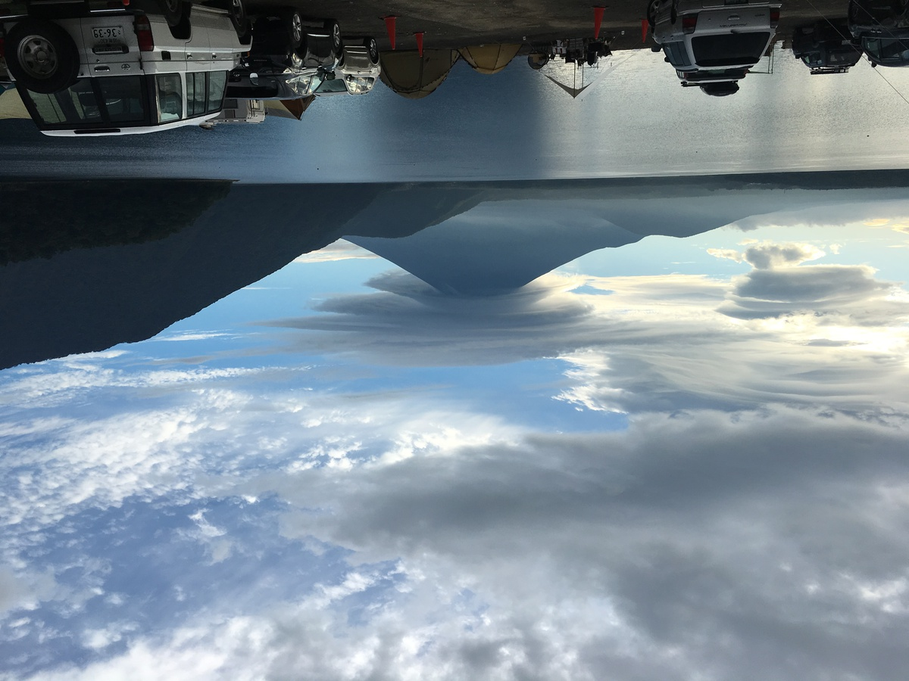

**ご当地カレーブログ** の1日は

布を敷くことから始まる :sparkles: :sparkles: :sparkles:

・

・

・

---

この布も、皿も

実は **100円で買ったやつ**

なんですよねえ〜 :moneybag:

---

**唐突なチープ感！！ :moneybag:**

:pig: :pig: :pig:

気持ちは豪華にいくゾー！ :muscle:

---

今日の **カレー :curry:** はこれ！

---

**山梨 小林牧場の甲州ワインビーフカレー！ :tada:**

とうとう **山梨** までやってきたー！

この **『なんとか牧場』** って名前のやつ

**しゅき〜〜 :heart_eyes_cat: :heart_eyes_cat: :heart_eyes_cat:**

---

今回は

**小林牧場** さん！ :cow:

---

最近、 **生産者いじりが少ない疑惑** が

持ち上がってるらしい（！）

・・・

そ、そんなことないぞ！ :worried: :worried: :worried:

---

**バックショットはこれ！ :dancer:**

---

**Foo! Wine and Beef Sexy...!!! :sparkling_heart: :wine_glass: :sparkling_heart: :cow: :sparkling_heart:**

**ワインビーフ** って、なんぞ？ :thinking_face:

ワイン飲ませてるのかな・・・ :wine_glass:

そんなまさか〜

---

https://www.winebeef.co.jp/kobayashi

**山梨の小林牧場** さん！

ウェブサイト、ちゃんとあっていいね！ :+1:

---

https://www.winebeef.co.jp/beef

なるほどー！ :hatched_chick:

ワインのために絞った

**ぶどうの搾り粕** を

えさにしてるらしい！

---

うしうしー :cow:

**うしうしー :cow: :cow:**

・・・じゃなかった

**うまうまー :horse: :horse:**

美味いもん

**食べてるぜー！ :yum: :cow: :fork_and_knife:**

---

おお〜スタッフのみなさんだ

**生産者さんに感謝・・・！ :pray: :pray: :pray:**

おいしいカレーをありがとう・・・ :curry: :pray:

---

ところで

なんで **ワインビーフ** なんだろ〜？

有名なのかな〜？ :thinking_face:

（ぽちっ）

---

https://www.suntory.co.jp/wine/nihon/column/daihyo01.html

**甲州ワイン！**

聞いたこと、あるぞ！ :v:

山梨！

**ブドウ** で有名らしい！ :grapes:

**ブドウ祭りじゃー！**

ブドウ :grapes: でわっしょい！ :grapes:

わっしょい！ :grapes: ブドウ！！ :grapes:

**ブドウ :grapes: :grapes: でわっしょい！ :grapes: :grapes:**

**わっしょい！ :grapes: :grapes: ブドウ！！ :grapes: :grapes:**

**わーーー :clap: :clap: :clap:**

---

https://www.yamanashi-kankou.jp/taste/wine/about03.html

ふむふむ〜？ :thinking_face:

> 甲州ぶどう自体は紫がかったピンク色。しかし果汁は白く、通常この果汁のみからワインを造るため、甲州は「白ワイン」なのです。ときおりほんのりと色づくことはりますが、決して赤ワインにはならないのが特徴です。

**なるほど！甲州ワイン :wine_glass:**

**へーそうなんだー！白ワイン！**

飲みたい！飲みたくなってきたぞ！

**飲みたい！ :rage:**

**飲みたい飲みたいぞー！ :rage: :rage:**

---

むむっ？

ところで、この **上のボタン** は？

（ぽちっ）

**:exclamation: :question: :exclamation: :question: :exclamation: :question: :exclamation: :question:**

えっなにこれ・・・ :sweat_smile:

**どういうことなの・・・ :sweat_smile: :sweat_smile: :sweat_smile:**

---

https://www.sanrio.co.jp/areasolution/case/yamanashi/

**ハローキティ・・・**

あんた、本当に・・・

**仕事選びませんな・・・ :star2:**

**世界で一番働く猫**

かもしれない・・・ :heart_eyes_cat:

---

山梨とハローキティ

**実はあまり関係がな・・・**

**あっいやなんでも・・・ :neutral_face:**

---

**こらー！ :cop:**

そういう **大人の事情** 的なことを

**言ってはいけません！ :cop: :rotating_light:**

---

そろそろ美味しいもの :yum:

**食べたいなー（唐突な脱線）**

---

:rotating_light:

http://www.kosaku.co.jp/

**小作** 、って店のほうとう

おいしいらしい・・・！ :yum: :yum:

美味しいって **ほんとう〜？ :thinking_face:**

・

・

・

**ってこらー！ :cop:**

でも実際食べなきゃ

**わかんないよねえ〜〜〜！ :sunglasses:**

ほうとう〜食べたい〜〜 :two_hearts:

**ほうとう〜食べたい〜食べたい〜〜 :two_hearts: :two_hearts:**

---

えっ、 **ほうとう** って

こんなに種類あるの・・・？？

**1種類だと思ってた・・・**

---

**かぼちゃほうとう！ :jack_o_lantern:**

> 甲州ほうとうの基本。ほうとうはここから始まりました。

**まじかー、しらなかったー :grinning:**

こりゃ〜

**現地で食べないとだな！ :sunglasses:**

---

https://www.mt-fuji.gr.jp/

**富士五湖！**

山梨の富士五湖も有名だよね！

**富士山の北側にある5つの湖！ :raised_hand:**

---

そう！

**河口湖** までは電車、バスなどで

**すごく行きやすくなっているのだ！**

行きたい〜 :train:

**行きたい〜 :train: 行きたい〜 :train: :train:**

行きたい！行きたい！ **行きたいぞー！ :rage:**

---

（ほわわわわ〜ん :innocent: :innocent: :innocent:）

・

・

・

---

**はっ！ :dizzy_face:**

気付いたら

**河口湖駅に居た・・・！ :smiling_imp: :smiling_imp: :smiling_imp:**

---

**ぶいーん！ :car: :dash:**

---

**本栖湖！**

本栖湖の **浩庵キャンプ場** に

きちゃったぞ！ :tent:

**いえーい！ :v: :v:**

---

うおー！

こんなとこでみんな

**キャンプ :tent:** してるのかー！

---

**富士山・・・ :mount_fuji:**

最高やないか・・・ :sparkles: :sparkles: :sparkles:

---

おおっと！

**焚き火台** と **薪** があるな・・・？ :thinking_face:

**これをこうして・・・ :muscle:**

---

**こうじゃ・・・！ :muscle: :muscle: :muscle:**

---

そして〜〜〜

**ファイヤー！ :fire: :fire: :fire:**

---

**いえーい！ :tada: :tada: :tada:**

**焚き火だいえーい！ :v: :v: :v:**

---

全然飽きない・・・

**無限に見ていられる・・・ :sparkles: :star: :sparkles: :star: :sparkles: :star:**

---

ときどき **風景見ながら・・・ :mount_fuji:**

---

そして **また焚き火を見る・・・ :fire:**

---

気付いたら夜・・・！ :fire:

**焚き火、危険だ〜 :smiling_imp: :fire: :smiling_imp: :fire: :smiling_imp:**

・・・

**だが！**

**焚き火を！！**

**やめない！！！**

---

**アルミホイルに包んで**

**雑に食べ物投げ込んじゃう！ :apple:**

**雑キャン :tent:** だぜ〜

---

**雑に食べ物焼いちゃう！ :fire:**

**雑キャン :tent: :tent: :tent:** だぜ〜

---

**そして！**

**食べ終わっても！！**

**焚き火を！！ :fire:**

**やめない！！！ :smiling_imp:**

---

**翌日に！**

**なっても！！**

**焚き火を！！ :fire:**

**やめない！！！ :smiling_imp:**

---

**焚き火、危険すぎる〜 :smiling_imp: :fire: :smiling_imp: :fire: :smiling_imp:**

---

・

・

・

**はっ！ :hushed:**

気付いたら **焚き火ブログ :fire:** になってた〜

**危険だ〜 :rage: :rage: :rage:**

---

もうカレー食べるの :curry:

ここでいいでしょ〜〜 :sparkling_heart: :sparkling_heart: :sparkling_heart:

**これ！ :mount_fuji: :mount_fuji: :mount_fuji:**

---

## 実食！！

**ながいw**

後半の **河口湖行ったあたりから長いw**

---

**ででーん！ :confetti_ball: :confetti_ball: :confetti_ball:**

**小林牧場の甲州ワインビーフカレー** の

できあがり〜 :tada: :tada:

**肉が旨そう** だ〜

旨そう！ウマソウ！

**UMASOU...!!!**

---

**はあ〜〜〜 :yum: :cupid:**

**食べたい〜〜〜 :yum: :fork_and_knife:**

---

ではでは

**いただきまーす！ :pray: :pray: :pray:**

---

（モグッ）

---

**おおっ・・・！ :flushed:**

---

（モグッ）

（モグッ）

---

**うまいうまーい！！！ :satisfied: :satisfied: :satisfied:**

---

なんか甘いペーストが入ってそうな甘い味わいだな、りんごかな？これはおいしい！

というかレトルトパウチを開けた瞬間、フルーティ？な香りがすごかった！
思いの外肉がごろごろ入ってる、肉のインパクトがけっこうあってうまいぞー！

---

**2代目ホアジャオせんせー、死す・・・！ :innocent:**

せんせー **「ジャオ〜・・・ :innocent: :innocent: :innocent:」**

---

**山梨 小林牧場の甲州ワインビーフカレー**

**おいしゅうございました！ :pray: :pray: :pray:**
