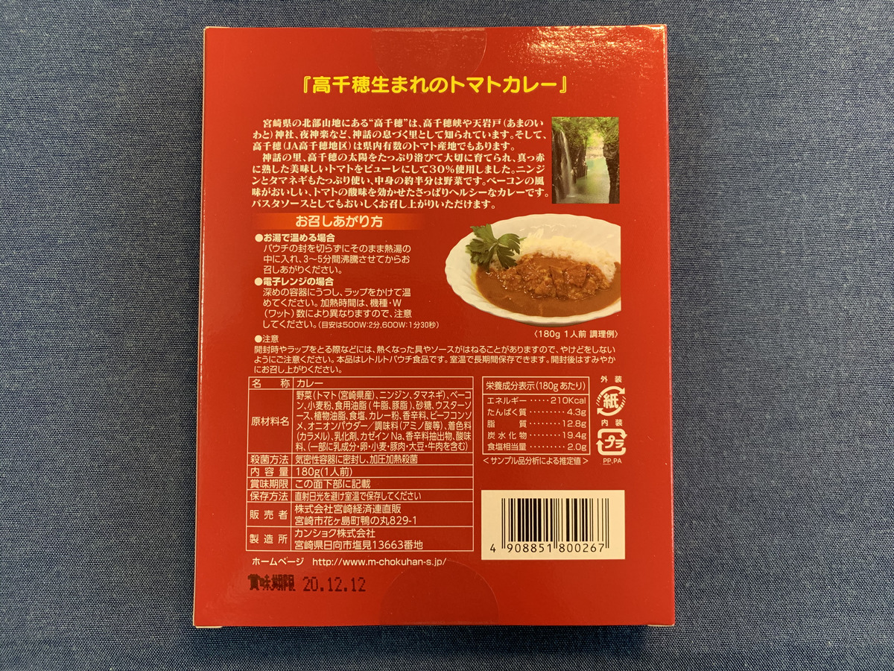
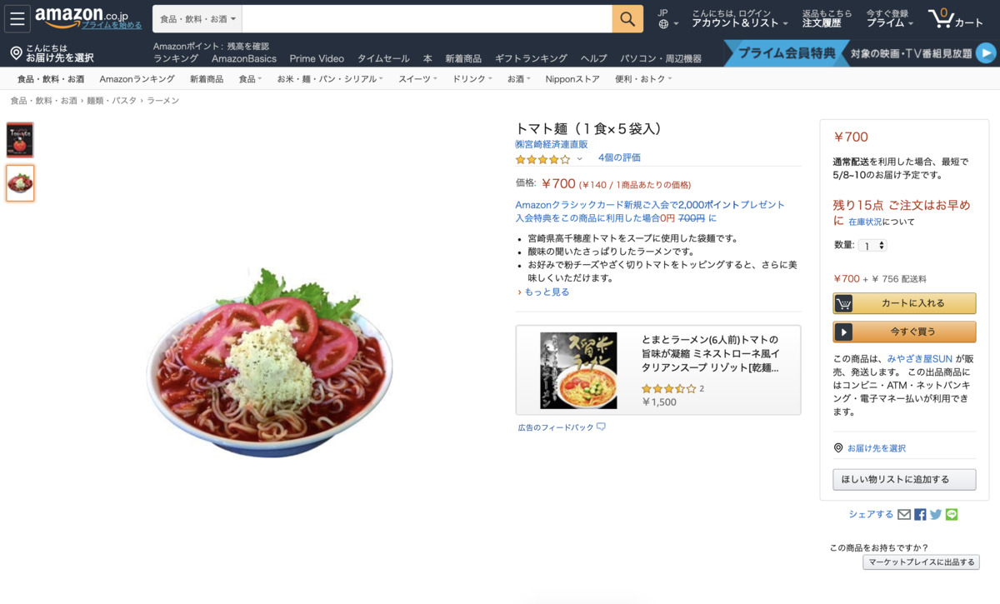
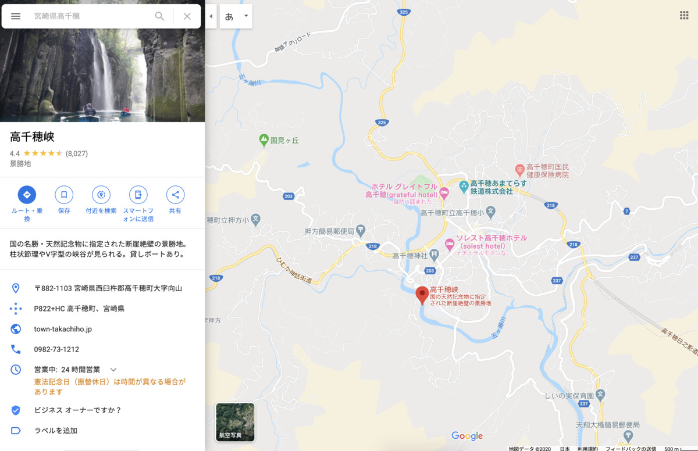
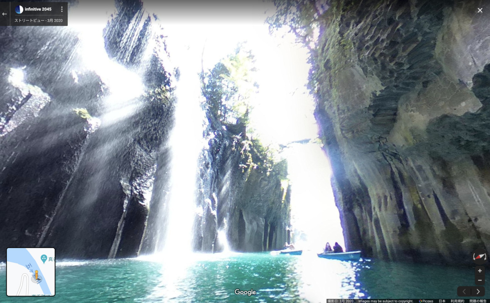
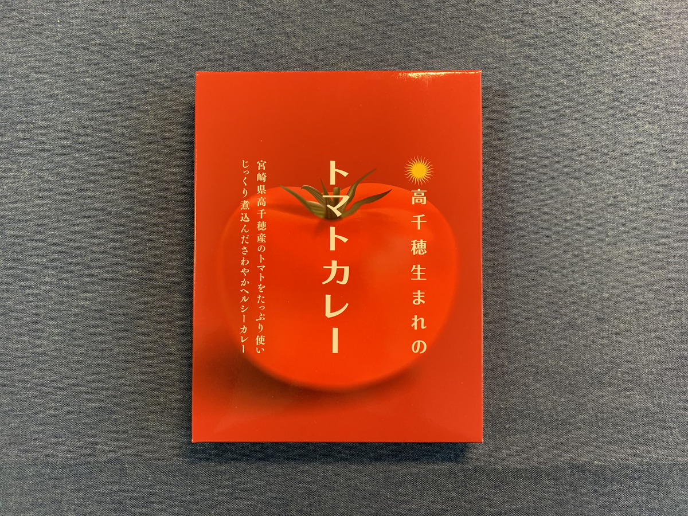
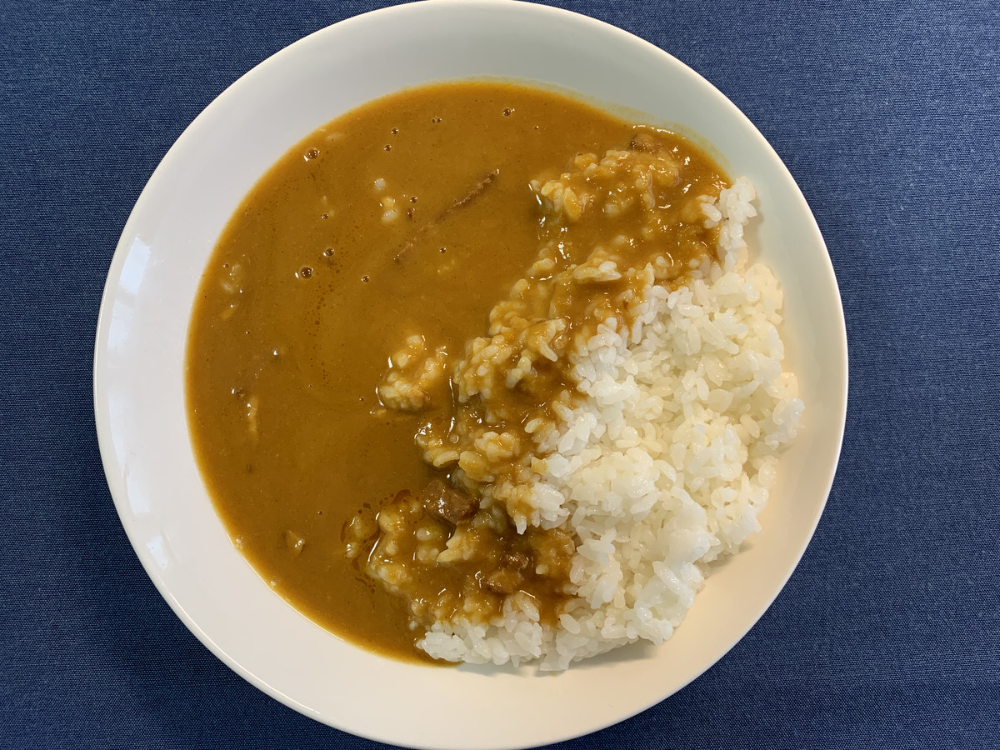
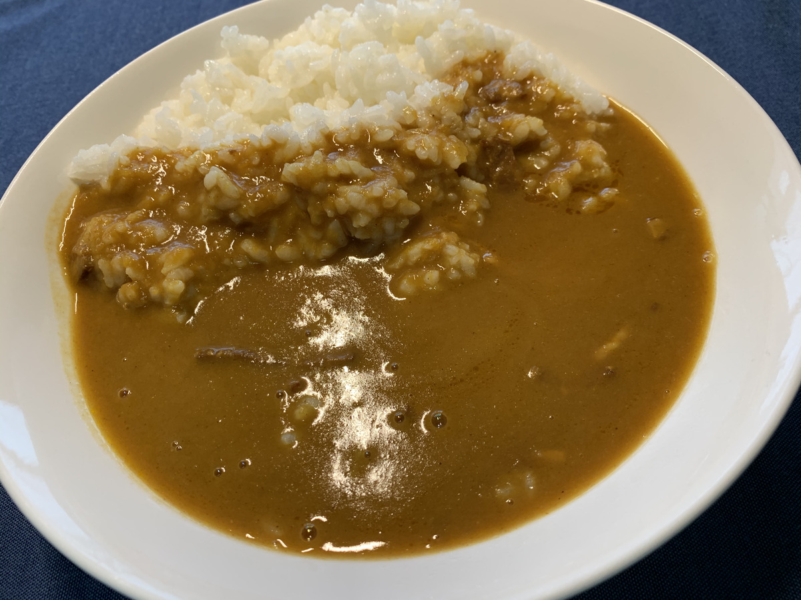
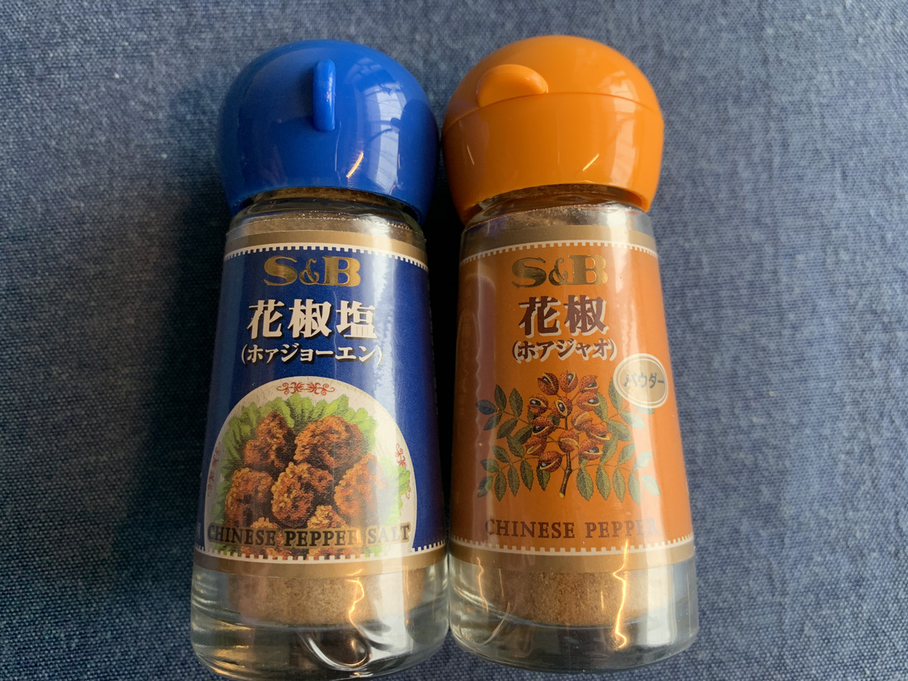
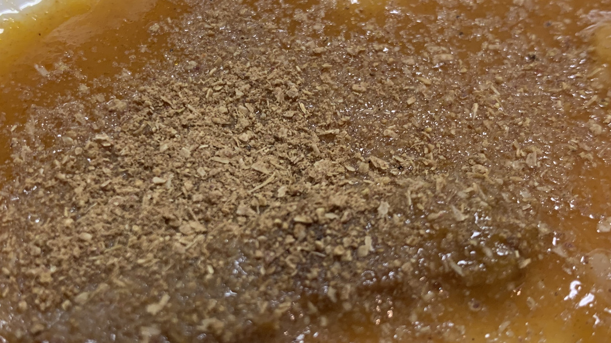

**カレー前線、北上中！ :cherry_blossom: :cherry_blossom: :cherry_blossom:**

今日は宮崎へやってきたぞ！

今日はどんな、カレーかなー？

今日はどんな、カレーかなー？？

---

カレー食べるようになってから、
**お昼が毎日楽しい！！**

---

段ボール :package: のカレー、

**食べても食べても全然減らないよー！ :yum: :yum: :yum:**

---

さてさてー！

今回のカレーは・・・？？？

---

 **宮崎 高千穂生まれのトマトカレー！** だっ！！

---

**トマト！ :tomato:**

**Tomato!! :tomato: :tomato: :tomato:**

はやくパッケージが見たい！！

---

**Wow! Tomatoish!! :tomato: :tomato: :tomato: :tomato: :tomato: :tomato:**

> トマトをたっぷり使い

**なんだってー？？**

---

:tomato: が、たっぷり・・・？

ということは・・・？

---

**トマト祭りじゃー！ :tomato: :tomato: :tomato:**

とーまとわっしょい！

**:tomato: :tomato: :tomato: :tomato: :tomato: :tomato: :tomato: :tomato: :tomato: :tomato: :tomato: :tomato: :tomato: :tomato: :tomato: :tomato: :tomato: :tomato: :tomato: :tomato: :tomato: :tomato: :tomato: :tomato: :tomato: :tomato: :tomato: :tomato: :tomato: :tomato: :tomato: :tomato: :tomato: :tomato: :tomato: :tomato:**

わっしょいとまと！

**:tomato: :tomato: :tomato: :tomato: :tomato: :tomato: :tomato: :tomato: :tomato: :tomato: :tomato: :tomato: :tomato: :tomato: :tomato: :tomato: :tomato: :tomato: :tomato: :tomato: :tomato: :tomato: :tomato: :tomato: :tomato: :tomato: :tomato: :tomato: :tomato: :tomato: :tomato: :tomato: :tomato: :tomato: :tomato: :tomato:**

---

バックショットは〜〜〜

**Oh, Healthy and Sexy!!! :sparkling_heart: :sparkling_heart: :sparkling_heart:**

---

こんな **Health and Sexy!** なトマトカレーを作ってくれた、

生産者の方々に敬礼！ :pray:

ありがたやー :pray:

**ありがたやー :pray:**

---

おや？

**おやおやおや〜〜？？**

カレーの他にもなんか作ってるみたいですねー？

（ぽちっ）

---

https://www.amazon.co.jp/dp/B00OL6EN2K/

トマト麺、ですって？？

気になるぅー！

**気になるぅ気になるぅー！！**

---

**・・・はっ！ :open_mouth:**

このブログ、

**ご当地カレーブログだった・・・！！ :open_mouth:**

---

ここはぐっとこらえて、

**カレーを食べる場所をさがさなきゃ！ :sunglasses:**

---

どこにしようかなー

宮崎のどこで食べよかなー :round_pushpin:

---

おおっ、 **高千穂峡** 、きいたことあるぞ！

**川から滝が見られちゃうやつ！ :sparkles: :sparkles: :sparkles:**

---

**いいーんじゃないでしょうか！ :sunglasses:**

では移動ー！

（びゅーん！）

---

**おおーーー！！**

**絶！　景！**

まさに至高のトマトカレーを食べるのに、最高の景色！

現実でも、まさか高千穂峡で

**滝を見ながらトマトカレーを食べるやつ**

なんて、いないでしょ〜

---

**高千穂峡で**

**滝を見ながら**

**トマト :tomato: カレー :curry: を食べる**

**初めての人です！** ＼コンニチワ／

---

## 実食！！

まえおきが長い！

**カレーの写真にたどり着くまでが長い！**

---

**どどーん！ :curry: :curry: :curry:**

おおーっ！ :clap: :clap: :clap:

---

**ばばーん！ :curry: :curry: :curry:**

おおーっ！ :clap: :clap: :clap:

前回までのは、スタンダードなカレーだったけど、
今回のはやっぱ色合いからして違いますねー。

---

生命はここから生まれた・・・！

トマトの海・・・！

・・・。

---

**そろそろ我慢できないぞ？？？ :rage: :rage: :rage:**

早く食べたーい！

**では、いただきます！ :pray:**

---

（ズズッ）

---

**むむっ・・・！ :flushed:**

---

（ペロリ）

（ペロリ）

---

**うまうまー！！！ :satisfied: :satisfied: :satisfied:**

---

トマトとカレーの絶妙なバランスがたまらん！

トマト感はそこまで強くないけど、エキスつまってる感最高だー！
むしろトマトってだけで苦手に思っちゃう人でも全然いける！

おいしい野菜ジュースとカレーを一緒に味わってるみたいだなー
リアル **「カレーは飲み物」** だこれ！

**うまーい！ :curry: :curry: :curry:**

---

（ガツガツガツ・・・）

---

ああっ早い、もう最後の一口だ・・・！

そろそろ

**ホアジャオタイム！**

の時間だよー！

さあみんな一緒にー！

---

**ホア〜〜〜〜〜**

---

**ジャオ〜〜〜〜〜！！！**

---

**ドゥーン！**

（フリフリフリフリ・・・）

---

えっ？どれだけふりかければ分からないって？

**ハッピーな気持ちになりたい分だけ**

**フリフリすればいいと思うゾ！ :sunglasses:**

（フリフリフリフリ・・・）

---

**宮崎 高千穂生まれのトマトカレー**

**おいしゅうございました！ :pray: :pray: :pray:**
