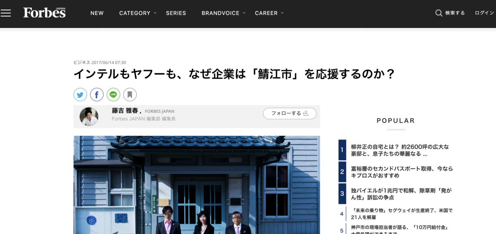

とうとう **30皿目・・・！ :fork_and_knife:**

わーー！ :smiley:

**おめでとー！ :tada: :tada:**

わーー！ :smiley:

**ありがとー！！ :crown:**

---

今日もひたすら **カレー！ :curry:**

今回は〜どこかな〜？

今回の県は〜
**福井〜〜〜！ :clap:**

ふくい〜〜〜！
ふくい〜〜〜！ :clap: :clap:

---

https://ja.wikipedia.org/wiki/%E7%A6%8F%E4%BA%95%E7%9C%8C

福井〜 :musical_note:

**福井県** は、 **滋賀県の北** にあるぞ！

---

なになに〜？

> 地理上は北陸地方または中部地方と分類されるが、行政管轄区分において近畿地方とされる場合もある。

おお〜っと、

**どこに属するか分からない** 問題きたー！ :scream:

こ、こまけーことはいいんだよ！ :sunglasses:

**福井くんは福井くんのまま** で

いいと思います！ :ok_woman:

---

さてさて〜 :kissing_cat:

今日のカレーはこいつ！

**じゃじゃん！ :boom:**

---

**福井 海の幸いかカレー！ :curry: :curry:**

**うぇーい！！！ :metal:**

ようやく本格的な

**シーフードカレーきたー！！！！ :confetti_ball:**

シーフード祭りじゃー！ :ocean:

---

海の幸！ :ocean: わっしょい！ :fish:

わっしょい！ :ocean: 海の幸！ :octopus:

**海の幸！ :ocean: わっしょい！ :dolphin:**

**わっしょい！ :ocean: 海の幸〜！ :whale:**

わーー！どんどんどんどん！！ :mega:

---

バックショットは〜〜

にゃ〜ん :heart_eyes_cat:

**Oh, Sexy ocean...!!! :sparkling_heart: :ocean: :sparkling_heart: :ocean: :sparkling_heart:**

> 自然豊かな日本の海に育まれた新鮮な海の幸と、じっくり煮込んだスパイシーなカレーとの絶妙な味のハーモニーを是非ご堪能ください。

ご堪能しちゃおう！！！ :muscle: :ocean:

---

やっぱ福井県は、 **海の幸** なんだね〜 :eyes:

（ぽちぽち〜っ）

---

https://tabihow.jp/trip118/

あっなんか早速・・・

**やべえサイト** 見つけちゃった・・・ :eyes:

---

ああ〜〜 :yum:

**グルメ地図〜 :yum: :fork_and_knife:**

**大人の宝地図や〜〜〜 :gem: :crown:**

---

あっそうそう〜

地図見て思い出したんだけど

福井県といえば、

今 **鯖江市が熱い** のよね・・・！ :fire:

---

https://forbesjapan.com/articles/detail/16579

> SAP、intel、Lenovo、NEC。他にも、Yahoo!JAPANや伊藤園など大企業や、眼鏡フレームの生産で有名な町らしく、地元眼鏡店の名前もある。それら企業が、ここ、「Hana道場」を支援する。この道場は、ドイツ、シリコンバレーに次いで、SAPが世界で3番目に開設を支援したイノベーションのためのファブラボ（3Dプリンタなどの工作機械を備えた場所）なのだ。

**鯖江市が熱いぞ〜〜〜 :fire: :fire: :fire:**

行ってみたいぞ〜〜〜！！ :stuck_out_tongue_closed_eyes:

なんか **企業家精神** を持った人が

たくさん集まってるんだって！ :muscle: :satisfied:

---

https://hanadojo.com/

おお〜！ :older_man:

ものづくり！ :nut_and_bolt:

**ファブリケーション！ :nut_and_bolt:**

---

http://hanadojo.sblo.jp/

すっげーなんか色々やってる・・・ :sparkles: :sparkles:

**行ってみたい・・・！ :running:**

これは何か参加するついでに

**ふらっと旅するフラグ・・・！ :triangular_flag_on_post:**

---

他に美味いもんないかな〜 :yum:

さっきの **グルメ宝地図** みようぜみようぜ〜〜 :eyes:

---

そう！

**ソースカツ丼！**

いやむしろ **カツ丼（どぅん）！**

福井県で **カツ丼（どぅん）** っていえば

これだぞ！

（かつや・・・店舗あるらしいけど気になる・・・）

---

http://yo-roppaken.gourmet.coocan.jp/

**元祖ー！ :old_man:**

**:old_man: 「ふぉふぉふぉ、わしが元祖じゃ・・・」**

**旨そう！ :yum:**

**ウマソウ！ UMASOU...!!! :yum: :yum:**

ヨーロッパ軒総本店！さん！

---

http://yo-roppaken.gourmet.coocan.jp/sub1.htm

> 薄くスライスした上等のロース・モモ肉を、
> 目の細かな特製パン粉にまぶし、
> ラード・ヘッドでカラリと揚げたカツを、
> 熱々のうちに
> ウスターソースをベースに各種の香辛料を加えた
> 秘伝のタレにつけ、
> 熱いご飯にタレをまぶした上にのせたカツ丼です。

あ〜〜〜

こういう、うんちく〜

**しゅき〜〜 :heart_eyes: :heart_eyes: :heart_eyes:**

これは行きたい！

行きたい！ :rage: 行きたい！ :rage:

**行きたいぞ！！！ :rage: :rage:**

---

http://www.fuku-e.com/top.php

**ふくいドットコム！**

**福井県** のことなら、

このサイトにおまかせだ！

ただ、 **URL がふくいドットコムじゃない・・・**

---

**ってこらー！ :rotating_light:**

**大人の事情** があるんだから、

触れたらあかんのじゃ・・・！ :cop:

---

ふむふむ・・・

**へしこってなあに？ :thinking_face:**

（ぽちっ）

---

http://www.fuku-e.com/200_gourmet_calendar/24_heshiko/

> へしことは魚の糠漬けのことで、その昔、魚の腐敗を防ぎ、長期保存するための保存食として作られていました。その歴史は深く、江戸時代中期にはすでにへしこ作りが始まっていたと言われています。

へえ〜〜〜知らんかった・・・！

これはあれじゃない？

**お酒に合うやつ :sake:** じゃない？？

あ〜〜〜

現地で **へしこ** をつまみつつ！ :fish:

現地の **地酒を飲む！ :sake:**

かあああああ！！ :rage:

**行きたい！行きたいぞ！！ :rage:**

は〜〜〜

へしこ〜〜〜 :fish:

**へしこ〜〜〜 :fish: :fish:**

---

**福井県民** が集まる

**ショッピングモール** といえば〜

（ぽちっ）

---

https://lp-lpa.co.jp/

ここ、 **エルパ** らしいぞ！

キャッチコピーは

**ラブリーパートナー！ :heart: :heart: :heart:**

こういう地元ショッピングモールで

だらだらできるようになったら、

ようやく **地元民として認められる・・・！**

---

https://withnews.jp/article/f0180219000qq000000000000000W07z10601qq000016659A

**イオンがない県・・・！**

**イオンなんかなくたって**

人間生きていける・・・！

**ラブリーパートナー** さえあれば！ :heart: :heart: :heart:

---

**ラブリーパートナー！！！ :heartbeat: :heartbeat: :heartbeat:**

---

ち、ちがうぞ！

**dis ってるんじゃないぞ！！ :sweat_drops:**

地元企業さんに敬礼だ！ :pray: :pray:

意外とこういうところに

**地元にしかないお店** が入ってたりするんですよ〜

あ〜そういうとこ行きたいね〜 :star:

---

あ〜そうそう

**敦賀** にさ〜

**フェリーターミナル** 、あるよね？ :ferry:

（明らかに脱線）

---

https://www.snf.jp/embark/turuga.html

そう！ **新日本海フェリー！ :ferry:**

乗りたい！！ :ferry: :ferry:

---

https://www.snf.jp/searoute/tsuruga-tomakomai02.html

すごい！

ここから **新潟！秋田！苫小牧！** に

行けちゃうらしいぞ・・・！

**日本海めぐりにもってこいじゃん・・・！ :ocean:**

---

**ってこらー！ :cop:**

---

ふぅ〜〜危ない・・・ :cold_sweat:

危うく **福井県のカレー** を食べようとしてるのに

**福井県外に出ちゃうとこだった・・・ :sweat_smile:**

**フェリー旅** 、相変わらず

**危険すぎる〜〜〜 :smiling_imp: :smiling_imp: :smiling_imp:**

---

**カレー :curry:** 食べる場所

探さなきゃね！ :smiley:

**さてさて〜？ :mag:**

---

**福井県！ :+1:**

改めてみてみると

**意外と広いな〜〜 :hushed:**

---

あ〜〜〜

ここ良いかもしれない

**恐竜博物館！ :raised_hands:**

さっきのふくいドットコムでも

恐竜アイコンが出てきたりして

**謎の恐竜推し** だったなー :+1:

---

**おお〜〜恐竜！ :japanese_ogre:**

**圧倒的迫力！ :muscle:**

ここでカレー食っちゃうぞ！

（リアルでやったら絶対怒られるやつ〜〜〜）

---

## 実食！！

**実食までがなが〜い！**

---

・・・のはお約束になりつつあるw

---

さあ、ようやくお待ちかねの

**シーフードカレー！ :+1: :+1: :+1:**

**イカ入ってるイカ！ :ocean:**

**海の幸〜〜〜 :ocean: :ocean: :ocean:**

---

旨そう〜〜〜 :yum:

作って食べる前は絶対にそう思っちゃう〜〜

**旨そう〜〜〜 :yum: :fork_and_knife:**

---

**生産者さんに感謝** しつつ、食べよう！ :pray:

---

**では、いただきまーす！ :pray: :pray: :pray:**

---

（モグッ）

---

**おおっ・・・！ :flushed:**

---

（モグッ）

（モグッ）

---

**うまいうまーい！！！ :satisfied: :satisfied: :satisfied:**

---

若干ビターより？なのかな？いやしょっぱさ？
ビターというかシーフードの塩っけがあるような感じで美味い！

イカとカレーはやはり合う、シーフードカレー美味いぞー！
イカカレーという割には、若干イカリングが少なすぎかなあ・・・さすがに2切れは少ない・・・もっとイカリング欲しい！

---

**ホア〜〜〜〜〜**

---

**ジャオ〜〜〜〜〜！！！**

---

**ほわわわわ〜ん！ :innocent: :innocent: :innocent:**

---

**:old_man: 「ふぉふぉふぉ・・・」**

**3代目ホアジャオせんせー** きたー！ :innocent:

（ペース、はやすぎないか・・・！？）

---

はい :sunglasses:

（ﾌﾘﾌﾘﾌﾘﾌﾘﾌﾘﾌﾘﾌﾘﾌﾘ...）

きょうも :sunglasses:

（ﾌﾘﾌﾘﾌﾘﾌﾘﾌﾘﾌﾘﾌﾘﾌﾘ...）

ふりふり :sunglasses:

（ﾌﾘﾌﾘﾌﾘﾌﾘﾌﾘﾌﾘﾌﾘﾌﾘ...）

しましょうねえ〜 :innocent:

---

**福井 海の幸いかカレー**

**おいしゅうございました！ :pray: :pray: :pray:**
