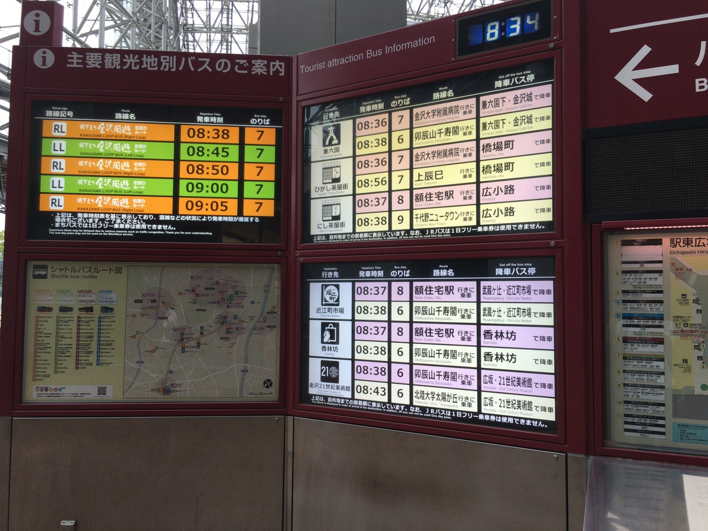
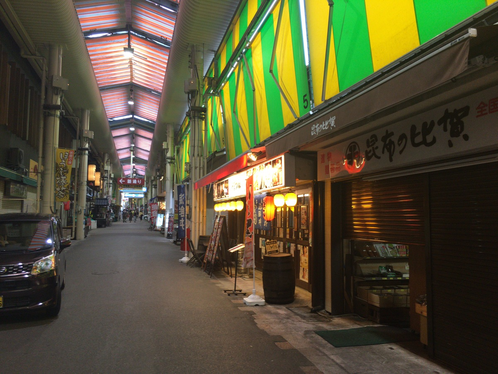
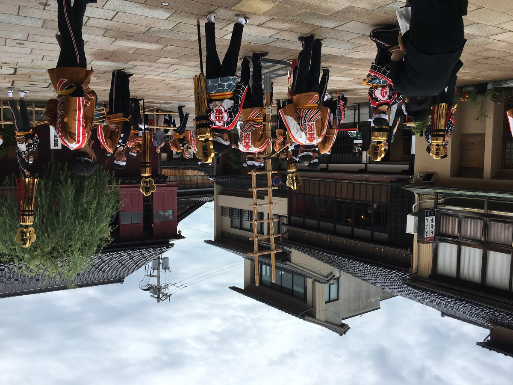
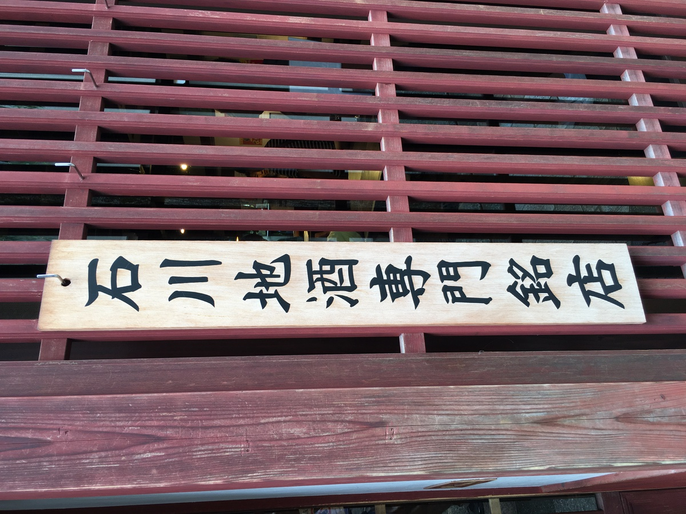
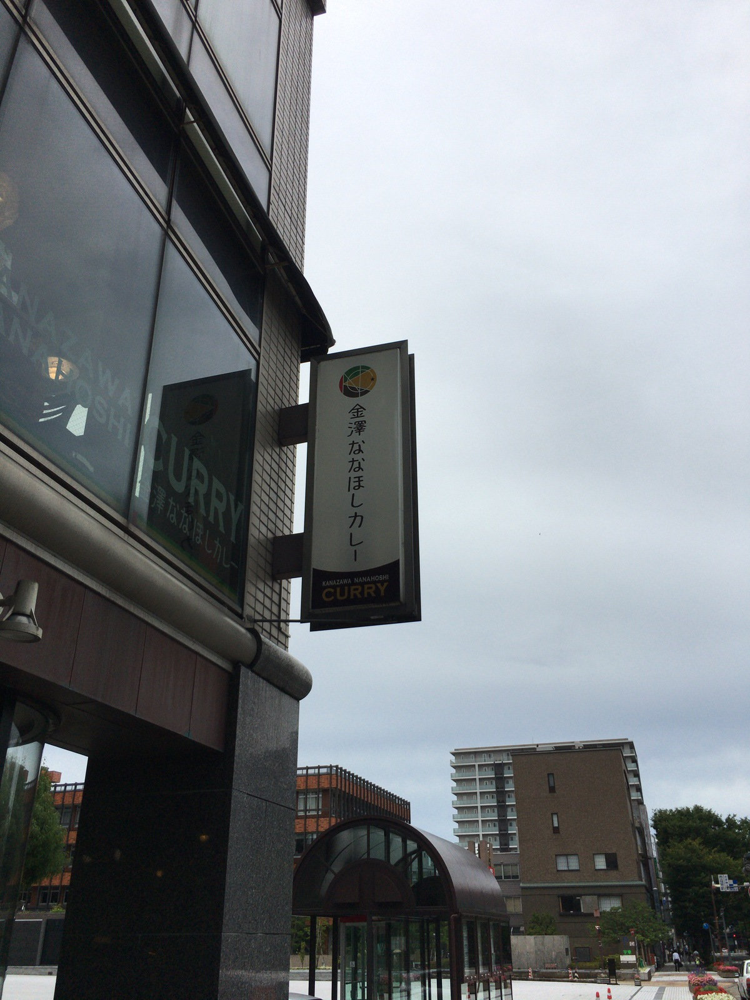

**だいぶ北まできたぞー :point_up_2: :point_up_2:**

うぇーいうぇいうぇーい :grimacing: :metal:

今日も雑に

**カレー :curry:** を食っていく・・・！

---

今日は **石川県！ :confetti_ball:**

かなざわ県じゃないぞ！

**いしかわ県だぞ！ :cop: :cop:**

---

石川県、金沢カレーが有名だよねー！

Go! Go! :car: :dash:

Champion! :crown:

**Go! Go! :car: :dash:**

**Champion! :crown:**

---

さてさて〜〜〜

今日のカレーはなにかな〜〜〜 :stuck_out_tongue_winking_eye:

なにかななにかな〜〜 :stuck_out_tongue_winking_eye: :stuck_out_tongue_winking_eye:

---

こんだけ煽っても

もう **タイトルで何のカレーか**

**みんな知ってる** のは

**触れちゃだめだぞ〜〜〜 :rotating_light: :rotating_light: :rotating_light:**

公然の秘密だぞ〜〜〜

---

さて、今日はこいつ！

---

**石川 アルバ熟成カレー！ :crown: :crown: :crown:**

いえーい！

旨そう！濃厚そう！！ :neckbeard:

---

で **アルバ** ってなあに？？ :thinking_face:

---

http://albacurry.com/

なるほどー！

**そういうお店があるのかあ！ :grinning:**

---

http://albacurry.com/about

**うはー！ :yum: :yum: :yum:**

これは地元にいかないと

**食べられない系のやつ** ですよ・・・！

> アルバカレーのルーはシチューがベース。ヨーロッパ修行の末に作り出した、欧風カレースタイルです。

へええええ〜〜 :thinking_face:

**シチューがベース** なのか :last_quarter_moon_with_face:

それは確かに **濃厚そうだ！ :first_quarter_moon_with_face:**

---

**Oh, Lovely Sexy...!!! :sparkling_heart: :gift_heart: :sparkling_heart: :gift_heart: :sparkling_heart:**

愛され続ける金沢カレーの味！

まさに **Lovely Sexy ...!!!**

---

ところで・・・

**カレーの市民** ってなんじゃろな？ :thinking_face:

**カレーを良く食う市民性** みたいなのを

指していたり、するのかな？？ :wink:

---

https://ja.wikipedia.org/wiki/%E3%82%AB%E3%83%AC%E3%83%BC%E3%81%AE%E5%B8%82%E6%B0%91

> イギリス海峡におけるフランス側の重要な港カレーが、一年以上にわたってイギリス軍に包囲されていた際（カレー包囲戦）の出来事に基づいて

**まさかのダジャレwww**

しかも **カレー全然かんけいない！ :astonished:**

---

あ〜〜〜石川県行きたいな〜〜

**行きたい行きたい〜！ :rage:**

**石川県、行きたいぞ〜〜〜！！！ :rage: :rage:**

---

（ほわわわわ〜〜〜ん :innocent: :innocent: :innocent:）

---

**おやおや〜？？？ :kissing:**

---

**気付いたら〜〜〜？？？ :wink:**

---

**金沢駅の目の前にいたー！ :heart_eyes: :heart_eyes: :heart_eyes:**

（ながくなるパターンのやつ〜）

---

ちなみに夜はこんな感じ〜〜〜

ええなあ〜〜 :izakaya_lantern:

**ええなあ〜〜〜 :izakaya_lantern: :izakaya_lantern:**

---

さてさて〜〜

**どこ行きますかね〜〜 :bus:**

**分かりやすい〜〜 :eyes:**

---

というかまずは **腹ごしらえでしょー :smiling_imp:**

---

**金沢回転寿司！！**

---

駅前にこんなんあって :eyes:

腹減ってたら :yum:

そりゃ〜 **入りますよね？？？ :sunglasses:**

---

**ドンッ！！ :boom:**

**茶をすする！ :tea:**

---

**ドンッ！！ :boom:**

**寿司を食う・・・！ :sushi: :sushi:**

こんなん

**美味いに決まってますやん〜〜〜 :sparkles: :star2:**

新鮮スギィー！ :fishing_pole_and_fish:

---

**近江町市場！ :fish: :fish:**

あ〜〜〜 **美味いもんの集積所だ〜 :yum:**

も〜こんなん

どこ入っても **絶対美味い** でしょ・・・！

---

あああ〜〜いいな〜 :sparkles: :sparkles: :sparkles:

こういうところでぶらぶらしながら

**飲み食いしたいよぅ〜〜 :two_hearts: :two_hearts:**

---

はっいかんいかん・・・ :sweat:

食ったばっかだった・・・ :sweat: :sweat:

---

おっ、 **地元のアパート情報** じゃん :eyes:

こういうのみるの

**しゅき〜〜〜 :heart_eyes_cat: :heart_eyes_cat: :heart_eyes_cat:**

---

おっ・・・

**住める・・・ :house:**

---

**知らない場所** に行って

**あっここ住めそう** 、って思ったとき

唐突に **「住める・・・」** って

**リアルにつぶやく癖** があります・・・

**ここは住める・・・ :house: :house: :house:**

---

おっ、なんだか

 **和と洋が融合したような建物** が

急に現れましたわね :house_with_garden:

---

**尾山神社** 、とな？

---

ふむふむ？

> 明治六年（一八七三）に歴代藩主の別邸であった金谷御殿跡に建立された。
> ギヤマンがはめ込まれたり、和・漢・洋折衷様式を見せる神門は、異国情緒漂う造り。

ほほー。異国情緒だわー。

ちなみに、 **ギヤマン** って

**カットガラス** のことらしい！

**ガラス綺麗だわ〜〜 :sparkles: :sparkles: :sparkles:**

---

**和・漢・洋折衷**

おいしいとこどり〜〜〜 :yum:

**そんな人生歩みたい〜〜〜 :paw_prints: :paw_prints:**

---

**加賀！百万石！**

の通りを歩く〜 :paw_prints:

---

おお〜ちょっと **飲み屋街** っぽさ

出てきたね！ :sake:

---

金沢駅の南の方〜

**香林坊** とか **片町** って言うらしい

いかにも **飲んでいってくれ！**

**って感じの雰囲気だ〜 :sake: :sake:**

---

ででーん！ :v: :v:

**おでーん！ :oden: :oden: :oden:**

**夏おでん！**

そう、金沢では

**夏にもおでんを食べる** のだ :oden:

---

金沢おでん！

**赤玉本店** さんでいただいちゃうぞ！

---

**旨そう！ :yum:**

**ウマソウ！ UMASOU!!! :yum: :yum: :yum:**

ちなみに赤玉なんじゃろな？ :thinking_face:

って感じなんですが

---

ちゃんと **英語** でも説明書いてくれてる！ :+1:

外国人の方も多いのかな・・・？

---

**茶めし茶漬け！ :tea:**

**おでんの出汁を使った茶漬け** が締め・・・！

こんなんずるいわ〜 :rage:

**絶対美味いわずるいわ〜〜 :rage: :rage:**

**食べたくなっちゃうわ〜 :rage: :yum: :rage:**

---

そろそろ **飲み屋街** じゃなくて

**茶屋街** にも行きたくなってきちゃったわね

---

（しゅーん :dash: :dash: :dash:）

---

おっ、 **なんかやってるぞ〜 :eyes:**

（ちなみに **きんつば** 食べたあと）

---

**おお〜〜〜 :confetti_ball: :confetti_ball:**

こうやって伝統は守られていくのだ〜

---

いや〜〜〜

にしてもいいっすな〜雰囲気が〜

**ひがし茶屋街** っていうらしいぞ :tea:

**:tea: :house: :tea: :house: :tea: ってことだな！**

意味わから〜ん :stuck_out_tongue_closed_eyes:

---

あ〜〜〜

あるある、こういうの〜

**なにかは知らんけどw**

---

**『玄関 たわし ボール』**

で検索だ！ :mag:

（ぽちぽちーっ）

---

https://ja.wikipedia.org/wiki/%E6%9D%89%E7%8E%89

へー **杉玉！**

**杉玉** っていうのか、知らんかったー :open_mouth:

むむっ？

> 日本酒の造り酒屋などの軒先に緑の杉玉を吊すことで、新酒が出来たことを知らせる役割を果たす。
> 「搾りを始めました」という意味である。

**なん・・・だと・・・！？ :innocent:**

---

なるほど？？ :smiling_imp:

**なるほどー？？？ :smiling_imp: :smiling_imp:**

**地酒専門店！ :sake:**

**いえーいやっほーぅ！ :sparkles: :sparkles: :sparkles:**

---

やべえ・・・！

アツがすげえ・・・！ :cyclone:

**引き込まれる・・・！！ :cyclone: :cyclone:**

こらえろ・・！ :confounded:

**こらえるんだ・・・！！！ :confounded: :confounded:**

---

ふーーー

**あぶなかったぜ〜〜〜 :sweat_smile: :sweat_smile: :sweat_smile:**

---

そうそう、酒飲んでたら :sake:

**次に行けなくなっちゃうからね！**

**兼六園！** の方に行きたかったのだぜ :deciduous_tree:

---

**茶店通り！ :tea:**

あ〜〜〜 :joy:

**ずるいわこういうの〜 :joy: :joy:**

---

茶店通り、茶店通りっぽさ〜〜〜 :tea:

ちゃみせ〜〜〜

**ちゃみせ〜〜〜ちゃみせ〜〜〜**

---

**日本酒アイスクリーム！ :icecream:**

**見た目はソフトクリーム** だけど・・・

**こまけーことはいいんだよ！ :fist:**

---

とうとう酒に屈してしまった・・・ :stuck_out_tongue:

**酒に屈するだけの人生・・・**

でも **アイスはセーフ！ :icecream: :ok_hand:**

---

おっ **カレー屋** があるぞ！ :curry:

（ここから違和感が故障するターン）

---

**金澤ななほしカレー！ :curry:**

あああ〜〜

いいっすな〜〜 :yum:

**旨そうっすな〜〜〜 :curry:**

---

じゃあ〜〜 :thinking_face:

この

**金澤ななほしカレーセット** で！！！

食べたい！！！ :yum: :yum: :yum:

---

## 実食！！

**ばばーん！ :tada: :tada: :tada:**

**金澤ななほしカレーセット！！！**

旨そう！ウマソウ！

**UMASOU...???**

---

**あれ？ :thinking_face: あれっ？ :thinking_face: あれれっ？ :thinking_face: :thinking_face:**

---

気付いたら・・・

**別のカレー :curry:** 食べようとしてる・・・！

**妄想旅、危険だ〜〜〜 :imp: :imp: :imp:**

---

## 改めて実食！！

食べるカレー違っちゃってるし！

---

これが今回のカレー、

**石川 アルバ熟成カレーだー！**

---

**ドンッ！！ :boom: :boom: :boom:**

うぇ〜〜〜い！

さすが **金沢カレー！ :curry:**

**濃厚そうだ〜〜〜 :fork_and_knife: :yum: :+1:**

---

そして

ちゃんと **生産者さんにも感謝！ :pray:**

別のカレー紹介しはじめちゃって

**すまんです！ :bow: :bow: :bow:**

---

おお〜〜

**プルンプルン！ :curry: :curry:**

カレーが

**プルンプルン！ :curry: :curry: :curry:**

---

**もう我慢できないぞー！！！ :rage:**

---

**いただきまーす！ :pray: :pray: :pray:**

---

（パクッ）

---

**むむっ・・・！ :flushed:**

---

（パクッ）

（パクッ）

---

**うまうまー！！！ :satisfied: :satisfied: :satisfied:**

---

重圧な感じのカレーでうまい！食い甲斐がある！！コメが進む！
すごくねっとり、濃厚そうに見えてやはり濃厚！カレールーが少し少なめに見えるけど、グラム数は他とそんなに変わらないよね！

これぞ金沢カレーという、すごくソースを感じる楽しめる感じのカレーで良い〜

---

・

・

・

---

:sake: の圧力には抗えない・・・

---

**:sake: の圧力には抗えない・・・**

---

**石川 アルバ熟成カレー**

**おいしゅうございました！ :pray: :pray: :pray:**
