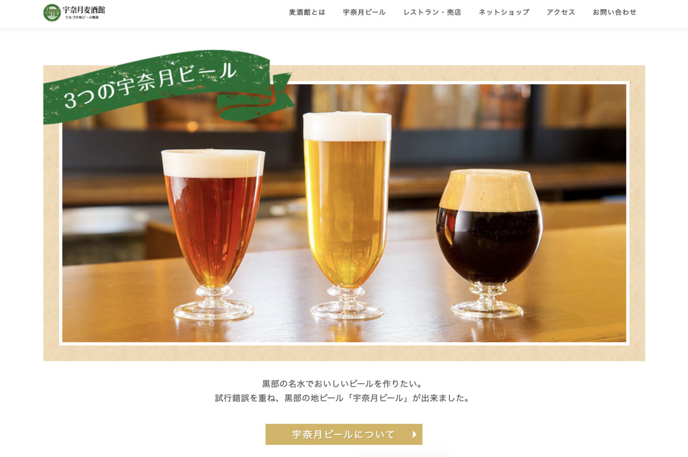
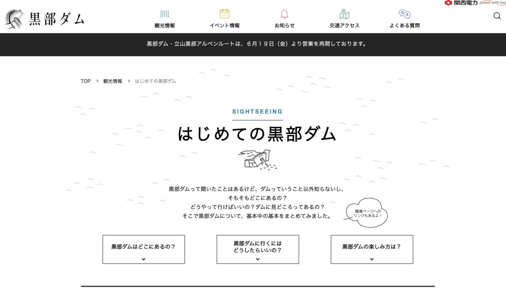
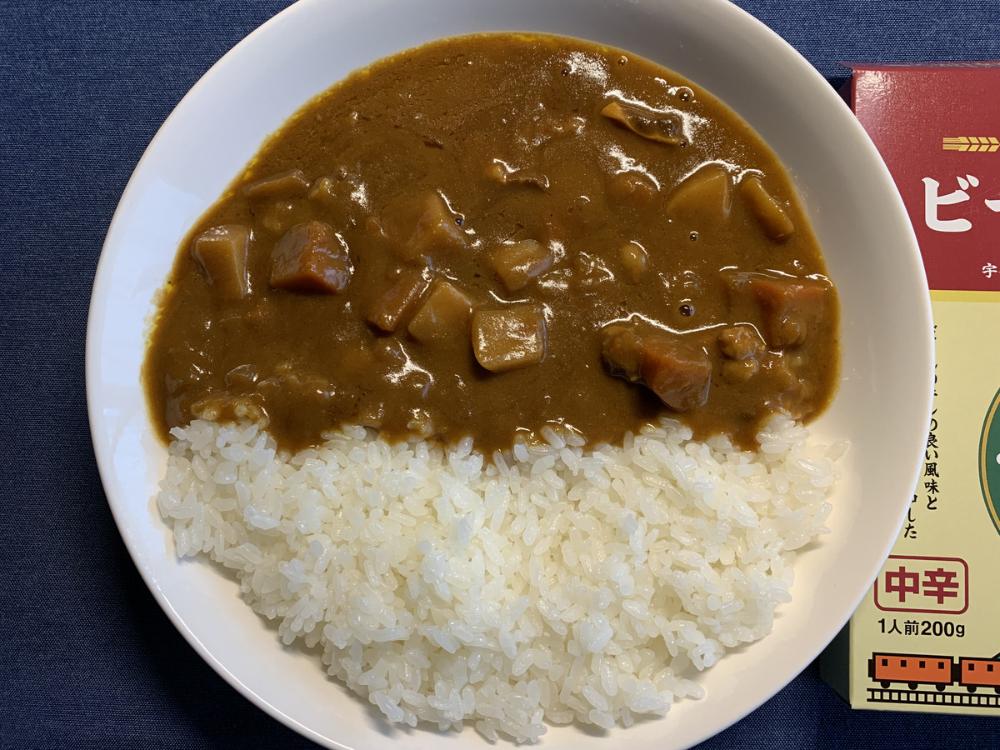

**カレーを食べよう！ :curry:**

そうだ！

**カレーを食べよう・・・！ :curry: :curry:**

---

えっ？最近楽しそうじゃないって？

自ら **カレーを食った罰** として

ブログを書いているわけではなーい！ :rage:

（どんだけマゾなの・・・w）

---

今日のカレーは **富山！**

**豊富な山！ :volcano: :volcano: :volcano:**

まだ行ったことないのよね〜 :open_mouth:

---

**富山 宇奈月麦酒ビールカレー！**

**わーーパチパチパチ :clap: :clap: :clap:**

---

ビールカレー、きましたよ〜〜〜 :beer: :beer:

だが、今までの経験上

**ビールカレーに :beer: :curry:**

**ビールの味はしない・・・！ :ok_hand:**

---

隠し味が **麦！**

くらいに思っておけばいいのかも・・・ :sweat_smile:

---

バックショット〜〜〜

**はい！ :sunglasses:**

---

**Oh, Sexy beer...!!! :sparkling_heart: :beer: :sparkling_heart: :beer: :sparkling_heart:**

セクシ〜ビア〜 :beer:

---

**宇奈月麦酒館** 、ってところが

作ってるらしいぞ？

**生産者に感謝！ :pray: :pray: :pray:**

---

https://www.unazuki-beer.jp/

> 黒部の名水はすごい。
>
> だからビールも旨い。

うわあ〜〜 :beer: :beer:

最初からそんなん見せてきたらずるいわ〜 :yum:

**レストラン** なんですって！ :fork_and_knife:

わ〜気になる〜 :eyes:

---

**宇奈月ビール！ :beer:**

現地で飲めちゃうやつ！

現地で飲めちゃうやつ！

---

ま、マスコットキャラクター・・・？ :thinking_face:

---

**HEY! :beer: :man:**

ぱ、パワーを感じる・・・

---

**モルト麦茶** 、なんてのもあるの・・・ :tea:

名前がやばい！ :astonished:

**モルト** って言われると

**なぜかそわそわしちゃう・・・！ :smiling_imp:**

---

**黒部の恵み** って言われたら

俄然気になっちゃいますわね〜

**黒部・・・行ってみたくなってきた！ :heartbeat: :heartbeat:**

---

https://www.info-toyama.com/tokushu/unazuki/3.cfm

**黒部峡谷トロッコ列車！ :mountain_railway:**

なんてのがあるらしいぞ :mountain_railway: :mountain_railway:

うお〜〜 **乗ってみたいぞ〜〜 :smiley_cat:**

ああああ〜〜 **感情の高まり〜〜**

---

**HEY! :beer: :man:**

---

ああ〜いいっすな〜

四季を・・・

**四季を感じたい・・・ :cherry_blossom: :leaves: :maple_leaf: :snowflake:**

---

温泉もあるのね〜

**最高か・・・！ :hotsprings:**

---

**最近、気づいた** んですよ・・・ :scream_cat:

体の調子を保つには

**適度に歩いて :runner:**

**適度に湯船に使った方が良いと・・・ :heart_eyes_cat:**

＼気づくのがおそーい！／

---

https://www.kurobe-dam.com/kankou/beginner.html

そう！ **黒部ダム！**

ダムとか全然くわしくないので、

気にはなってるんだけど、行ったことないのよね〜

**気になる気になる〜 :eyes: :eyes:**

---

> はじめての黒部ダム

あっこれ **攻略サイトだ・・・！**

どれどれ？ :thinking_face:

---

> 長野県の大町から入る方法と、富山県の立山から入る方法があります。

2つルートがあるらしいぞ？ :thinking_face:

> 長野ルートで黒部ダムに来られる場合、車なら直接「扇沢駅」までお越しいただけます。
> 電車ならJR信濃大町駅が最寄りとなり、そこから路線バスかタクシーでお越しください。
> 関東方面からは北陸新幹線にご乗車いただき、長野駅で下車し、そこから特急バスで扇沢駅までお越しいただくことができます。

へー、 **長野から入るのが一般的らしい・・・！ :grin:**

> 富山ルートの場合は、立山駅から立山黒部アルペンルートの各種乗り物を乗り継ぎ、お越しください。

おおっ、 **富山から入るルートもあるらしいぞ？ :smirk:**

---

なるほどなー :thinking_face:

さっきの **黒部峡谷トロッコ列車** は

**北から** 行けるとこまで行くやつ

（つながってない）

こっちの **黒部ダムへ行くルート** は

**西から** 黒部ダムまでいけるやつ

って感じなのか、へえー :satisfied:

---

**西から** 黒部ダムまでいけるやつ！ :raised_hands:

色んな乗り物 **乗り継いでいくらしい！ :mountain_railway: :mountain_cableway: :bus:**

---

実際に行くなら、

こういう **攻略サイトで予習**

してから行くのもいいな・・・ :sunglasses:

---

これ以上突き詰めると

**旅行計画ブログ** になっちゃう・・・！

この辺にしとこ！ :wave:

ちなみに・・・

---

**ダムカレー！ :curry:**

あ〜〜〜

これは **現地で食べたいね〜！！ :curry:**

**別で計画せねば・・・ :sunglasses: :sunglasses:**

（ブログはもうある・・・）

---

https://arnon.jp/toyamaben

ここで唐突に **卑猥な富山弁ワースト10〜**

---

> ちんちんぼんぼ
>
> ちんちんぼんぼしよ！

肩車のこと、 **ちんちんぼんぼ** っていうらしい・・・

**HEY! :beer: :man:**

---

> おちんちんかく
>
> おちんちんかいとかれ〜

まんまじゃん・・・！w

**HEY! :beer: :man:**

---

> 富山はちんちんがお好き！！

・

・

・

---

**HEY! :beer: :man:**

---

って、 **セクハラはダメだぞ・・・！ :cop:**

でも、みんなでせーので

**ちんちんぼんぼー！ :scream_cat:**

って叫ぶくらいなら許される・・・（はず）

---

ほらあ、 **ちんちん** 言ってる場合じゃないでしょー

**カレー！ :curry:**

食べる場所探さなきゃー

---

まあでも、今回はここかなー？ :mag:

（ぽちっ）

---

おお〜

やっぱ **黒部ダム** でしょ〜 :two_hearts: :two_hearts:

**行きたさ〜〜〜 :heart_eyes: :heart_eyes:**

---

ふむふむ〜？

**なるほど〜？ :eyes:**

---

**わー！ :cyclone:**

**わー！ :cyclone:**

すごい！ :muscle:

**治水！ :muscle: すごい！ :muscle: :muscle:**

**ここでカレー食うぞ〜〜 :fork_and_knife: :yum: :curry:**

---

## 実食！！

**久々に実食までの蛇足〜！ :sparkles: :sparkles:**

---

**宇奈月麦酒ビールカレー :curry:**

**出来上がりー！ :tada:**

わー :clap: :clap:

---

あんまり具材のアピールされなかったから

ルーがおすすめなのかなと思いきや！

**具材が意外にごろごろ！ :muscle:**

---

**ひゃあああ！！ :yum: :yum: :yum:**

もう我慢しきれないよ〜 :heart_eyes:

**では、いただきまーす！ :pray: :pray: :pray:**

---

（モグッ）

---

**おおっ・・・！ :flushed:**

---

（モグッ）

（モグッ）

---

**うまいうまーい！！！ :satisfied: :satisfied: :satisfied:**

---

具材ごろごろでおいしい！
甘辛いソースでパクパクいけちゃうスタンダードなカレーだ！
当たり前だけどビールっぽさはそんなに感じない、子供でもおいしく食べられちゃいそうな感じのど直球なカレーで旨い！

---

・

・

・

---

**ホア〜〜〜〜〜**

---

**ジャオ〜〜〜〜〜！！！**

---

**ほわわわわ〜ん！ :innocent: :innocent: :innocent:**

---

**:old_man: 「ふぉふぉふぉ・・・」**

（ﾌﾘﾌﾘﾌﾘﾌﾘﾌﾘﾌﾘﾌﾘﾌﾘ...）

**:old_man: 「出番は減ったが、どばどば使われておるよ・・・」**

（ﾌﾘﾌﾘﾌﾘﾌﾘﾌﾘﾌﾘﾌﾘﾌﾘ...）

---

**富山 宇奈月麦酒ビールカレー**

**おいしゅうございました！ :pray: :pray: :pray:**
