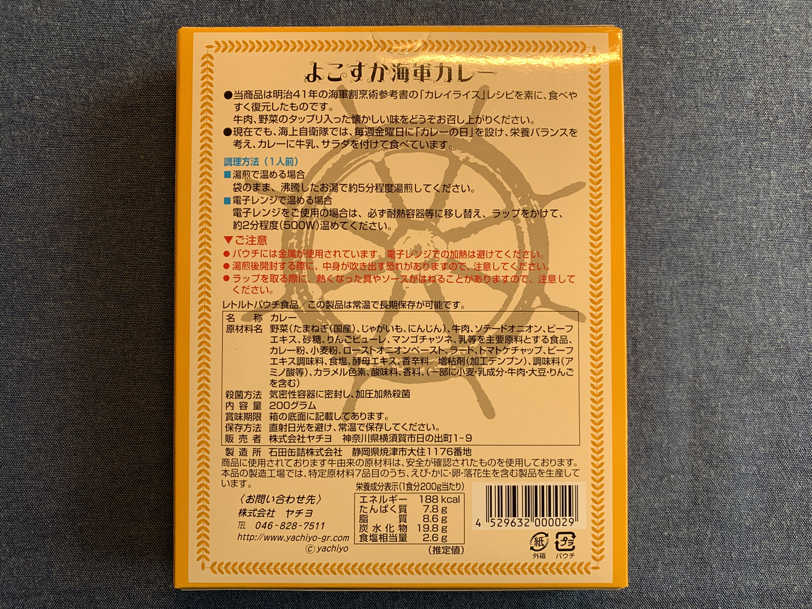
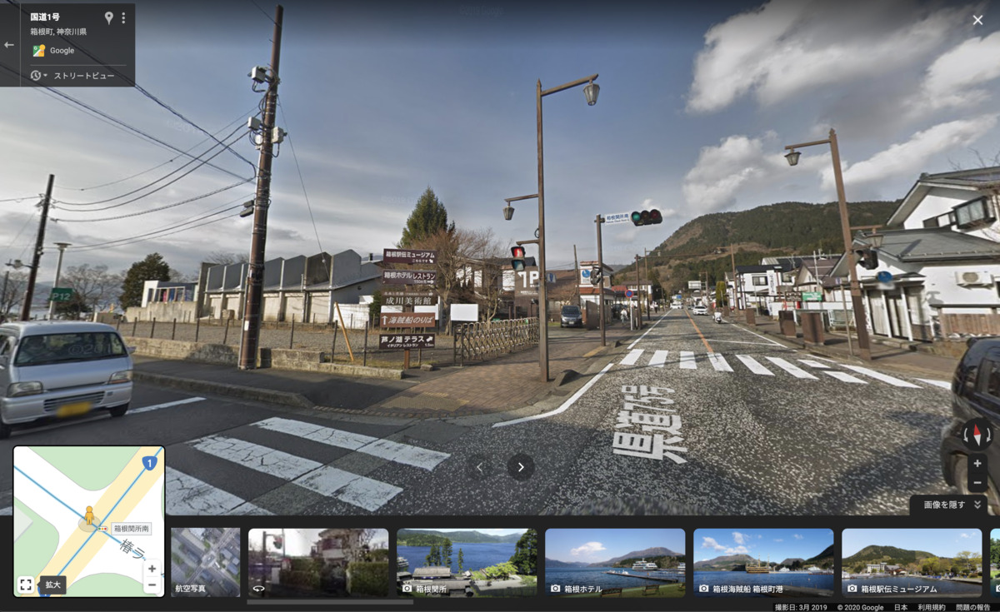
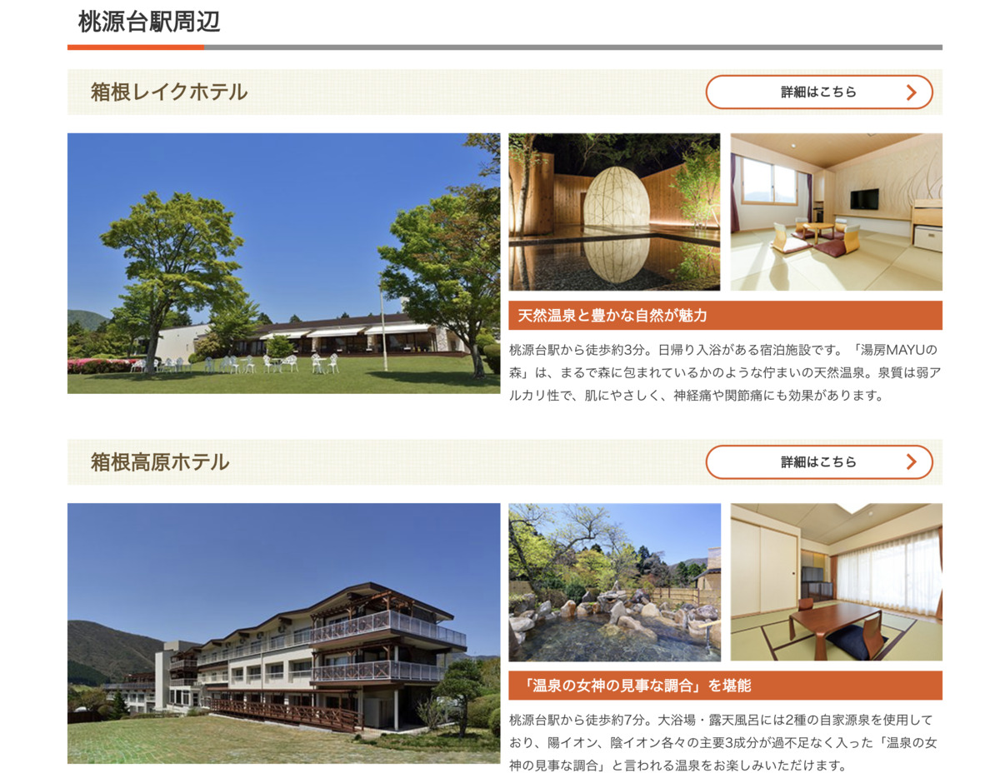

わーー :raised_hands:

**関東きちゃった** わーー :raised_hands: わーー :raised_hands:

---

えっ？

**山梨は関東** じゃないかって？

**こまけーことはいいんだよ！ :cop:**

**文化はグラデーション！ :rainbow:**

なのです！ :sunglasses:

---

じゃじゃじゃーん :tada:

今回は **神奈川！**

**よこすか海軍カレー！ :curry:**

いえーい！ :smile: :v:

---

なんか書いてあるけど・・・ :eyes:

うーん、 **読みづらいな？ :astonished:**

どれどれ〜？ :mag:

---

> トロミヲツケテ　御飯ニカケテ　食ベテミタラ、「コレハイケル」トイウコトニナリ・・・

ああ、 **あれ** を思い出す・・・

---

**開国シテクダサイヨー！ :person_with_blond_hair:**

これ、くっつけたら違和感なさそう・・・

---

**開国シテクダサイヨー！ :person_with_blond_hair:**

ほらあー！ :joy:

**違和感ない** じゃん！w

---

バックショットは〜

---

**Oh, Sexy Perry...!!! :sparkling_heart: :person_with_blond_hair: :sparkling_heart: :person_with_blond_hair: :sparkling_heart:**

セクシーペリー？

**セクシーペリー** ってなんだよw

---

ほらあ〜〜

まいかい **セクシーなんちゃらって言うルール**

なんか作るから〜 :speak_no_evil:

**何言っていいか分からなくなるんじゃん〜 :speak_no_evil:**

---

https://triplovers.jp/kanto/article/10468

**神奈川あるあるー！ :smiley_cat:**

---

**崎陽軒のシウマイ！**

ついこの前まで食べたことなかったんだけど

これ、 **本当に冷めても美味しかった・・・ :scream_cat:**

なめててごめんね・・・

**本当に美味しかったよ・・・ :yum:**

---

https://kiyoken.com/

今度は・・・！

**出来立てを食べたい・・・！ :yum:**

冷めても美味しいとはいえ！

**出来立てのが美味しい** に

決まっているじゃないか！！！ :rage:

＼デキタテ、クワセロ！／

---

おー **箱根・・・！**

**箱根** もね、 **神奈川県** なのよね・・・ :anguished:

意外と忘れがち・・・

---

**芦ノ湖！**

そうなのよー

毎年1月2日、3日にやっている

**箱根駅伝の舞台** なのだ！

**いきたーい！ :aerial_tramway: :smiley:**

---

そうここ！ :runner:

**テレビで見たことあるやつだ！！ :runner: :runner: :runner:**

---

http://www.hakoneekidenmuseum.jp/spot/01/

**へーー！ :satisfied:**

すぐ近くに **箱根駅伝ミュージアム**

なる建物があるらしい！

これは行ってみたいですなー :runner:

---

https://www.hakoneropeway.co.jp/ohwakudani/

そして

芦ノ湖の北にある **箱根ロープウェイ！ :aerial_tramway:**

うおー！いいじゃないすかー！ :stuck_out_tongue_closed_eyes:

---

おやおや〜？

**カレーがあるじゃないですかあ〜？ :curry: :curry: :curry:**

ということは？

**行って？ :running:**

**食べて？ :fork_and_knife:**

**ブログ？ :memo: の流れ？？？**

うぇーい！ :+1: :+1:

---

あ〜〜〜

**こういう噴煙しゅきー！ :heartbeat: :heartbeat:**

噴煙があるということは？

**温泉も？？**

---

**あるんですねー！**

**ああ〜良い〜〜良い〜〜 :innocent:**

---

https://www.hakone-lakehotel.com/hotspring/

**日帰り温泉！**

あんな **噴煙** 見せられて！

目の前に **日帰り温泉** あったら？

**入るにきまってるじゃん！ :rage:**

わーいいなー :raised_hands:

---

ゆるキャラ・・・ :eyes:

> 藤沢市のふじキュン！可愛いルックスのふじキュンの頭には、江の島がのっています。

そうなのか・・・ :sweat_smile:

---

**開国シテクダサイヨー！ :person_with_blond_hair:**

こっちのがゆるキャラな気がするなー :joy:

---

ご当地タレント・・・ :eyes:

> 神奈川のローカルスターと言えば「キンシオ」。神奈川県のスターで、県民で彼を知らない人はたぶんいません！

えっそうなんだ、知らない・・・ :sweat_smile:

---

**開国シテクダサイヨー！ :person_with_blond_hair:**

こっちのがご当地タレントな気がするなー :joy:

---

**ってこらー！ :cop:**

**ペリーいじり** しすぎるんじゃありません！ :cop: :cop: :cop:

現地でがんばってる **タレントさんに失礼** でしょ！ :pray:

---

https://www.tvk-yokohama.com/kin/

っていうか、東京に超近い神奈川で

**ご当地タレントが成立する :muscle:** って

**逆にすごくない？ :sparkles: :sparkles:**

---

頑なに東京へ行かない・・・ :angry:

**強い意志を感じる・・・！ :muscle: :muscle: :muscle:**

**ご当地タレント** 大事なので頑張ってほしい・・・！

---

https://www.cocoyoko.net/gourmet/yokosuka_navyburger.html

**横須賀ネイビーバーガーとな？ :thinking_face:**

---

あああーーー！！！ :yum:

**あああーーー！！！ :yum:**

**あーこれ絶対うまいやつぅー！ :rage:**

---

いいですねー

こういう **アメリカンな食べ物** も食えるの

**最高じゃないかー！ :star2: :star2: :star2:**

（横中しか目がなかったのは公然の秘密・・・）

---

今日は浦賀で **海軍カレー** を食べるのだ！ :mag:

ちゃんとカレー忘れてないやつー

（ぽちっ）

---

**浦賀の海** を眺めつつ！

**カレーを食う！ :fork_and_knife: :yum: :curry:**

---

## 実食

今回も

**旅行計画は完璧だ・・・！**

---

**神奈川 よこすか海軍カレー** の

**できあがりー！ :confetti_ball:**

おおー

スタンダードなカレー！ :curry:

**海の上で食うなら最高** じゃないのこれ〜 :yum:

---

ああ〜 **旨そう！ :yum: :yum:**

---

**生産者に感謝してー！ :pray: :pray: :pray:**

食べよう・・・！ :muscle:

**いただきます！！ :pray: :pray: :pray:**

---

（パクッ）

---

**むむっ・・・！ :flushed:**

---

（パクッ）

（パクッ）

---

**うまうまー！！！ :satisfied: :satisfied: :satisfied:**

---

ソースが濃厚！甘くて辛いソースが絡みつく感じで濃厚！うまーい！
具が大きくて食べ応えがある、具材もやわらかくて良いー！
あまりに食べやすすぎて、ホアジャオせんせーを出す前にペロリと食べ切っちゃった・・・！

---

**せんせー「えっ？ :weary:」**

---

**神奈川 よこすか海軍カレー**

**おいしゅうございました！ :pray: :pray: :pray:**
