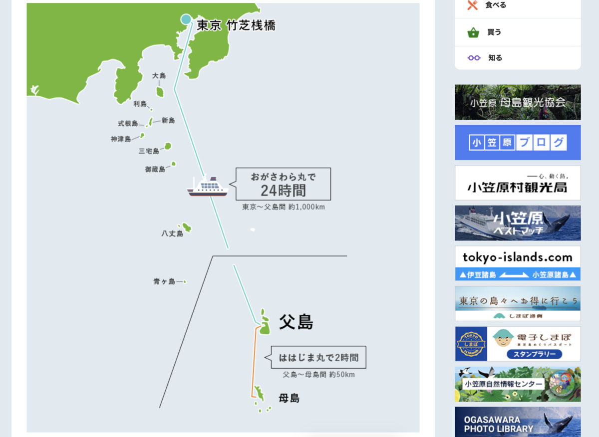

とうとうきましたね・・・

**東京まで・・・！ :tokyo_tower:**

---

東京って

**いろんなものが集まる都市** だから

**東京自体の名物** を使った

カレーなんかあるの？ :thinking_face:

な〜んて思ったこともありました

---

でも

**あるんですよねー :smiley: :smiley:**

**TOKYO X...!!! :no_good:**

---

**じゃーん！ :confetti_ball:**

今日は **東京X豚ポークカレー！ :curry:**

**TOKYO X...!!! :no_good:**

どうやらそういう **豚 :pig:** がいるらしい

---

**Oh, Sexy X...!!! :sparkling_heart: :no_good: :sparkling_heart: :no_good: :sparkling_heart:**

> TOKYO X とは、「北京黒豚」、肉質が良い「パークシャー種」、脂肪交雑が入る「デュロック種」をもとに、東京都が・・・

なるほど **かけあわせ！ :no_good:**

脂肪交雑？は **霜降り** のことを言うらしい！

**なるほど！ :sunglasses:**

---

・

・

・

---

さーて今日は！

日本の首都である **東京 :tokyo_tower:**

ではなーく！

**いち地方としての東京**

のおもしろーなネタを :eyes:

**存分に探していくぞ！ :muscle:**

---

うぇーい :metal:

**うぇいうぇーい :metal: :metal:**

---

https://jouer-style.jp/1176

**あ〜そう！ :satisfied:**

**こういうの！ :smile: :two_hearts:**

---

**地方から出てきた人** の集まりで :family:

意外と **東京地方の名物 :tokyo_tower:** って

知らない人も多いのよ〜 :thinking_face:

---

> 東京の郷土料理は、「もんじゃ焼き」や「どじょう鍋」など

えっ？そうなの？

**まじかー！ :baby: :thought_balloon:**

**早速知らなかったぜー :scream_cat:**

---

https://tripeditor.com/387387

**もんじゃ！ :japanese_ogre:**

どこで食えるのかなーと思ったけど

**月島** ってとこが **発祥** っぽい！ :crossed_flags:

ほええ〜 :hushed:

---

なるほど **戦後** ・・・ :thinking_face:

いろんな名物を見ると

**比較的最近っぽさ** あるね〜

といっても75年経ってるけど・・・

---

おおっ！ :grinning:

**ええやん！ :kissing_closed_eyes:**

**好美家（よしみや）** さん！ :eyes:

---

https://monja.gr.jp/restaurant/yoshimiya/

あ〜〜これは雰囲気からして

**美味しそうなにおいが〜〜〜 :thought_balloon: :thought_balloon: :thought_balloon:**

これはいきたい！ :rage:

**行きたいぞー！ :rage:**

---

**あああ〜〜〜 :cupid:**

**好美家** さん以外にも

**美味しそうなお店、たくさんありそう！ :yum:**

っていうか **商店街っぽさ〜 :sparkles: :sparkles:**

---

**これはいいっすな・・・ :sunglasses:**

なんかの用事で東京行くときに

ついでに食べよう・・・ :yum:

---

https://ja.wikipedia.org/wiki/%E3%81%A9%E3%81%9C%E3%81%86%E9%8D%8B

**どぜう鍋！ :fish:**

どじょう！じゃなくて **どぜう！**

---

https://www.dozeu.com/asakusa/

**うひゃー！ :hatched_chick:**

**浅草 :izakaya_lantern:** に

**専門店 :house:**

あるっぽいぞおおお〜？ :stuck_out_tongue_closed_eyes: :stuck_out_tongue_closed_eyes:

---

**おお〜 :+1: :+1: :+1:**

こういう

**専門店、しゅき〜 :heart_eyes: :heartbeat:**

あ〜どれも旨そうすな〜

でもやっぱり・・・？

**どぜうなべが気になるうぅぅー！ :yum: :fork_and_knife:**

---

いやあ〜

もんじゃも、どぜう鍋も

**どっちも旨そうだなー食べたいなー :smile:**

---

> 東京には、11の離島があります。伊豆諸島の大島・利島・新島・式根島・神津島・三宅島・御蔵島・八丈島・青ヶ島の9つの島と、小笠原諸島の父島・母島の2つの島です。

そう！

**離島！ :star2:**

島はいい・・・ :sparkles:

**島はいいぞ・・・ :sparkles:**

---

っていうか、東京

**島多い** じゃん・・・！

**ずるいぞずるいぞー！ :rage:**

---

https://www.ogasawaramura.com/

小笠原ー！

**父島ー！**

はー気になりますねー :eyes:

気になっちゃいますねー :eyes: :eyes:

---

**島野菜・・・！ :tomato:**

これは **旨そうー！ :yum:**

**現地で食べたいやつー！ :lemon: :sushi:**

---

他にはどんなものがあるのかなー？ :mag:

（ぽちぽちっ）

---

**・・・小笠原ラムとな？ :thinking_face:**

---

http://www.oga-rum.com/

**いえーい！ :v:**

小笠原ラムのページだぜ〜

なかなかに **味のある** サイトだぜ〜 :muscle:

---

なになに〜？

> 小笠原では、開拓初期（１８３０年頃）の欧米系定住者が捕鯨船とラム酒の取引を行っており、ラム酒製造の土壌は備わっていました。１８７６年に日本領土になってから、亜熱帯の気候を生かし、サトウキビの栽培による製糖業が盛んになり、その過程で生じた副産物を発酵・蒸留してつくった酒を島民は飲むようになりました。その酒は「泡酒」や「蜜酒」などと呼ばれ、太平洋戦争中に島民が強制的に内地へ疎開させられるまで永く愛飲されてきたのです。
>
> 終戦後、小笠原はアメリカが統治し、１９６８年(昭和４３年)に日本に返還されました。返還後、疎開先から徐々に小笠原に戻ってきた旧島民にとって、疎開前に愛飲していた酒の味は忘れがたいものでした。

そうなのよねー。 :sob:

沖縄だけが話にあがるけど

**小笠原** もそうなのよねー。 :pray:

---

にしても、

**疎開前に愛飲していた :sake:**

**酒の味は忘れがたい :sake: :sake:**

いいですねえ〜 :blush: :blush:

---

> こうした独自の歴史を背景に村おこしの１つとして小笠原ラム・リキュール株式会社が設立され、小笠原の地酒としてのラム酒が誕生し、１９９２年(平成４年)より販売を開始しました。

なるほど！ :joy_cat:

最近（でもないけど） **復活した** ってことなのね！ :muscle:

**こりゃー気になります！ :sake:**

---

**現地で・・・！ :checkered_flag:**

**飲みたい・・・！！！ :tired_face: :sake:**

むしろ

**行きたい・・・！ :rage:**

（どうやっていけば・・・）

---

https://www.ogasawaramura.com/go/

**これだっ！ :smiling_imp:**

ぐひひっ！ :smiling_imp: :smiling_imp:

---

なるほどー？ :thinking_face:

**24時間** かあ〜

**思ったよりは時間かからないな〜**

---

**鹿児島** から

**那覇** まで

**フェリーで25時間 :ferry:** かけて

いったことを考えれば

**ちょろいちょろい〜 :ferry: :smiling_imp:**

---

http://www.ogasawarakaiun.co.jp/

フェリー情報ここか！

**小笠原海運さん！ :ferry:**

はー

こういうの見てると

**わくわくしちゃう・・・！ :heartpulse: :heartpulse: :heartpulse:**

---

なるほどレストラン！

つまり・・・

**ここで？ :thinking_face:**

**カレーライスを注文して？ :thinking_face:**

**ブログに書くと・・・？ :smiling_imp: :smiling_imp:**

（あとは、わかるな？の流れ）

---

ついでに **時刻表 :clock:** を

見ておくかあ〜 :mag:

まあすぐには行かないけど〜

（ぽちっ）

---

**！？！？ :dizzy_face:**

な、なるほど？

船自体は24時間で着くけど

行ったら戻りの船が

**4日後にしかない・・・！ :boom:**

---

つまり・・・！ :see_no_evil:

**6日間** 確保する必要があるッ・・・！ :see_no_evil:

**難易度が・・・！ :see_no_evil:**

**高いッ・・・！ :see_no_evil:**

でも **行きたい・・・！ :sparkles: :sparkles: :sparkles:**

---

今日は **行ったつもり** になって

**小笠原のどこかでカレーだ！ :curry:**

---

**ひゅう〜！ :kissing_smiling_eyes:**

**父島のフェリーターミナルを眺める灯台！**

あ〜いいですねえ〜

**ここに決めた！ :bulb:**

---

## 実食！！

次回の東京のカレーは :curry:

船の上のやつかもしれない・・・！ :ferry:

今日は **TOKYO X...! :no_good:** を食うぞー！

---

**どーん！ :boom: :boom:**

きたー！ **TOKYO X...! :no_good:**

いいねえ〜 :eyes:

**旨そうだね〜 :smiley:**

---

おお〜思ったより **具材ごろごろ！**

---

はよぅ〜 :tired_face:

**はよぅ〜食べたいよぅ〜 :yum:**

---

**生産者に感謝して〜 :pray: :pray:**

**いただきまーす！ :pray: :pray: :pray:**

---

（モグッ）

---

**おおっ・・・！ :flushed:**

---

（モグッ）

（モグッ）

---

**うまいうまーい！！！ :satisfied: :satisfied: :satisfied:**

---

今までで一番スパイスを感じられるカレーかもしれない、それくらいルーがスパイシー！
ポークがまたスパイスに合う、おいしい！
ラベル見ても香辛料としか書いてなくて気になるー、スパイシーなカレー大好きー！

これは、ホアジャオせんせーの

頑張りがいがあるぞ！ :+1:

---

**ほわわわわ〜ん！ :innocent: :innocent: :innocent:**

はい :sunglasses:

（ﾌﾘﾌﾘﾌﾘﾌﾘﾌﾘﾌﾘﾌﾘﾌﾘ...）

スパイスカレーも :sunglasses:

（ﾌﾘﾌﾘﾌﾘﾌﾘﾌﾘﾌﾘﾌﾘﾌﾘ...）

ふりふり :sunglasses:

（ﾌﾘﾌﾘﾌﾘﾌﾘﾌﾘﾌﾘﾌﾘﾌﾘ...）

しましょうねえ〜 :innocent:

---

**東京 東京X豚ポークカレー**

**おいしゅうございました！ :pray: :pray: :pray:**
