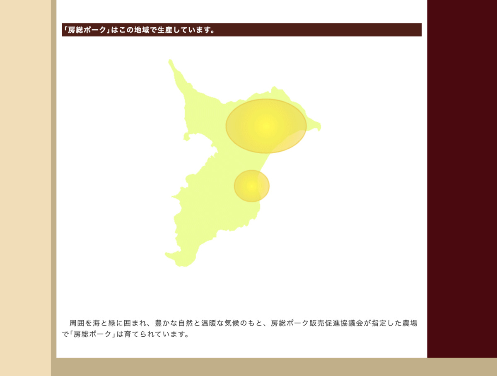

**ちばぁ〜 :rage:**

とうとう **千葉** まできてしまった

**本州の南東** だぞ！ :smiley_cat:

---

**いいねえ〜 :+1: :+1: :+1:**

んで **今日のカレー** は〜？ :mag:

---

**じゃーん！ :confetti_ball:**

**房総ポークカレー！ :curry:**

いえーい :+1: ポークだうぇーい :metal:

---

**房総半島** とかよく聞くけど

たぶんその辺で作ってる豚なのかな？ :mag:

（ぽちっ）

---

http://www.boso-pork.gr.jp/bsp_boso-pork.html

**房総ポーク** のページがあったぞー

---

**なるほどこの辺！ :grinning:**

**ざっくり** だけど分かる！ :smiley:

**間が飛んでたり、丸がざっくり** なのは

**つっこんじゃいけないぞ！ :cop:**

だいたいこの辺、で **こまけーことはいいんだよ！**

のやつ〜 :stuck_out_tongue:

---

そんでもって〜〜〜

**バックショット** は〜〜？

はい！

---

**Oh, Sexy Pork...!!! :sparkling_heart: :pig: :sparkling_heart: :pig: :sparkling_heart:**

**暴走豚祭り :pig: :dash:** じゃー！

---

**暴走豚 :pig: :dash: わっしょい！ :dancers:**

**わっしょい :dancers: 暴走豚！ :pig: :dash:**

**暴走豚 :pig: :dash: :pig: :dash: わっしょい！ :dancers:**

**わっしょい :dancers: 暴走豚！ :pig: :dash: :pig: :dash:**

わ〜〜〜 :clap: :clap: :clap: :clap: :clap:

---

この

**意味のない儀式〜 :two_hearts:**

ぶーぶー :pig: :pig:

---

ちなみに今回は

**東京要素** は徹底的に排除していくぞ！

だって **千葉** だからね！ :triumph:

**東京 :tokyo_tower:** とついているものは

**積極的に避けていく** スタイルで！ :sunglasses:

---

千葉で **おいしいお酒 :sake:** とか

ないんですかねー？ :thinking_face:

って **展開がはやーい！ :boom:**

---

むむっ？ :thinking_face:

**薬草園の蒸留所とな？？**

（ぽちっ）

---

https://colocal.jp/news/98587.html

うおーなんじゃこれー！ :herb: :herb: :herb:

**ミトサヤ薬草園蒸留所** とな？

---

ふむふむ、なるほど？ :thinking_face:

> 薬草園の跡地に日本初の「ボタニカル・ブランデー」の蒸留所をつくる
> ——そんなプロジェクトの資金を募るクラウドファンディングがスタートしました！
>
> ボタニカル・ブランデーとは、ヨーロッパでは「オー・ド・ヴィー」とも呼ばれる、
> フルーツやハーブからつくられる蒸留酒。
> 梨やぶどう、ベリーなどの果物を発酵させ、複数回蒸留することでできます。
> ジンやウォッカよりもずっと繊細で、フルーツの芳香が立ち上がるお酒なのだとか。

うおー！ :satisfied:

こんなのがあったのかー！知らんかったー！ :satisfied: :satisfied:

どうやら **最近** できたらしい！

**へー！いいないいなー :yum:**

**千葉、ずるいぞー！ :rage: :rage:**

---

http://mitosaya.com/

うおーこれが **公式サイト** かあ :sparkles: :sparkles: :sparkles:

**薬草園、良さげ・・・！ :heartbeat:**

---

> ようこそmitosaya薬草園蒸留所へ。
> 私たちの活動を現地で体験していただけるオープンデーを開催しています。

おおー見学もできるっぽい！ :eyes:

**行きたい！行きたいぞー！ :heart_eyes: :heart_eyes:**

---

はーなんかそわそわしてきた :smile:

なんか **OUT OF STOCK** って

書いてあるやつばっかなんですけども

> 毎日朝に採れたものをお昼頃に取りに行き、そのまま加工するという超近所だからできる加工法で、一週間かけて約80キロを仕込みました。
>
> 完熟のいちごの甘やかなアロマをそのまま閉じ込めたようなストロベリーのブランデーに、パキスタンのオーガニックのマルベリー、いすみで採れたヤマモモで作ったスピリッツをブレンド。

あ〜おいしいやつ〜 :yum:

**絶対おいしいやつぅ〜！ :yum:**

---

なるほどなー :relaxed:

これは **行きたい** なー :sake:

そういえば、もうちょい南に行ったところに

**鴨川** あるんだっけ？

ちょっと気になってるのよねー :mag:

（ぽちっ）

---

http://www.city.kamogawa.lg.jp/kanko/index.html

**鴨川市の観光ページ :eyes:**

ちゃんとありますやんー :+1:

担当者の方々に敬礼！ :pray:

---

あー鴨川シーワールド！

行ってみたいなー

**気になる気になるー :sparkles: :sparkles:**

---

http://www.kamogawa-seaworld.jp/

おおー **シャチ！ :heartbeat:**

**いいですねー！ :fish: :fish: :fish:**

やはり生き物は見てて飽きない・・・

良い・・・ :star2: :star2: :star2:

---

うひょー！

**シャチ見ながら飯食える** ってよ！ :fork_and_knife:

**すごい！ :joy: :+1:**

まあ、直接シャチが見られる席は

少ないかもだけど・・・

でもいいなー :two_hearts: :two_hearts:

---

鴨川・・・

**思ったよりもいいっすね・・・ :innocent:**

他にはどんなんあるのかな〜？

---

https://kamotabi.jp/

おおー :star2: :star2: :star2:

いつもの **地元観光サイトー！**

**カモ旅！ :eyes:**

こういう情報、大事よ〜 :muscle:

で、この

**おらが丼 :fu:** ってなんすかね？

（そわそわ・・・）

---

> 鴨川には
> 「おらが丼」がある！

あーしってるぞー！

しってますぞー！

**地元の美味しい素材 :fish:** を

**決められたフォーマット** に沿って

色々 **混ぜちゃう** のを

**同時多発的に提供しちゃうやつー！ :sparkles:**

（だいたいあってる）

---

**うぇ〜い！ :metal: :metal:**

---

**うぇいうぇ〜い！ :metal: :metal: :metal:**

**こんなん絶対うまいやつやん！ :fork_and_knife: :yum: :+1:**

---

えっ？ **温泉 :hotsprings:** もあるの？

なにそれ **無敵 :star:** じゃん！ :star2:

---

**あ〜〜〜 :innocent:**

---

**あ〜〜〜いい〜〜〜 :innocent: :innocent:**

おらが丼食って温泉入ったら最高じゃん！ :innocent:

あ〜いいなあこれ〜

---

あとは **移動手段** だなー :car:

ん？ **フェリー？ :thinking_face:**

---

> フェリーをご利用の方

フェリー？ :thinking_face: :thinking_face: :thinking_face:

**フェリー :ferry: のルート** なんかあったっけ？？

---

http://www.tokyowanferry.com/

ほほーなるほど！

**東京湾フェリー！ :ferry:**

**東京湾** にも **フェリールート :ferry:** があったのか

知らなかったー！ :sweat_smile:

---

おっとっとー！

**毎回フェリー :ferry: で脱線** しちゃってるから

気になりつつも **今回はスルー** だ！ :see_no_evil:

実際フェリーで行ったりはしないからねー :expressionless:

---

やっぱり **電車 :train:** かなー？

**安房鴨川駅（あわかもがわえき）！**

なるほどー :kissing_smiling_eyes:

あとは **カレー :curry:** に絡めてぐふふふふーですよ :smiling_imp:

---

## 実食！！

もう完全に **旅行計画ブログ :pen:**

と成り果ててしまった・・・

だが後悔はない・・・！ :smiling_imp:

**千葉（Not 東京）、最高じゃないか！ :+1:**

---

そんな **千葉・房総ポーク** を使った

カレーはこれ！ :curry:

---

じゃじゃじゃーん！

**出来上がりー！ :tada:**

**生産者に感謝ー！ :pray: :pray: :pray:**

---

もう作るのが **最適化** されつつある・・・！

**熱湯！コメ！ルー！**

隙のない業務フロー！ :muscle:

---

**はー旨そうだなー！ :yum: :yum: :yum:**

---

そろそろ我慢できないよー！ :rage:

**食べよう！ :fork_and_knife:**

**いただきまーす！！！ :pray: :pray: :pray:**

---

（モグッ）

---

**うまっ・・・！ :satisfied: :satisfied: :satisfied:**

---

（モグッ）

（モグッ）

---

**うまいうまーい！！！ :satisfied: :satisfied: :satisfied:**

---

甘さひかえめ、スパイシーなカレールーが美味しい！ホアジャオに合う！
豚肉も適度に歯応えがあってカレーにマッチしてる！おいしいぞー！
辛いのが苦手だけど、甘口カレーで特に甘いのが好きではないんだけどなーって人に向いてそうなカレーだ！

---

・

・

・

---

最近・・・！

ホアジャオをいろんなところで使いすぎて

**ホアジャオせんせー** の寿命が

一気に縮んできてる！ :innocent:

またスーパーで弟子を仕入れなきゃ・・・！

＼じゃおじゃおー／

---

**千葉 房総ポークカレー**

**おいしゅうございました！ :pray: :pray: :pray:**
