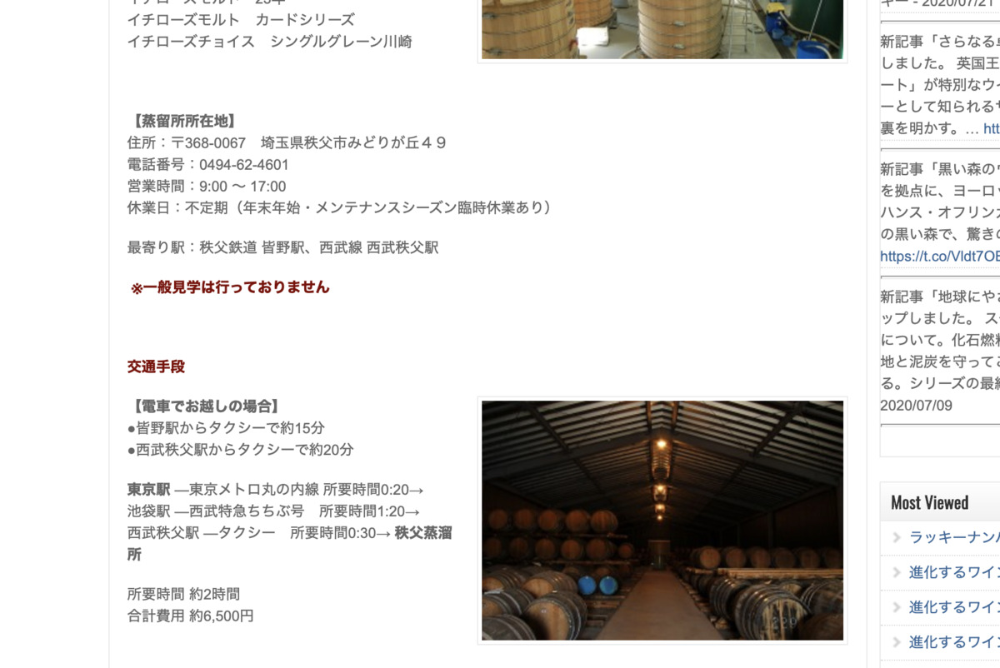
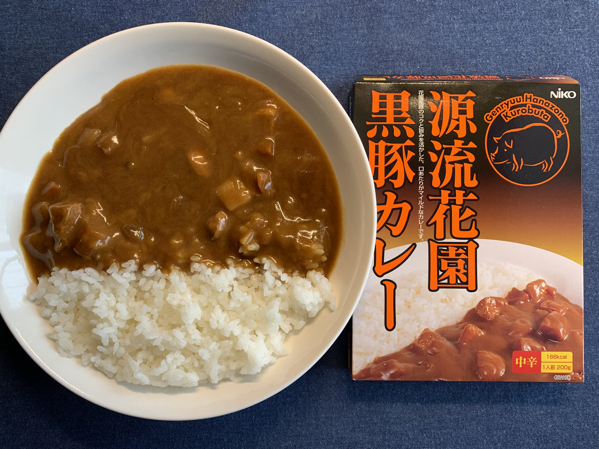

**さいたまー！ :smiley:**

＼さいたまー！／

今日は **さいたまー！ :smiley:**

---

関東に住んでない人だと

いまいち位置関係がわからないかもだけど

さいたまー！は **池袋の北！ :point_up_2:**

池袋が **さいたまの玄関口** と

呼ばれているとかなんとか・・・

---

今日のカレー :curry: はこいつ！

**Yeah!! :sunglasses:**

---

**源流花園黒豚カレー！ :tada:**

**源流花園黒豚** とは・・・？ :thinking_face:

なんじゃろな？？ :thinking_face: :thinking_face:

---

そんでもって

バックショットはこれ！

**C'mon!! :sunglasses:**

---

**Oh, Sexy Pork...!!! :sparkling_heart: :pig: :sparkling_heart: :pig: :sparkling_heart:**

**セクシーポーク** はいりましたー！

ポークはポークで安定して美味いのよ〜

**うまいブヒ！ :pig: うまいブヒ！ :pig: :pig:**

---

さてさてー

**源流花園黒豚** がなんなのか

分かってないので

**ぐーぐるせんせー** に聞いてみちゃおう :raised_hand:

ぽちっとな :mag:

---

http://www.hanazonokurobuta.com/

なるほどーこれかー！

さっそく **生産者に感謝！ :pray: :pray: :pray:**

長い時間育てた豚を

カレーにパッケージングして

**5分で準備して食える :alarm_clock:**

ところまで落とし込んでくれて :man_with_turban:

ありがとう・・・！ :pray:

---

わー **100年** も養豚業やってるらしい！

**すごい！！**

明治29年からやってるらしい・・・ :eyes:

ひええ〜〜 :hushed:

---

**さいたまー！ :smiley:**

なんか **池袋と埼玉** 、密接な関係があるらしい

---

**よくわかる埼玉県〜** によると

どうやら

**埼玉の首都は池袋** らしい :joy:

な、なるほど・・・？w

あーでもこういう図すきなのよ :heart_eyes:

---

あ〜〜いいっすね〜

**気になるとこ、順にみていこ！ :eyes:**

---

https://metsa-hanno.com/

**ムーミン谷！** :eyes:

**ムーミンバレーパーク** っていうらしい！ :heartbeat:

ムーミン谷がこんなところにあったのか！ :smiley_cat:

へえ〜〜気になる〜〜 :girl:

---

おお〜〜 :two_hearts:

アニメでみたことあるやつだ〜〜

---

ムーミン以外でも、 **自然豊か** で

**ぶらぶらお散歩** するだけでも楽しそうねえ :evergreen_tree: :evergreen_tree:

なるほど埼玉にこんなのあるのかあ :unamused:

---

なんか地図に書いてあった

**ゼリーフライ** ってなんじゃろな？ :thinking_face:

ぽちっ :mag:

---

> ゼリーフライは、埼玉県行田市で作られている食品の商品名であり、おからを主としたものをパン粉などの衣を使わずに素揚げしたコロッケの一種である。行田付近地域限定の食べ物であり、広範囲に普及はしていない。近年は自治体がB級グルメとしてその存在をPRしている

へえ〜〜

**行田市** でのみ流行ってる **超ローカルグルメ** らしい

でも **ゼリー全然関係ない** ・・・ :confounded:

**おからじゃん！ :rage:**

---

> 名称の「ゼリー」はゼラチンで固めた菓子の「ゼリー」ではなく、形状や大きさが小判に近いことから「銭富来（ぜにふらい）」と呼ばれていたものが訛り、「ゼリーフライ」に変化したとされている

なるほどー！

小判の方の **銭** :moneybag: らしい！

**Oh! Flied money...! :money_with_wings: :money_with_wings: :money_with_wings:**

---

https://www.city.gyoda.lg.jp/15/04/12/gurume/zerifurai/zerifurai.html

あ〜いいっすな〜

こういうのは **現地で食べないとね！ :yum:**

**食べられる場所** がまとめられてて良いね〜 :+1:

---

そうそう！

**深谷ねぎ** も有名だよね！ :heartbeat:

ねぎ、好きなのよ〜〜〜 :heart_eyes_cat:

---

http://www.city.fukaya.saitama.jp/kanko/tokusan/fukayanegi/1391492634591.html

> 深谷ねぎの旬はなんといっても12月頃から出荷が始まる「秋冬ねぎ」。寒さで甘みが増す冬の時期、深谷の大地が育んだ、甘くてやわらかい深谷ねぎのおいしさをぜひ堪能してください。

あ〜〜〜！ :heartpulse: :heartpulse: :heartpulse:

**旬の時期に現地で食べたい〜〜〜！ :yum: :yum: :yum:**

---

https://www.tripadvisor.jp/ShowUserReviews-g298180-d13040318-r616850599-Kushiyakitei_Negi_Kitayono-Saitama_Saitama_Prefecture_Kanto.html

そうそうそういうとこ！

**ねぎ** をテーマにしてくれてる

お店、いいよね・・・！ :+1:

**串焼亭ねぎ** さん！ :yum:

たんまりねぎ食べたい！食べたい！！ :yum:

**食べたい！食べたいよう！！ :tired_face:**

---

https://www.railway-museum.jp/

なるほど？ :thinking_face:

**鉄道博物館！ :train:**

こういうのもあるのかあ〜 :satisfied:

---

**その手の乗り物 :train: が好きな人には**

たまらんだろうな〜 :satisfied: :satisfied:

---

えっ？

ちなみに僕はそこまでじゃないのよ :confused:

**移動が好き** なだけで

乗り物自体には

特にこだわってなかったりする・・・

---

特に **蒸留所とか、醸造所** とかの見学だと

運転できないからねえ・・・

公共交通機関、ありがたや〜 :pray:

---

https://navi.city.chichibu.lg.jp/about/

そう！

**秩父！**

秩父も埼玉だった！ :blush:

秩父もいろいろ歩いてて楽しそうだなー

---

歴史あり〜の :grin:

自然あり〜の :grin:

**良いね〜 :+1: :+1: :+1:**

でも〜〜〜？

**秩父といえば〜〜〜？ :sunglasses:**

---

http://whiskymag.jp/chichibu_j/

**ウイスキーでしょ！ :wine_glass: :wine_glass: :wine_glass:**

**うぇ〜〜〜〜い :sunglasses: :metal:**

けんがくけんがくぅー！ :smile_cat:

---

>  ※一般見学は行っておりません

**！？！？！？**

けんがく・・・ない・・・ :disappointed:

**けんがく・・・ない・・・ :disappointed: :disappointed:**

残念・・・

ないのなら仕方ない・・・

仕方がないが・・・

---

https://travel-star.jp/posts/1006

**ほほぅ〜？ :sunglasses:**

**秩父ウイスキー祭り** とな？

すごく・・・いいです・・・ :yum: :yum: :yum:

---

https://www.chichibuwhiskymatsuri.jp/

ああ〜〜こういうの

**参加したい〜〜行きたい！行きたいぞ！ :rage:**

どこかでタイミング合わせて

**参加できるといいなー！**

---

## 実食！！

さてさてカレーに戻って

**埼玉 源流花園黒豚カレー** を食べるぞー！ :muscle:

---

**どーん！！ :boom: :boom: :boom:**

おお〜いいねえ〜〜 :sparkles: :sparkles: :sparkles:

---

**はー旨そうだなー！ :yum: :yum: :yum:**

---

もー早くたべたーい！！！ :yum:

**いただきまーす！！！ :pray: :pray: :pray:**

---

（モグッ）

---

**うまっ・・・！ :satisfied: :satisfied: :satisfied:**

---

（モグッ）

（モグッ）

---

**うまいうまーい！！！ :satisfied: :satisfied: :satisfied:**

---

わー食べた瞬間スパイシー！

カレーとスパイシーさがマッチしてたまらなく美味い！
お肉もほどよく歯応えがあり、他の具材もスパイシーなルーとともに味わえて良い！

---

・

・

・

---

＼じゃおじゃおー／

＼じゃおじゃおー／

---

**埼玉 源流花園黒豚カレー**

**おいしゅうございました！ :pray: :pray: :pray:**
