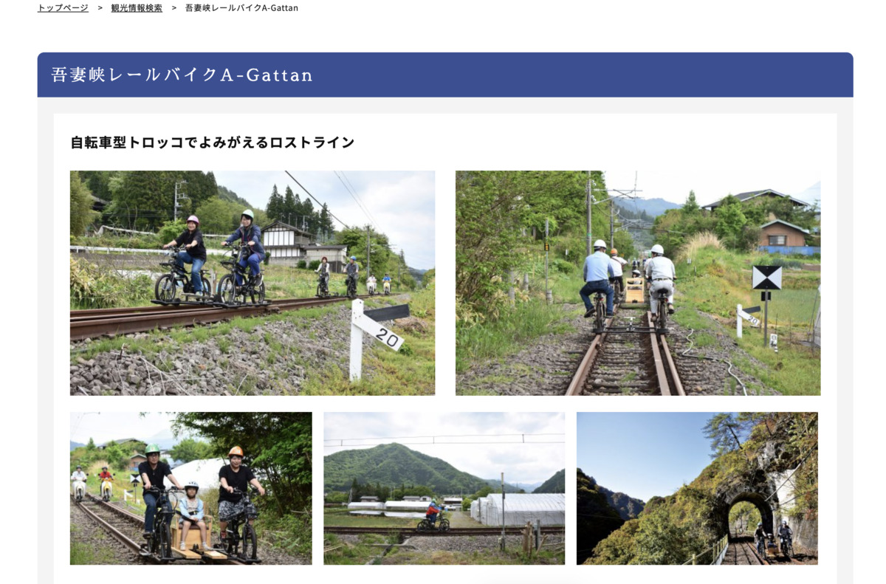
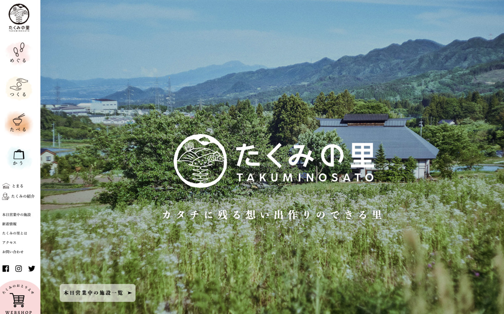

**ぐんまー！**

とうとう **群馬** まできちゃったぞ！ :runner:

38食目だから

今回ので **残り10食だー！ :v:**

いえいいえい〜

---

もう

ほとんど書く内容が

**旅行計画** になっちゃってるー！ :airplane:

でも〜 :bookmark:

**良いのです良いのです :blush:**

---

**今日のカレーは？ :curry:**

これ！ :cow:

---

**群馬 赤城牛ビーフカレー！ :curry:**

わー！ :tada:

**わー！わー！ :tada: :tada:**

> 口の中でほろりととけて、ジュワッと広がる

そういう表現ずるいぞー！ :rage:

**ずるいぞずるいぞー！ :rage: :rage:**

---

まじめな食レポサイトではないけど〜

**表現のレパートリー** は欲しい！ :yum:

「ん〜お口の中で〜」

「ほろりととけて〜しまいますね〜」

とかさっと出したいわ〜 :speech_balloon:

---

**バックショット！ :boom:**

---

**Yeah! Sexy beef...!!! :sparkling_heart: :cow: :sparkling_heart: :cow: :sparkling_heart:**

うぇ〜い :metal:

またまた安定の〜

**セクシービーフ！ :cow: :cow: :cow:**

---

レトルトカレーは :curry:

**牛と豚、二台巨頭っすな :cow: :pig:**

---

https://akagigyu.jp/

んでもって〜 :eyes:

作っているのがこちら :muscle:

**鳥山畜産食品株式会社** さん〜 :confetti_ball:

さあ！

**生産者さまに感謝** するのだ！ :pray: :pray: :pray:

かんしゃ〜 :pray:

**かんしゃ〜かんしゃ〜 :pray: :pray:**

---

そうそう、 **観光サイト :mag:** をみながら

**美味しいもの :fork_and_knife:** や **素敵な場所 :camera:** を

探そうぜ！ :heart_eyes:

**どれどれ〜？ :mag:**

---

https://apps.apple.com/jp/app/%E3%81%90%E3%82%93%E3%81%BE%E3%81%AE%E3%82%84%E3%81%BC%E3%81%86/id517048771

そうそうこれこれ！

**ぐんまのやぼう！ :sunglasses:**

そう、これでね

**各都道府県を制圧して群馬県に**

・

・

・

ってちがーう！ :boom:

---

ってなにこれ？ :thinking_face:

**なんかやばそう** なので

スルーしよう・・・ :worried:

---

https://gunma-dc.net/

**ググっとぐんま！**

ぐんまだからぐぐっとね！

そう・・・ぐんまだからね・・・

・

・

・

**ってこらー！ :cop: :rotating_light:**

一生懸命考えてるんだからいじっちゃいけません！ :rage:

**ダジャレも大事なんだぞ！ :older_man:**

---

なるほどねー :thinking_face:

**いろいろ情報まとまってる！ :raised_hands:**

おっ **アクセスランキング** あるぞ？ :eyes:

---

おっと、 **ほとんど屋外だ〜 :runner: :runner:**

し、自然ゆたかなんだからね！ :tired_face:

おっ、でもなんか **気になるやつ** いくつかあるぞー

---

**八ッ場ダム〜 :sparkles:**

群馬だったのか・・・！ :sparkles: :sparkles:

2019年だったっけ〜？

まだ完全に出来てないけど

水を溜めて **水害を防いだ** という

**伝説のダム・・・！ :star: :star: :star:**

これではじめて「やんばだむ」って読むことを

知ったのは秘密だぜ・・・ :sunglasses:

---

**吾妻峡レールバイク A-Gattan・・・！ :bicyclist:**

なにそれ気になるー！ :heartbeat:

気になる気になるー！ :heartbeat: :heartbeat:

**乗ってみたいー！！ :satisfied:**

---

https://agattan.com/

これかー！ :eyes:

おお〜オープンしたの、 **つい最近じゃん！ :clap:**

---

あっ、 3〜5km 程度の意外と短いや〜つだった

あくまでターゲットは

**ガチ勢ではなく :bicyclist: :bicyclist: :bicyclist:**

**観光客向けのやつだ〜 :bicyclist: :smile:**

みんな安心だね！ :innocent:

---

なるほど！

車以外の手段だと

**体験よりも行く方が大変そうだ・・・！ :sweat:**

---

https://gunma-dc.net/featurecat/onsen/

あ〜〜 **温泉！**

温泉もたくさんあるっぽいよね〜

> 県内各地に源泉が湧き出るぐんま。「自然湧出量日本一」「日本三美人の湯」「天下一の露天風呂」など宿泊できる温泉地の数は100、源泉数は453も。

**えっそんなにあるの！？**

---

まじかあ〜

現地で温泉入りながら :hot_springs:

美味いもん食って :yum:

また温泉入ったら **最高じゃん！ :innocent: :innocent:**

---

おお〜〜 **すげ〜たくさんある・・・ :eyes:**

こりゃ〜温泉周りたい放題じゃ〜〜 :old_man:

---

じゃあ、あとは **美味い飯** だな！ :yum:

なにがあるのかな〜？ :thinking_face:

---

https://gunma-dc.net/feature/okkirikomi/

**おっきりこみ？ :thinking_face:**

ってなんじゃろな？ :thinking_face: :thinking_face:

> 幅広の生麺を、旬の野菜やきのこなどと一緒に煮込んだ料理。　塩を入れずに打った生麺を煮込むため、打ち粉が溶け出してとろみが出ます

へー！

**とろみのある煮込み麺料理 :stew:**

みたいな？

いいなあ、 **気になる・・・！ :grin:**

---

**下仁田ネギ！ :heart_eyes_cat:**

そうなのよ、 **ネギ好きなのよ〜 :+1:**

下仁田ネギってよく聞くけど

**群馬** だったのかあ・・・ :bulb:

---

https://shimonitatown.com/archives/973

うほー！

**下仁田ネギコロッケ！**

**旨そう！食べたい！ :yum: :fork_and_knife:**

**食べたい！食べたいぞー！ :rage: :fork_and_knife:**

こんなん

**ネギ好きなら絶対好きでしょ〜 :two_hearts:**

---

https://lifemagazine.yahoo.co.jp/articles/851

**カミナリ重・・・？ :thinking_face:**

> 近年はあまり食卓で見かけられないナマズ。しかし日本でナマズが食べられてきた歴史は長く、食材としてのポテンシャルは極めて高い。その魅力を最大限に引き出し、群馬県のみなかみ町の多くの地元民をとりこにしている「カミナリ重」。いったいどんな味なのか。

**ナマズなのか・・・！ :fish: :zap:**

ああ〜 **だからカミナリ重！** なるほど！  :fish: :zap:

気になるな〜 :relieved: :revolving_hearts:

**これは食べてみたい・・・ :yum:**

---

> それらの店の味も気になるところだが、県北のみなかみ町にある「奥平温泉　遊神館」が試行錯誤を繰り返し、より多くの人に親しみやすいナマズ料理をつくり上げた。その名も「カミナリ重」（950円）だ。

へー、ここで食べるのが **定番** っぽい。 :eyes:

---

http://takuminosato.or.jp/yusin/y_index.html

**奥平温泉 遊神館** さん！ :clap:

ほほー

どうやら **日帰り温泉** と **レストラン** が

併設された施設っぽい！ :house_with_garden:

**なにそれ最強じゃん！ :hot_springs: :fork_and_knife:**

---

そもそもこの施設はどこにあるんじゃろな？ :thinking_face:

（ぽちっ）

---

http://takuminosato.jp/

ほほー！

**たくみの里！ :sparkles:**

なんか **体験型施設** やら **宿泊施設** やらが

集まってる場所があるのね？ :circus_tent:

**そういうのしゅきー！ :heart_eyes: :heart_eyes:**

---

ああああ〜〜〜

**いいじゃないすか〜〜〜 :+1: :+1: :+1:**

ここ行きたい〜〜 :blush:

**美味しいもの食べて！ :yum:**

**体の疲れとって！ :innocent:**

っていうのやりたい〜

---

## 実食

さて！

そろそろビーフカレー食べよう！

作ろう！

---

（調理）

---

おやおや？

なんじゃこりゃー！ :sparkles: :sparkles: :sparkles:

**レトルトパウチが豪華** だったの

今回が初めてかもしれない・・・！ :satisfied:

**豪華さを感じる・・・！ :sparkling_heart:**

---

**ってことでできたー！ :tada:**

おお〜いいじゃないの〜 :clap:

**具材ゴロゴロよ〜？ :+1:**

---

あ〜旨そう〜！

**安定のビーフカレーっぽさ！ :cow:**

これは美味いに違いない！ :yum:

---

お腹すいたよー！ :astonished:

**早く食べたいよー！ :astonished: :astonished:**

**いただきます！ :pray: :pray: :pray:**

---

（モグッ）

---

**おおっ・・・！ :flushed:**

---

（モグッ）

（モグッ）

---

**うまいうまーい！！！ :satisfied: :satisfied: :satisfied:**

---

甘みがあるけどルーの濃さを楽しめる味わい深いカレー！
甘みの中にもピリッとした辛さがあってうまい！
肉が思った以上にちゃんと入ってて食べ応えがあっていいね！

---

**ホアジャオせんせーの出番だ！ :sparkles:**

---

**ホア〜〜〜〜〜**

---

**ジャオ〜〜〜〜〜！！！**

---

はい！ :sunglasses:

（ｼﾞｬﾌﾞｼﾞｬﾌﾞｼﾞｬﾌﾞｼﾞｬﾌﾞ...）

正統派カレーは :sunglasses:

（ｼﾞｬﾌﾞｼﾞｬﾌﾞｼﾞｬﾌﾞｼﾞｬﾌﾞ...）

わたしの :sunglasses:

（ｼﾞｬﾌﾞｼﾞｬﾌﾞｼﾞｬﾌﾞｼﾞｬﾌﾞ...）

出番ですからね〜 :innocent:

---

**群馬 赤城牛ビーフカレー**

**おいしゅうございました！ :pray: :pray: :pray:**
