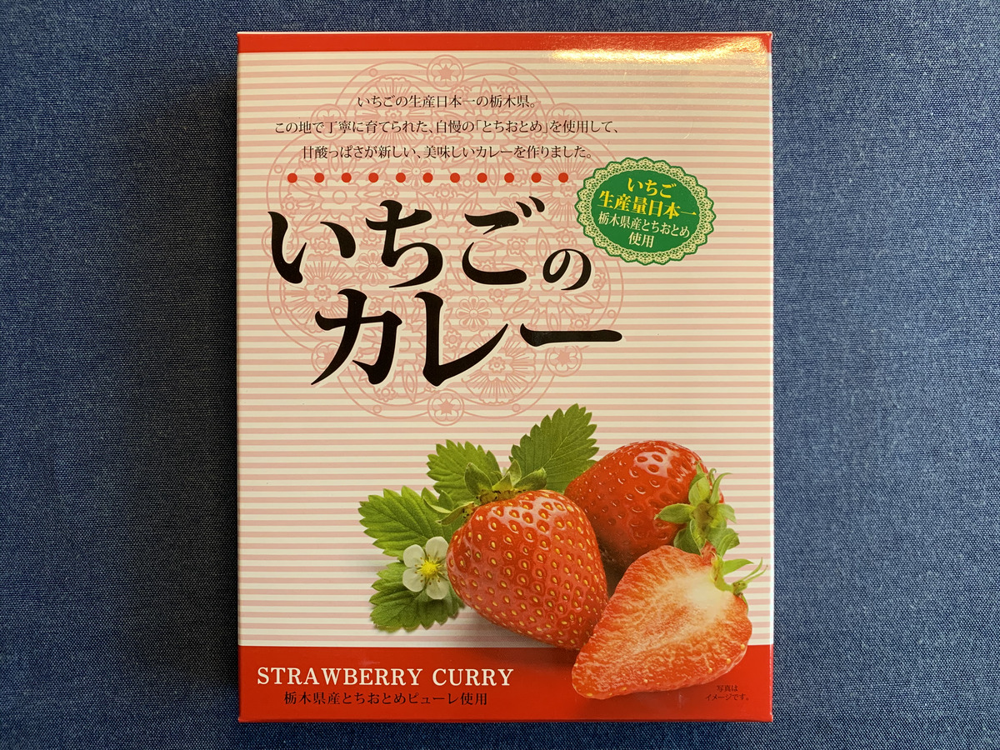

**どん！ :boom: :boom: :boom:**

もうね、やばい :sweat_drops:

やばいのきたわこれ :sweat_smile:

**攻めてるわあ・・・ :smiling_imp:**

---

**今日は栃木！ :+1:**

どんどん北上してきて、

やっぱどこも無難に

**ビーフ？ :cow: ポーク？ :pig: で**

攻めるよね〜と思ってきて

**からの〜？ :sunglasses:**

**ですよ :two_hearts:**

---

**とちおとめ！ :strawberry:**

そう、栃木はいちごで

有名とは聞いていたが

**まさかのいちごカレー！ :strawberry: :curry:**

くるとは思わなかったぜー :speech_balloon:

---

この時点で

**栃木・・・なんて恐ろしい子・・・！**

ってなってる :see_no_evil:

---

ひゃっほーう！ :raised_hands: :raised_hands:

いちご！ :strawberry: カレー！ :curry:

いちごカレー！ :strawberry: :curry:

**いちご！ :strawberry: カレー！ :curry:**

**いちごカレー！ :strawberry: :curry:**

どんな味がするんだろー

楽しみだなー :yum:

---

バックショットはこれ！

**ばしっ :wave:**

---

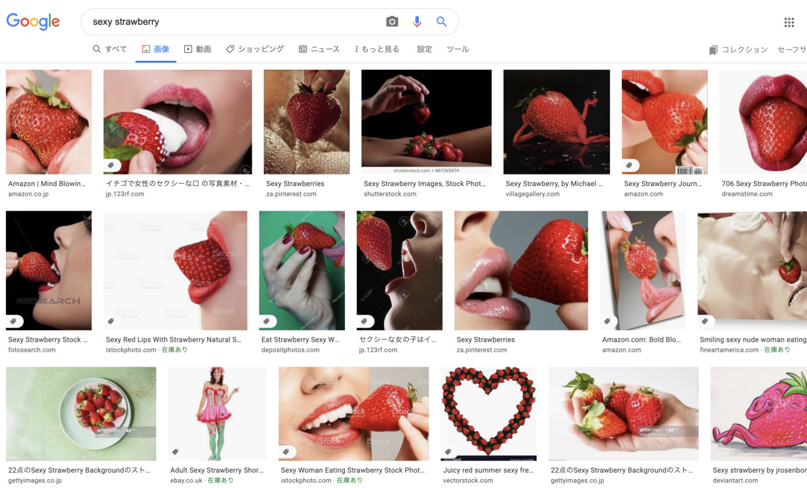

**Yeah! Sexy berry...!!! :sparkling_heart: :strawberry: :sparkling_heart: :strawberry: :sparkling_heart:**

じゃなかった :sweat:

---

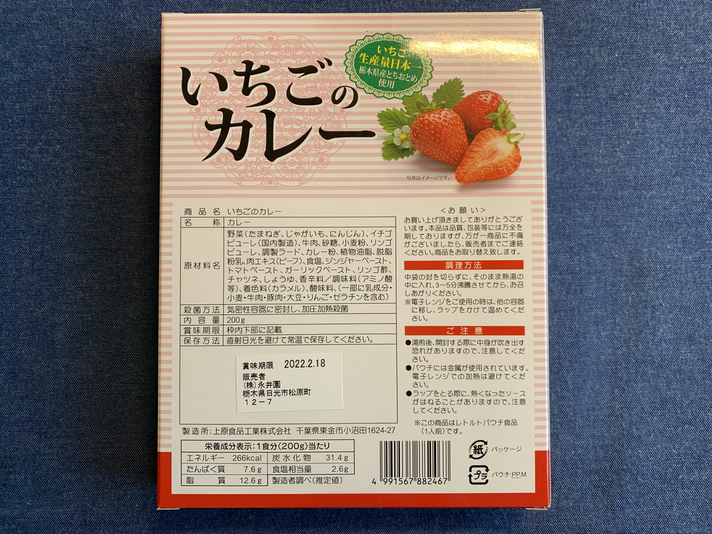

**Yeah! Sexy berry...!!! :sparkling_heart: :strawberry: :sparkling_heart: :strawberry: :sparkling_heart:**

・

・

・

おおっと、作っているのは

**千葉の会社さんだったー！ :rocket:**

---

**こ、こまけーことはいいんだよ！ :angry:**

個性があれば :boy: :girl:

**なんでもオーケー！ :ok_hand:**

---

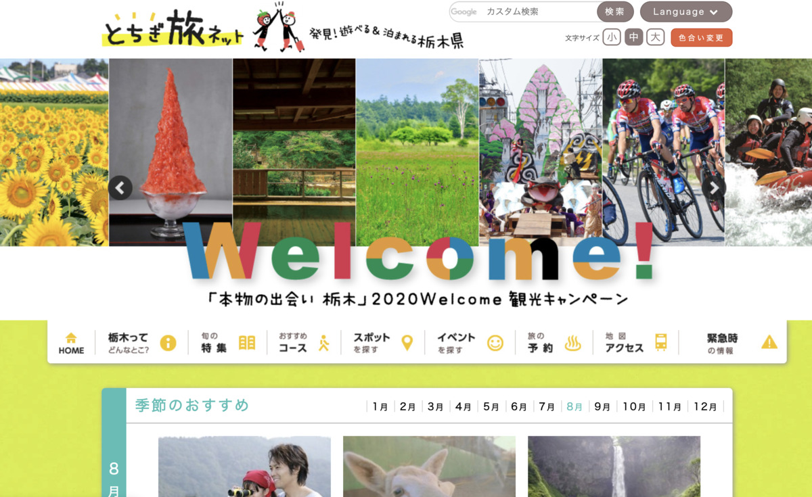

https://www.tochigiji.or.jp/

おや？ :thinking_face:

**とちぎ旅ネット〜 :mag:**

こんなのがあるらしい・・・

栃木県観光物産協会？の方々に感謝！ :pray:

どれどれ〜？ :eyes:

---

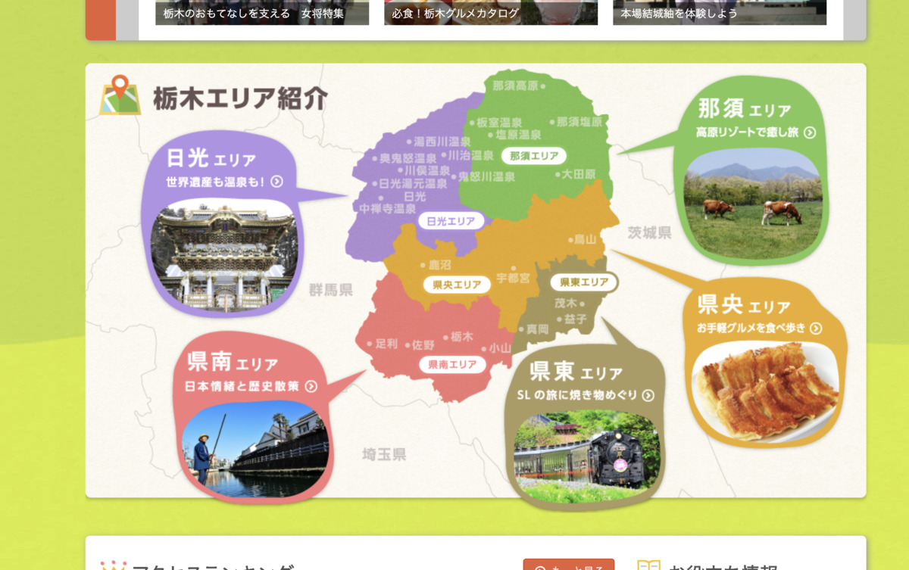

**なるほど！ :bulb:**

こうやって最初に **全体地図** 的なのがあると

**すごく分かりやすくていいね！ :+1: :+1: :+1:**

そうかあ〜 :smiley:

**群馬** と隣り合ってて

温泉もこの一帯ずらっと並んでるのね :hot_springs:

---

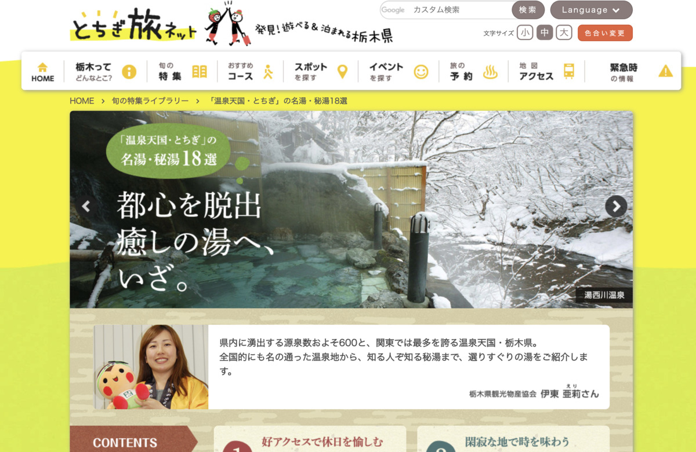

> 県内に湧出する源泉数およそ600と、関東では最多を誇る温泉天国・栃木県。
> 全国的にも名の通った温泉地から、知る人ぞ知る秘湯まで、選りすぐりの湯をご紹介します。

なんと、そうだったのかあ・・・！

この辺 **温泉多いんだなあ〜 :hot_springs:**

**関東で一番温泉多い** とこだったっぽい

ほえ〜 :hot_springs: :hot_springs: :hot_springs:

---

たくさんあって、全部見てると

さすがに大変だ・・・！ :astonished:

でもこことか気になるなー :mag:

---

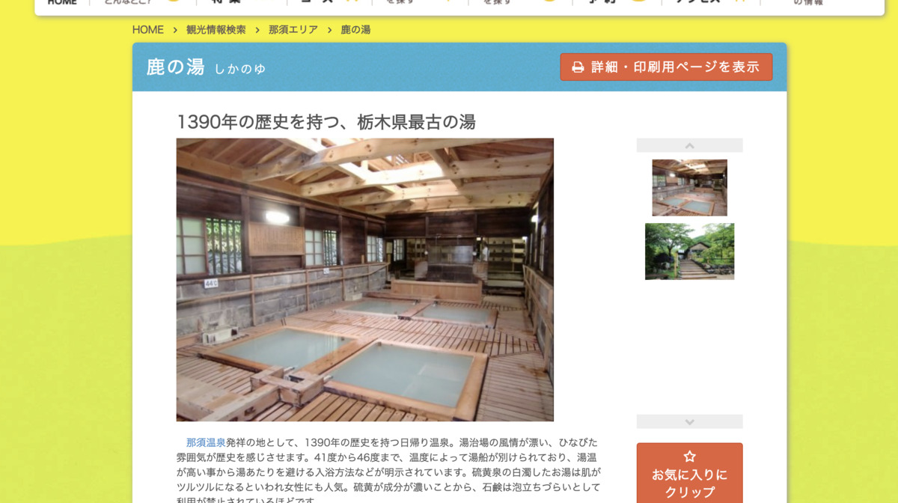

**鹿の湯さん！ :clap:**

おー行ってみたさ〜 :eyes:

---

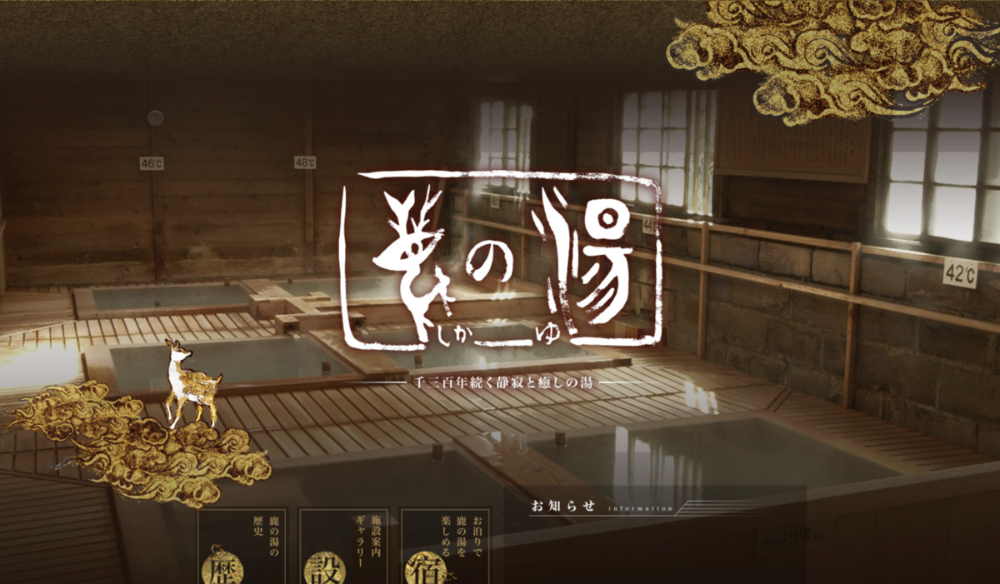

http://www.shikanoyu.jp/

ほえ〜 **1300年も続いているらしい・・・！**

1300年前っていうと

西暦720年とか？

日本書紀とかの時代だ〜 :triumph:

**スケールやばいぜ〜 :triumph: :triumph:**

---

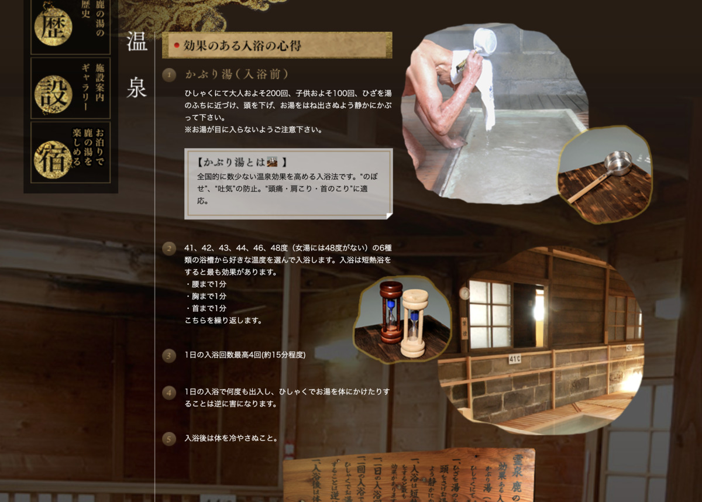

浴槽の温度やばいなー

**低くても41度、高い方で48度** もあるの

**ひええ〜 :fearful:**

しかも入り方もルールあるっぽい

---

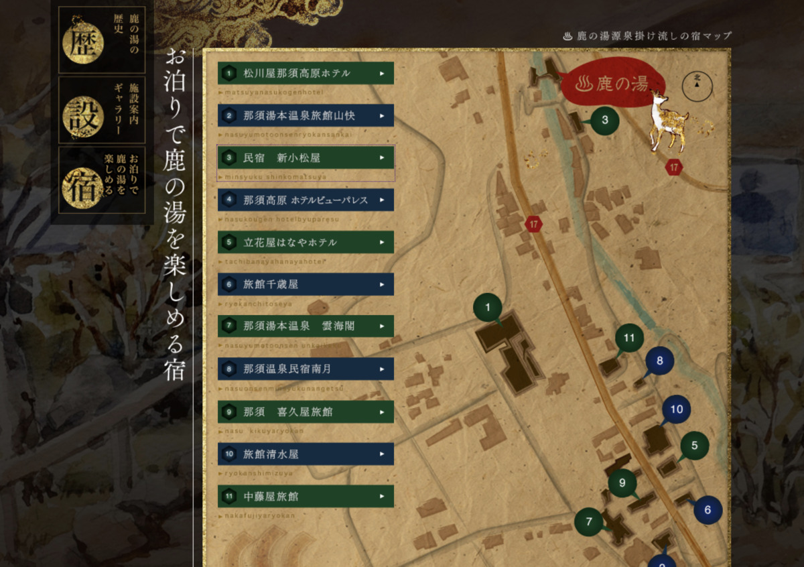

なるほど？宿もあると :hotel: :smile:

あ〜この **近くにある民宿** とか

気になりますねえ〜 :flushed: :heartbeat:

---

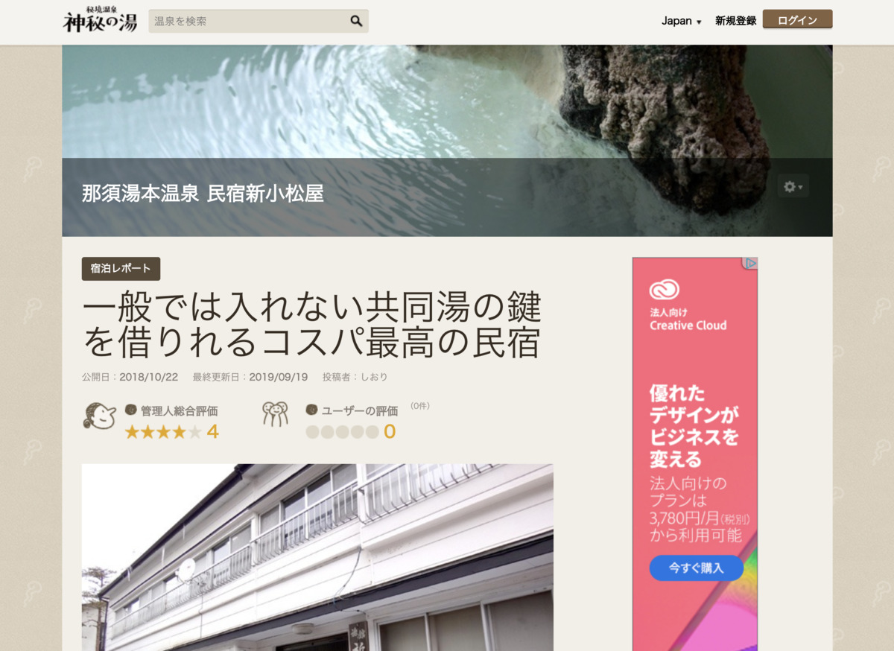

https://hikyou.jp/report/stay/49892/

おっ、記事があるじゃないですかー

読もう読もう！ :eyes:

---

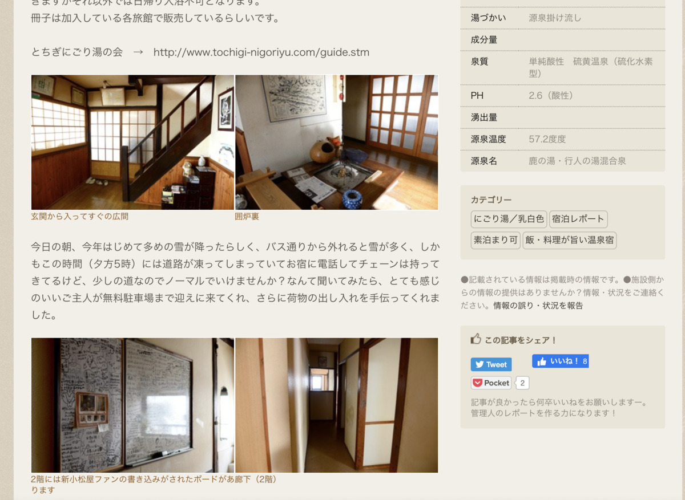

あああ〜〜〜そう！

こういうの！

**こういうのですよ！ :innocent:**

**ファンの書き込みができるボード** があるとか

いいですね〜 :sparkles:

ファン多そうでいいじゃないですかあ〜！ :+1:

---

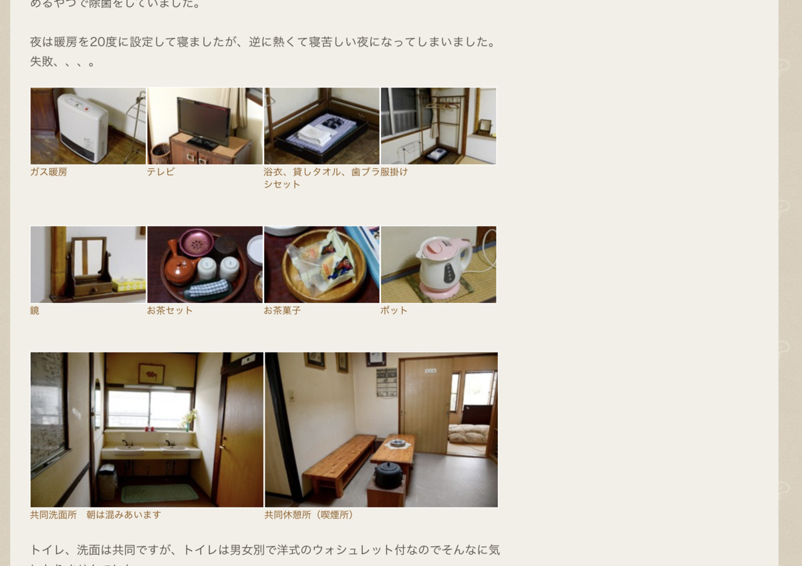

あ〜これは行きたい〜〜

**行きたい！行きたいぞー！ :rage:**

---

温泉宿もいいが〜

他にはどんな面白いところ

あるのかなーっと :mag:

（ぽちっ）

---

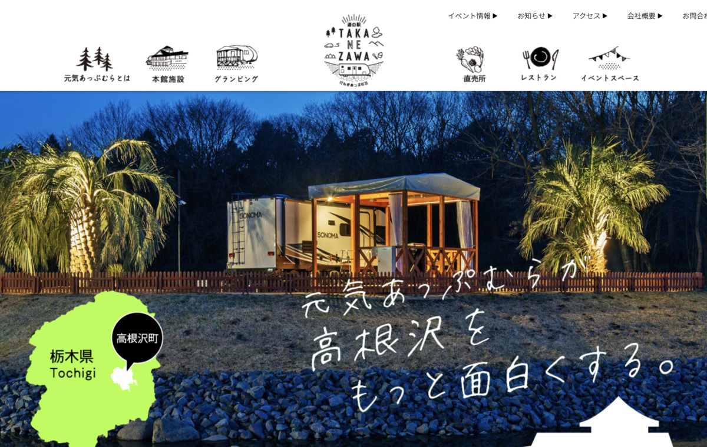

https://www.genkiupmura.com/

**元気あっぷむら** とな？

なんか **ベストコンディション** に

通ずるところがあるな〜？ :thinking_face:

どうやら **2020年オープン！** らしいぞ :tada:

こういう新しいやつもいいね！ :+1: :+1: :+1:

---

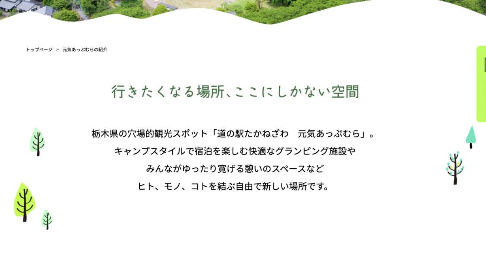

> 栃木県の穴場的観光スポット「道の駅たかねざわ　元気あっぷむら」。
> キャンプスタイルで宿泊を楽しむ快適なグランピング施設や
> みんながゆったり寛げる憩いのスペースなど
> ヒト、モノ、コトを結ぶ自由で新しい場所です。

自分で **穴場的** って行っちゃうのすきー！ :heart_eyes_cat:

おっ？っていうか

**グランピング** あるの？？

気になる気になるぅ〜！ :star2:

---

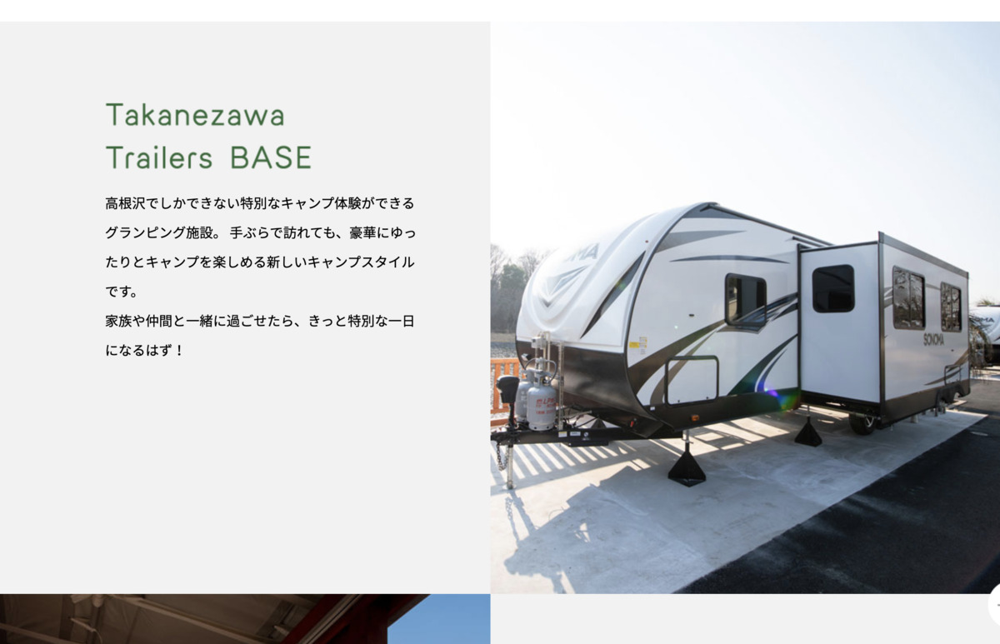

へー！ **トレーラーハウス** に泊まれちゃうらしい！

**いいじゃん！ :minibus: :minibus:**

> アメリカ・フォレストリバー社のトレーラーハウス

ちなみにこのトレーラーハウスには

全然詳しくないんだけど

どんなのなんだろー？ :thinking_face:

内装の紹介がないから

**自分で調べちゃお！ :mag: :mag:**

---

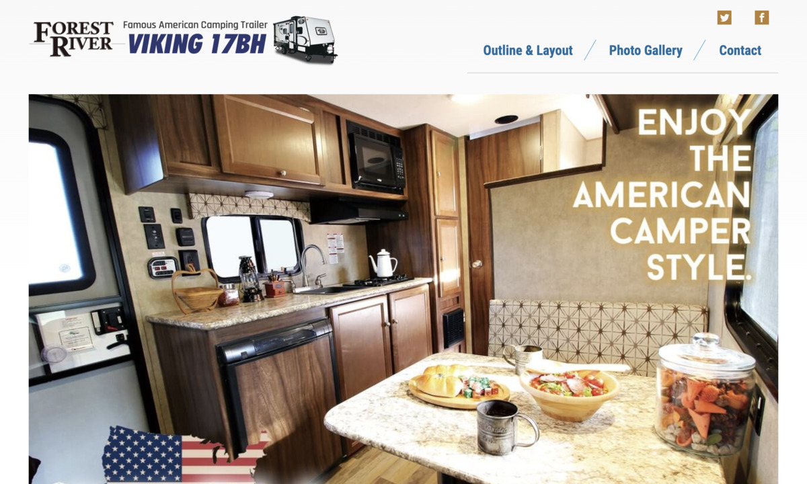

https://www.campnofuji.jp/forest_river/viking17bh/

なんだこれ・・・

**最高じゃねえか・・・！ :star: :star: :star:**

これさ〜

試しに1泊体験お泊まりして :zzz:

気に入ったら

**この車を借りてどこかに行く** のも

いいかもしれない・・・！ :minibus: :dash:

---

よし次は **うまいもんだ！ :meat_on_bone:**

うまいもんがあれば

どこでも楽しめる！ :meat_on_bone: :sparkles:

---

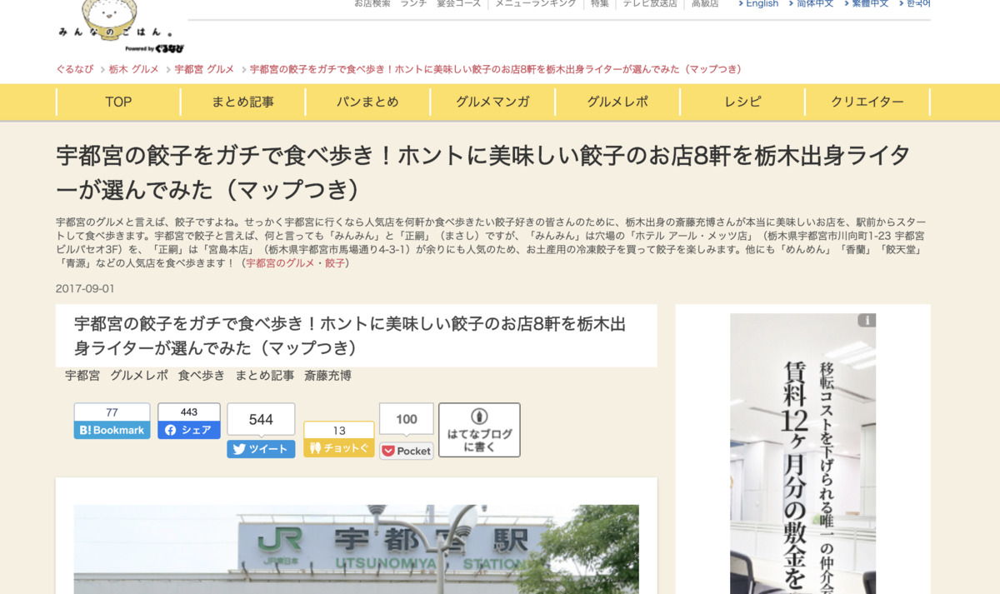

**宇都宮餃子めぐり〜〜！ :raised_hands:**

やっぱりここは

**定番がいちばん！** かな〜？ :grinning:

---

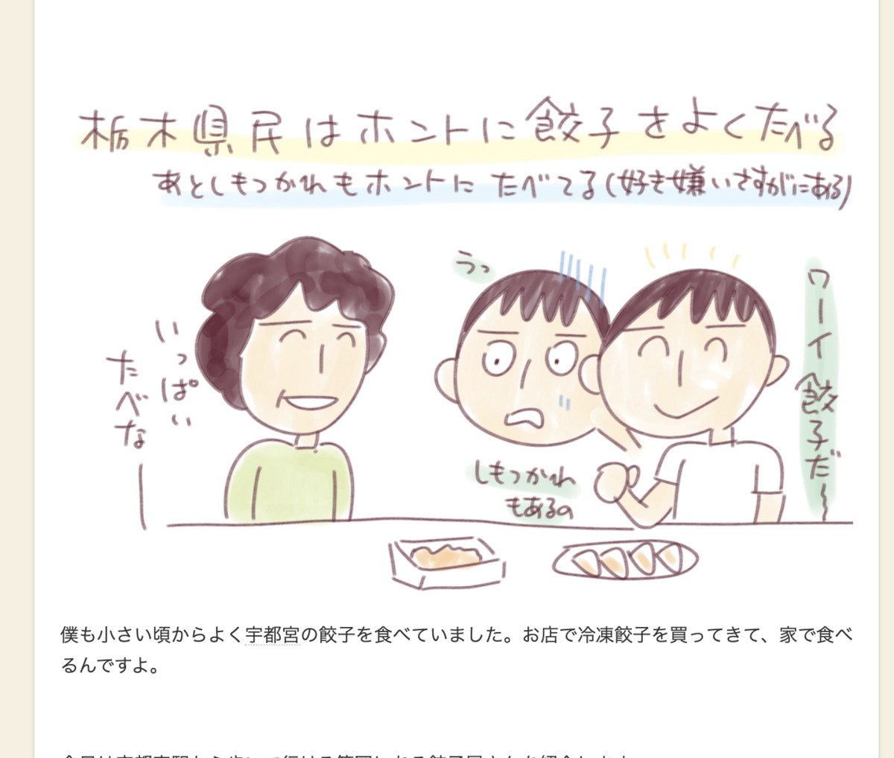

やっぱみんなたくさん食べてるのね :yum:

場所によっては

**「観光客しか食べねえよ」 :monkey_face:**

みたいなものもあるから

**現地の人が食べてるのは良いね！ :+1:**

（しもつかれ、なんぞ？）

---

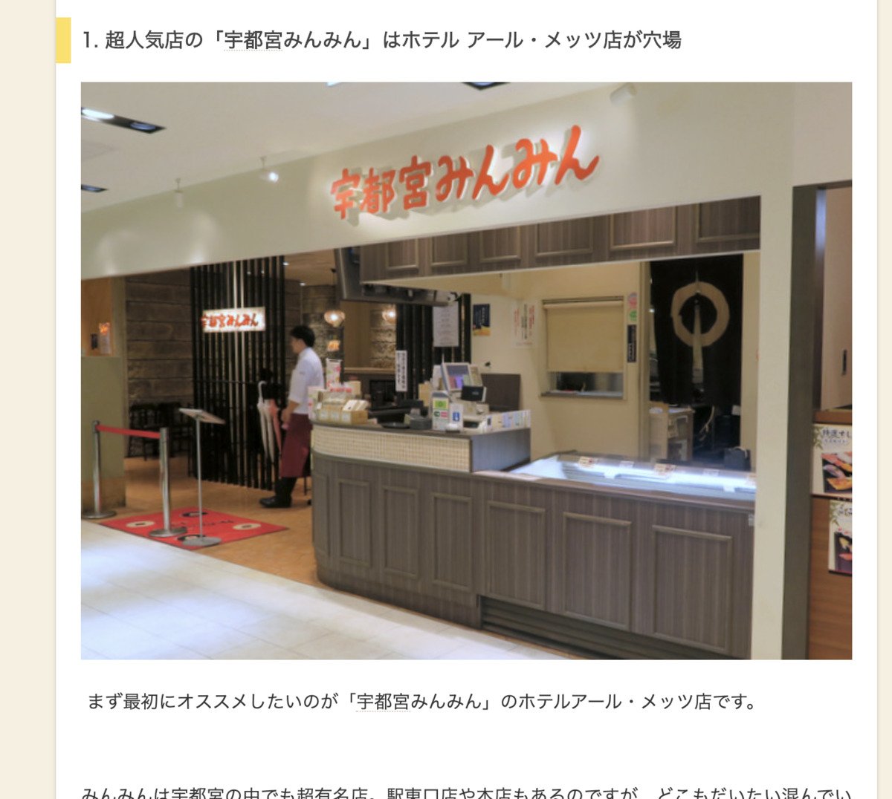

http://www.minmin.co.jp/gyoza/index.html

**宇都宮みんみん** 、有名店らしい！

知らなかったぜ〜

なるほどなーメモメモ :pencil2: :notebook:

---

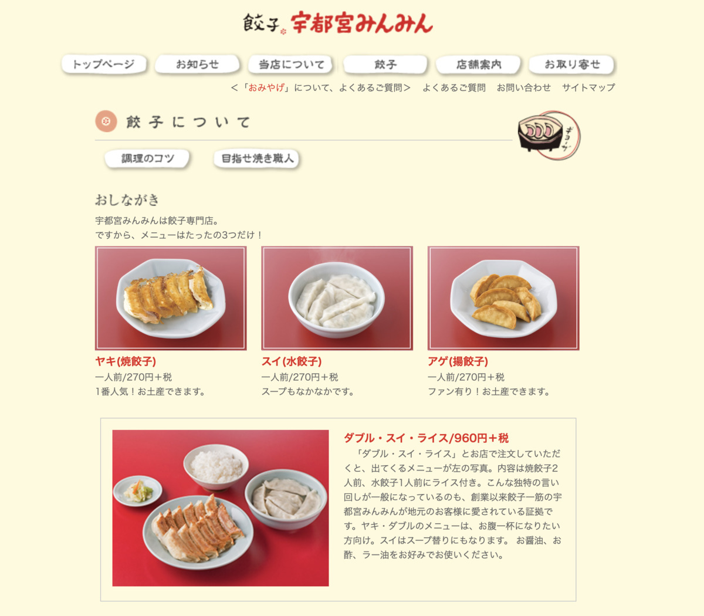

https://macaro-ni.jp/32697

**ヤキ！ :fire:**

**スイ！ :sweat_drops:**

**アゲ！ :boom:**

**ぜんぶしゅきー！ :heart_eyes_cat:**

はーこれは現地で食べたいやつだ・・・ :yum:

---

ちなみに、ここのみんみんと

**正嗣（マサシ）** っていうお店が

宇都宮では超人気店らしいぞ :sparkles: :sparkles:

**現地で食べたいー！ :confounded:**

**食べたいよお〜 :confounded: :confounded:**

---

そういや

さっきの

**しもつかれ** ってなんでしょね？ :mag:

（ぽちっ）

---

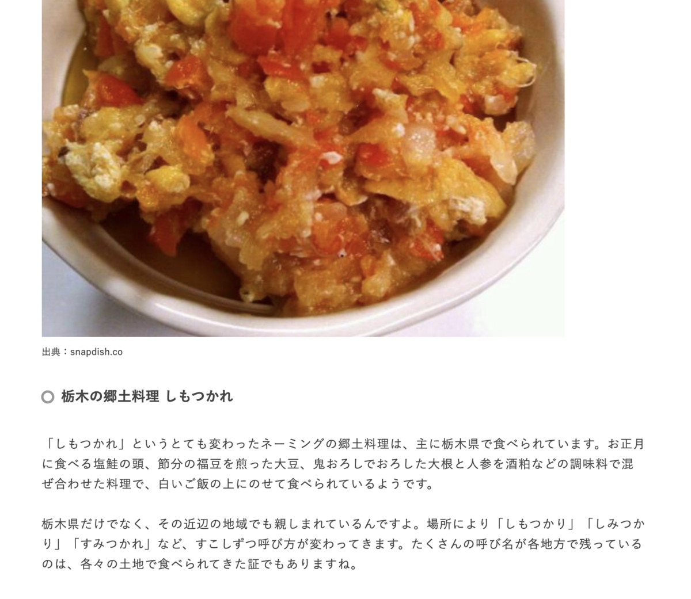

https://macaro-ni.jp/32697

> しもつかれは、現代においては賛否両論です。鮭の頭、大豆、酒粕を混ぜたこの料理の香りは、独特で生臭く感じることもあり、苦手な人も多いようです。しもつかれの見た目も、食材がごちゃまぜになってどろっとしているため、食べるのに抵抗があるという人も多いのが実情。ただし、こういった見た目や香りが苦手な人にもおすすめなのが、スーパーなどで売っているしもつかれ。ビジュアルもにおいに関しても、初めて食べる人が大丈夫なように作られているので安心です。

なるほどー **栃木の郷土料理** らしい！

そうそう、ここにもあるけど

**地元のスーパーにしか売ってないやつ :department_store:**

**気になるよね〜 :satisfied:**

---

ちなみに

**しもつかれをカレーにしちゃってる** 人も

いるらしい :eyes:

---

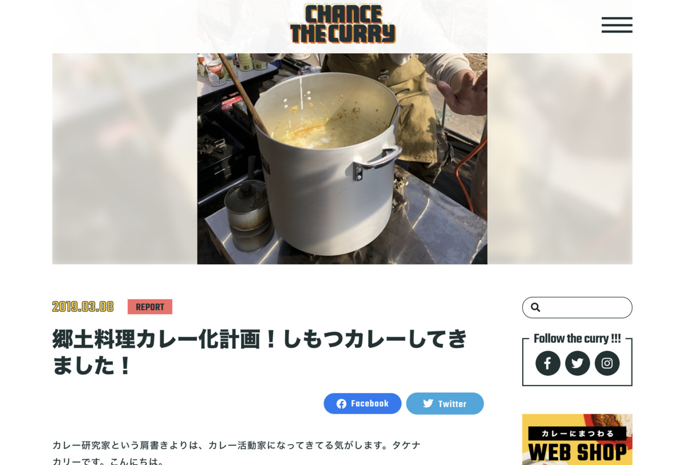

https://chancecurry.com/contents/4162/

**世界は広い・・・ :earth_asia:**

---

これは **しもつかれ**

現地で買って食べてみないと

あかんやつだなー :yum:

**もう行くしかないなー :runner:**

---

## 実食

さてそろそろ **カレーの時間！ :curry: :watch:**

あえていちごはスルーしてきちゃったけど

**いちごカレー :strawberry: :curry:**だぞ！

わくわく！ :yum:

**わくわく！ :yum:**

---

ずどーん！

おおっ、 **見た目は普通のカレー** だけど

**香りが若干いちごっぽい・・・！ :strawberry:**

もうすでに期待感がある！ :v:

---

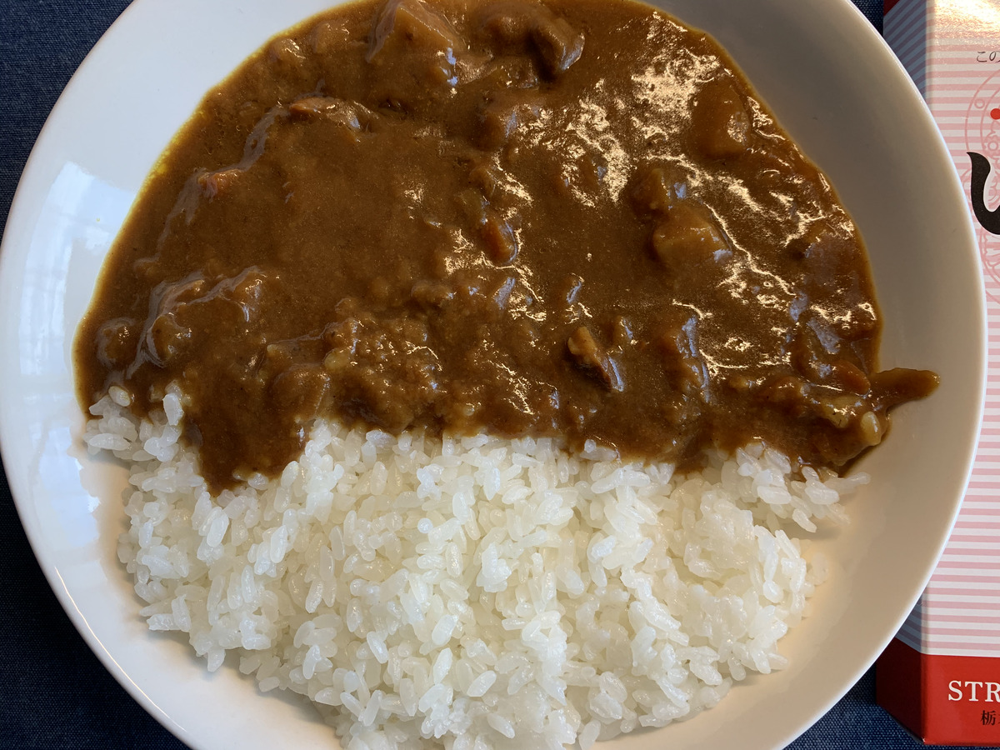

**うまそだなー！うまそだなー！！ :fork_and_knife:**

---

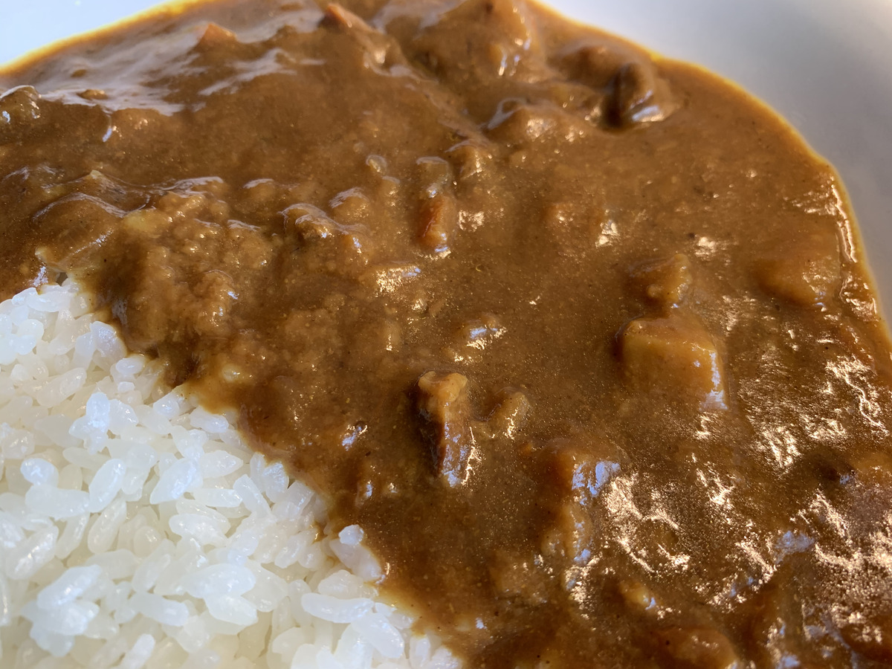

**生産者に感謝して〜！いただきます！ :pray: :pray: :pray:**

---

（モグッ）

---

**おおっ・・・！ :flushed:**

---

（モグッ）

（モグッ）

---

**うまいうまーい！！！ :satisfied: :satisfied: :satisfied:**

---

なんだこれ！

明らかに普通のカレーとは異なる味わい、いちごのペーストもカレーに負けないくらい主張してるパンチのあるカレーだ！
食べたあとにじんわり辛さが後追いでくる、でも甘い！
最初の食感は驚いたものの、食べていくうちにやみつきになる味！

やー、 **カレーの主張に負けてない具材** すげえ！

・

・

・

さ、さすがにホアジャオせんせーの

出番じゃないと思ったのでスルー・・・ :innocent:

せんせー **「ジャオ〜・・・ :innocent: :innocent: :innocent:」**

---

**栃木 いちごのカレー**

**おいしゅうございました！ :pray: :pray: :pray:**
