今日は大分・豊後だぞ！

実は大分、まだ行ったことないんだぞ！

豊後は **ぶんご** って、読むんだぞ！！

---

そのうち、現地でおいしいカレーを

**食べたーい！！ :yum: :yum: :yum:**

絶対に行っちゃうからなー！

---

さて今回のカレーは何かなー？？？

---

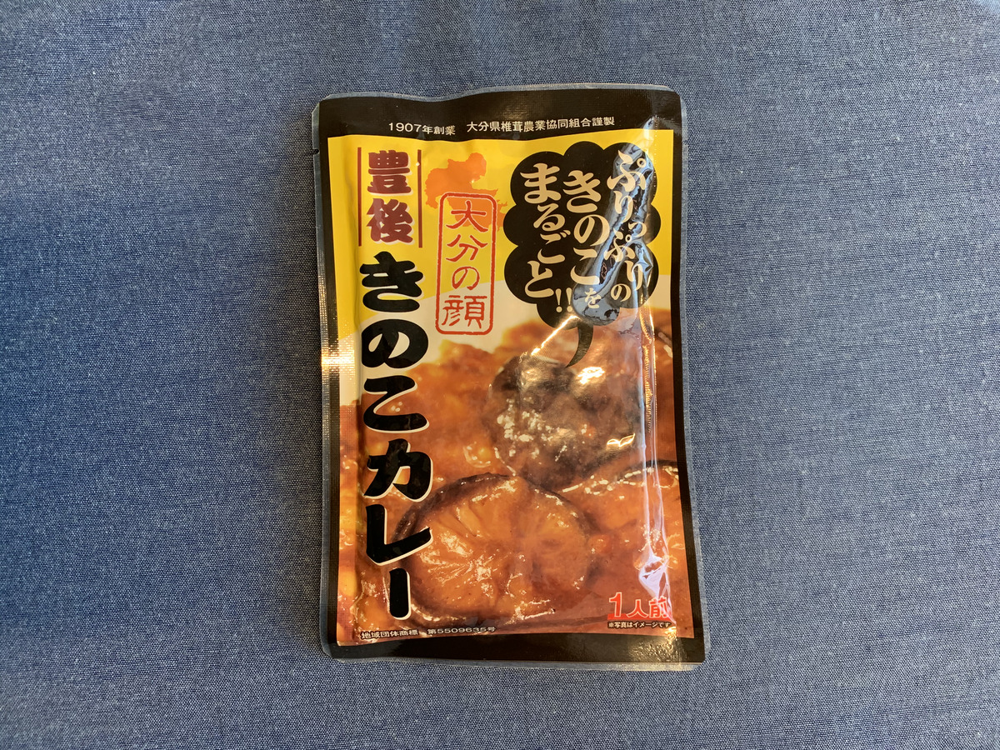

**Yeah!**

**大分 豊後きのこカレー！ だっ！ :mushroom:**

---

**ということは・・・？**

---

**きのこ祭りじゃー！！！**

きーのこわっしょい！

**:mushroom: :mushroom: :mushroom: :mushroom: :mushroom: :mushroom: :mushroom: :mushroom: :mushroom: :mushroom: :mushroom: :mushroom: :mushroom: :mushroom: :mushroom: :mushroom: :mushroom: :mushroom: :mushroom: :mushroom: :mushroom: :mushroom: :mushroom: :mushroom: :mushroom: :mushroom: :mushroom: :mushroom: :mushroom: :mushroom: :mushroom: :mushroom: :mushroom: :mushroom: :mushroom: :mushroom:**

わっしょいきのこ！

**:mushroom: :mushroom: :mushroom: :mushroom: :mushroom: :mushroom: :mushroom: :mushroom: :mushroom: :mushroom: :mushroom: :mushroom: :mushroom: :mushroom: :mushroom: :mushroom: :mushroom: :mushroom: :mushroom: :mushroom: :mushroom: :mushroom: :mushroom: :mushroom: :mushroom: :mushroom: :mushroom: :mushroom: :mushroom: :mushroom: :mushroom: :mushroom: :mushroom: :mushroom: :mushroom: :mushroom:**

---

そういえば、箱パッケージがないぞ？ :thinking_face: :thinking_face: :thinking_face:

そんなもんなくてもおいしい！という、

 **自信のあらわれだー！！ :muscle: :muscle: :muscle:**

---

バックショットは〜〜〜

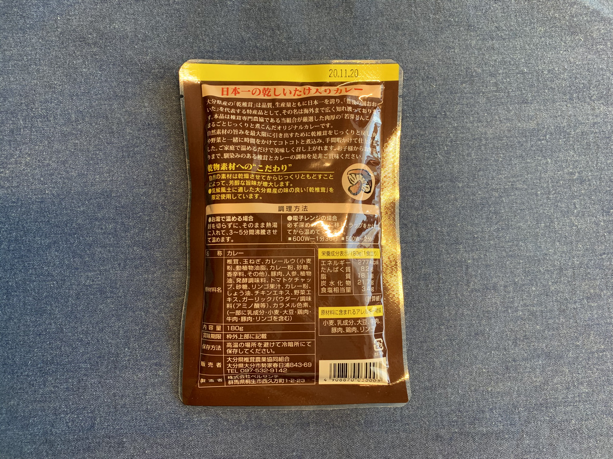

**Oh, Mushroomy and Sexy!!! :sparkling_heart: :sparkling_heart: :sparkling_heart:**

---

なんかいろいろかいてあるぞ？

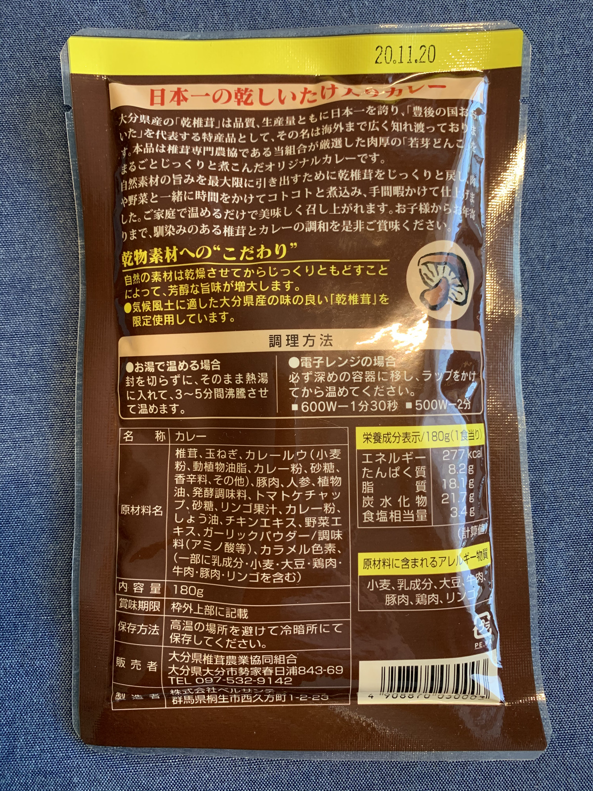

肉厚！

芳醇な旨味・・・！

**こいつはセクシーすぎるぜ・・・！ :sparkling_heart: :sparkling_heart: :sparkling_heart:**

---

んんっ？

**椎茸農業協同組合** だって？？ :thinking_face:

どれどれー？

（ぽちっ）

---

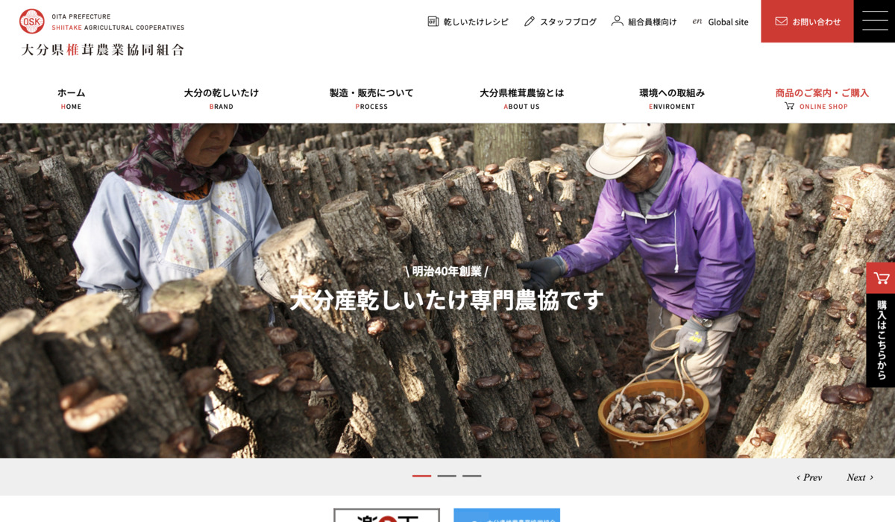

http://www.osk-shiitake.or.jp/

すげえ、 **専門** だぜ〜〜〜。

**専門** って言葉に弱いんだぜ〜〜〜。

**しいたけのことなら、俺に聞け・・・**

感ぱないー！！！ :mushroom: :mushroom: :mushroom:

**生産者の方々に感謝！ :pray: :pray: :pray:**

---

へー、 **かわきしいたけ**  っていうのね。

カレーじゃなくても **普通に旨そう** じゃないのよー。

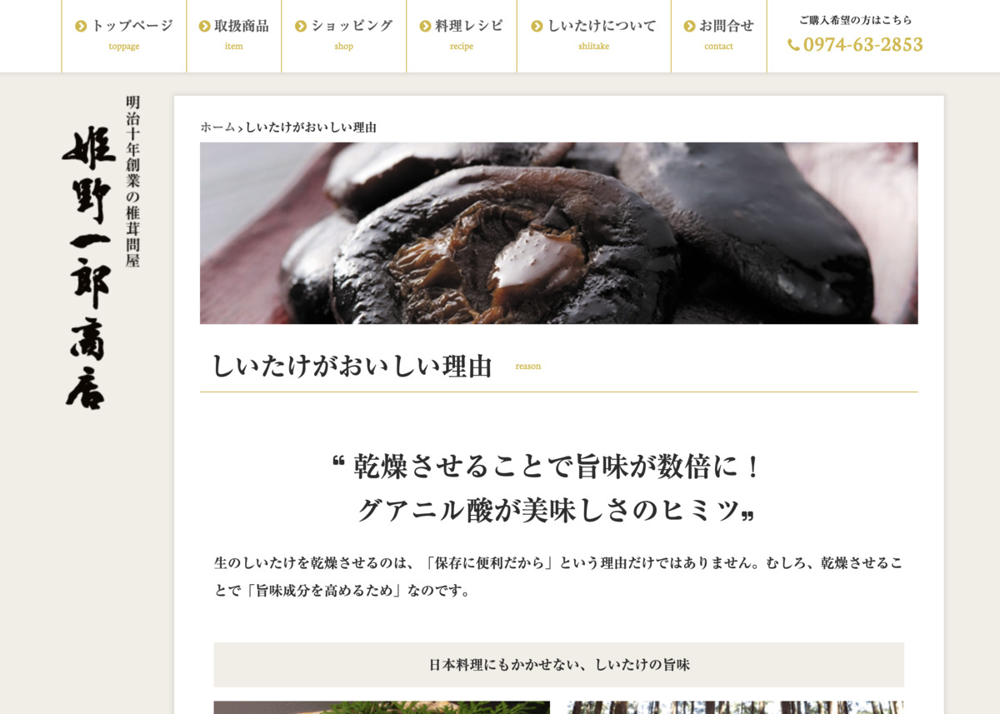

https://shiitake-himeno.co.jp/reason

へえええ、すごい！

乾燥させると！

**旨味が数倍！！！**

**圧倒的成長！！！ :muscle: :muscle: :muscle:**

---

**あ〜〜〜〜 :satisfied: :satisfied: :satisfied:**

こういう **うんちくに弱い** のよね〜〜〜

たまらん！

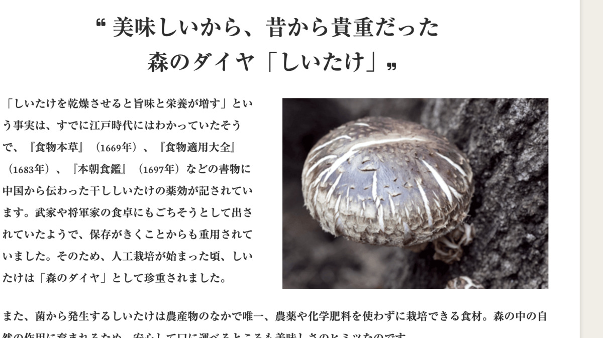

やだもー、 **森のダイヤ** ですって！

**:gem: :gem: :gem:**

も〜〜〜 **しんぼうたまらん！！**

---

はやく！

**食べる場所を！！**

**探そう！！！ :mag: :mag: :mag:**

---

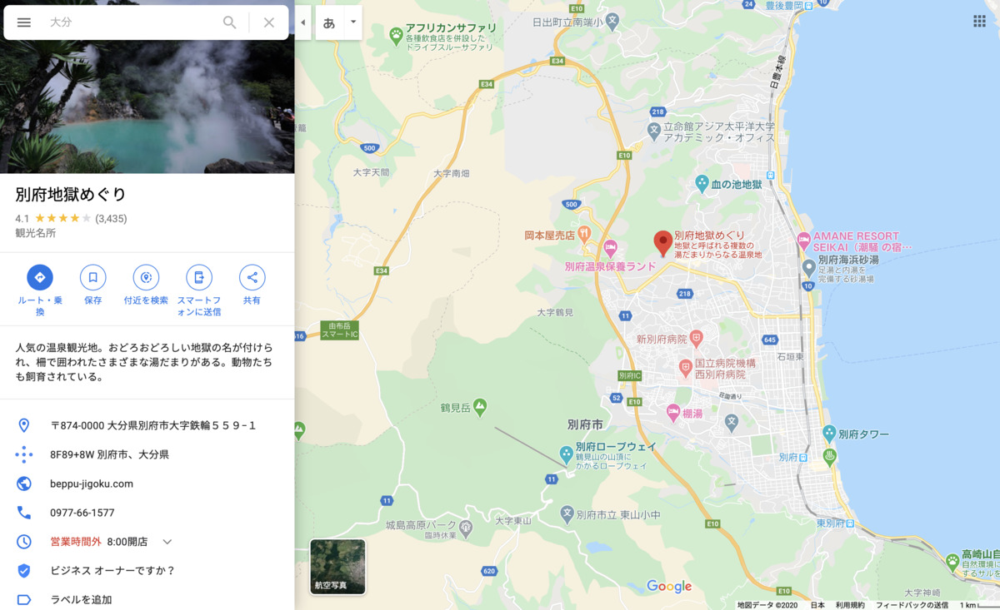

うーん、

やっぱり行ったことないところだから、

**定番は押さえないとねー！ :v:**

地獄をめぐりながら

**きのこカレー** でしょ！ :mushroom:

---

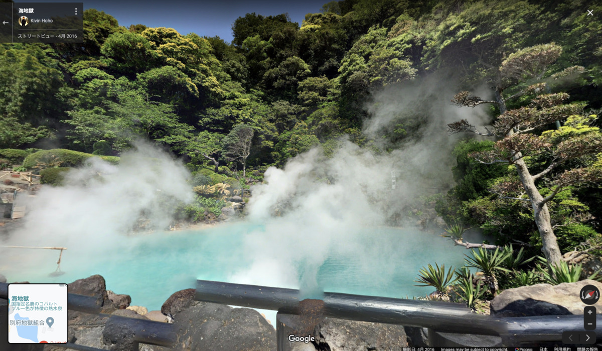

おおおおお！！

**景　色　最　高！ :sparkles: :sparkles: :sparkles:**

いいーんじゃないのー？？？

**いいーんです！ :sunglasses: :sunglasses: :sunglasses:**

---

ここだー！

**ここできのこカレーを食べるぞー！！**

---

## 実食！！

まえおきが長い！

**毎回ここにくるまでが長い！**

（おなかすいた）

---

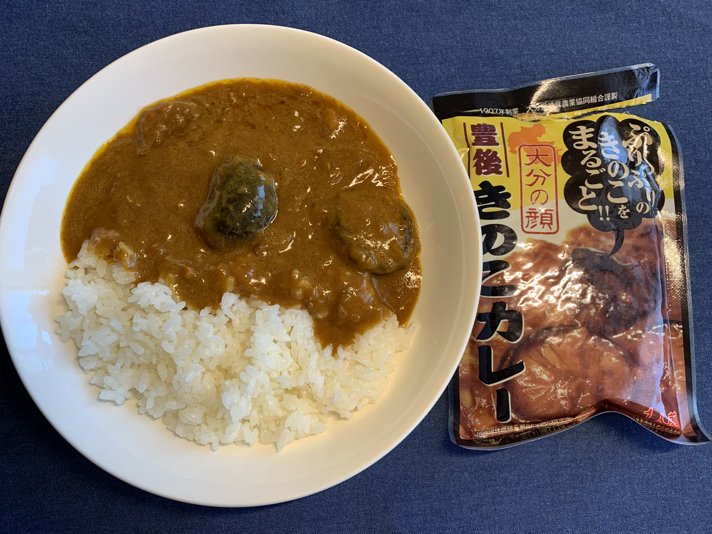

**じゃじゃーん！ :curry: :curry: :curry:**

ひゅーっ♪

**ひゅーっひゅーっ♪♪**

きのこでかい！！！

---

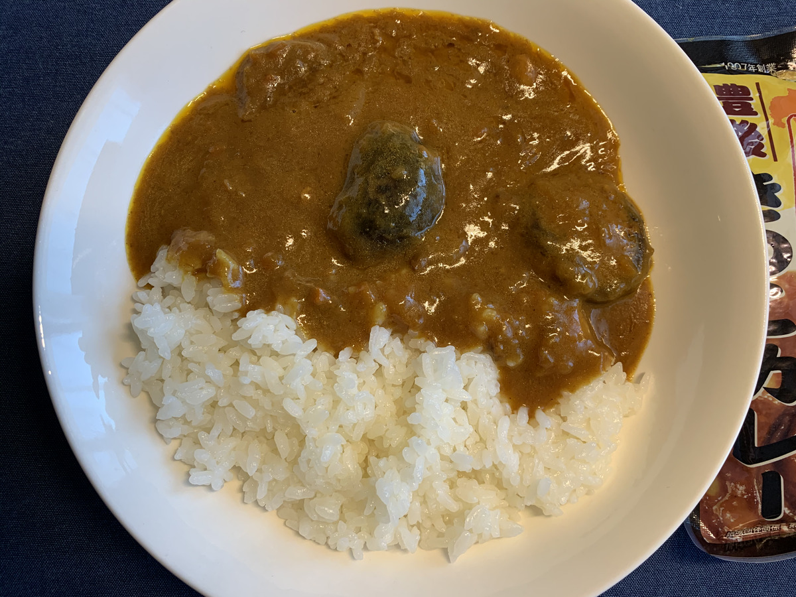

こりゃーたまらんでしょー！

**確かにパッケージなんか不要だわー :smiley:**

---

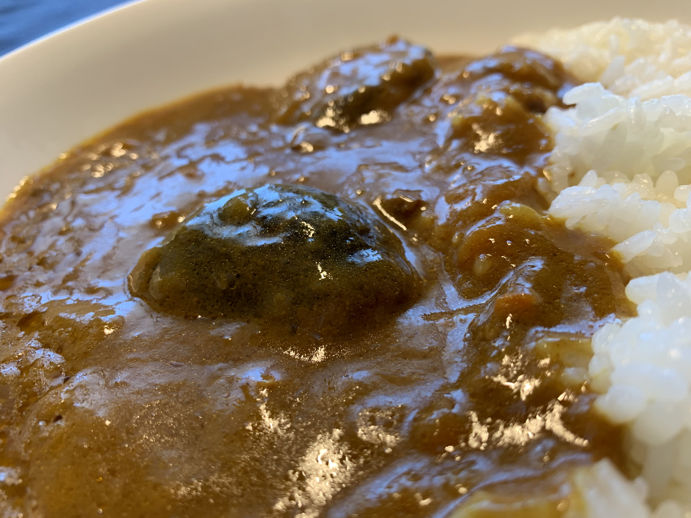

これが！

**森の！！**

**ダイヤです！！！ :gem: :gem: :gem:**

---

**ではでは、いただきます！ :pray:**

---

（モグッ）

---

**おおっ・・・！ :flushed:**

---

（モグッ）

（モグッ）

---

**これはうめえ〜〜〜！！！ :satisfied: :satisfied: :satisfied:**

---

きのこのゴロゴロ感たまらん！
辛さは中辛くらいかな？濃厚なカレーのソースに旨味が凝縮されてて良い！

カレーっぽさの中にもちゃんとしいたけが主張してていいなあ。たまらんなあ。

---

はあ〜〜〜、

カレーと乾きしいたけ、

**ベストマッチです・・・！ :heartbeat: :heartbeat: :heartbeat:**

---

ここで突然の

**ホアジャオタイーム！！！**

**ホアジャオが全てを上書きしていく・・・！ :sunglasses:**

---

（フリフリフリフリ・・・）

**Oh, Happy powder...! :sparkles: :sparkles: :sparkles:**

---

**大分 豊後きのこカレー**

**おいしゅうございました！ :pray: :pray: :pray:**
