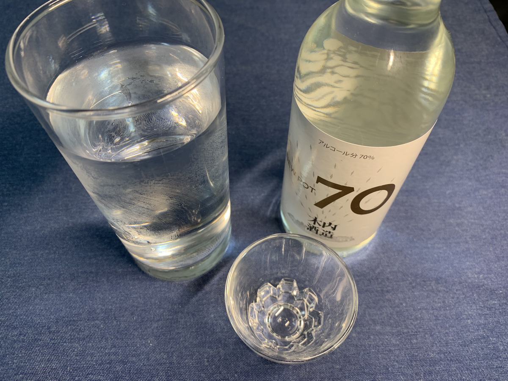

**どん！ :boom: :boom: :boom:**

またまたやばいわこれ :sweat_drops:

**前回に続いて攻めてるわあ・・・ :smiling_imp:**

メロンですよ、 **メロンのカレー！**

---

今回は **茨城！ :+1:**

そんでもって

**茨城県鉾田市のメロン** を使った

**メロンカレー :melon: :curry:**を食べちゃうぞ！

やばいやばーい！ :raised_hands:

---

バックショットはこれ！

**Wow! Sexy melon...!!! :sparkling_heart: :melon: :sparkling_heart: :melon: :sparkling_heart:**

セクシーメロンきたこれ！

---

っていうか

**茨城、メロン** で有名なの？ :mag:

（ぽちっ）

---

http://www.melonnomori.com/

**おっおう・・・ :sweat_smile:**

これはまた

**香ばしい** 感じの **ホームページ** ですね・・・ :earth_asia:

---

**メロンの森・・・ :melon: :melon: :melon:**

メロン狩りとか色々できるらしい・・・

と、とりあえず

**メロン :melon: への愛情 :heart:** は分かったよ・・・

---

https://gurutabi.gnavi.co.jp/a/a_2519/

おお〜

現地にはいろんな **メロンスイーツ :melon: :cake:**

あるらしい！ :yum:

---

**ケーキ** や **バウムクーヘン**

他にも **メロン大福** 、 **メロンパイ**

なんかもあるらしい！

**すごーい！ :satisfied:**

---

これはもう〜 **メロン祭りじゃー！  :melon:**

メロン  :melon: でわっしょい！  :melon:  :melon:

わっしょい！  :melon: メロン！  :melon:  :melon:  :melon:

**メロン  :melon: でわっしょい！  :melon:  :melon:**

**わっしょい！  :melon: メロン！  :melon:  :melon:  :melon:**

---

そうそう！

茨城で最近気になってる **スポット** あるのよー :round_pushpin:

---

http://r.gnavi.co.jp/g-interview/entry/bad/4320

**木内酒造さん！ :sake:**

いえーい :+1:

いえいえい :+1: :+1:

**最近お世話に〜 :sake: :sunglasses:**

---

やーそれがさー :thinking_face:

どうやら **お酒だけじゃないっぽい** のよ

どういうことなの？ :thinking_face:

---

**そば** とな？ :thinking_face:

> 水の代わりに純米酒で打った蕎麦、“十割酒蕎麦”なんてのがあります！

はー、ちょっと **何言ってるか分かんない** っすw

十割酒蕎麦・・・

---

むかし、 **ねるねるねるね** を

**水の代わりにビール使ってみた** ことあるけど

つまりはそういうことだな？ :speak_no_evil:

というか **十割酒蕎麦きになるー！ :grinning:**

---

http://kodawari.cc/

**木内酒造さん** 、ここだな？

**ドメインがこだわり** なの

**しゅき〜〜〜 :heart_eyes_cat:**

---

そうそう〜

元々 **気になってた** のは

飲めるけど **消毒用途アルコール** で

これが **一番うまい！ :smiley:**

・・・

って聞いたからなんだなー :wink:

---

そうこれなのよ〜 :star2: :star2:

**NEW POT 70 〜！ :cocktail:**

この木内酒造さん、 **ウイスキーを作り始めてて**

まだ **樽で寝かせてないやつ** だから

**無色透明** なんだよね〜 :eyes:

---

おやおや〜？ :thinking_face:

なぜか

**てもとに**

**消毒液が**

**あるよ？ :sake:**

---

これを

こうして

**こうじゃ〜 :older_man: :sake:**

---

**くはー！ :fire: :kissing_closed_eyes:**

**アルコール度数、70度は危険・・・！ :rage:**

っていうか

**まじ燃えるから注意〜 :fire: :rotating_light: :fire_engine:**

なんていうか、 **ラム酒 :sake:** っぽさ〜

---

残りは **ドライフルーツの漬け込み酒** にしちゃうぞ :star2: :star2:

---

http://kodawari.cc/brewery/yasatodistillery.html

や〜〜〜 :blush:

**ウイスキー作り** 、これからが楽しみですねえ〜 :heartbeat: :wave:

木内酒造さんマジ頑張ってほしい・・・！ :muscle:

---

ほかには

どんな **茨城グルメ** あるかなー？ :yum:

（ぽちっ）

---

http://www.namegata-koikoi.com/special/burger.html

**行方（なめがた）市** ってところにある

**行方バーガー** なるものがうまいらしい！ :eyes:

ほほ〜たしかにうまそう :heart_eyes:

**ナマズ** とか **コイ** とかを具材にしてるらしい :fish:

**うおー気になるー！ :fish: :hamburger:**

---

他にはどんなものあるかなー？ :two_hearts:

どれどれ？

---

https://www.ibarakiguide.jp/seasons/osakana/oarai.html

**大洗海鮮市場！**

海の幸、絶対美味いやつやん！ :fork_and_knife: :yum: :+1:

---

**浜焼き！ :shell: :fire:**

あ〜たまらんでしょ〜これ :yum:

> 買ったその場で焼いてくれる！熱々の浜焼きを豪快に召し上がれ！

**その場で！**

**焼いてくれる！ :+1:**

いいね！現地で食べたい！ :+1: :+1: :+1:

---

https://ja.wikipedia.org/wiki/%E3%81%A9%E3%81%B6%E6%B1%81

**どぶ汁** とは・・・？ :thinking_face:

なんぞや？？

> 名前の由来は、あん肝が溶け出して汁がどぶのように濁ることから、また、どぶには「すべて」という意味があり、アンコウのすべてを入れることから「どぶ汁」との説もある。

へ〜知らんかった〜

あん肝だけで相当美味いのに

普通にアンコウ鍋に入れてしまうとか

**そんなんずるすぎるやん！ :rage: :rage:**

---

https://umai-mon.shokubunka.co.jp/blog/archives/22802

あああ〜〜〜 :frowning:

---

あああ〜〜〜 :weary:

---

**あああ〜〜〜！ :confounded:**

こんなん絶対美味いでしょ、ずるいでしょ・・・ :rage:

これ作り方の紹介なんだよなあ・・・

---

**あああ〜〜〜！ :dizzy_face:**

**ごいりょくなくなる〜 :cyclone:**

こういうの、現地で食べたいよね！！ :smiling_imp:

これもし行くことになったら

**美味しいどぶ汁** を

出してくれるところを探していきたいね！ :muscle:

---

## 実食！！

そろそろ **カレーのターン！ :dash:**

メロンカレー・・・そわそわ・・・ :melon:

---

はいどーん！ :boom: :boom:

**おお〜 :sparkles: :sparkles: :sparkles:**

もっと **メロンっぽい見た目** を考えてたけど

意外と見た目は **普通のカレーだったー :curry:**

---

おお〜うまそう〜

どんな味がするんだろ〜気になる〜 :heartbeat:

---

気になる〜気になる〜！ :rage:

ということで〜

今回も生産者に感謝して〜

**いただきます！ :pray: :pray: :pray:**

---

（パクッ）

---

**うまーーーい！！！ :satisfied: :satisfied: :satisfied:**

---

（パクッ）

（パクッ）

---

**うまいうまーーーい！！！ :satisfied: :satisfied: :satisfied:**

---

むむっ？カレーというよりは、メロンとカレーが合わさってメロンカレーという何か別のものになってる！

最初カレーだと思って食べて違和感を感じるんだけど、食べていくうちにメロンカレーのやさしさが心地よく感じて良い〜！
メロンがおすすめかと思いきや、意外と肉がごろごろ入ってて、具材としてのカレーも楽しめて美味い！

・

・

・

こういう **フルーツ系のカレー :melon:** には

**ホアジャオせんせーは合わない** って

最近分かってきたぞ :ok_hand:

＼じゃおじゃおー／

---

**茨城 メロンカレー**

**おいしゅうございました！ :pray: :pray: :pray:**
