さあさあ、 **東北** どんどんいきますよー！ :muscle:

今回は〜

**山形！ :mountain:**

---

山形は知ってるよ〜 :satisfied:

山形市の人は **仙台市が超近い** から

週末になると仙台におでかけしちゃうのだ

---

あと

**さくらんぼ :cherries:** がうまい！

---

なななんと！

今回の **カレー :curry:** は〜〜〜

---

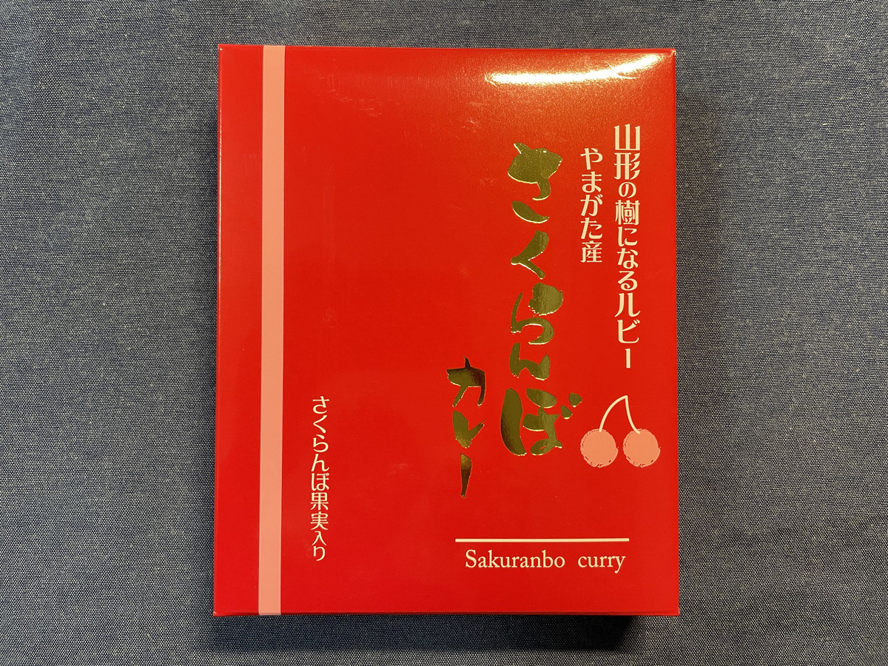

**まさかの、さくらんぼカレー！ :cherries: :curry:**

---

だだだだだ大丈夫なの・・・！？ :fearful:

---

バックショットは〜

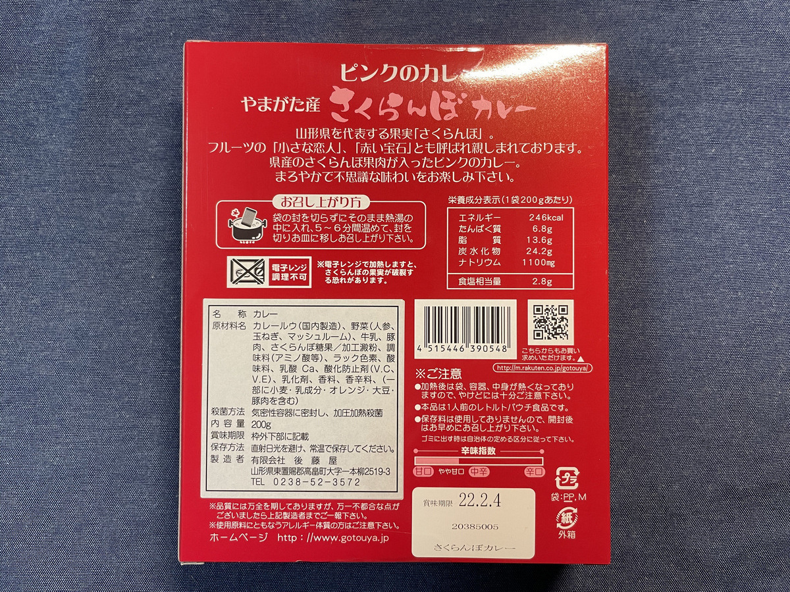

**Oh! Sexy cherry...!!! :sparkling_heart: :cherries: :sparkling_heart: :cherries: :sparkling_heart:**

---

た、たいへんだ・・・！ :boom:

**さくらんぼの、果肉** 、入ってるってよ！

（さくらんぼ風の・・・とかじゃないんだ・・・）

---

ああ〜〜〜ふあんだ〜〜〜

不安だ〜ふあんだ〜〜ぶつぶつぶつ・・・

・・・

・・・・・・

**ほわわわわ〜ん！ :thought_balloon: :thought_balloon: :thought_balloon:**

---

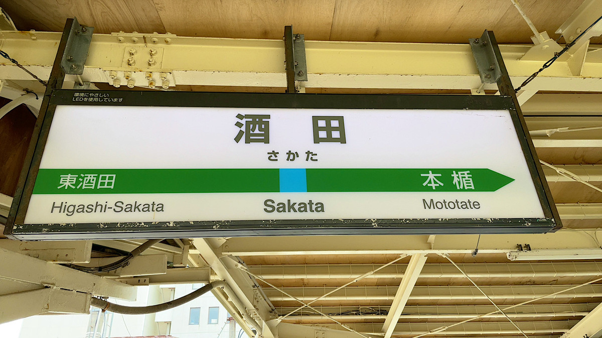

**おやおや〜？ :eyes:**

**あれれれれ〜？ :eyes: :eyes:**

---

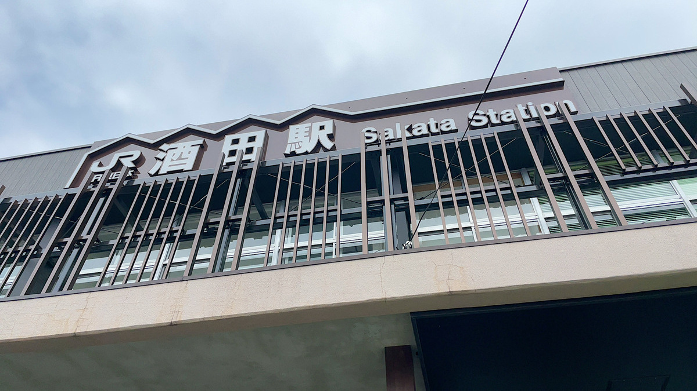

さくらんぼカレー :cherries: :curry: に不安を感じてたら

いつのまにか **酒田駅** にいるじゃないですかあ :thinking_face:

とりあえず、 **ちょっとぶらぶら** してみるかあ :confused:

---

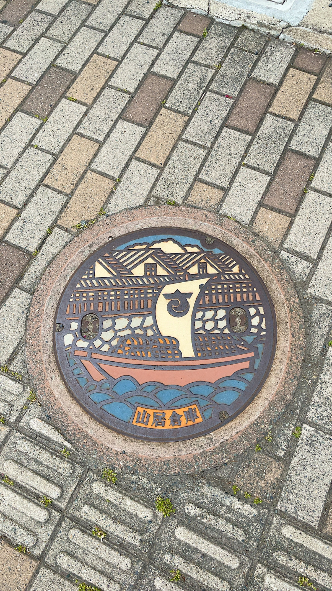

おっ、なんだこの **マンホール** は :cyclone:

やまなんとか倉庫って書いてある :thinking_face:

**山居倉庫（さんきょそうこ）** って読むらしいぞ

メモメモ・・・ :pencil2:

---

とりあえず行ってみるかあ :runner:

---

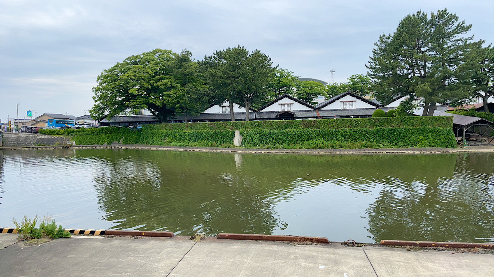

おお〜なんか見えてきた :eyes:

---

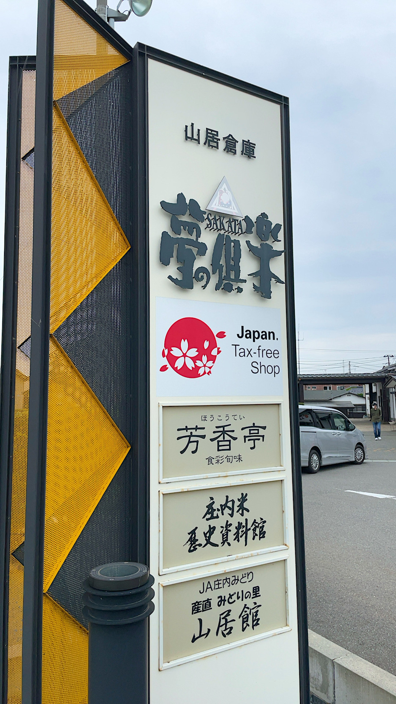

よく分からんが

**いろいろあるらしい！:factory:**

---

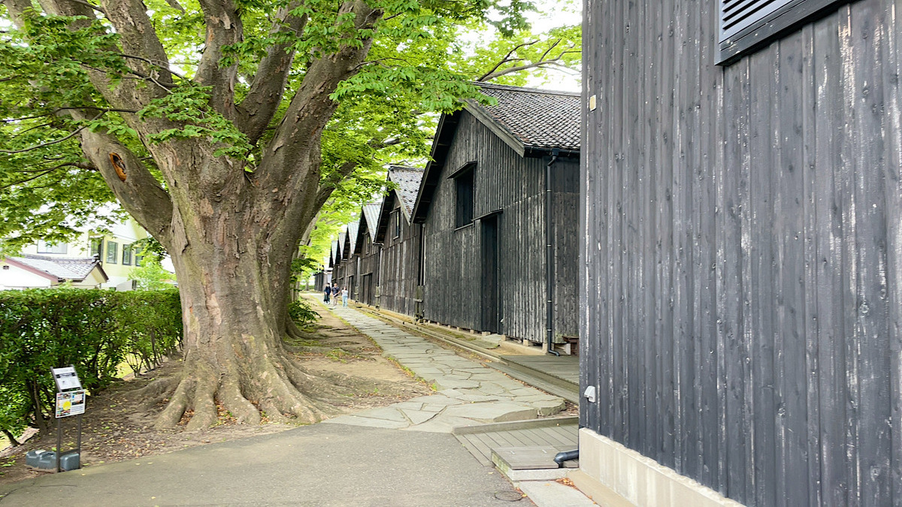

おお〜なんか **でっかい倉庫 :factory: と木 :deciduous_tree:** が並んでる・・・！

---

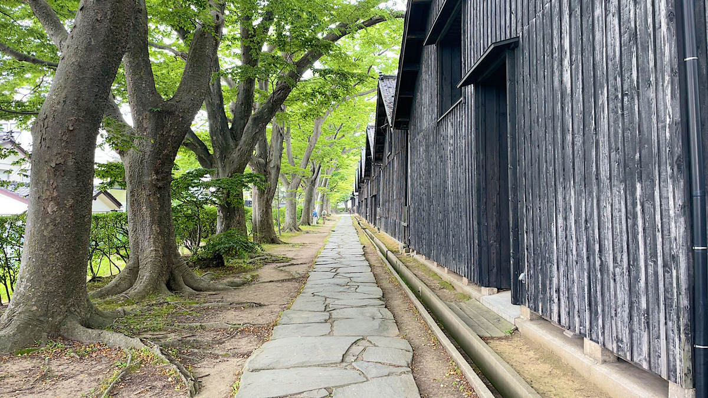

**ケヤキ並木** らしい・・・！ :deciduous_tree: :deciduous_tree: :deciduous_tree:

倉庫もたくさんある・・・！

どうやら昔は

**米の倉庫！ :rice: :factory:** だったらしいのね・・・！

---

そりゃそうだよね〜

**庄内平野** だもんね〜〜！

**こめどころ :ear_of_rice: :ear_of_rice: :ear_of_rice:** ですよ奥さん！

---

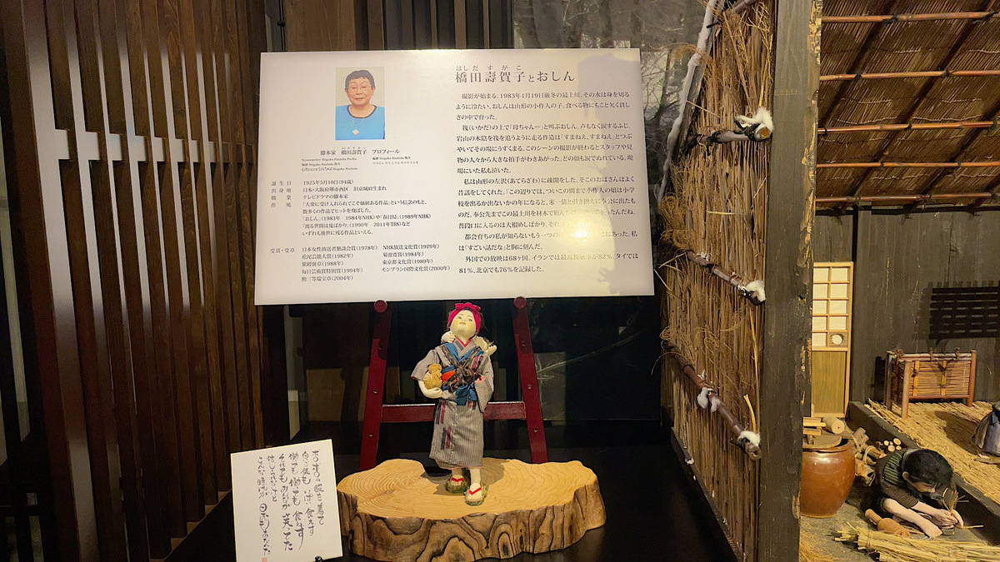

へ〜〜〜、 **おしん** ってドラマの撮影地だったらしいよ :movie_camera:

ほほー

---

みたことはないけど

原作・脚本の人はもちろん知ってるぞ :+1:

---

なるほどな〜

この辺はけっこう日本海側の **貿易地 :anchor:** だったらしい

そりゃ〜 **米も運びますわ :runner: :rice: :runner: :rice:**

---

っと、ぶらぶらしてたら

なんか **立派なお屋敷が・・・ :house_with_garden:**

見学できるっぽいぞ！ :raised_hands:

わーい！ :raised_hands: :raised_hands:

---

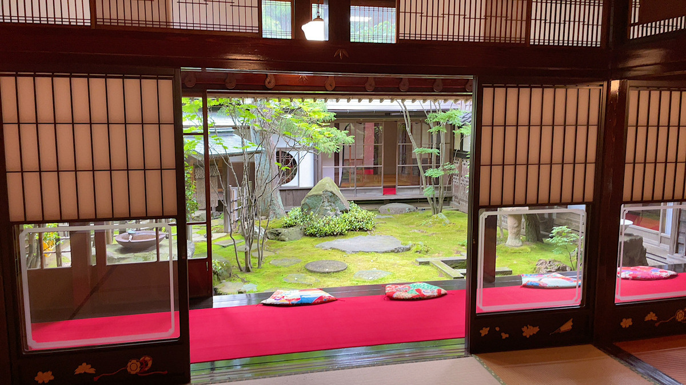

あら〜〜〜

立派なお庭だこと・・・ :sparkles: :sparkles:

さすが貿易してただけのことはありますねえ〜 :smirk:

---

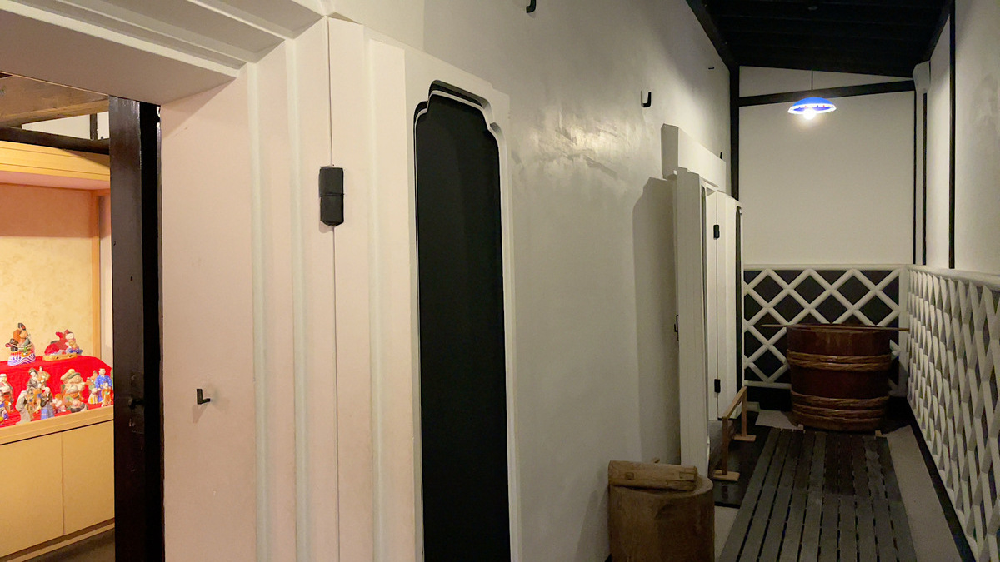

**蔵（くら）** もあるぞ・・・すげー！

くらっくらしちゃう・・・！ :persevere: :persevere: :persevere:

---

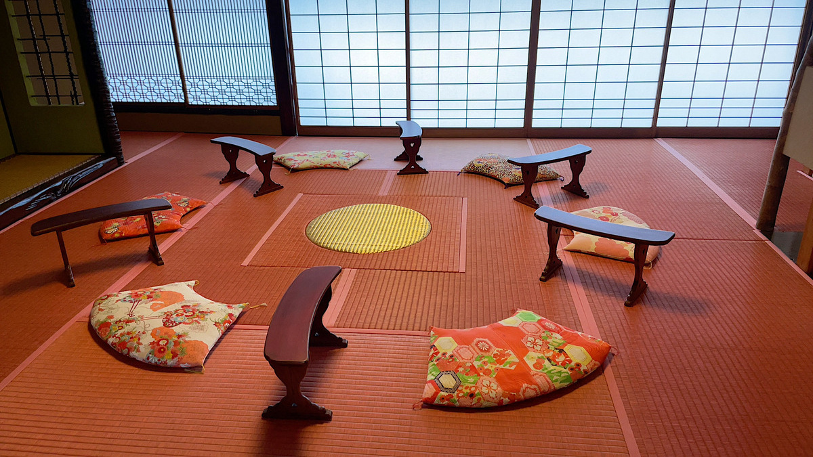

おお〜なんじゃこれ〜

昔の遊びかな・・・？

---

残念ながら

遊んでるところは見られなかったけど :frowning:

見られない分、どんな **いけない遊び** なのか

妄想が膨らんでしまうー！ :smiling_imp: :smiling_imp: :smiling_imp:

---

さてさて〜

**酒田は満喫したな〜！ :wink:**

次はどこかなー？？？ :satisfied: :satisfied: :satisfied:

---

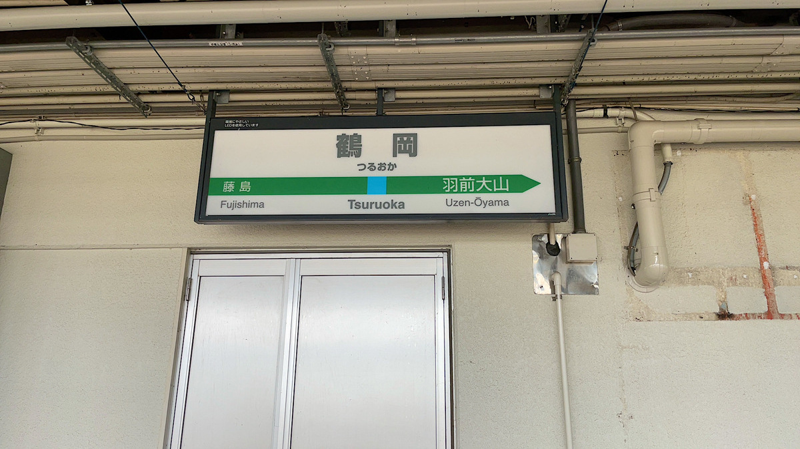

**鶴岡！ :bird:**

気づいたら鶴岡にいた！！

---

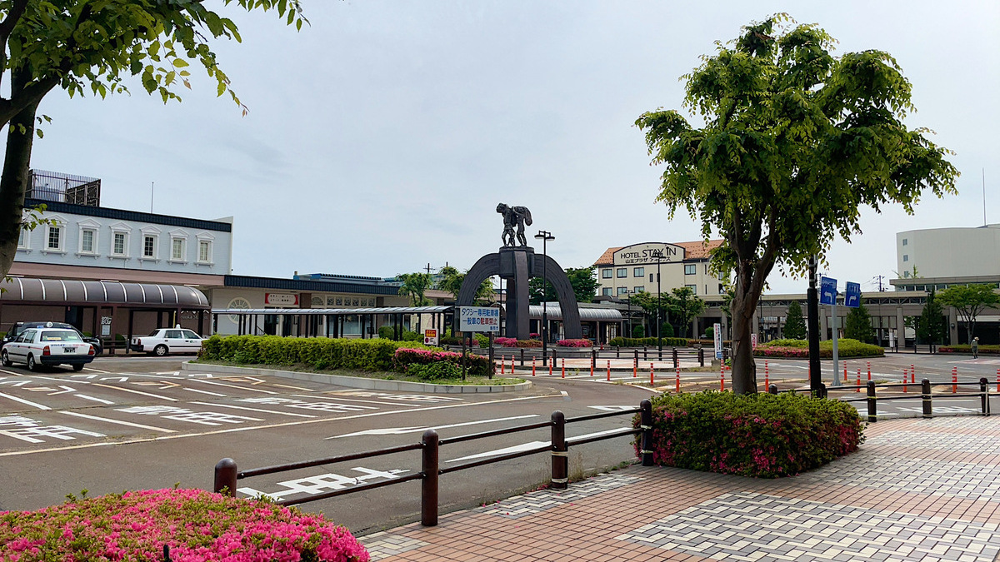

**わー鶴岡！！ :bird: :bird: :bird:**

---

やーそろそろ **お腹空きませんか？ :weary:**

んーなんか忘れてる気がするけど

おいしいもの

**食べましょう！！ :fork_and_knife: :yum:**

---

ちょうどいいところにお店が〜 :mag:

**さささっ :runner:**

---

さてさて〜

**何たべましょうか〜 :yum:**

（完全に目的忘れてるときの顔 :open_mouth:）

---

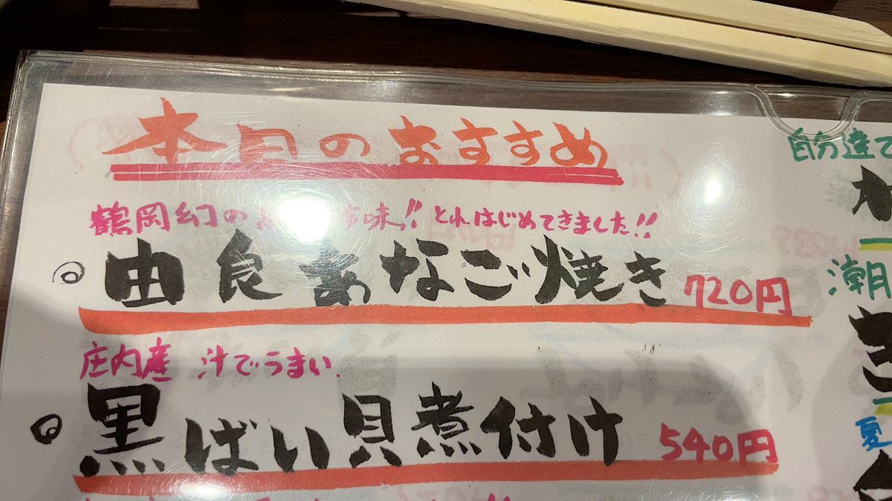

**由良アナゴ！ :fish:**

ってなんじゃい！ :thinking_face: :thinking_face: :thinking_face:

---

どうやら

**ヌタウナギ** 、のことを

この辺では **由良アナゴ** って呼ぶらしい！ :sunglasses:

へえ〜〜〜 :smiley:

---

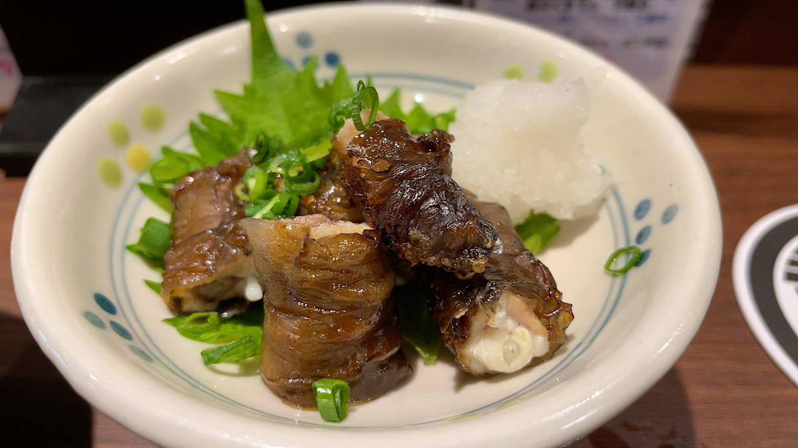

おおー！ :yum:

（ぱくぱく・・・）

こりこりしてて、 **うまいじゃないか・・・！ :triumph: :triumph: :triumph:**

---

（ぱくぱく・・・ :yum: ）

（ぐびぐび・・・ :beers: ）

**（ぱくぱくぐびぐび・・・・・・ :yum: :beers: ）**

---

やー色々食ったったわー :blush: :blush: :blush:

飯食ったら

**ゆったり過ごせるところ** で

**のんびり** したいわね :innocent:

---

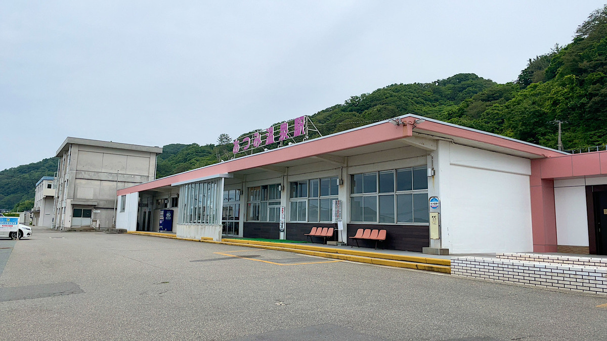

おお〜 **温泉〜**

---

ここがうわさの

**熱海とかぶる** から

**『あつみ』ってひらがなにしようぜ！**

で有名な

**あつみ温泉** さんじゃないっすかー！ :stuck_out_tongue_closed_eyes:

---

さーせん・・・ :pray: :pray: :pray:

---

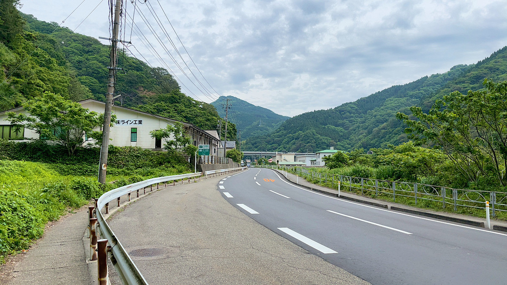

**駅から20〜30分** らしいから

**たまには歩いてみようぜ :runner:**

---

（てくてく・・・ :runner:）

あっ、バスとか乗ればよかった（後悔） :weary:

---

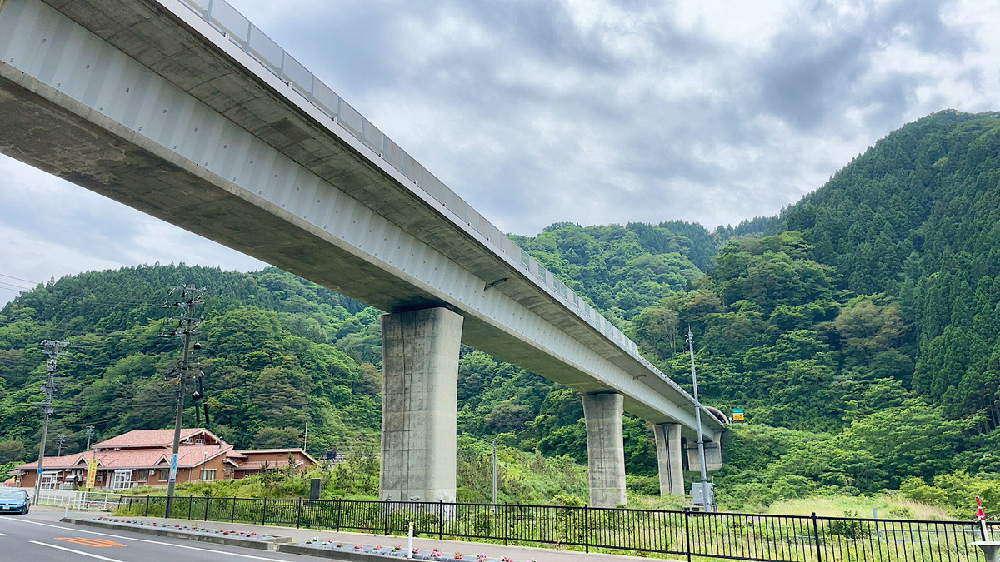

こうやって

高速の橋かかってるところを

下から通ると

**すごい建造物** だよね〜

って思っちゃう :relaxed:

---

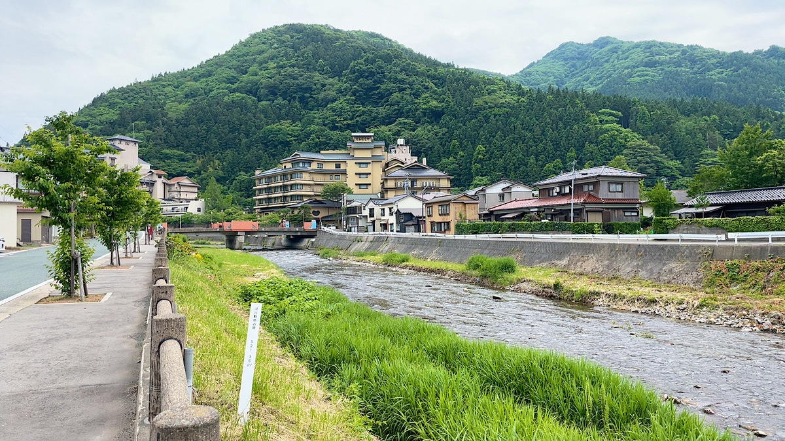

おっ

見えてきたでー :runner:

これが **あつみ温泉 :hotsprings:** かあー！

---

ふう〜〜〜 :sweat_drops:

**やっとついた〜〜〜  :sweat_drops: :sweat_drops:**

---

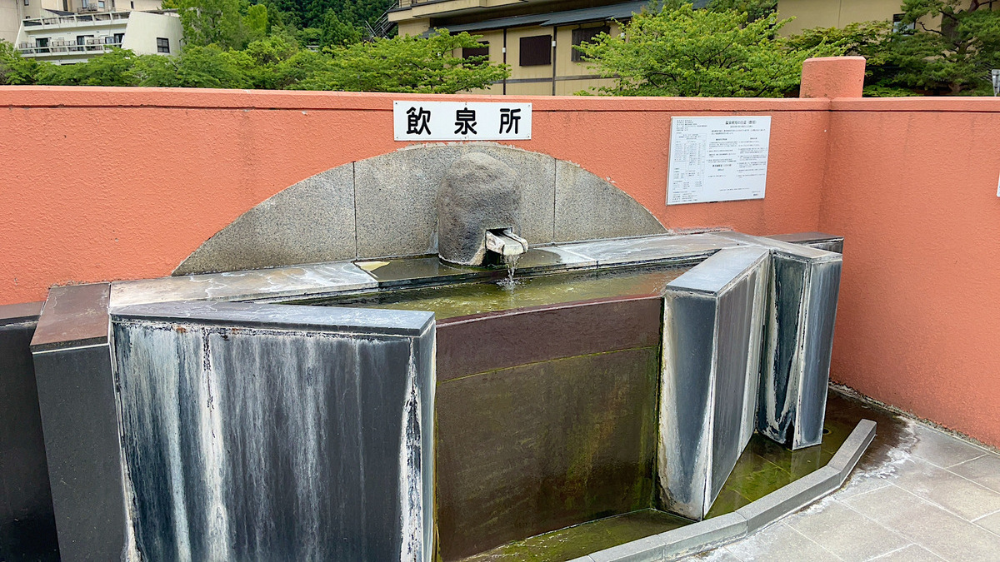

**飲泉所** 、って書いてある！

もしかして、 **温泉飲めるやつ？？？ :potable_water:**

飲めるやつか・・・！飲んでみよう！！ :potable_water: :potable_water: :potable_water:

---

（手ですくって）

**あっつ！！ :fire:**

**なにこれあっつ！ :fire: :fire:**

---

えっなにこれ、 **形状的にすくうしかない** けど

どうやって飲むの・・・！ :rage: :rage:

---

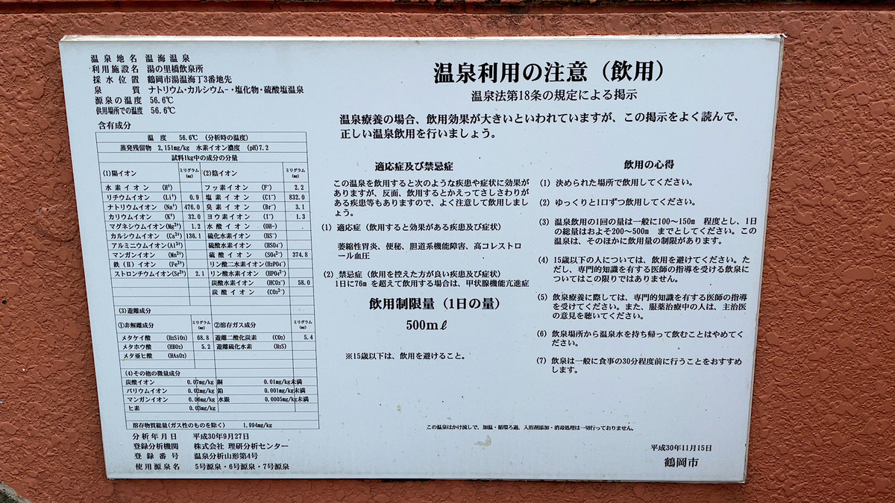

**56.6度・・・！ :fire:**

手ですくうのは無理げー :cry:

---

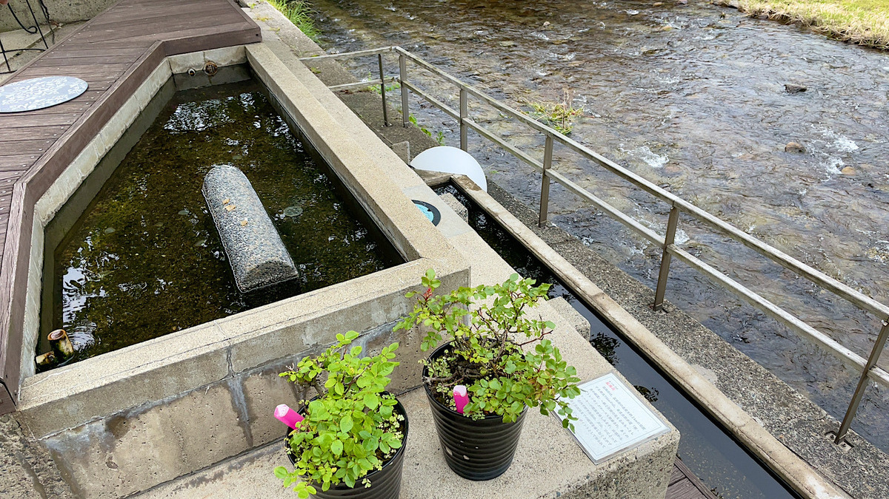

おやおや〜？ :sunglasses:

すぐ近くに **足湯** がありますねえ〜？ :sunglasses: :sunglasses:

---

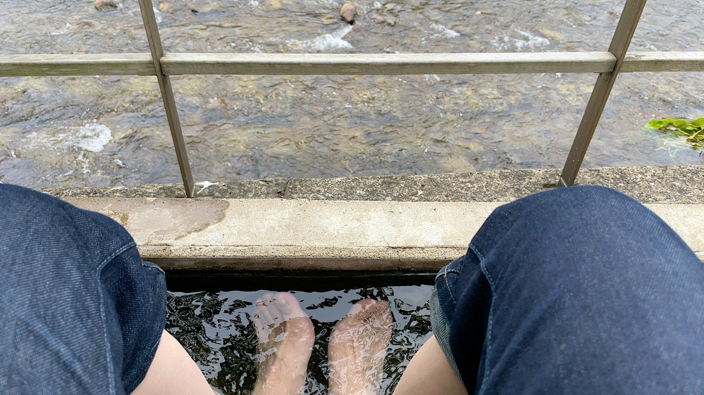

あああ〜〜〜！ :innocent:

**最高じゃないかー！！ :innocent: :innocent: :innocent:**

この川を眺めながら！

足湯に入る！

**最高だっ！！！**

---

さてさて〜

ここにあるとさらに **最 :innocent: の高 :revolving_hearts:** になるものは

なにかな〜？ :smiling_imp: :smiling_imp: :smiling_imp:

---

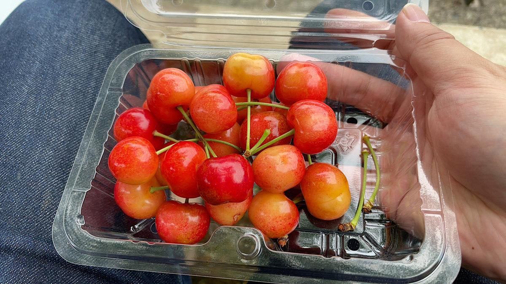

**答えはこれ！ :cherries: :cherries: :cherries:**

ひゅーひゅー！ :satisfied:

---

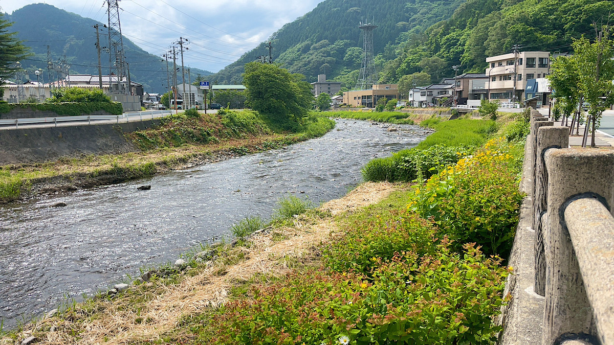

こうやって川をのんびり眺めながら・・・ :eyes:

---

**さくらんぼを食べちゃう！ :cherries: :cherries: :cherries:**

むふふふふ〜〜〜 :kissing_smiling_eyes:

---

むふ・・・ :kissing:

むふ？ :anguished:

---

**ハッ！ :open_mouth:**

**さくらんぼカレー :cherries: :curry:** 食べなきゃだったー！

---

妄想が行きすぎて

**さくらんぼ :cherries:** 食べちゃってたわ・・・

危険〜危険〜！ :imp: :imp: :imp:

---

## 実食！！

さて！カレーだカレー！ :curry: :fork_and_knife:

でも今回の、 **味大丈夫かなー？ :sweat:**

---

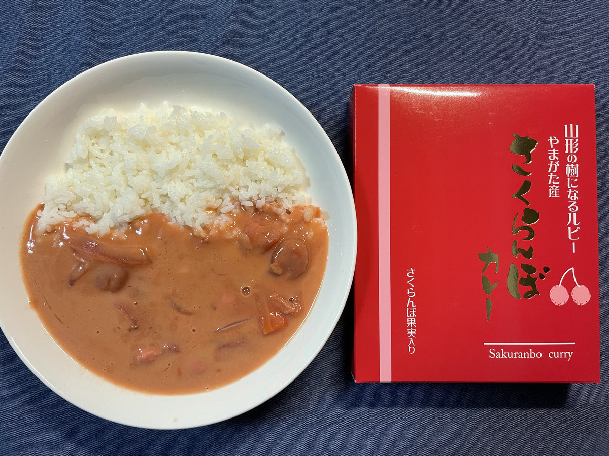

**どどーん！ :tada:**

おおっ、なんだこの色はー！

どうやら **さくらんぼの果肉** ごと入っているのは

事実のようだな・・・ :sweat:

---

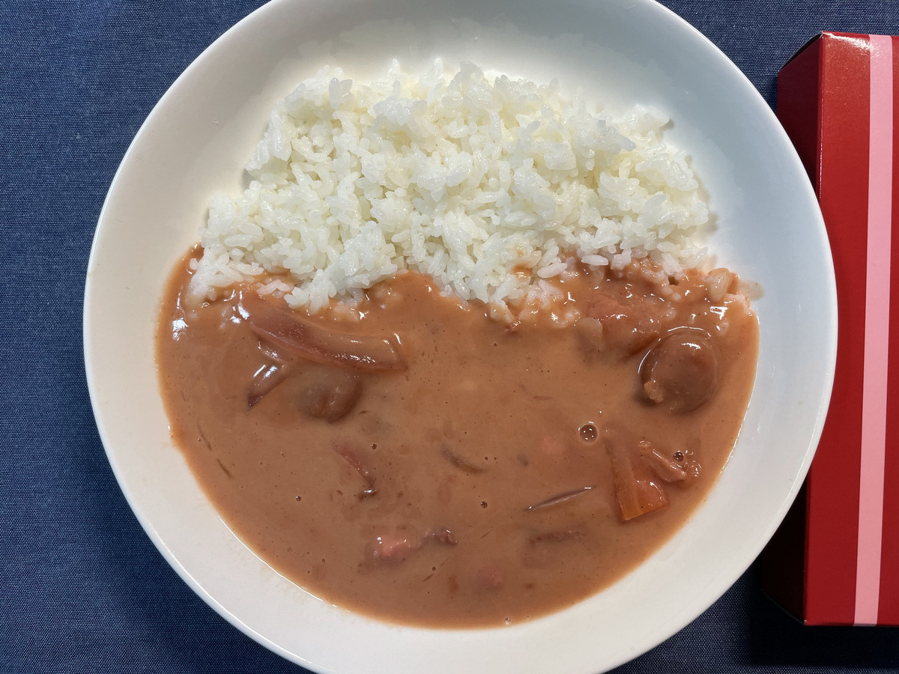

では

いつものように

生産者の方に感謝 :pray: して〜〜〜

---

**いただきまーす！ :pray: :pray: :pray:**

---

（モグッ）

---

**おおっ・・・！ :flushed:**

---

（モグッ）

（モグッ）

---

**うまいうまーい！！！ :satisfied: :satisfied: :satisfied:**

---

見た目がルビー色！しかもさくらんぼの果肉がそのまま入ってるのが面白い！

カレーの味はちゃんとするけど、爽やかでフルーティな味が楽しめるね。
全体的にまろやかなんだけど、お肉がほどよく弾力がある豚肉でアクセントになってて美味いっ！

---

最近・・・わかってきたんだ・・・

フルーツ系のカレーには

ホアジャオは合わないってこと・・・

（ジャオ〜・・・）

---

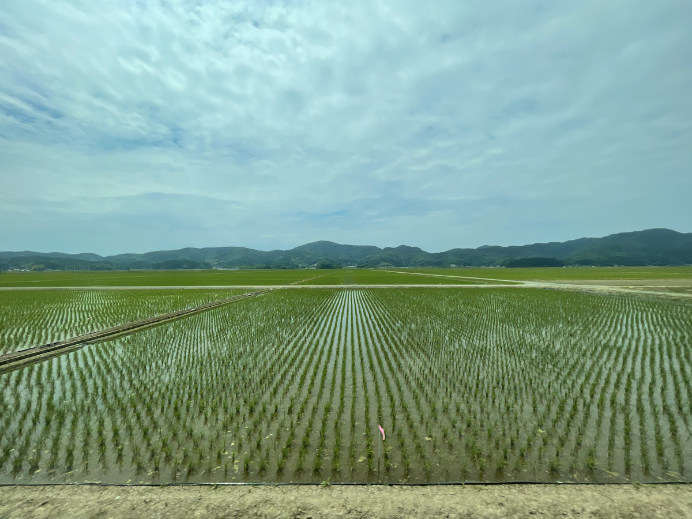

**庄内平野 :ear_of_rice: :cherries: ・・・最高だ・・・！ :100:**

---

**山形 さくらんぼカレー**

**おいしゅうございました！ :pray: :pray: :pray:**
