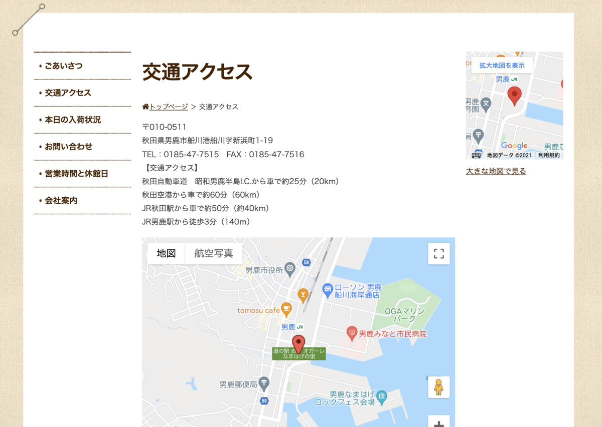
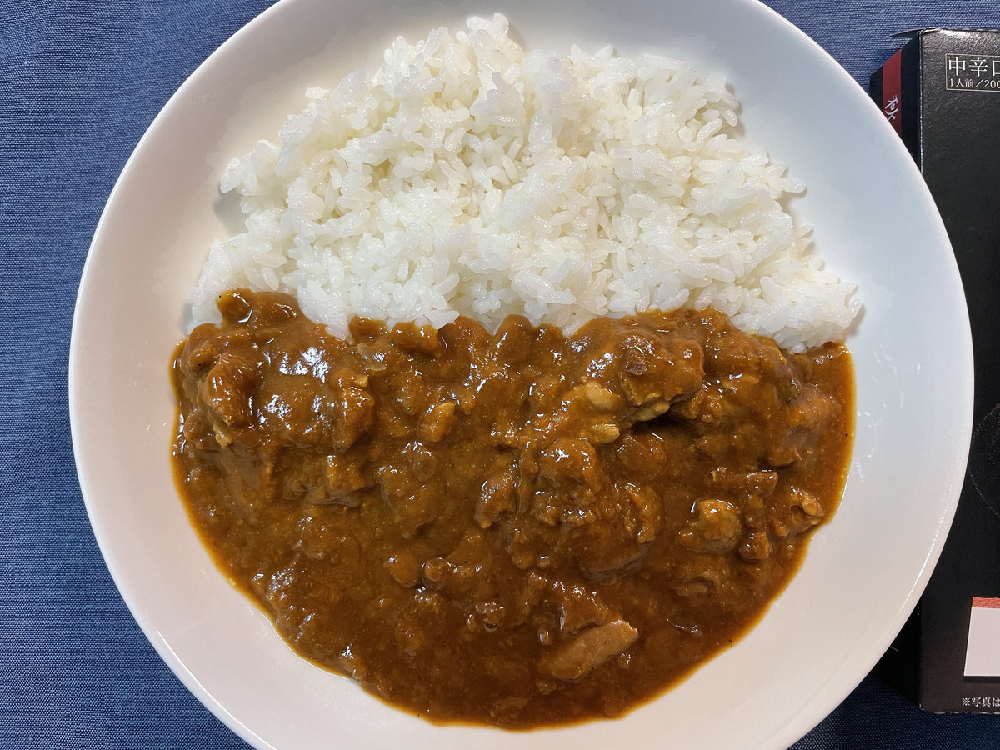

どんどん **北上** してきたよ！

今回は **秋田県！** :maple_leaf: :ear_of_rice:

新潟・山形・秋田は、 **特急いなほ** が

日本海側をずどーんと :train: :train: 走ってるエリアだね！

---

そんな秋田のカレーは〜〜〜 :question: :question: :question:

**これだぁー！ :raised_hands: :raised_hands:**

---

**比内地鶏カレー！ :curry:**

うぇーい！ **こけっこー :chicken: :chicken: :chicken:**

---

そしてー

**バックショット** は〜〜〜

---

**Oh, Sexy chicken...!!! :sparkling_heart: :chicken: :sparkling_heart: :chicken: :sparkling_heart:**

**日本三大美味鶏** 、だって？？

ってことは **美味** ってことー！？

**わー！ :clap: :clap: :clap:**

---

**あきた、いきたーい！ :raised_hands:**

でもまだ行ったことないから

なにがあるのかなー？ :thinking_face:

---

https://akita-fun.jp/

アキタファン :relaxed:

**ほっこり :relaxed: :relaxed: :relaxed:**

---

こういうサイトは

毎回参考にな〜る :mag:

---

おお〜

地域ごとに

まとめられているぞ？

---

どうやら

**8つの地域 :ocean: :mountain:** に

分けられるらしい

---

ほほー

やっぱ秋田市が中心なのかね？

（ぽちぽちー）

---

**秋田犬ー！ :dog:**

---

**秋田犬ー！！ :dog: :dog:**

もふもふしたいー！

やっぱ秋田は

**秋田犬 :dog:** 飼ってる人多いのかな・・・？

---

おや？

気になるのがあるぞ？ :eyes:

---

なになに？

> 漁師直送で鮮度抜群な海産物が目玉です。

**ひゅー！ :fish: :sushi:**

---

**男鹿！ :japanese_ogre:**

秋田で出っ張ってるとこ！

---

http://michinoekioga.co.jp/

男鹿っ？オガーレ！  :japanese_ogre:

---

こういうとき

**ダジャレ** くるパターンが多いのは

**触れてはいけないぞ・・・！ :wink:**

---

わー

こういう季節のおさかなも！

---

そうそう

ハタハタ :fish: って

秋田でつくられる

**さかな :fish: の醤油** なのよ〜

---

https://marutomisuisan.jpn.com/oga/

そして〜

おいしそうな **レストラン :fork_and_knife:** もなかにあーる！

---

**ハタハタ** や **しょっつる** を使った料理が

いろいろあるっぽいー！ :yum:

---

**うまそー！ :yum: :yum:**

---

なんかハタハタ以外の

**謎料理 :alien:** もあるっぽいが・・・？

> 航空自衛隊秋田男鹿加茂分屯基地の空上げ

**:thinking_face:**

---

こりゃ〜

行ってみて

**食べないとわからない** わね・・・ :thinking_face:

---

おお〜

めずらしく

**駅から :station:** すぐいける :runner: やーつー

---

http://www.nyuto-onsenkyo.com/

**温泉 :hotsprings:** も有名なのあるよね〜

**乳頭温泉郷ー！**

「大曲・角館・田沢湖」エリア

にあるらしいぞ？

---

おお〜

雰囲気ありますなー :two_hearts:

---

**温泉郷！**

って書いてあるだけあって

温泉たくさんあるらしい！

---

https://www.qkamura.or.jp/nyuto/

へえ〜〜〜

休暇村、過ごしやすそうね :sunglasses:

こういうとこで **湯治したい〜 :blush: :blush:**

---

飯もうまくて :fork_and_knife:

温泉もある！ :hotsprings:

**最高か！ :smiling_imp:**

---

ついでに **コーヒー :coffee:** 飲めるといいね

（ぽちぽちー）

---

ん？

**名だたるチェーン店** を押さえて

秋田県で展開してる

**ナガハマコーヒー** ・・・とは？

---

http://www.ncafe.co.jp/

あ〜これはもしかして

味にこだわりすぎて

他地方に展開しづらいやつでは？？？

---

いかねばー :coffee:

これは **のみにいかねばー :smile: :coffee:**

---

## 実食！！

さてさて〜

今回の **カレー :curry:** はこれ！

---

**ばばーん！！ :tada:**

うまいカレー :curry: はねえがー？ :japanese_ogre:

**比内地鶏カレー！ :tada: :tada: :tada:**

---

おお〜〜〜！！

**うまいカレー :curry: はあるぞー！ :japanese_ogre:**

生産者さんに感謝して！ :pray:

**いただきます！ :pray: :pray: :pray:**

---

（パクッ）

---

**むむっ・・・！ :flushed:**

---

（パクッ）

（パクッ）

---

**うまいうまーい！！！ :satisfied: :satisfied: :satisfied:**

---

鶏肉の主張が思ったより激しい！歯応えあって旨味ある！ :ok_hand:
カレーソースは濃厚でご飯に絡みついてガツガツ食えそうな、ほどよく辛い感じのカレーだ！
皮も入ってて、また食感が違ってやわらかーで最高にうまーい！

---

https://neiger-info.com/

**秋田も・・・熱い・・・！ :muscle:**

---

**秋田 比内地鶏カレー**

**おいしゅうございました！ :pray: :pray: :pray:**
