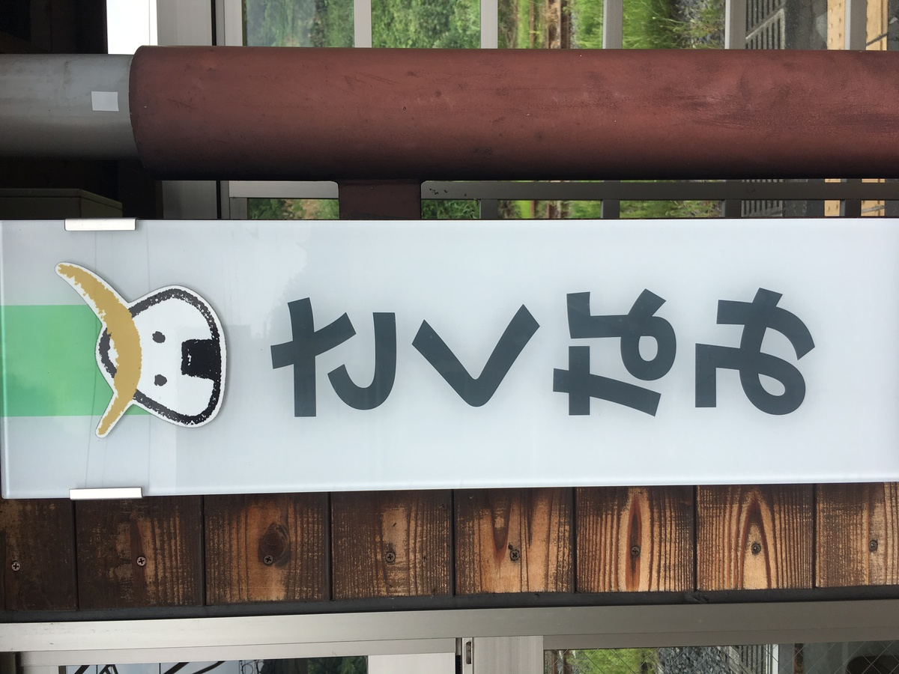
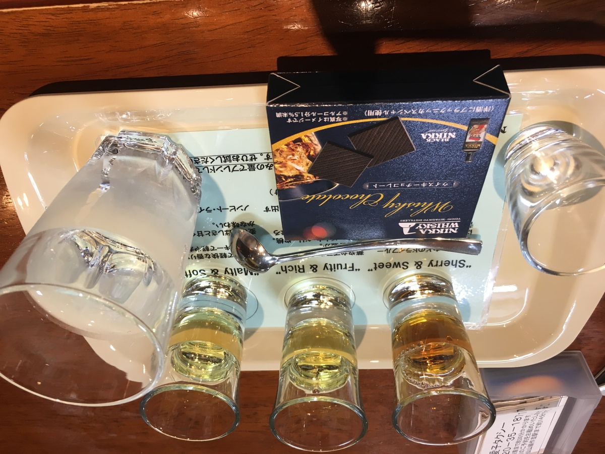

ちょっぴり南下の **宮城県！**

だけど、ゴールが近づいてきたぞー :muscle:

---

今回のカレーはこいつ！

**じゃーーん！ :sunglasses:**

---

**肉屋牛たんカレー！ :cow: :tongue: :curry:**

**わーわー :clap: :clap:**

牛たんですってよ！！

**おいしいに決まってるじゃん！！！**

---

バックショットは〜〜

**これ！**

---

**Oh, Sexy cow...!!! :sparkling_heart: :cow: :sparkling_heart: :cow: :sparkling_heart:**

写真がも〜！ :cow:

も〜 **おにくごろっごろ** なのよ！ :cow: :cow:

---

むむっ？

めずらしい **横開け・・・！**

もしかして

**肉たっぷり** だから・・・？

しらんけど :smirk:

---

宮城、いいなあ

仙台、いきたいなあ・・・

・・・

・・・

**ほわわわ〜ん :zzz:**

---

はっ、ここは・・・？

**海の上 :ocean:** じゃないか・・・！

---

な、なぜか

**仙台湾の手前・・・！ :open_mouth:**

---

と、きづいたら

**仙台港に着いていたー！ :anchor:**

---

わー **フェリー！ :ferry:**

フェリーだよーフェリー！ :ferry:

---

ちょっと移動したら仙台駅に来た！

駅構内にアレ、あるよね〜 :kissing_closed_eyes:

アレ、食べたいよね〜 :kissing_closed_eyes: :kissing_closed_eyes:

---

ずずーん！ :yum:

**ずんだシェイク！ :yum:**

---

これこれ〜〜 :heart:

**これですよこれ〜 :heart: :heart:**

---

ずんだをね

ずずーっとね :sunglasses:

---

えっ？

ずんだってなにかって？

**枝豆ですよー枝豆ー！**

これがおいし〜んだな :yum:

**『ずんだ茶寮』のやつが好きー :revolving_hearts:**

ずずー

---

ずんだシェイクをずずーっとしたところで

ちょっとぶらついてみようかね

---

仙台、地下鉄が十字にあって便利そうー

寒くても地下なら大丈夫そうね

---

そうそうー

仙台から西にいく線路

**仙山線 :train:** っていうのよね

**仙台市** と **山形市** を結ぶ路線だから！ :train:

---

そうそう、そうなのよー

作並駅っていう駅もあって・・・

---

って、おや〜？ :thinking_face:

---

ここは例のアレがある

**作並駅** じゃないですかあー :heart_eyes:

アレってなにかって？

そりゃー

---

そりゃー

---

**宮城峡** に決まってるでしょ！！ :wine_glass:

あの！

有名な！！

**宮城業！！！ :wine_glass:**

---

さっそく見学だー！ :runner:

---

**発酵！**

すきな言葉だ・・・！ :sparkling_heart:

---

**蒸留！**

すきな言葉だ・・・！！ :sparkling_heart: :sparkling_heart:

---

ここで蒸留されるんですよねー

**ひゅー :fire: :droplet: :fire: :droplet:**

---

そして **貯蔵！**

ここで何年もねむるのよ・・・ :zzz:

---

は〜〜〜たのしみだわ〜〜〜 :sparkles: :sparkles: :sparkles:

---

ぐるっと回ってきて

あとやることといえば〜〜〜

---

**テイスティングでしょー :wine_glass: :wine_glass:**

わー :tada: :tada:

ここでしかのめないやつもあるよー :raised_hands:

---

おとなのゆうえんちだー :star:

---

のみくらべもあるよー :star: :star: :star:

---

うーん最高だ・・・ :wine_glass:

---

宮城峡・・・いい・・・

---

**宮城峡・・・とてもいい・・・ :100:**

---

よし、そろそろ戻ろう〜 :relaxed:

---

**もどってからの〜〜**

---

**ずずーん**

---

こんどは食べるでしょー :yum:

やーうまい！

食べるずんだもうまい！ :yum: :yum:

---

おやつ食べたあとだけど

そろそろがっつり **お肉** 食べたいわね・・・ :thinking_face:

---

おおーっと

こんなところに

**牛たんのお店がー！！**

**牛！ :cow:**

**たん！ :tongue:**

---

**牛！ :cow:**

**たん！ :tongue:**

**牛！ :cow:**

**たん！ :tongue:**

**牛！ :cow:**

**たん！ :tongue:**

**たん！ :tongue:**

（なんかわすれてるような・・・？）

---

きたー！

**お肉きたー！ :cow:**

こんなのうまいに

きまってるじゃーん！ :dancers: :dancers: :dancers:

---

って、えーもう帰る時間になってたー！

---

からのー

---

空港ずんだー！ :yum:

---

**ずずー！**

---

・・・ :zzz:

・・・ :zzz:

---

**はっ！？**

夢のなかですでに **牛たん** 食ってたわ・・・

あぶねー

**牛たんカレー :cow: :tongue: :curry:** 食べなきゃだったわー

---

## 実食！！

ってことで **どーん！ :curry:**

**ごろごろ** 入ってるぅー！

---

**おいしそうー！ :yum: :yum:**

では、いただきまーす！

---

牛たんの味がカレーに全然負けてなくてジューシー！牛たんカレーを食べてる実感がすごい！

カレールーはとにかくお肉の脇役に徹しててフルーティーな優しい味わいで、辛さは全然強くないし、パクパク食べてもまだ牛たんの肉片がたくさんあって最後まで楽しめる！

---

やーこれは意外なほどに

牛たんのお肉感が残ってて美味すぎるね・・・！

**生産者さんに感謝！ :pray: :pray:**

ありがとう・・・！ありがとう・・・！

---

仙台・・・住める街だった・・・！ :wave:

---

**宮城 肉屋牛たんカレー**

**おいしゅうございました！ :pray: :pray: :pray:**
