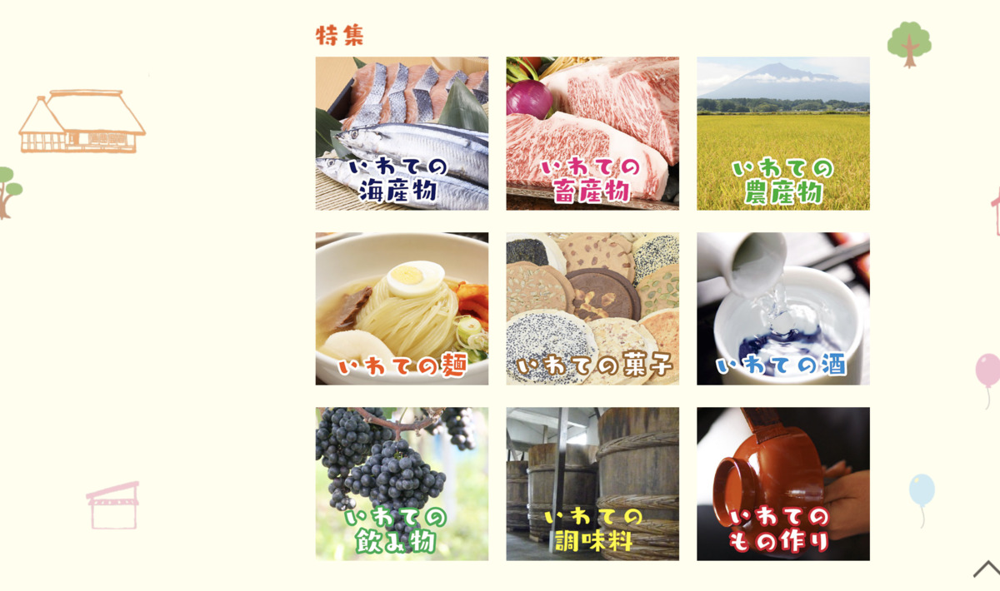
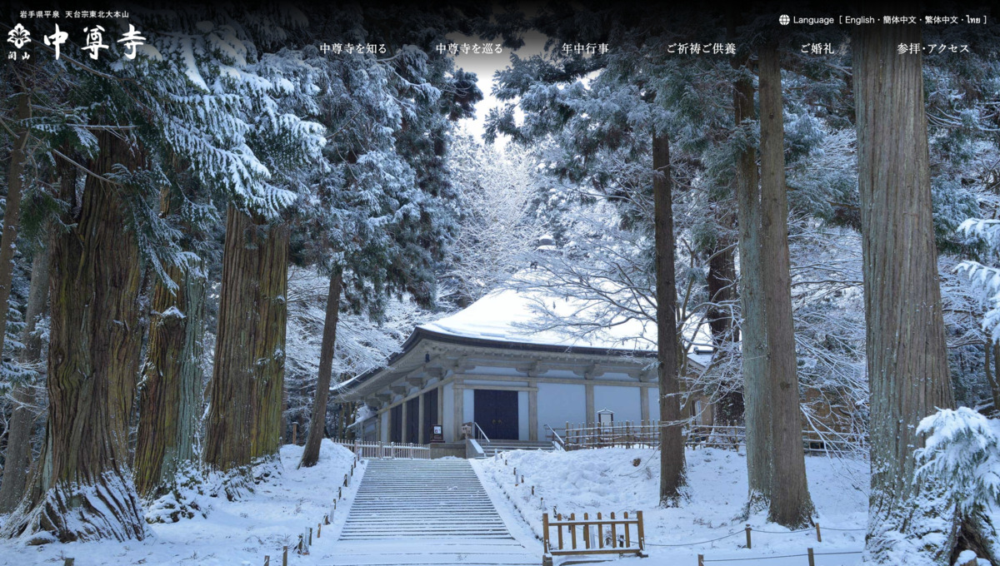
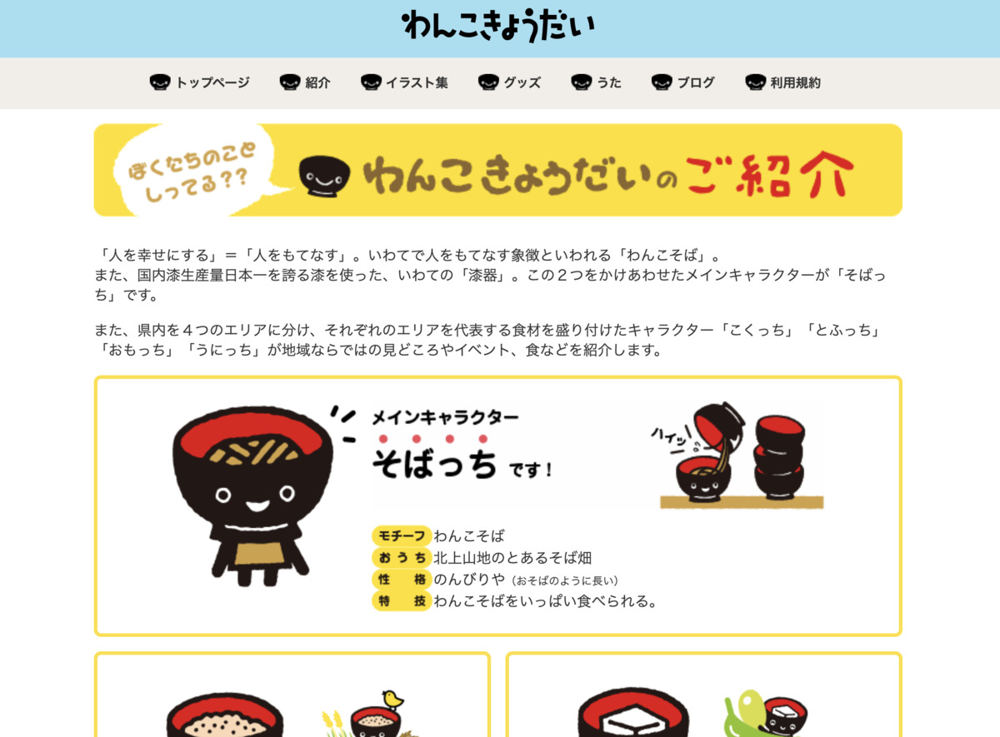

さてさて？

本日のカレーは？？ :curry:

じゃじゃーん！ :confetti_ball:

**鯖カレー！ :fish: :curry:**

---

そしてバックショットはー？

**Oh, Sexy sava...!!! :sparkling_heart: :fish: :sparkling_heart: :fish: :sparkling_heart:**

---

・・・

・・・

**:thinking_face:**

---

よく見ると **お菓子** じゃないかー :boy: :girl:

---

サヴァ？缶のお菓子だってよ :lollipop: :cookie:

**すげー :yum:**

---

じゃなくて :sweat:

ほんものの方はこっち！ :point_down:

どーん！

岩手の **小岩井クリームチーズカレー！ :curry:**

---

**ミルクだぜー！ :baby_bottle: :baby_bottle: :baby_bottle:**

**チーズだぜー！ :cheese: :cheese: :cheese:**

---

そして〜

**バックショット** どーん！ :collision:

---

**Oh, Sexy milk...!!! :sparkling_heart: :baby_bottle: :sparkling_heart: :baby_bottle: :sparkling_heart:**

あの有名な小岩井のカレーが食べられるなんて・・・！

生産者に感謝・・・！ :pray:

---

ん？

って、賞味期限きれてるじゃーん :dash:

---

2年も食べずに残したままにするからじゃーん :angry:

**反省しよー :no_mouth:**

よーし食べて終わらせるぞー :fork_and_knife: :muscle:

---

ところで

さっきの **お菓子** はなんなんだ？ :thinking_face:

---

https://www.iwatekensan.co.jp/cava/

> 三陸からオリジナルブランドの加工品を発信しようと、国産サバを使用したオリジナルの洋風缶詰として誕生

なるほどー！ :fish:

> 「Ça va?（サヴァ）?」はフランス語『元気ですか？』という意味。

なるほどなるほどー！ :laughing:

---

おっ、なんか

**バーチャル物産展 :department_store:**

やってるみたいだな

---

https://iwks-netshop.com/

ほほー！ :eyes:

---

**海産物！ :fish:**

**畜産物！！ :pig:**

**農産物！！！ :ear_of_rice:**

---

あ〜〜これは **いつもの流れ！ :yum:**

---

https://www.kankou385.jp/spacial2018/

そうそう！

**瓶ドン！！ :fish: :baby_bottle:**

---

**瓶ドン** っていうのが

最近、有名なのよね！ :wink:

---

**瓶に〜 :baby_bottle:**

**ウニとか海産物を〜 :fish:**

**ドーン！！** とね :yum:

---

> 獲れたてのウニを、滅菌処理を行った海水と一緒に牛乳瓶に入れ保存することで、地元でしか味わえない新鮮で美味しいウニを食べることができます。

> この独特のスタイルからヒントを得て、考案されたのが「瓶ドン」です。

なるほどー **ウニ** を詰めてたらしい :thinking_face:

---

https://onsennews.com/news181123_bindon_miyako/

**カラフルー :rainbow:**

**映え映え〜〜〜 :tropical_drink:**

---

https://www.city.kuji.iwate.jp/kanko/kanko/kosodeamacenter.html

**あまちゃん！ :ocean: :woman:**

海 :ocean: の女 :woman: と書いて **海女！**

---

https://www.city.kuji.iwate.jp/kanko/kanko/ama.html

**素潜り** すごいわねー :expressionless: :expressionless: :expressionless:

絶対息続かないわ :innocent:

---

どうやら平安時代から

有名なお寺もあるらしいぞ :mag:

---

https://www.chusonji.or.jp/

ほほーここが **中尊寺・・・！** :running:

なんだか広そうね〜

---

どうやら **国宝** もあるし :star:

**世界遺産** にもなってるらしい！ :star2:

うーん、レガシ〜 :pray: :pray: :pray:

---

**お茶** も飲めるっぽい！ :tea:

本格的なやつ！ :tea: :tea:

---

座禅の体験もやってるらしい！

こころを無にするのです・・・ :cyclone: :cyclone: :cyclone:

---

いいなあお寺・・・

お寺行きたい・・・ :sparkles:

**行きたいぞ〜 :running:**

どの辺にあるんだろ？ :thinking_face:

---

なるほどー

**仙台** と **盛岡** の

ちょうど間くらいっぽい！

これは **仙台** から **盛岡** へ

行く予定を立てなくては・・・ :thought_balloon: :thought_balloon: :thought_balloon:

（新幹線よりは、 **在来線** がいいな・・・ :train: :train: :train: ）

---

## 実食！！

さあ、そろそろ **カレー :curry:** の時間！ :clock:

---

**うぇ〜〜い :baby_bottle: :cheese: :curry:**

クリームチーズの香りするする〜 :nose: :dash:

---

それでは！

**いただきまーす！ :pray: :pray: :pray:**

---

（モグッ）

---

**おおっ・・・！ :flushed:**

---

（モグッ）

（モグッ）

---

**うまいうまーい！！！ :satisfied: :satisfied: :satisfied:**

---

食べた瞬間ソースの濃厚さとチーズの香ばしさで口が満たされる・・・！

具材は細かめに刻んであるので、よくソースに絡んでおいしい！パスタ入ってても違和感ないくらい、ソースがメインと言えそうなカレーだ！

---

**まじうまだった・・・ :curry: :pray:**

---

いわて

今度食べにいくで・・・！

https://iwatetabi.jp/wanko/introduction

---

**岩手 小岩井クリームチーズカレー**

**おいしゅうございました！ :pray: :pray: :pray:**
