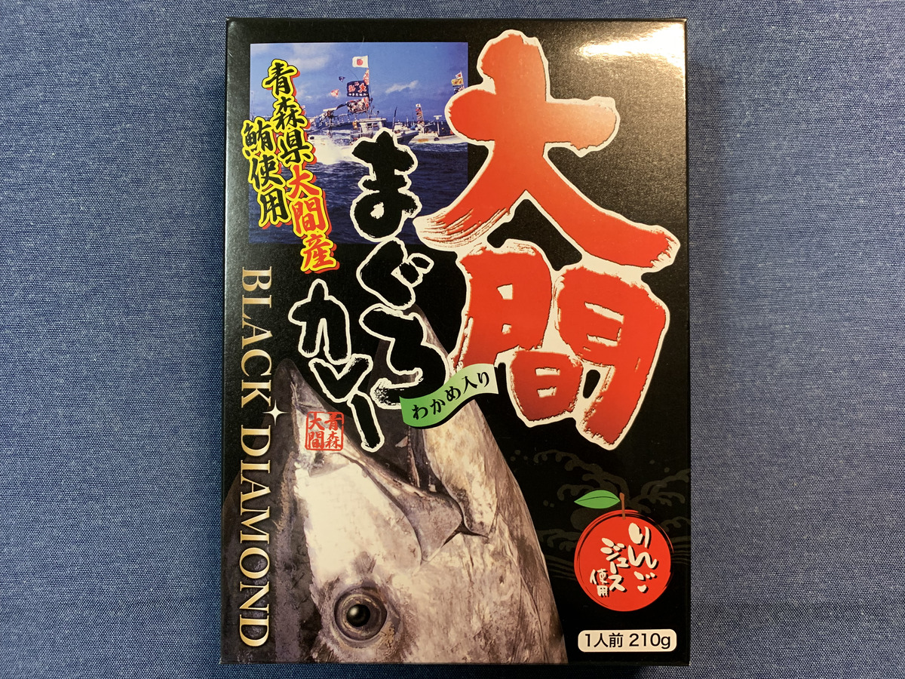

とうとう・・・！ :sob:

とうとう **本州の北の端** まできた！！

きたぞ・・・！！ :raised_hands: :raised_hands:

---

本州最後のカレーは〜？？？ :curry:

**これっ！ :boom:**

---

**青森 大間まぐろカレー！！ :fish: :fish: :fish:**

ど直球ストレートきたー！ :fish:

---

バックショットは〜 :eyes:

---

**Oh, Sexy Tuna...!!! :sparkling_heart: :fish: :sparkling_heart: :fish: :sparkling_heart:**

そして安定の

賞味期限切れ〜〜〜 :sweat: :sweat: :sweat:

**すまん〜 :pray: :pray: :bow: :bow:**

（さっさと終わらせんからや・・・）

---

だが！

頑張って **食べて** 終わらせる・・・！ :muscle:

---

大間かあ〜〜〜 :thinking_face:

行ったことないんだよなあ〜〜 :thinking_face: :thinking_face:

（ぽちぽち〜 :mag: ）

---

https://www.town.ooma.lg.jp/kanko

ほほー **大間崎ー :fu:**

北の端だぜー :sparkles:

---

なんかこういうの

**行ったった感** あるよねー :trophy:

北海道まで

けっこう近いらしい・・・！ :eyes:

---

https://www.tsugarukaikyo.co.jp/

**船ー！！ :ferry:**

**フェリー！！！ :ferry: :ferry:**

**Foo!!! :swimmer: :swimmer: :swimmer:**

やーさすがに泳げないけど・・・

---

でも **近いよね！ :runner:**

**片道90分** ですって！！

もしかしたら

函館行くのは **青森から** のが近いかも・・・？？

---

https://r.gnavi.co.jp/g-interview/entry/another/2437

なになに〜？

**のっけ丼？？ :yum:**

---

**券** 買いーの？

---

**白米** 買いーの？？

---

**のっけーの！**

わー :clap: :clap: :clap:

---

https://nokkedon.jp/

わー **やばーいやりたーい！**

---

あ〜〜〜 :yum:

**季節** によって違うやつ〜 :cherry_blossom: :sunflower: :fallen_leaf: :snowflake:

こんなん絶対うまいじゃん！ :rage:

---

https://www.hirosaki-kanko.or.jp/

あ〜そうそう〜

**弘前** も気になってるのよ :ear:

ひろさきひろさきー

---

**弘前市りんご公園！ :apple: :park:**

わーすごいイメージ通りの公園きたー

---

なんかいろいろありそうだぞ？ :grinning:

---

なんじゃこれ！

**このりんごづくしメニュー！！ :apple: :apple: :apple:**

**りんごカツカレー :curry:** に

**りんごラーメン :ramen: ？！**

どゆこと・・・

---

**収穫体験** までやってるって！ :apple:

**りんご :apple:** の掘り下げがすごい・・・！

---

しかもけっこうな期間やってる

へーりんごにも種類があるからなんだ、へー

これは **行かねば・・・！ :runner:**

---

## 実食！！

さーて **食べるぞ食べるぞー :muscle:**

---

**ずーん！！ :crown:**

---

**ばばーん！！！ :crown: :crown:**

どうやら **りんごとわかめ** が入ってるらしい

どういう味なのか想像つかないぞ？？？ :thinking_face:

---

では生産者さんに感謝して・・・ :pray:

**いただきます！ :pray: :pray: :pray:**

---

（パクッ）

---

**うまーーーい！！！ :satisfied: :satisfied: :satisfied:**

---

（パクッ）

（パクッ）

---

**うまいうまーーーい！！！ :satisfied: :satisfied: :satisfied:**

---

なんだこれカレーか？って思うくらい、最初のひと口がまろやかすぎてびっくり！

あーでも後からじわっと辛さが舌にきて、やっぱりカレーだわって思ったり。程よい歯応えのマグロと、黒っぽいこれはわかめかな？ルーに合ってて良いね！

---

やーーーー

**うまかったーーー :yum:**

あおもり・・・いいな・・・ :apple:

---

https://www.jreast.co.jp/akita/gonosen/menu/15.html

**青森にいらっしゃいビーム！！！ :sparkles: :sparkles: :sparkles:**

---

**青森 大間まぐろカレー**

**おいしゅうございました！ :pray: :pray: :pray:**
