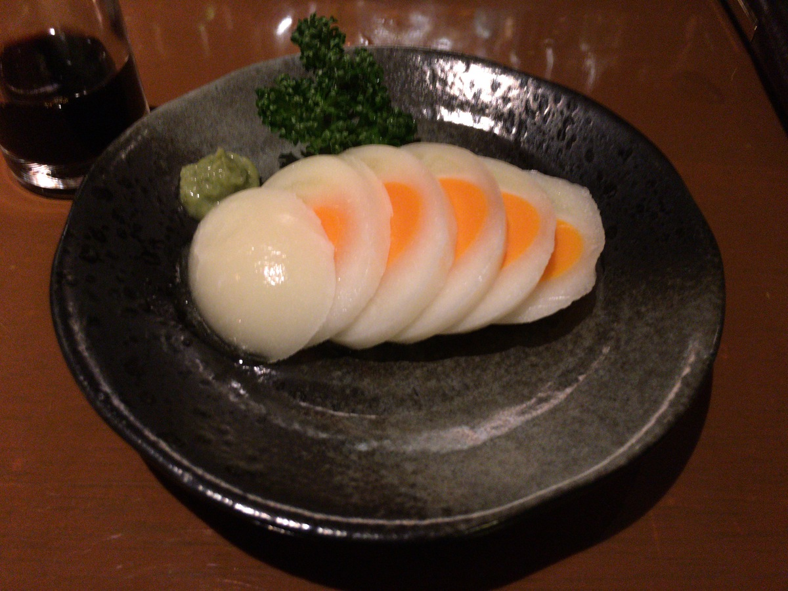

**ながかった・・・ :hourglass:**

---

思えば

自宅に **籠るのを強いられる :disappointed:** ようになって

---

「このままだと **ストレス半端ない :anger:** 」

「 **カレー :curry:** でも大量に買って食べたら :fork_and_knife: いいんじゃね？」

「ついでに **ブログ :pen:** 書いたらいいんじゃね？」

---

なんて **てきとーな気持ち** で始めて

**はや2年近く・・・ :hourglass: :hourglass:**

---

最初の記事・・・

**なぜこんなに時間かかる作りに :weary:**

**してしまったのか・・・ :weary: :weary:**

---

とどいたぞー、じゃねえよw

---

2記事目からは

**逆に記事を書くのが辛く** なるという

**本末転倒感・・・ :tired_face:**

---

だが、やっと・・・

やっと、たどりついた・・・

**北海道ー！！ :tada: :tada: :tada:**

---

ながかった・・・ :sob:

**ながかったよお・・・ :sob: :sob:**

（だいぶ時間使ってしまった・・・）

---

さあ、 **さいごのカレー :curry:** はこいつだー！

---

**函館カレー！**

おっ **地名** きた :eyes:

どうやら有名レストランが作った

**おいしい勝負 :gun: :bomb:** しにきたやつっぽい

---

もはや

北海道ともなると

素材がうまいのは **あたりまえ・・・ :stuck_out_tongue_winking_eye:**

いちいちいわないのさ :kissing_smiling_eyes:

---

そして **バックショット** はこれ！

---

**Oh, Sexy Factory...!!! :sparkling_heart: :factory: :sparkling_heart: :factory: :sparkling_heart:**

・・・

Factory...?

どうやら本気で

**うまいやつ狙ってる :gun:** っぽいぞ・・・

---

さいごの **レトルトパウチ・・・！**

**五島軒** さん、ありがとうありがとう・・・ :pray:

---

https://gotoken1879.jp/

ほほーすごい **雰囲気** ある・・・

**明治** ですって :sparkles:

すごい〜〜

---

そう！

すごい **レストラン :fork_and_knife:** のサイトは

**歴史のページがある :boy: :older_man:**

---

おお〜

場違いかもだけど

**函館 :star:** 行ったら

一度は行ってみたいわね！ :runner: :runner:

---

そう

北海道って

**広い** のよね

函館は **北海道の南西** の方〜 :point_down: :point_left:

---

https://www.rausu-town.jp/

羅臼は **北海道の北東** の方〜 :point_up: :point_right:

**700km** 近くあるっぽい・・・

ひえええ〜〜〜 :cyclone: :cyclone: :cyclone:

---

おおっ、なんだこの

**『5分でわかる羅臼町』** って？ :thinking_face:

---

もう海鮮がうまいとかは

**いちいち言わない** やつだよな〜 :yum:

（ぽちぽち〜 :mag:）

---

https://kanko.rausu-town.jp/about

> 最後に残された手付かずの自然

って、 **パワーワードだな :muscle:**

すごいぜ・・・ :sun_with_face: :ocean: :earth_asia:

---

**アクセス方法** あるぞ？

> 450km・約8時間（夏）〜約10時間（冬）

あ〜〜やっぱり **単位がちがう :eyes:**

---

一番ありそうなのが

近くの **空港** まで行って

**レンタカーコース** なのかな？

んー冬は厳しそう・・・ :snowflake:

でも **行ってみたい・・・ :two_hearts: :two_hearts:**

---

そーそー :smile:

近くに・・・って言っても近くないけど

**網走** も同じ方面にあるのよね

---

https://www.kangoku.jp/

**網走監獄ー！ :smiling_imp:**

囚人だー！！ :smiling_imp: :smiling_imp:

---

わー行ってみたいー！ :runner:

---

おー **囚人のお気持ち** になれそう

思った以上に **いろんな施設** があるんだなあ

こんなとこに入れられたら

絶対寒いでしょ・・・ :cold_sweat:

---

そうそう

**網走監獄** に行く **漫画 :books:** あるよね

---

https://youngjump.jp/goldenkamuy/

これや・・・

これ読んでから :books:

**北海道** に行きたすぎてしょうがない・・・！

---

北海道の入り口に

**ゴールデンカムイ :trophy: :trophy: :trophy:**

いいかもしれない・・・！

---

やーー

北海道、 **広すぎるんだよなー :raised_hands:**

---

**電車 :train:** で行くにしても

**ものすごい時間かかる** んだろうな〜 :hourglass:

---

そうそう、電車でね :train:

電車に乗ってね

---

って着いたら **余市だった〜！ :flushed:**

---

**余市！ :cocktail:**

---

**ニッカ・・・！ :cocktail: :cocktail:**

---

**foo...!!! :smiling_imp: :smiling_imp: :smiling_imp:**

---

あ〜〜〜そう

---

そうそう！

**蒸留！ :fire: :droplet:**

---

好きなことばは

**蒸留・・・！！ :fire: :droplet: :fire: :droplet:**

---

あ〜〜〜 **良い〜〜〜 :heart_eyes: :dizzy:**

---

つくったら

保存するよね〜〜

**貯蔵！！ :package: :package: :package:**

---

**天使の分け前** だよね〜〜〜 :angel: :angel: :angel:

---

**楽しみだよね〜〜〜 :zzz: :zzz: :zzz:**

---

全部回ったら

**試飲** できちゃうよね〜〜〜 :cocktail: :cocktail: :cocktail:

---

**アップルワイン！ :apple: :wine_glass:**

**ウィスキー** できるの

何年もかかるから

その間に作ってたやつも **試飲** できちゃう :yum:

---

は〜〜〜

北海道の土地じゃないとできないやつだよね

**感謝せねばー :pray:**

---

**ニッカウヰスキー**

**大人の遊園地や・・・ :circus_tent:**

---

ありがとう・・・！ :wave:

**ありがとう・・・！！ :wave: :wave:**

---

**からの〜？**

---

**BAR やまざき・・・！**

やっぱこの流れなら

行っちゃうよね〜 :runner:

---

そう **ルイベ** 知らなかったのよ :ear:

寒い地方ならではの

**凍らせる :snowflake:** ことで

**新たな料理 :egg:** になるやつ！

---

・・・

・・・はっ！

なぜか **蒸留所とバーの妄想 :thought_balloon: :thought_balloon:**

になってたわ :sweat:

**あぶないあぶない・・・ :sweat: :sweat:**

---

## 実食！！

よし！ :ok_hand:

最後の **カレー :curry:** を食べよう！ :fork_and_knife:

---

**できましたー！！ :confetti_ball:**

---

うーん47回よくやったなあ・・・

**さあ食べようぞ :pray:**

**いただきまーす！ :pray: :pray: :pray:**

---

（モグッ）

---

**おおっ・・・！ :flushed:**

---

（モグッ）

（モグッ）

---

**うまいうまーい！！！ :satisfied: :satisfied: :satisfied:**

---

食べた瞬間、直球勝負なカレーの雰囲気を感じた、これレストランで食べられるやつだ！

具材もしっかりとしていて、それぞれがカレーの一部分として成立してる感ある、ルーはねっとりした感があり、スープというよりはペーストといった印象、がっつり食べられそうなカレー！

---

北海道は〜

**4県分** くらいあるからね

---

**4倍** いろいろ見て回りたい・・・！ :sushi: :rice: :ramen: :corn:

---

**北海道 函館カレー**

**おいしゅうございました！ :pray: :pray: :pray:**

**完！！！**
