今日も **ご当地カレー** の時間が・・・

---

**来たよぉぉぉーーー！！**

---

みんなも頭からっぽにして

**カレー食っていこうぜー！ :curry:**

---

**火の国！熊本！**

今の熊本あたりが、

むかし **火の国** って呼ばれてたんですって！

**火の国のカレー！ :fire:**

今日は **ファイヤー  :fire: カレー :curry:** だー！

---

今回の〜 **カレー :curry:** は・・・

これ！

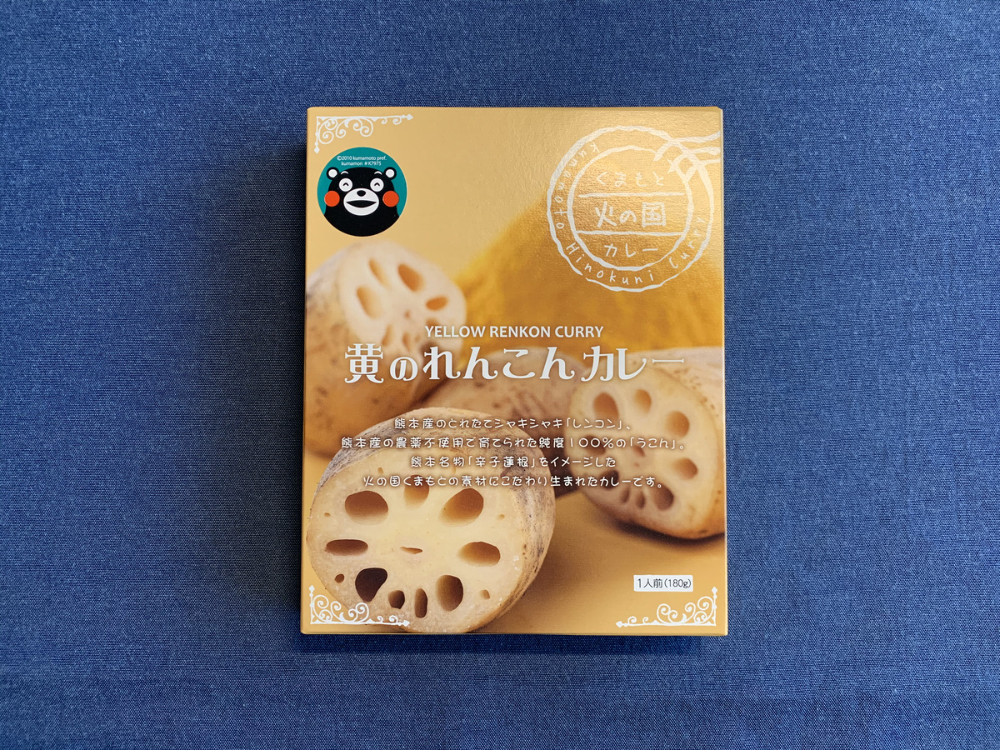

**くまもん肉 :meat_on_bone: カレー！**

---

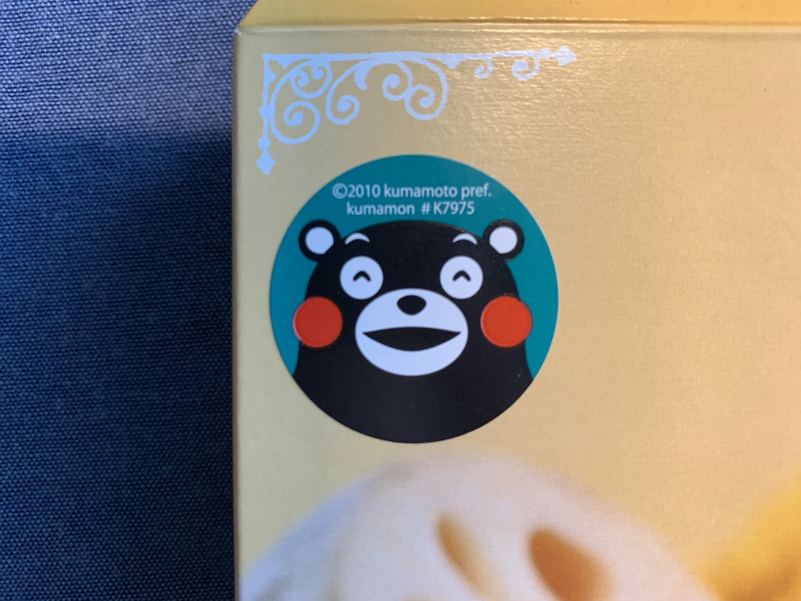

（ちがうモン・・・ :bear: ）

---

おおっとまちがえたー :sweat: :sweat: :sweat:

正しくはこれ！

**熊本 黄のれんこんカレー！**

わーい！

**うまそう！ :yum:**

**うまそう！！ :yum: :yum: :yum:**

れんこんたっぷりー！

---

**ウコン** も入ってるんですって！

ウコンっていうと

カレーとあんまり結びつかないけど、

**ターメリック** って言われたら

**なんだかカレーっぽい！ :curry:**

カレーっぽい雰囲気を出してこ！

---

恒例のバックショットは〜〜〜

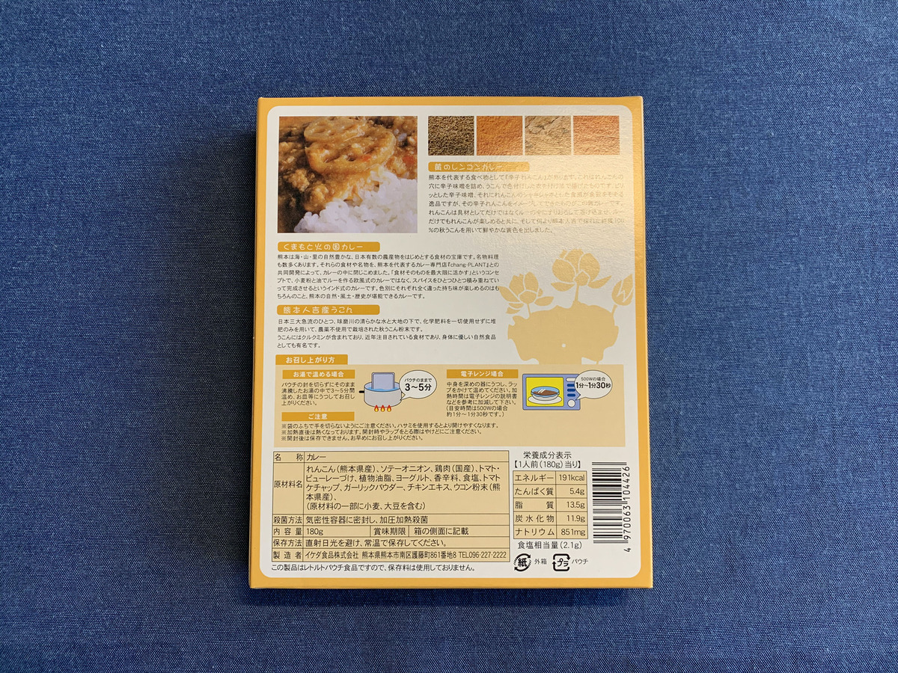

**Oh, Sexy bear!!! :sparkling_heart: :bear: :sparkling_heart: :bear: :sparkling_heart:**

---

うんちく、

読んでいこう・・・！

**うんちく、**

**楽しいよね・・・！**

（わくわく・・・）

---

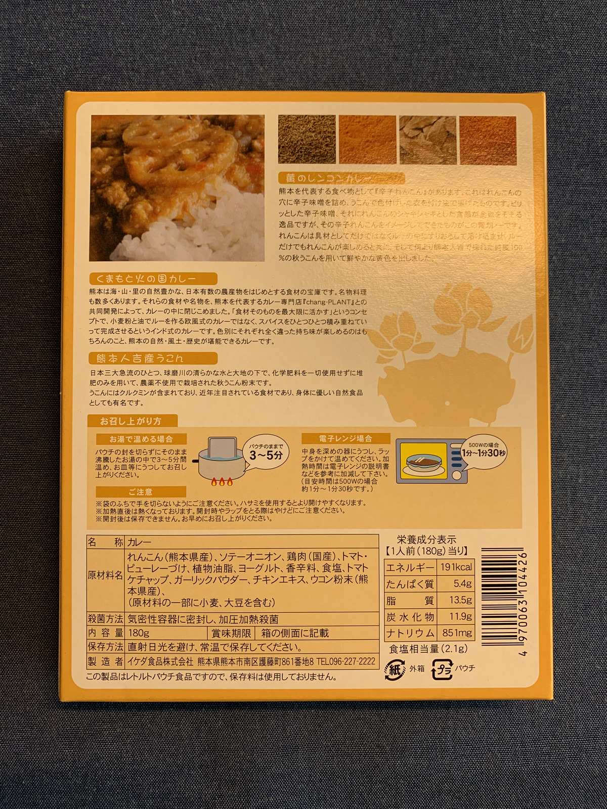

どれどれー？

> 熊本は海・山・里の自然豊かな、日本有数の農産物をはじめとする食材の宝庫です。
> 名物料理も数多くあります。
>
> それらの食材や名物を、熊本を代表するカレー専門店『chang-PLANT』との共同開発によって、カレーの中に閉じ込めました。

なにぃ〜？

**美味いもの全部、**

**閉じ込めただと〜！？**

これは事件だ！

**美味いもの監禁事件だ！！ :cop: :cop: :cop:**

---

美味いものを！

**解放だ！ :cop: :cop: :cop:**

お口の中で

**解放だ！！！ :yum: :yum: :yum:**

---

そういえば、お店の名前が載ってましたね？

（ぽちっ）

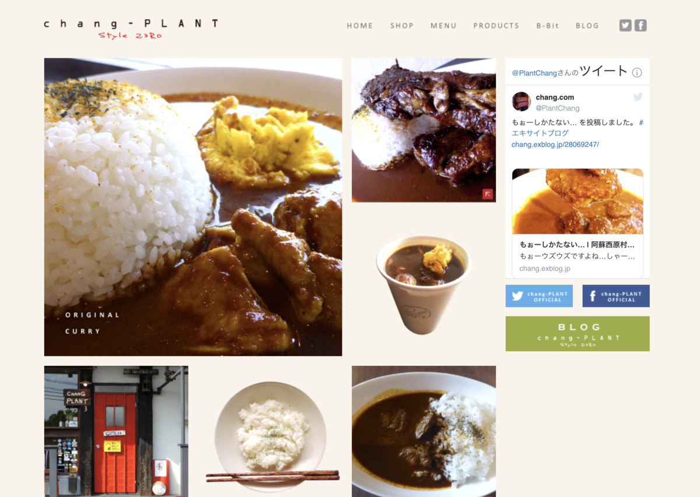

http://chang-style.com/

おおー！

**これは旨そう・・・！！ :curry:**

なるほど、熊本の **カレー専門店！**

---

どうりでパッケージに

**スパイス** がどうとか色々書かれてたんでした

なるほどー！

---

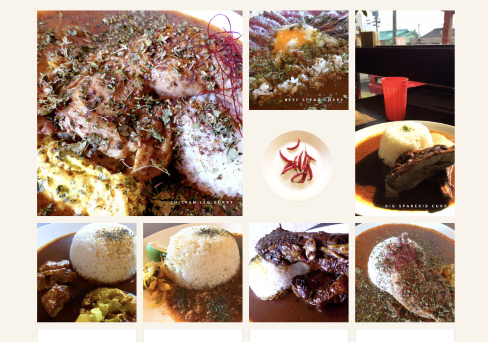

あ〜〜〜 :yum: :yum: :yum:

**こんなんぜったい美味いやんー！ :rage: :rage:**

ズルイゾズルイゾー！

落ち着いたら

ぜ〜〜〜ったいに

**行っちゃうからなー！ :rage: :rage: :rage:**

---

さてさてー

今日はどこで食べよかなー

今日はどこにいこうかなー！ :star: :star: :star:

---

**よーしここに決めた！**

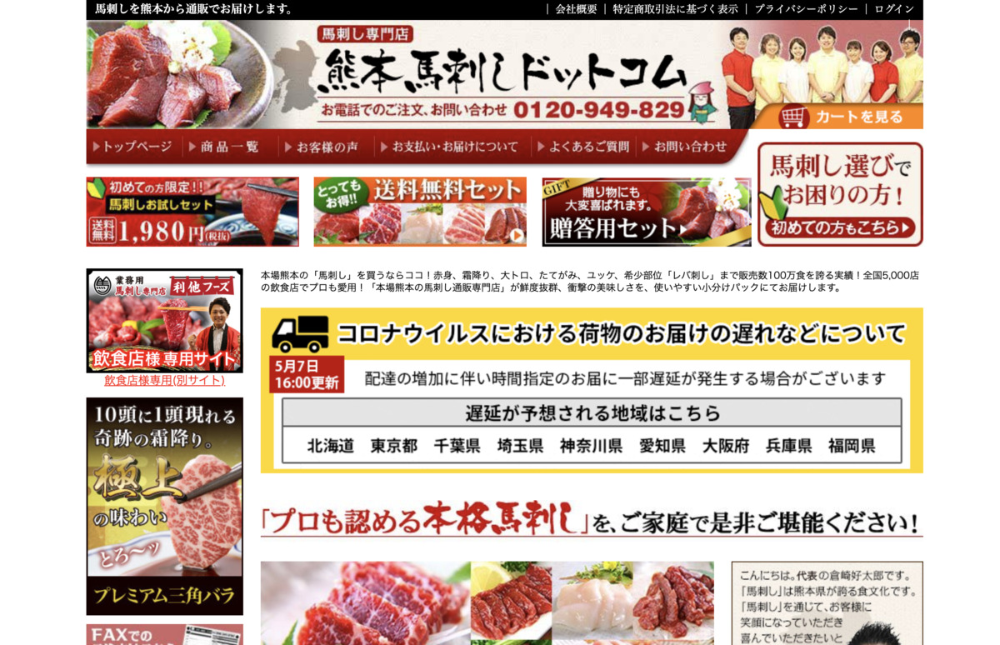

https://kumamoto-basasi.com/

おおっと、

これは熊本の名物、

**馬刺しじゃないですかー！！！**

---

**馬刺し祭りじゃー！ :horse: :horse: :horse:**

---

っとあぶないあぶない・・・

**馬刺し祭り :horse:** じゃなかった・・・

馬刺しの誘惑・・・

**危険すぎるぅ〜〜〜！ :ghost:**

---

食べる場所、

**さがさなきゃ！ :mag: :mag: :mag:**

---

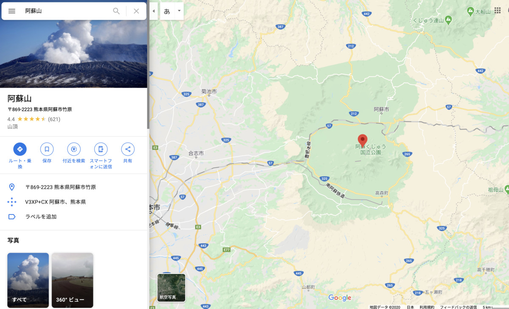

熊本市内もいいけど〜

やっぱり・・・

**景色のいいとこ** で食べたいよね！！！

でも阿蘇山っていつも曇ってて

天気よくないかもー？

---

心配ご無用・・・！

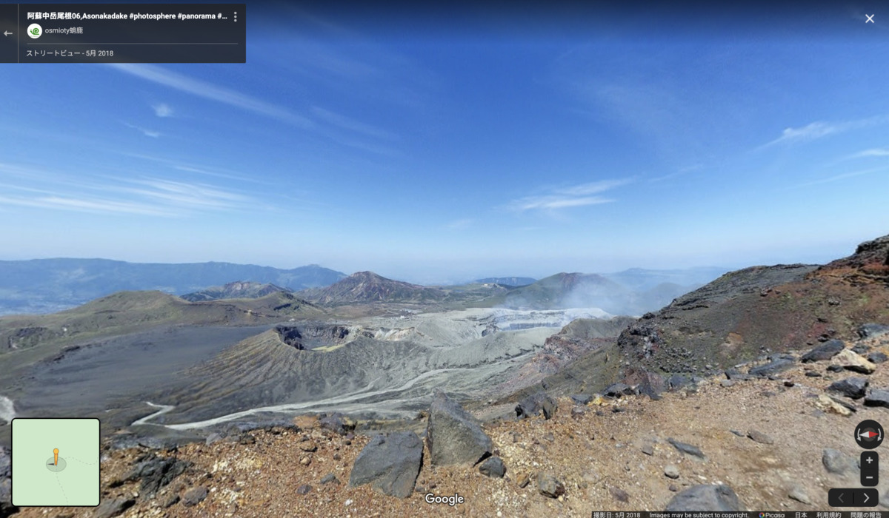

**天気までも超越するシステム！！ :sun_with_face:**

常に晴れを選ぶ！

**だから晴れしかない！ :sun_with_face: :sun_with_face: :sun_with_face:**

---

## 実食！！

もー

**どんどん実食までが長くなっていくわーw**

前振りなげえーわーw

---

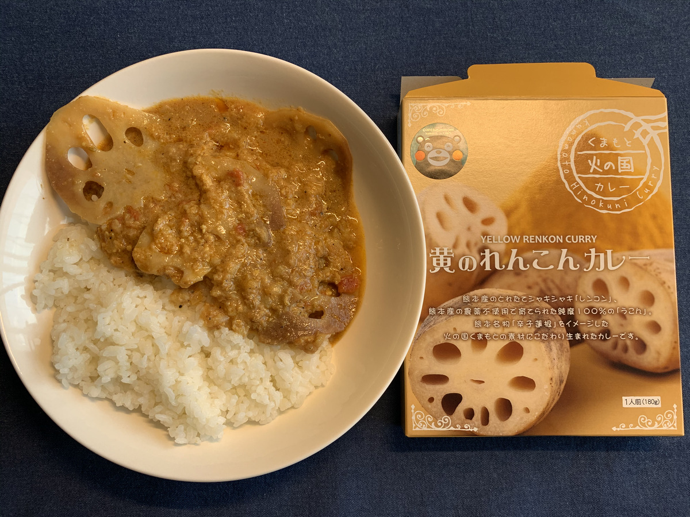

**じゃじゃーーん！ :curry: :curry: :curry:**

遠目に見てもわかる、

**このレンコンのインパクト！ :boom:**

---

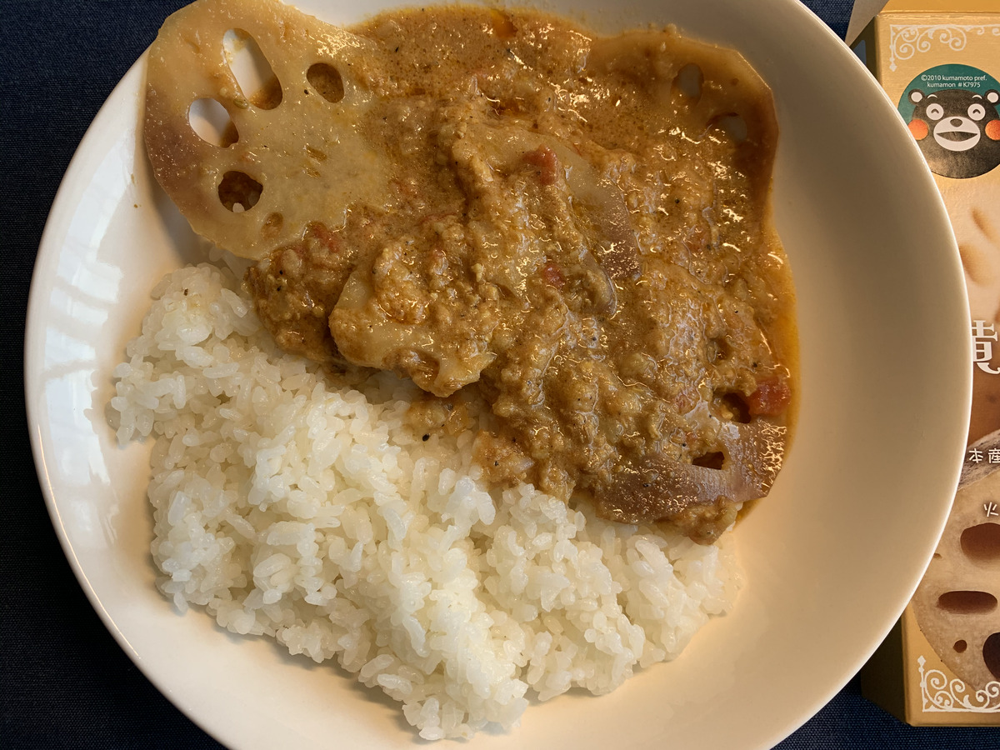

あ〜〜〜

これは **シャキシャキ** してそうですねー！！

---

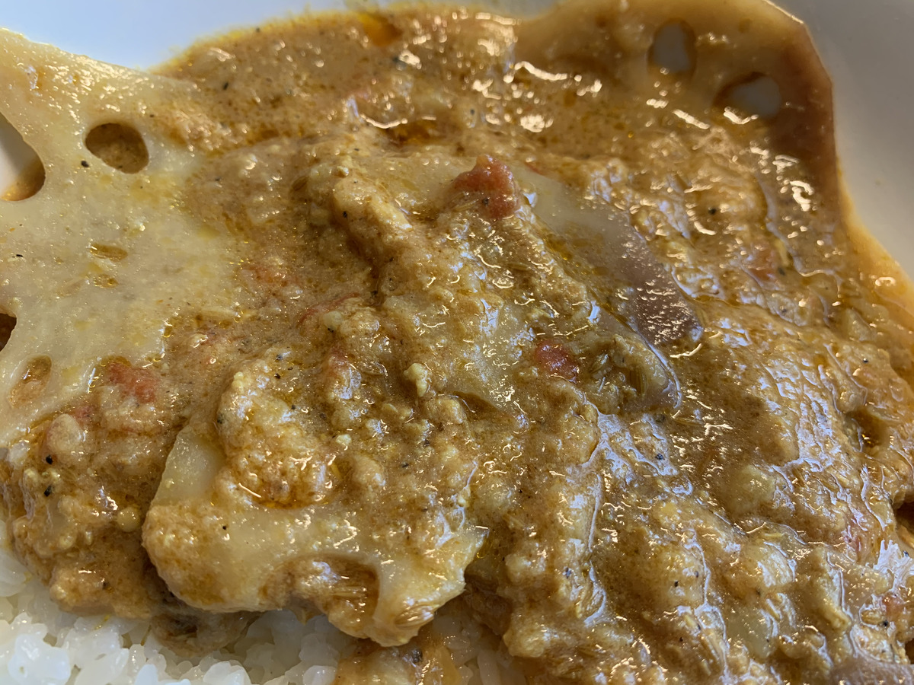

**あああ〜〜〜**

**もう〜〜〜！**

**辛抱たまらん〜〜〜！！！ :confounded: :confounded: :confounded:**

---

**それでは、いただきます！ :pray:**

---

（シャキッ）

---

**もぐもぐ・・・！ :flushed:**

---

（シャキッ）

（シャキッ）

---

**スパイシ〜〜〜！！！ :satisfied: :satisfied: :satisfied:**

---

レンコンとカレーがまた合うわー！

スパイスカレーの雰囲気を若干感じるけど、そこまでピリッとくるわけでもなく、
ターメリックあたりからくるスパイシーさが美味い！

輪切りのレンコンがたくさん入ってるから、
最後までシャキシャキで飽きさせない！こいつは美味いゾー！

---

**まんまんまんぞく〜**

**レンコンまんぞく〜 :yum:**

---

**まんまんまんぞく〜**

**レンコンまんぞく〜！！ :yum: :yum: :yum:**

---

さてさて〜

最後の一口となりました〜。

あれの出番ですかー？

いいえ今回はちょっと違います！

---

**こいつの登場だ！！！**

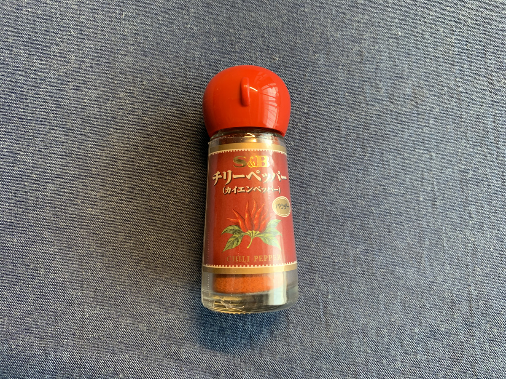

**Chili Pepper!!! :fire: :fire: :fire:**

もともとがスパイシーだったら、

そのスパイシーさを殺さずに

辛みだけ加えた方が楽しめるかも！

**こいつも Happy powder family さ！ :sparkles: :sparkles: :sparkles:**

---

（フリフリフリフリ・・・）

ひーーー！！

**うまからーー！！ :fire: :fire:**

---

**熊本 黄のれんこんカレー**

**おいしゅうございました！ :pray: :pray: :pray:**
