さあ！

今日もやってきました！

**至福の時間！ :yum:**

---

**カレーパーティー** の時間だよー！

**ひゃっほーう！ :surfer: :surfer: :surfer:**

---

毎日、朝起きてから

お昼のカレーのことが

**楽しみすぎる・・・！**

みんなもカレー :curry:

頼んでみると **イイゾ！ :+1: :+1: :+1:**

---

さてさて！

今日のカレーはなんだろな〜 :baby:

今日のカレーはなんだろな〜！ :older_man:

---

今日は〜〜〜

**こいつだ！！！ :point_down:**

（バシッ！）

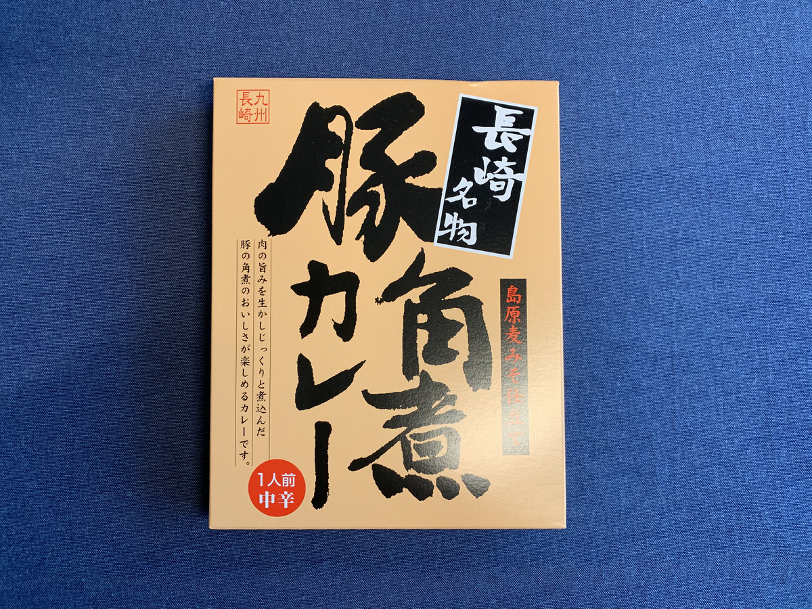

**ババーーーン！ :tada: :tada: :tada:**

**豚角煮カレー！**

---

安定の〜〜〜

**豚！！！ :pig: :pig: :pig:**

はい、ぜったい **うまいやつ〜〜〜**

---

恒例のバックショットは〜〜〜

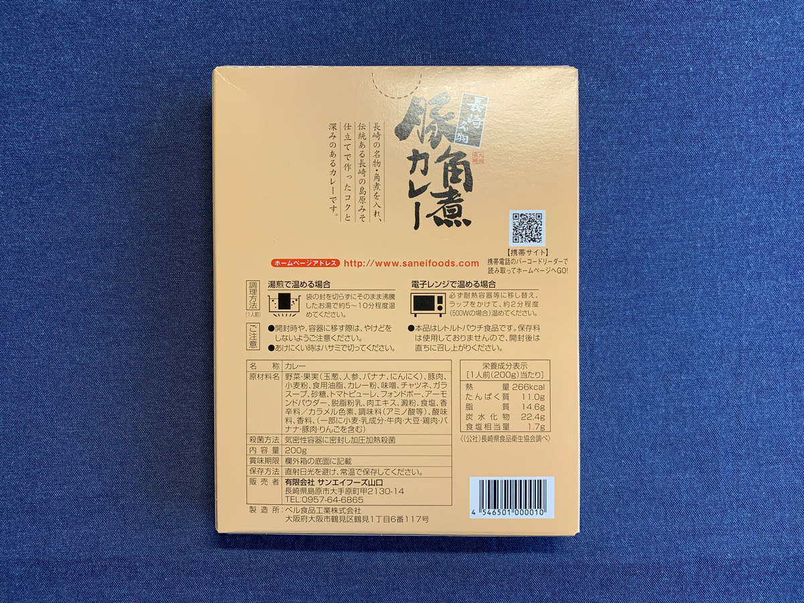

**Oh, Sexy pig!!! :sparkling_heart: :pig: :sparkling_heart: :pig: :sparkling_heart:**

シンプル！

多くは語るまい・・・タイプきたこれ

**旨さは言葉で語るんじゃない、**

**舌で語るんだ！**

---

**タンタンタタン！ :tongue: :tongue: :tongue:**

---

そして生産者さんに

**圧倒的感謝！！！ :pray:**

（ぽちっ）

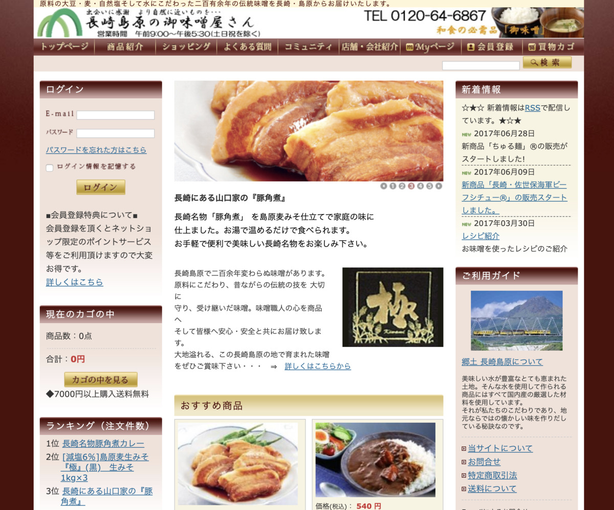

http://www.saneifoods.com/

おおっ？

**養豚業者** じゃなくて、

 **お味噌やさん** だったのね！

 なるほどー。

---

ながさき〜

おいしいもの、たくさんあるよね〜〜

おいしいもの

**たくさんうらやましいゾ！ :rage:**

**このやろう！ :rage: :rage:**

**このやろう！！ :rage: :rage: :rage:**

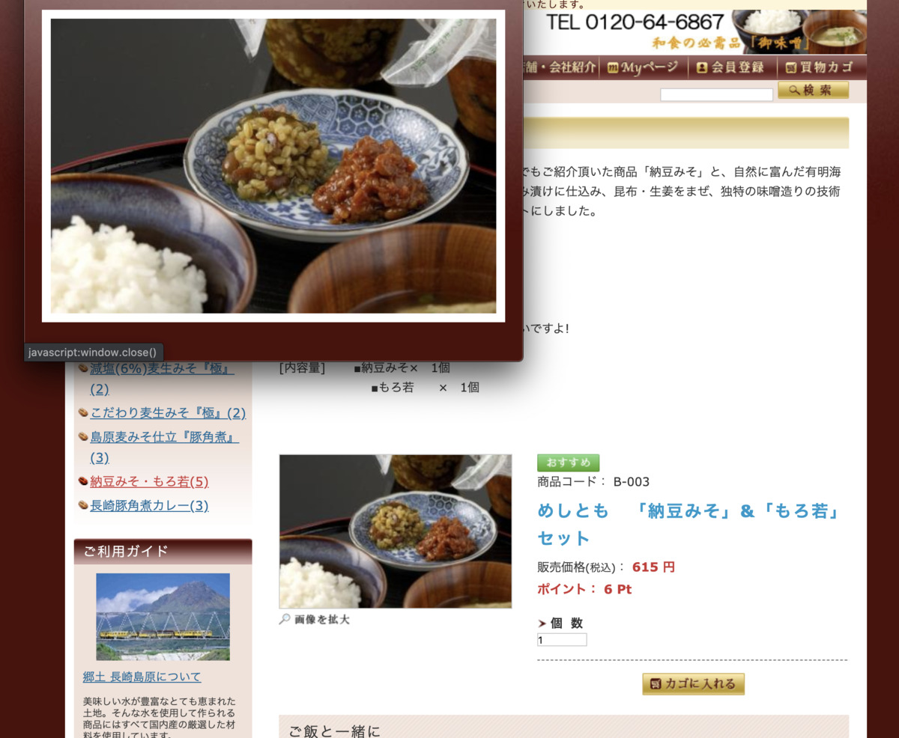

はい、またぜったい **うまいやつ〜〜〜 :yum:**

なまえがずるいわーw

なに『めしとも』ってw

まるで

**めしの友達じゃん！！！**

---

あ〜〜〜

そうそう、そういえば **島原** も

長崎だったよねえ〜〜〜

（ぽちっ）

---

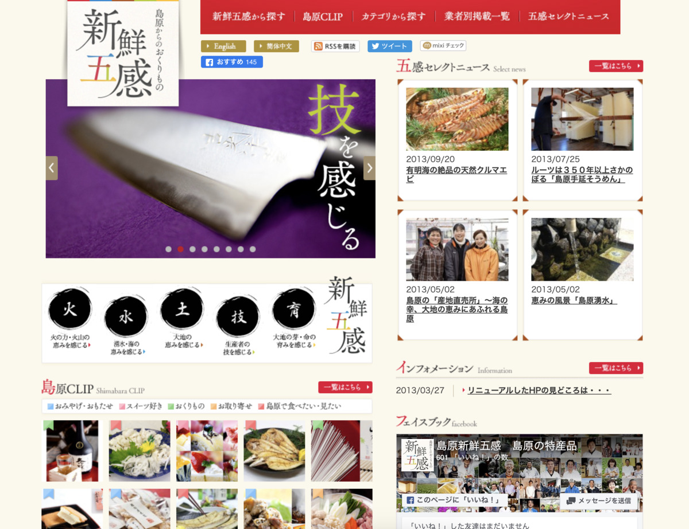

http://www.yokabai-shimabara.com/

まーた旨そうなもんばかり

並べちゃってー

**ズルイゾズルイゾー！ :rage:**

2013年で更新とまっちゃってるのは

旨そうだから全然気にならないぞー！ :eyes: :eyes: :eyes:

---

**はっ・・・！**

**お腹がカレーを欲してる・・・！ :curry:**

---

はやく・・・

**食べる場所、探さなきゃ！！ :mag: :mag: :mag:**

---

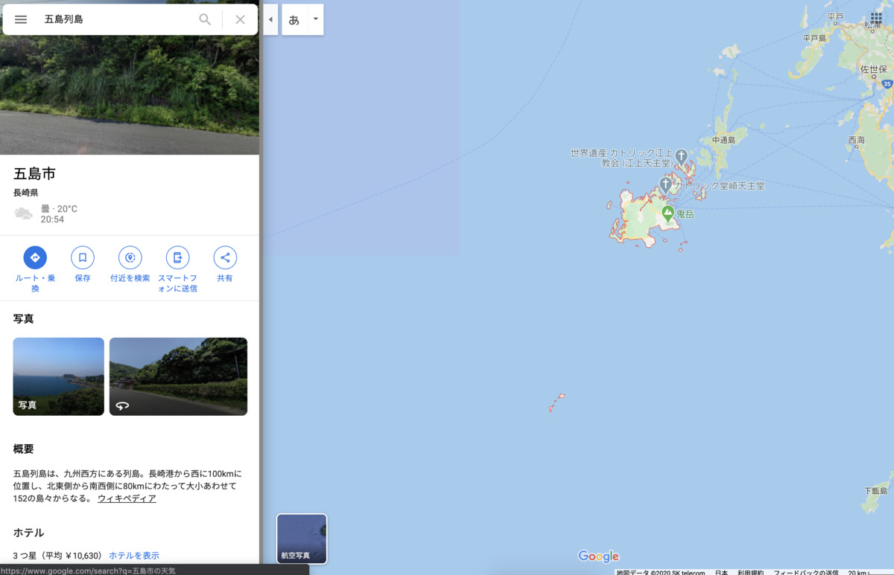

あ〜〜〜

そうそう〜〜〜

そうそう〜〜〜

五島列島も長崎だよね？

**ちょっとコンテンツ充実しすぎててずるくない？**

---

**いいえ、いいーんです！ :sunglasses:**

**ずるくて、いいーんです！ :sunglasses: :sunglasses:**

---

五島列島行きたいなー

五島列島で食べたいなー :yum:

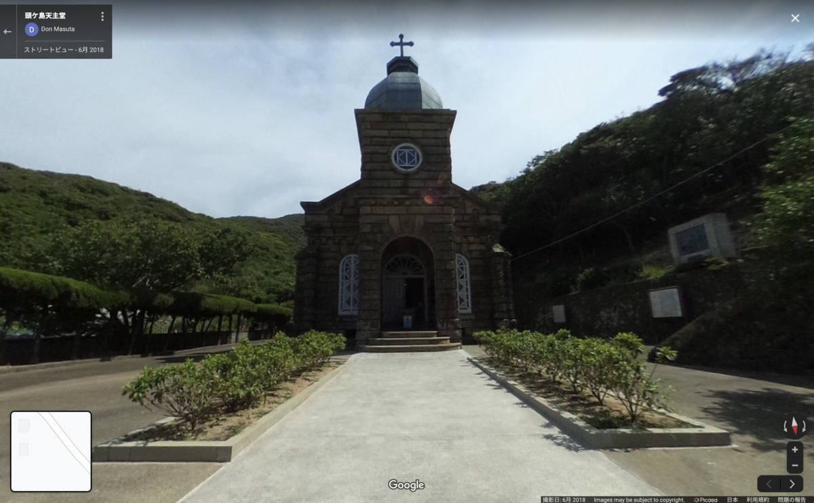

あああ〜〜いいっすね〜〜

**教会を眺めながら** 食べるのも

オツなんじゃないでしょうか！ :church:

---

いやーホント

こうやって長崎見てみると

旨そうなもんばかりで

**行きたくなってきちゃうね！！ :sparkles: :sparkles: :sparkles:**

---

（ぽちっ）

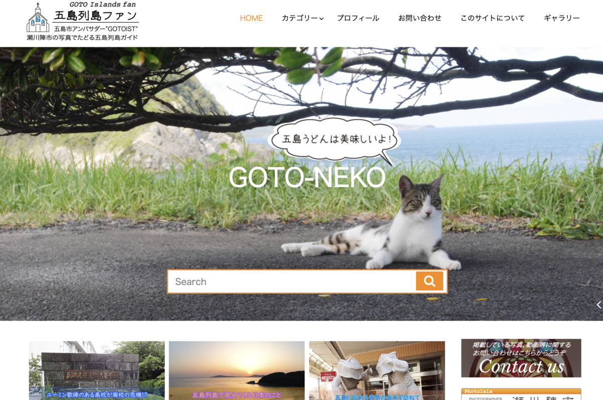

https://gotofan.net/

ああ〜もう **ファン** なんです〜

**その名前はずるいですー :heart_eyes_cat: :heart_eyes_cat: :heart_eyes_cat:**

---

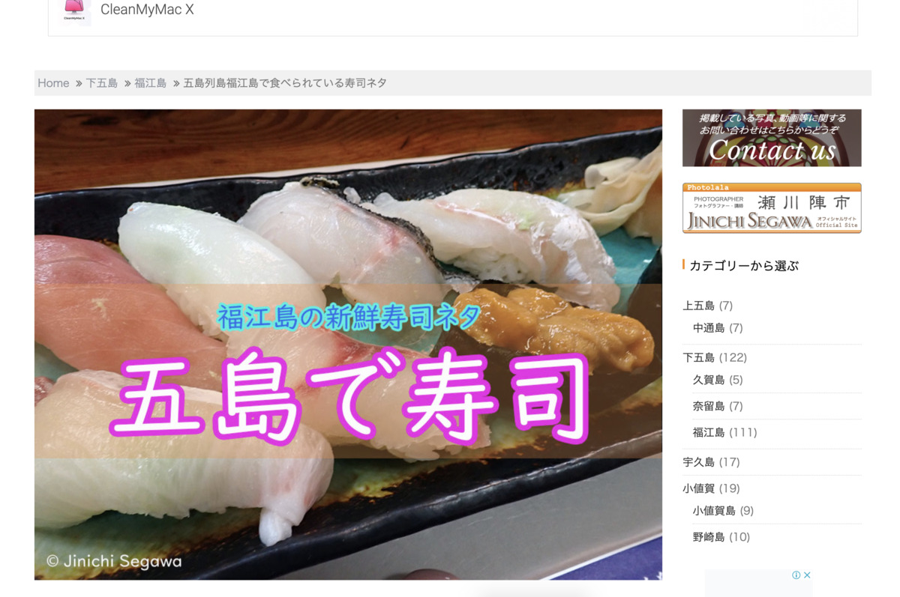

**あああああああああああああ！！！！！**

**:sushi:！**

**:sushi: :sushi:！！**

**:sushi: :sushi: :sushi:！！！**

---

**はっ・・・！**

---

## 実食！！

よりみち多すぎ・・・！w

**途中カレーどこ行っちゃったし！**

---

ブヒブヒ！まちきれないブヒ！ :pig:

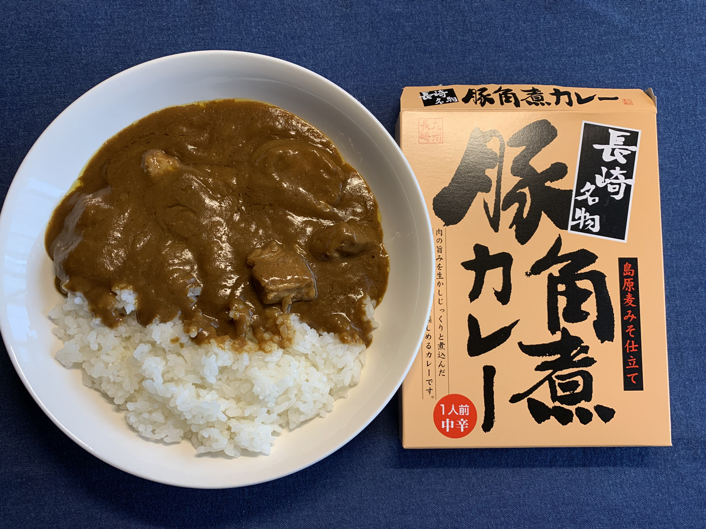

**パンパカパーン！！！ :confetti_ball: :confetti_ball: :confetti_ball:**

**豚角煮カレー :curry:** の完成だっ！

5分で用意できるの、

**最高だぜー！！！ :dancers:**

---

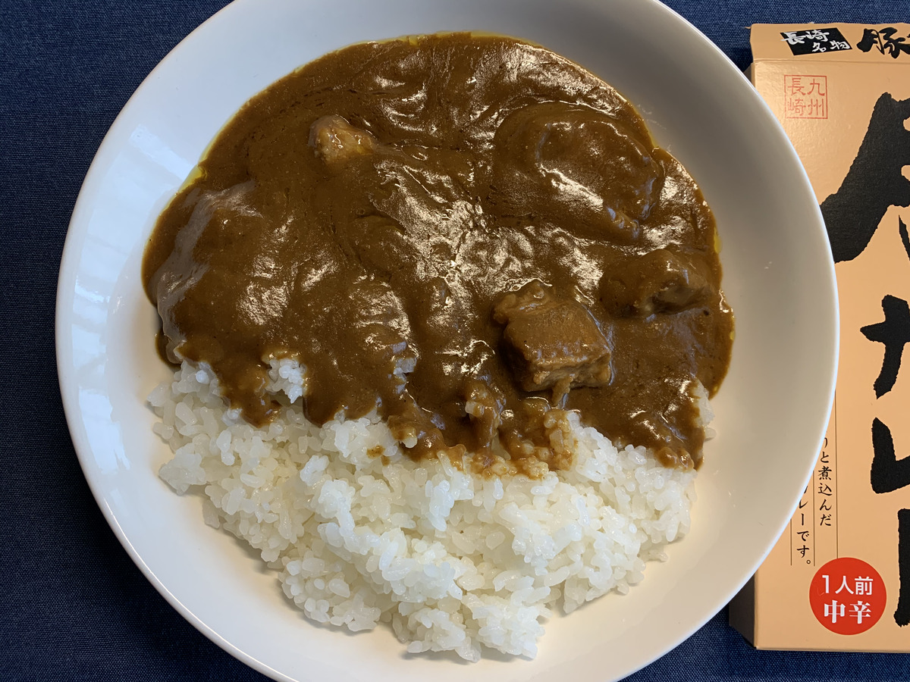

重厚感・・・

あるね・・・！

---

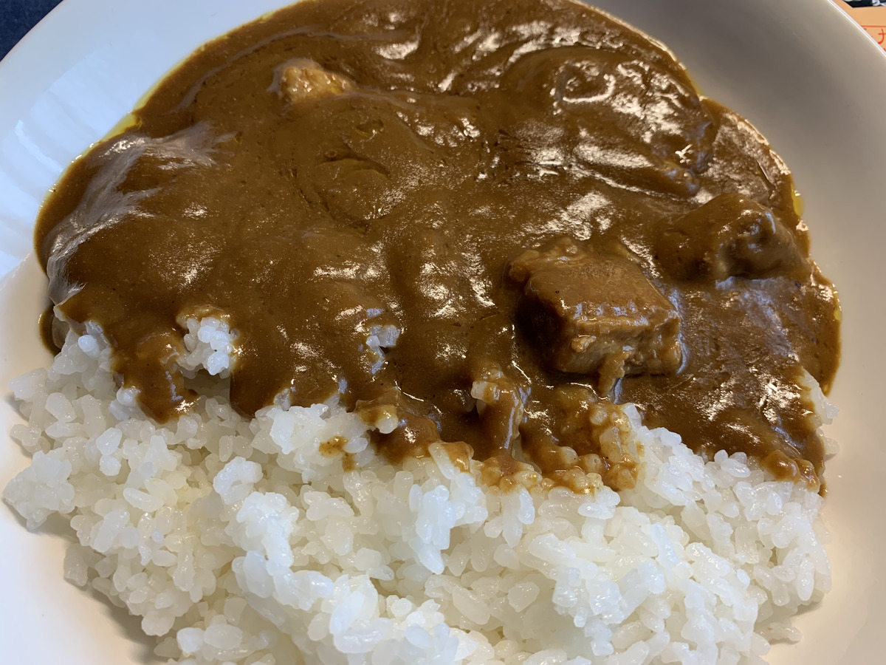

安定感・・・

**あるね・・・！！**

ガツガツ食えるタイプだ・・・！

---

ってことで、

**いただきまーす！！！ :pray:**

---

（モグッ）

---

**ブヒブヒ・・・！ :pig:**

---

（モグッ）

（モグッ）

---

**うめえ〜〜〜！！！ :satisfied: :satisfied: :satisfied:**

---

味はザ・ポークカレーって感じだなー。
豚の角煮がゴロゴロしててたまらん！

中辛って書いてあったけど、
辛さはあとからじんわりくる感じで、そこまで辛くないかなー、美味いぞ美味いぞー。

なんかこう、雪山で食べたくなってくるタイプのカレーかもしれない・・・！
はあ〜〜毎日食えるやつ〜〜 :yum:

---

ごろごろ感がたまらんゾー！

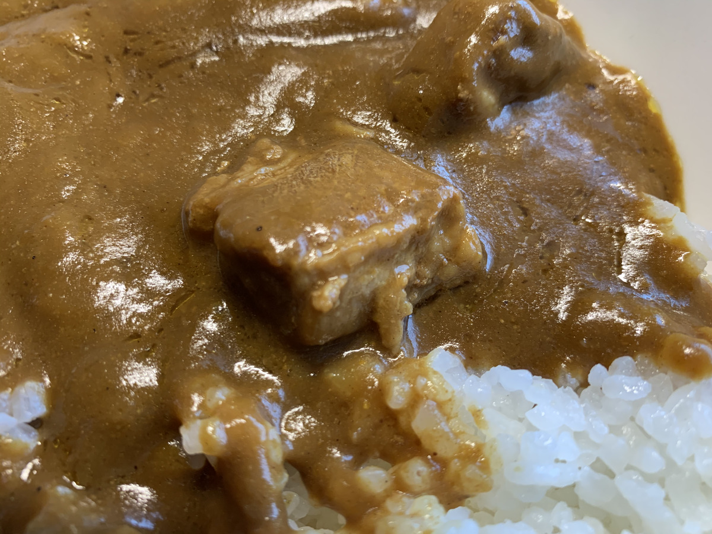

**はわわわわ〜〜〜！ :yum:**

---

（モグッ）

はっ、もう **残り一口** しかない・・・！

**やつ** を呼ばないと・・・！

---

**ホア〜〜〜〜〜**

---

**ジャオ〜〜〜〜〜！！！**

---

**ババーン！ :star2: :star2: :star2:**

（フリフリフリフリ・・・）

**ﾊｧｯﾊｧｯ... ﾀﾏﾗﾝ...!**

（フリフリフリフリ・・・）

**ﾓｯﾄ... ﾓｯﾄ... ﾌﾘｶｹﾅｷｬ...!!**

（フリフリフリフリ・・・）

**ﾊｯﾋﾟｰﾊﾟｳﾀﾞｰ...!!! :innocent: :innocent: :innocent:**

---

**長崎 豚角煮カレー**

**おいしゅうございました！ :pray: :pray: :pray:**
