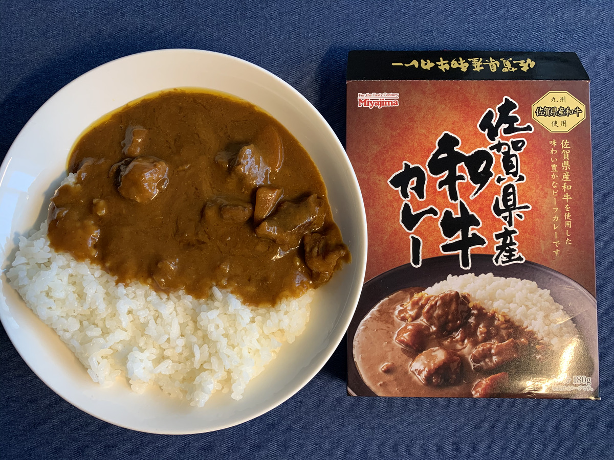
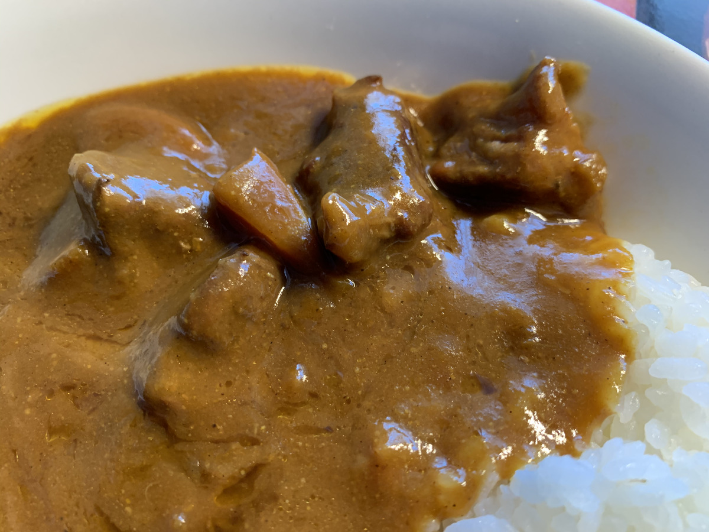

まだかなーまだかなー？

**カレータイム**

**まだかなー？？ :curry:**

---

昨日の夜から、

明日のお昼のカレーが

**楽しみでたまらなぁーい！ :heart_eyes_cat: :heart_eyes_cat: :heart_eyes_cat:**

---

そして今日も！

カレータイムが

**やってきたぞぉぉぉー！！ :curry: :curry: :curry:**

ひゃっほーい！！

---

今日のカレーは〜〜〜

**これっ！！！ :point_down:**

**やったぁ！**

**佐賀県産和牛カレー！**

もう待ちきれないモウ！ :cow:

**モウ！  :cow: モウ！  :cow: モウ！  :cow:**

---

ようやく、ド直球の！

**ビーフがキマシタワー！！ :tokyo_tower: :tokyo_tower: :tokyo_tower:**

---

これ、 **食べる前から美味いやつ** だわー

絶対これ **美味いやつ** だわー

---

恒例のバックショットは〜〜〜

（バシッ）

**Oh! Sexy Beef!!! :sparkling_heart: :cow: :sparkling_heart: :cow: :sparkling_heart:**

---

うんちく、読もうぜ・・・！

（わくわく・・・！）

どれどれ〜？

> 「佐賀県産和牛」は佐賀県内の肥育農家にて飼育されている黒毛和種の総称で、柔らかい赤身の中に適度にサシ（霜降り）が入った優れた肉質の牛肉です。

**サシー！！！**

**しもふりー！！！**

**ひゃっほぉぉぉーい！！！:zap: :zap: :zap:**

びりびりー :zap:

びりびりーびりびりー :zap:

---

これはいつにもなく

**期待できそうですねえー :laughing:**

---

おやっ、なんだこれ？

（ぽちっ）

http://www2.saga-s.co.jp/120/sagakenjin/check.htm

ここで突然の！

**佐賀人度チェック〜！！！**

---

**なーんもわかりません・・・！ :scream:**

---

・・・って、ここの

**竹下のモンブラン、ってなぁに？ :thinking_face:**

どれどれ〜？

---

**おぉー！ :open_mouth:**

地元で愛される企業さんだ！

---

https://black-monblanc.com/

ブラックモンブラン、有名なのかあ :ice_cream:

今度行ったら、

**絶対、食うぜ・・・！ :+1: :+1: :+1:**

---

ほかに佐賀でおいしいものって

**どんなのがあるんだろー？ :thinking_face:**

（ぽちぽちっ）

---

**！？！？**

http://www.saga-city.jp/wrsb/

**なんやこれ！？ :confounded:**

た、たべものなの・・・？

---

まじかあ :alien: :alien: :alien:

有明海近辺にしか住んでない、

**ハゼの仲間** らしい・・・！

---

**ハゼ** って聞いたら、

**なんだか食えそうな気がするなー！ :fork_and_knife:**

なんだか気になってきたぞー！

食べたい！

**食べたいぞー！ :fork_and_knife: :yum:**

---

**おっと、今日はカレーだ！ :curry: :curry: :curry:**

**あぶないあぶない〜 :sweat:**

妄想グルメ旅、

**危険だ〜〜〜！ :smiling_imp: :smiling_imp: :smiling_imp:**

---

早いとこ、

食べる場所探さなきゃ！ :yum:

どこで食べよかなー？ :mag:

**どこで食べよかなー？ :mag: :mag: :mag:**

---

そうそう

**バルーンフェスタ** でも有名だよね！

（ぽちっ）

---

こういう、

壮大な景色のところで

**食えたらいいーんじゃない？**

**いいーんです！ :sunglasses:**

---

おおーっ、

なんかそれっぽいところあった！

---

**ジャストビューイング！！ :star2: :star2: :star2:**

そうなんです！

場所や天気だけでなく、

**時間までも超越するシステム！！！ :watch:**

**さいこうだー！ :innocent: :innocent: :innocent:**

---

バルーンフェスタで

バルーンを眺めながら **ご当地カレー :curry:** を食う！

やつは他にもいるかもしれないな・・・ :thinking_face:

---

## 実食！！

**はい！長い！**

実食、いくよ！

---

**ばばーん！！！ :tada: :tada: :tada:**

いいねえ〜、

ザ・カレーって感じだ・・・！ :sunglasses:

---

あ〜〜〜

いいじゃないですかあ〜〜〜 :+1: :+1: :+1:

---

もう・・・

**モウ :cow: ・・・**

**がまんできなーい！！ :cow: :cow: :cow:**

---

生産者の方々に感謝して！ :pray:

**いただきまーす！ :pray: :pray: :pray:**

---

（モグッ）

---

**ほふほふ・・・！ :cow:**

---

（モグッ）

（モグッ）

---

**うまーい〜〜〜！！！ :satisfied: :satisfied: :satisfied:**

---

柔らかいけど噛みごたえがある！美味い肉のやつだ！
霜降りの部分がじゅわーってする！じゅわーってする！

辛さはほとんど感じないかなあ、子供でも全然食べられるレベルかも！
カレーのペーストはかなり濃厚、しかし肉が全然負けてない、ゴロゴロで美味い！

---

はあ〜〜〜

**至福の時〜〜〜 :angel:**

---

・・・はっ！

気づかないうちに、

もう **残りひと口** になっていた・・・！

こわっ！ :laughing:

---

さあ、

**ホアジャオタイム** の

時間だよ・・・！

---

**ホア〜〜〜〜〜**

---

**ジャオ〜〜〜〜〜！！！**

---

**Oh, Happy Powder...!!! :innocent: :innocent: :innocent:**

（フリフリフリフリ・・・）

---

・

・

・

---

「・・・拘束具？」

「そうよ。あれは装甲板ではないの。 **ホアジャオ本来の力を私たちが押え込むための拘束具** なのよ。その呪縛が今、自らの力で解かれていく・・・」

（フリフリフリフリ・・・）

---

**佐賀 佐賀県産和牛カレー**

**おいしゅうございました！ :pray: :pray: :pray:**
