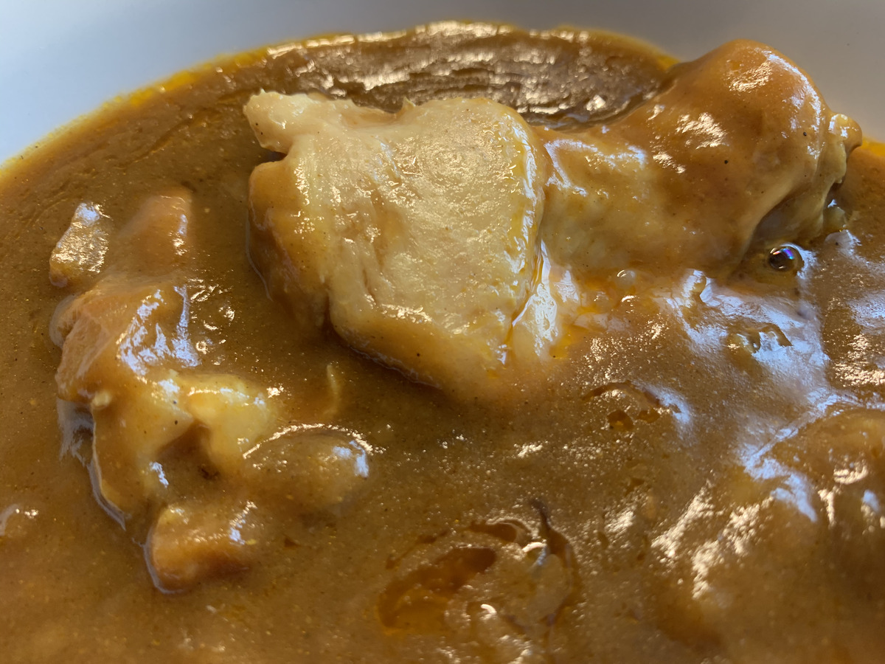

ババン！

**今日はいよいよ福岡県だー！**

**:clap: :clap: :clap:**

---

これで九州最後の県！

**九州の玄関口**に、

きちゃったぞー！

---

**どんどんどん！ぱふぱふぱふー！ :tada: :tada: :tada:**

**うぇーい！ :metal: :metal: :metal:**

---

キョ〜〜ノッ！

カリィ〜〜ハ！

**コイツダッッッ！ :sunglasses:**

---

**手羽元カレー！**

いや、

**じっくり煮込んだ華味鳥の手羽元まるごと入った食べ応えのある味。【手羽元カレー】**

だっ！！！

---

**ラノベ風 :closed_book: タイトル**

**キターーーー！！！ :japanese_ogre:**

---

やだもー奥さん！

**手羽元** ですって！

---

ようやくこっこにきて

**Chicken Curry!** がきましたわよー！

こっここっこ :chicken:

**こけこっこー！ :chicken: :chicken: :chicken:**

---

**にわとり祭りじゃー！！！**

こっこ :chicken: :chicken: :chicken: こっこ :chicken:  :chicken: :chicken:

こけこっこー！ :chicken:  :chicken: :chicken:

こっこ :chicken: :chicken: :chicken: こっこ :chicken:  :chicken: :chicken:

**こけこっこー！ :chicken:  :chicken: :chicken:**

---

バックショットは〜〜〜

**これ！**

**Oh, Sexy Chicken...!!! :sparkling_heart: :chicken: :sparkling_heart: :chicken: :sparkling_heart:**

---

あっ、うんちくがめずらしく、

パッケージじゃなくて、

レトルトパウチの方に書いてある・・・！

---

うんちく、楽しいよねー！

その道のプロの話、 **わくわくしちゃう** よね・・・！

---

なになにー？

> 華味鳥は、澄んだ空気が満ち、たっぷりと陽光が降り注ぐ開放鶏舎で、海藻やハーブ、ぶどうの搾り粕や木酢液などと共に・・・

要約すると〜

空気うめえ〜！ :chicken:

**飯うめえ〜！ :chicken: :chicken:**

**圧倒的成長！ :muscle: :chicken: :muscle: :chicken: :muscle: :chicken:**

の鳥ってことだな！

**UMASOU!!! :yum:**

---

なるほどなるほどー？

ということは、

**華味鳥** っていうのは

ブランド鶏の名前でもあり〜の、

お店の名前でもあり〜の、

って感じなのか。へえー。

（ぽちっ）

---

https://www.hakatahanamidori.co.jp/cpm/intro/

おおー。

なるほどなー。

鶏を育てて **水炊き** にしてるのかあ。

**生産者に感謝！ :pray:**

---

https://www.hakatahanamidori.co.jp/item/p_00048.php

水炊き・・・

**おいしそう・・・！！**

うほー！！

**たまらん！！ :pig_nose: :pig_nose: :pig_nose:**

---

福岡も、

美味しいもの

**たくさんあるよねー！**

**うらやましいぞ、このやろう！ :rage: :rage: :rage:**

---

まーでもー？

福岡と言えば〜？？？

（ぽちっ）

---

https://retty.news/26581/

**やっぱラーメンだよねー！！！ :ramen: :ramen: :ramen:**

いつか行きたい

**博多の屋台・・・！**

**福岡3大ラーメン** ですって・・・！

---

落ち着いたら

**絶対行っちゃうからねー！ :rage: :rage:**

---

おれ、この戦争が終わったら、

**ラーメンと結婚** するんだ・・・！

---

・

・

・

---

**それ脂肪フラグやー :meat_on_bone: :meat_on_bone: :meat_on_bone:**

**ラーメン！ :ramen: :ramen: :ramen: わっしょい！ :fish_cake: :fish_cake: :fish_cake:**

**ラーメン！ :ramen: :ramen: :ramen: わっしょい！ :fish_cake: :fish_cake: :fish_cake:**

---

https://ichiran.com/mori/main.php

何を隠そう・・・！

一蘭マニアなのです・・・！

**:ramen: :ramen: :ramen:**

一蘭の森にも行きたいよぅ・・・！

**現地で食べたいよぅ・・・！ :yum: :yum: :yum:**

---

はっ！

気付いたら

**ラーメンブログ** になりかけてた・・・！

**福岡・・・恐ろしい子・・・！ :smiling_imp: :smiling_imp: :smiling_imp:**

---

はやく食べる場所

**さがさなきゃ！ :mag: :mag: :mag:**

---

どーれ

**屋台街** なんかいいんじゃなかろうかー。

えっ？

まだ **ラーメンから離れてない** のかって？

**いいじゃないか！ :rage:**

みんなが屋台でラーメン食ってるそばで

**カレー食ったっていいじゃないか！！！**

---

あ〜〜〜

福岡っぽさ〜〜〜

**今日はここにしよう！！！**

雰囲気あって

**いいぞぉ〜〜〜！ :smiley_cat: :smiley_cat: :smiley_cat:**

---

## 実食！！

**なが〜〜〜い！**

はやく食べたいんだよ！！

**カレーをはよ・・・！！！**

---

**じゃじゃじゃーん！！！ :tada: :tada: :tada:**

ひゃあああああああ！！

**なにこれでかーい！ :sparkles: :sparkles: :sparkles:**

---

写真、誇張だと思ってたけど

本当に、 **手羽元大きいぞー！！！**

---

**はわわわわ〜〜〜。 :heart_eyes_cat: :heart_eyes_cat: :heart_eyes_cat:**

**もうたまらーん！**

はやく食べよう！

---

では、

**いただきまーす！ :pray: :pray: :pray:**

---

（モグッ）

---

**ぴよぴよ・・・！ :baby_chick:**

---

（モグッ）

（モグッ）

---

**うまーい〜〜〜！！！ :satisfied: :satisfied: :satisfied:**

---

甘いソースだ！食べてから少し辛みがくる！でもそこまで辛くない！

手羽元のごんぶと感たまらん〜。もうこれだけで満足度が100%だ〜。

チキンカレーはまたポークやビーフとは違ったうまさがあっていいなあ。
美味いぞ美味いぞー。

---

なんてこった！

**気付いたら最後のひと口** になっていた・・・！

---

**レッツ！ホアジャオー！**

（ふりふりふりふり・・・）

**:innocent: :innocent: :innocent:**

ｱｱｱｱ...!!!

ﾋﾟﾘﾋﾟﾘｸﾙ...!!!

**ﾋﾟﾘﾋﾟﾘｸﾙ...ｯｯｯ!!!**

（ふりふりふりふり・・・）

---

**福岡 手羽元カレー**

**おいしゅうございました！ :pray: :pray: :pray:**

---

これで沖縄・九州のカレー

**完　食　だっ！ :crown: :crown: :crown:**
