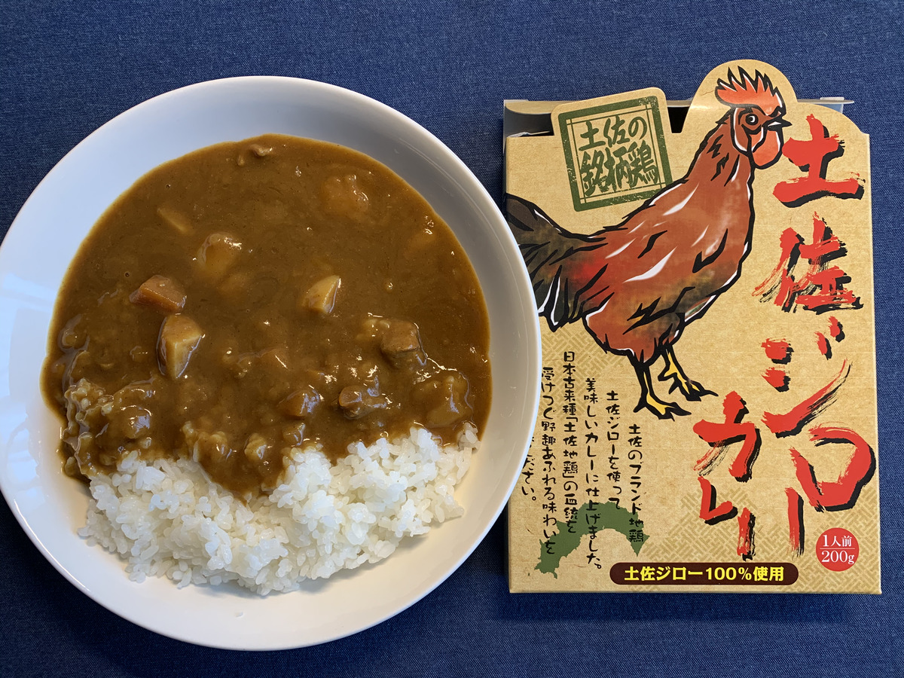

**おたよりが、きているよ！ :email:**

えーっと、なになに？

---

「 **ホアジャオ** ってなんですか？ :baby:」

「 **おいしいんですか？ :baby:** 」

---

なるほどー！

きみはまだ、 **ホアジャオ** を知らないんだね！ :eyes: :eyes: :eyes:

ホアジャオは

たまに **麻婆豆腐の上** に

振りかけてある **アレ** のことだよ！

---

**麻婆豆腐** だけじゃなくて、

色んなものに振りかけると

**絶対おいしいゾ！ :star2: :star2: :star2:**

**パパやママにおねだりしてみてね！ :sunglasses:**

---

さてさて！

**今日のカレーは何かなー？ :man_with_turban:**

---

**パンパカパーン！ :tada: :tada: :tada:**

**土佐ジローカレー！**

でっぱってる！

**トサカでっぱってる！！**

---

**ででんっ！！ :chicken:**

**ﾄﾞﾔｧ...! :chicken: :chicken: :chicken:**

---

お待ちかねの〜

バックショットは〜〜〜

**これ！**

**Oh, Sexy Cute...!!! :sparkling_heart: :sparkling_heart: :sparkling_heart:**

---

**土佐ジロー** 、ってなんだろなー？

なになにー？

> 地鶏の（ジ）とロードアイランドレッドの（ロー）から名付けられました

お、おまえ・・・

**次郎** じゃなかったのか・・・！ :sweat_smile:

---

へー。

土佐ジローを専門に出してるお店、

**あるんだねえ〜 :smiley:**

（ぽちっ）

---

http://tosajiro.com/inn/stay.html

うはー！

その『 **風景の味がする** 』ってキャッチコピー

**ずるーい！ :stuck_out_tongue_closed_eyes:**

---

風景の味がする・・・

---

やっぱり

**ずるーい！ :stuck_out_tongue_closed_eyes: :stuck_out_tongue_closed_eyes: :stuck_out_tongue_closed_eyes:**

---

あーもうこんなん **絶対うまいやつやん！**

**うまいやつやーん！！！**

**新鮮じゃないと食えないやつ！ :yum: :yum: :yum:**

じゅるりー :yum:

**じゅるりじゅるりー :yum:**

---

あー、これ **宿泊** もやってんの？

**あーこれ絶対やばいやつぅー！ :rage:**

やばい！ :rage:

**これはやば〜〜〜い！！！ :rage: :rage: :rage:**

---

**やばいぜよ・・・！！！ :smiling_imp:**

---

そうそう！

高知と言えば、

**坂本龍馬だよね！！ :sparkles: :sparkles:**

---

なんかー

それにまつわるもの

あるのかなあ？ :thinking_face:

---

https://web.ako-kasei.co.jp/PR/washinomizu/

！？！？

**龍馬（わし）の水ぜよ・・・！**

**:thinking_face: :thinking_face: :thinking_face:**

---

**龍馬と書いて、わし・・・？ :thinking_face:**

---

**わからんぜよ・・・！！！ :thinking_face:**

---

**龍馬（わし）の塩ぜよ・・・！**

---

**水分と塩分は大事ぜよ・・・！ :sweat:**

**なんでも末尾に「ぜよ」ってつければいいってもんじゃないぜよ・・・！ :boom: :boom: :boom:**

---

はっ、カレー食べるぜよ・・・

じゃなかった、

**食べるぞー！ :curry: :fork_and_knife: :yum:**

---

今日はどこにしようかなー？

**なんか良い場所ないかなー？ :mag:**

（ぽちっ）

---

おやおや〜？

**ひろめ市場！**

聞いたことある！

**色んなお店がたくさん、**

**くっついてるところでしょ！ :beer:**

---

いきたい！

**いきたいいきたい、いきたいぞー！ :sunglasses:**

---

おおーなるほどー。

**高知城の近く** にあるのかあ :thinking_face:

**よさこい祭り** も

たしか、この辺なんだよね？

---

**うほほほー！ :beer:**

---

**うほほほー！！ :beers: :beers: :beers:**

よーし **ここで飲もうぜ！**

---

**飲もうぜよ・・・！！ :beers: :beers: :beers:**

---

## 実食！！

**飲もうぜよ！じゃねえよカレーだよ！**

**カレーをはよ・・・！！！**

---

**じゃじゃじゃーん！！！ :tada: :tada: :tada:**

**ふっふーぅ！ :star2: :star2: :star2:**

---

見た目はザ・カレーって感じで

**イイ・・・！ :+1: :+1: :+1:**

---

あ〜〜〜

もうたまら〜〜〜ん！

目の前の **カレー :curry:** に

**釘付けだー！ :heart_eyes_cat: :heart_eyes_cat: :heart_eyes_cat:**

---

では、生産者に感謝して〜

**いただきまーす！ :pray: :pray: :pray:**

---

（モグッ）

---

**おお〜っ！ :cupid:**

---

（モグッ）

（モグッ）

---

**うまいぜよ〜〜〜！！！ :satisfied: :satisfied: :satisfied:**

---

ああああー、やさしい、これはやさしいカレーだ！
あとからじんわり辛さがくる系で、やはり若干スープっぽさがあるね！

肉は小さめに刻んであるけど、歯応えは鶏ってよりは牛って感じする・・・。
言われないと鶏って気づけないなあ。
ああ、カレー以外でも土佐ジロー食べたくなってきた・・・！

---

ああ〜、のこり一口だよ・・・

そろそろ **アレ** を呼ばなきゃ・・・！

えっ、アレってなにかって？？

そんなの、

**ハッピーパウダー、ホアジャオ**

に決まってるじゃないかー！ :sparkles: :sparkles: :sparkles:

---

さあみんな一緒にー！

---

**ホア〜〜〜〜〜**

---

**ジャオ〜〜〜〜〜！！！**

---

**Let's Powder Time...! :innocent: :innocent: :innocent:**

（ふりふりふりふり・・・）

---

**高知 土佐ジローカレー**

**おいしゅうございました！ :pray: :pray: :pray:**
